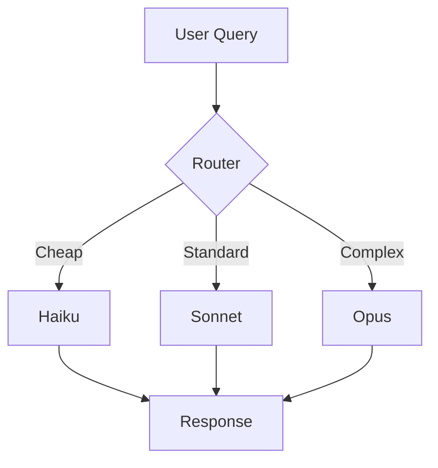

# Plan Enhancement Framework - Run 2

**Purpose**: Systematically upgrade all workstream plans with breakthrough tiers and complete coverage.

---

## Plan Quality Requirements

Every plan file MUST contain:

### 1. Complete Structure
- **Problem**: What challenge this workstream addresses
- **Evidence Synthesis**: Links to relevant findings.md rows + source URLs
- **Proposed Lyra Design**: Specific, not generic (with concrete examples)
- **Architecture + Data Model**: Mermaid diagrams where structure matters (MANDATORY for §4.2 memory)
- **Build Outline**: Ordered tasks + dependencies (as SPEC for future build, no code)
- **Multi-Provider Note**: Behavior on DeepSeek vs Anthropic + fallback (esp. §4.4 skills, §4.5 router)
- **Risks & Open Questions**: What could go wrong, what's unknown
- **(A) Parity vs (B) Breakthrough**: Explicitly separated tiers with impact×effort
- **References**: All source URLs cited
- **Changelog**: What changed in Run 2 (for existing plans)

### 2. Breakthrough Tier (B) Requirements
- **Must combine ≥2 sources**: Not just porting one tool
- **Must go beyond any single source**: Novel fusion
- **Must name sources fused**: Explicit attribution
- **Must argue why fusion wins**: Concrete reasoning
- **Must link to brainstorm file**: Show ideation process
- **Must have impact×effort ratings**: 1-5 scale

### 3. Parity Tier (A) Requirements
- **Must identify best-in-class source**: Which tool/paper to match
- **Must specify exact features**: Not vague "adopt X"
- **Must note version constraints**: Dependencies, prerequisites
- **Must have PORT/ENHANCE/SKIP decision**: Clear action

---

## Current Plans Status

| Plan | Exists | Has (A) | Has (B) | Has Mermaid | Linked Brainstorm | Action |
|------|--------|---------|---------|-------------|-------------------|--------|
| 00-voice-mode.md | ✅ | TBD | TBD | TBD | TBD | AUDIT + ENHANCE |
| 01-ui-ux.md | ✅ | TBD | TBD | TBD | ❌ | CREATE BRAINSTORM + ENHANCE |
| 02-memory-architecture.md | ❌ | N/A | N/A | N/A | ✅ | CREATE (standalone exists) |
| 03-context-optimization.md | ❌ | N/A | N/A | N/A | ✅ | CREATE |
| 04-skills-system.md | ❌ | N/A | N/A | N/A | ✅ | CREATE |
| 05-tools.md | ✅ | TBD | TBD | TBD | ❌ | CREATE BRAINSTORM + ENHANCE |
| 06-plugins.md | ✅ | TBD | TBD | TBD | ❌ | CREATE BRAINSTORM + ENHANCE |
| 07-mcp.md | ✅ | TBD | TBD | TBD | ❌ | CREATE BRAINSTORM + ENHANCE |
| 08-commands-interactive.md | ✅ | TBD | TBD | TBD | ❌ | CREATE BRAINSTORM + ENHANCE |
| 09-hooks-automation.md | ✅ | TBD | TBD | TBD | ❌ | CREATE BRAINSTORM + ENHANCE |
| 10-sessions-checkpointing.md | ✅ | TBD | TBD | TBD | ❌ | CREATE BRAINSTORM + ENHANCE |
| 11-permissions-credentials.md | ✅ | TBD | TBD | TBD | ❌ | CREATE BRAINSTORM + ENHANCE |
| 12-swarm-fleet-channels.md | ❌ | N/A | N/A | N/A | ✅ | CREATE |
| 13-full-autonomy.md | ❌ | N/A | N/A | N/A | ❌ | CREATE BRAINSTORM + CREATE |
| 14-deep-research.md | ❌ | N/A | N/A | N/A | ✅ | CREATE |
| 15-reliability-verification.md | ❌ | N/A | N/A | N/A | ✅ | CREATE |
| 16-safety-alignment.md | ❌ | N/A | N/A | N/A | ✅ | CREATE |
| 17-model-router.md | ❌ | N/A | N/A | N/A | ✅ | CREATE |
| 18-rmux-rebuild.md | ❌ | N/A | N/A | N/A | ❌ | CREATE BRAINSTORM + CREATE |
| 19-multi-tenancy.md | ❌ | N/A | N/A | N/A | ❌ | CREATE BRAINSTORM + CREATE |

**Note**: Some plans exist in phase-specific directories (phase-3-skills-routing/, phase-4-swarm-autonomy/). Need to consolidate into plans/ directory.

---

## Enhancement Workflow

### Phase 1: Consolidate Existing Plans
1. Move phase-specific plans to plans/ directory
2. Rename to match numbering scheme (00-19)
3. Preserve content, add Changelog section

### Phase 2: Audit Existing Plans
For each existing plan:
1. Read full content
2. Check for (A) parity tier - if missing, add
3. Check for (B) breakthrough tier - if missing, add from brainstorm
4. Check for Mermaid diagrams - add where structure matters
5. Check for multi-provider notes - add for §4.4, §4.5
6. Check for references - ensure all sources cited
7. Add Changelog documenting Run 2 improvements

### Phase 3: Create Missing Plans
For each missing plan:
1. Read relevant findings.md sections
2. Read linked brainstorm file (or create if missing)
3. Write complete plan following structure above
4. Ensure (A) parity + (B) breakthrough tiers
5. Add Mermaid where needed
6. Link to brainstorm file

### Phase 4: Cross-Reference Validation
1. Every plan links to its brainstorm file
2. Every brainstorm file has ≥3 cross-source ideas
3. Every plan's (B) tier comes from brainstorm
4. Every plan cites sources in findings.md
5. Every workstream (§4.1-§4.18, §5.1-§5.3) has a plan

---

## Mermaid Diagram Requirements

**MANDATORY for**:
- §4.2 Memory Architecture (data model + flow)
- §4.13 Swarm/Fleet (coordination model)
- §4.15 Deep Research (workflow)
- §5.1 rmux Rebuild (architecture)

**RECOMMENDED for**:
- §4.4 Skills System (loader + curator flow)
- §4.5 Model Router (decision tree)
- §4.8 MCP (integration architecture)
- §4.10 Hooks (lifecycle events)
- §4.18 Voice Mode (pipeline)

**Example Mermaid**:


---

## Multi-Provider Notes Template

For §4.4 Skills and §4.5 Router, include:

```markdown
## Multi-Provider Behavior

### Claude (Anthropic)
- Native skill support via Agent SDK
- Auto-trigger reliability: HIGH
- Tool-calling format: Standard

### DeepSeek
- Harness-level skill injection required
- Auto-trigger reliability: MEDIUM (v4-flash), HIGH (v4-pro)
- Fallback: Deterministic keyword matching

### Qwen / GPT / Open-Weights
- Harness-level skill injection required
- Auto-trigger reliability: VARIES by model tier
- Fallback: Embedding-based similarity search

### Routing Strategy
- Use deterministic matching for all providers as baseline
- Layer model-auto-trigger on top for Claude/high-tier models
- Validate with provider × skill compatibility matrix
```

---

## Priority Order

1. **Voice Mode** (00) - Flagship
2. **Memory** (02) - Core capability
3. **Skills** (04) - Self-improvement
4. **Model Router** (17) - Cost optimization
5. **Safety** (16) - Production critical
6. **Reliability** (15) - Production readiness
7. **Deep Research** (14) - Differentiator
8. **Swarm** (12) - Scalability
9. **Context** (03) - Performance
10. **All others** - Feature parity

---

## Validation Checklist

Before marking a plan complete:
- [ ] Has Problem section
- [ ] Has Evidence Synthesis with links
- [ ] Has Proposed Lyra Design (specific)
- [ ] Has Architecture + Data Model (Mermaid if needed)
- [ ] Has Build Outline (ordered tasks)
- [ ] Has Multi-Provider Note (if §4.4 or §4.5)
- [ ] Has Risks & Open Questions
- [ ] Has (A) Parity tier with PORT/ENHANCE/SKIP
- [ ] Has (B) Breakthrough tier combining ≥2 sources
- [ ] Has References section
- [ ] Has Changelog (if existing plan)
- [ ] Links to brainstorm file
- [ ] Brainstorm file has ≥3 cross-source ideas

---

## Next Steps

After research agents complete:
1. Consolidate phase-specific plans
2. Audit existing plans (add missing sections)
3. Create missing brainstorm files
4. Create missing plan files
5. Add Mermaid diagrams
6. Cross-reference validation
7. Update MASTER-PLAN.md with plan summaries

---

**Status**: FRAMEWORK READY  
**Trigger**: After Batch 1 research completes
