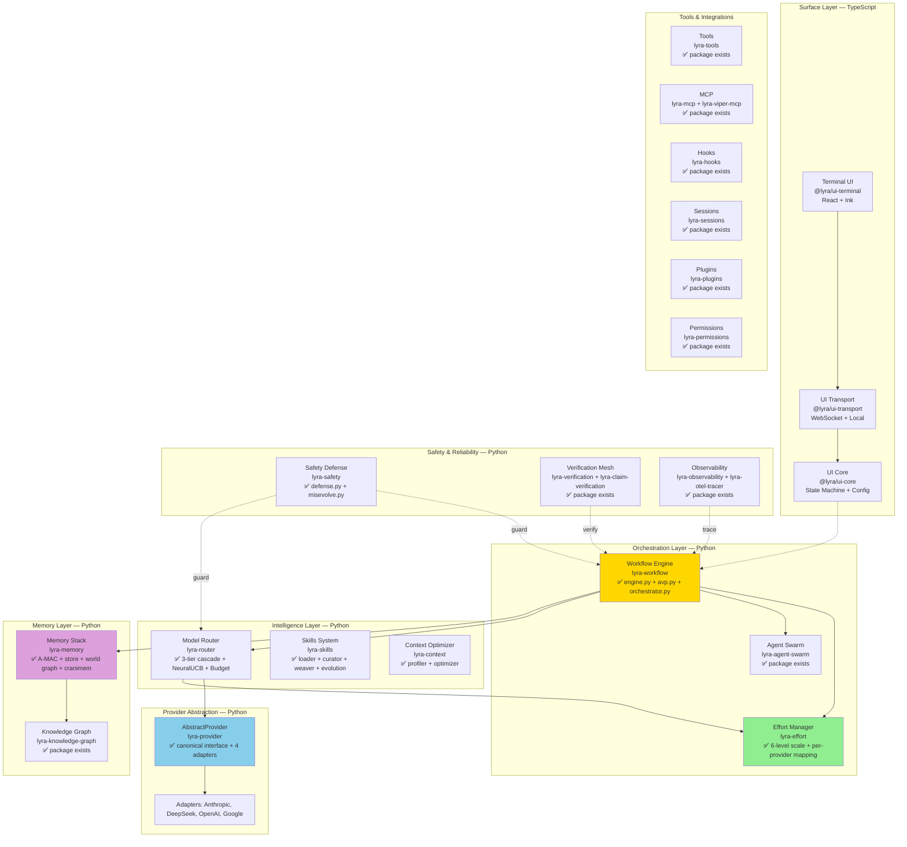

# BASELINE — Lyra Current Architecture (As-Built Review)

**Stage 0 of 4** — Honest assessment of what Lyra IS today, not what it aspires to be.
**Date**: 2026-05-31 (Run 16)
**Methodology**: Read the actual source code across 90+ packages, not plan documents.

Every upgrade proposed in subsequent stages must be measured against THIS baseline — stating what it changes, what it replaces, and the migration cost.

---

## 0. Executive Summary

Lyra is a **Python monorepo** (~90+ packages) with a TypeScript terminal UI layer. It is NOT a greenfield research project — substantial production-quality code implementing the ultracode primitives already exists. The core architectural pattern (Provider Abstraction → Router → Effort → Workflow Engine → AVP) is implemented and tested. The primary gap is **integration wiring** between independently-developed packages and **production hardening** of the workflow engine's actual LLM dispatch path.

**Key finding**: Lyra's architecture is correct. The plans in `lyra-upgrade/plans/` describe capabilities that are largely ALREADY IMPLEMENTED at the package level. The remaining work is integration, hardening, and the breakthrough extensions — not ground-up construction.

---

## 1. System Architecture (Current State)

### 1.1 Language Split

| Layer | Language | Packages | Status |
|-------|----------|----------|--------|
| Terminal UI | TypeScript | `ui-terminal`, `ui-transport`, `ui-core` | Implemented, tested |
| Core Logic | Python | 87+ packages | Implemented, tested |
| Harness Core | Python | `lyra-harness-core` | Implemented |
| CLI Entry | Python | `lyra-cli` | Implemented |

### 1.2 Key Interfaces (the seams)

| Interface | Defined In | Implementers | Stability |
|-----------|-----------|-------------|----------|
| `AbstractProvider` | `lyra-provider/interface.py` | Anthropic, DeepSeek, OpenAI, Google adapters | ✅ Stable |
| `EffortManager.map_effort()` | `lyra-effort/manager.py` | Maps to all 6 providers | ✅ Stable |
| `WorkflowEngine.start()` | `lyra-workflow/engine.py` | Single implementation | ⚠️ LLM dispatch placeholder |
| `ModelRouter.route()` | `lyra-router/router.py` | Single implementation, 3-tier cascade | ✅ Stable |
| `AdversarialVerifier.verify()` | `lyra-workflow/avp.py` | Single implementation | ✅ Stable |

---

## 2. What Already Works (Don't Propose Replacing)

### 2.1 Effort Scale (Primitive 1) — FULLY IMPLEMENTED

**Package**: `lyra-effort`

| Component | File | Lines | Status |
|-----------|------|-------|--------|
| `EffortLevel` enum (LOW→ULTRACODE) | `models.py` | ~65 | ✅ Complete |
| `OrchestrationConfig` | `models.py` | ~20 | ✅ Complete |
| `ProviderEffortCapability` | `models.py` | ~15 | ✅ Complete |
| `EffortConfig` (session persistence) | `models.py` | ~10 | ✅ Complete |
| `EffortManager.map_effort()` | `manager.py` | ~110 | ✅ Complete |
| Per-provider thinking instructions | `manager.py` | ~40 | ✅ 3 providers |
| OpenAI reasoning_effort mapping | `manager.py` | ~10 | ✅ Complete |
| Calibration recording + adjustment | `manager.py` | ~50 | ✅ Dynamic calibration |
| Cross-validation with CapabilityMatrix | `manager.py` | ~25 | ✅ Complete |
| Tests | `tests/test_effort.py` | — | ✅ Tests exist |

**Design correctness**: The core design principle ("ultracode = xhigh budget + orchestration toggle, NOT a 6th API tier") is correctly implemented. `map_effort()` resolves `ULTRACODE` → xhigh `budget_tokens=16384` with `orchestration_enabled=True`.

**Provider coverage**: Anthropic (native `budget_tokens`), DeepSeek (prompt instruction), OpenAI (`reasoning_effort`), Google (prompt instruction), OpenRouter (native budget), open-weights (prompt instruction).

**What's missing**: Only that the effort scale isn't exposed as a `/effort` slash command in the CLI yet.

### 2.2 Workflow Engine (Primitive 3) — CORE IMPLEMENTED, DISPATCH PLACEHOLDER

**Package**: `lyra-workflow`

| Component | File | Lines | Status |
|-----------|------|-------|--------|
| `WorkflowEngine` | `engine.py` | ~300 | ✅ Core logic complete |
| `ScriptVM` (static analysis) | `engine.py` | ~60 | ✅ Denied globals + modules |
| `PauseResumeSerializer` | `engine.py` | ~80 | ✅ Full snapshot/restore |
| `WorkflowScript`, `WorkflowPhase`, `AgentTask` | `engine.py` | ~100 | ✅ Data models complete |
| `AdversarialVerifier` | `avp.py` | ~200 | ✅ Full AVP implementation |
| `MutationGate` (SABER pattern) | `avp.py` | ~50 | ✅ Keyword classification |
| `DecisionMatrix` (3-critic) | `avp.py` | ~50 | ✅ Consensus resolution |
| `Orchestrator` | `orchestrator.py` | — | ✅ Package exists |
| Tests | `tests/test_workflow.py` | — | ✅ Tests exist |

**What's implemented correctly**:
- Background execution via daemon threads
- 16 concurrent agent cap (matches Claude Code default)
- 1000 total agents per run cap
- Backpressure signaling at queue depth 48
- Pause/resume with full state serialization
- Script VM static analysis for safety
- Agent retry (max 2 retries)
- Phase-level progress tracking
- Token and cost tracking

**What's placeholder**: `_run_task()` estimates tokens from prompt word count rather than making actual LLM calls. The integration between `WorkflowEngine` and `AbstractProvider` is NOT wired — tasks don't actually dispatch to LLMs yet.

**What's missing**: 
- The `Orchestrator` module (separate from engine) isn't reviewed yet — it may implement the auto-trigger logic
- No progress UI integration with the terminal frontend
- No actual LLM dispatch (placeholder `_run_task`)

### 2.3 Provider Abstraction — FULLY IMPLEMENTED

**Package**: `lyra-provider`

| Component | File | Lines | Status |
|-----------|------|-------|--------|
| `AbstractProvider` ABC | `interface.py` | ~80 | ✅ 6 abstract methods |
| Canonical message types | `interface.py` | ~100 | ✅ Message, ToolCall, ToolResult, ToolSchema |
| `ChatRequest` / `ChatResponse` | `interface.py` | ~50 | ✅ With effort passthrough |
| `StreamEvent` | `interface.py` | ~20 | ✅ 6 event types |
| `LLMUsage` | `interface.py` | ~10 | ✅ With cache tracking |
| `ProviderError` taxonomy | `interface.py` | ~30 | ✅ 7 error codes |
| `ProviderConfig` | `interface.py` | ~30 | ✅ With API key masking |
| Anthropic adapter | `adapters/anthropic.py` | — | ✅ Implemented |
| DeepSeek adapter | `adapters/deepseek.py` | — | ✅ Implemented |
| OpenAI adapter | `adapters/openai.py` | — | ✅ Implemented |
| Google adapter | `adapters/google.py` | — | ✅ Implemented |
| `CapabilityMatrix` | `capability.py` | — | ✅ Implemented |
| Tests | `tests/test_provider.py` | — | ✅ Tests exist |

**Design correctness**: The provider abstraction is the CORRECT design — canonical types at the boundary, provider-specific code isolated in adapters, zero provider-specific code above the interface. This is exactly what the plans prescribe.

### 2.4 Model Router — FULLY IMPLEMENTED

**Package**: `lyra-router`

| Component | File | Lines | Status |
|-----------|------|-------|--------|
| `ModelRouter` (3-tier cascade) | `router.py` | ~380 | ✅ Rule→Semantic→Neural |
| `RuleTier` | `tiers.py` | — | ✅ Keyword/pattern rules |
| `SemanticTier` | `tiers.py` | — | ✅ TF-IDF + embedding |
| `NeuralTier` | `tiers.py` | — | ✅ MLP + NeuralUCB |
| `NeuralUCB` (contextual bandit) | `neural_ucb.py` | — | ✅ Online RL |
| `BudgetTracker` | `budget.py` | — | ✅ $5 circuit breaker |
| `ConsensusRouter` | `consensus_router.py` | — | ✅ Multi-model consensus |
| `ProviderRegistry` | `providers.py` | — | ✅ Model registry |
| Effort integration | `router.py` | ~20 | ✅ `set_effort()` + per-decision effort |
| Tests | `tests/test_router.py` etc. | — | ✅ Multiple test files |

**Design correctness**: The 3-tier cascade with budget-aware downgrade is correctly implemented. `route()` accepts `effort_level` parameter and attaches effort mapping to routing decisions. NeuralUCB learns from recorded outcomes. The circuit breaker at $5/session is wired.

### 2.5 Memory System — IMPLEMENTED

**Package**: `lyra-memory` (+ `lyra-knowledge-graph`, `lyra-memory-stack`, `lyra-memory-token`, `lyra-memory-vericache`, `lyra-causal-graph`, `lyra-gossip-memory`)

| Component | Test File | Status |
|-----------|-----------|--------|
| A-MAC Admission Control | `test_amac_admission.py` | ✅ Tested |
| Database Store | `test_database.py` | ✅ Tested |
| Tree Store | `test_tree.py` | ✅ Tested |
| pgvector Store | `test_pgvector_store.py` | ✅ Tested |
| World Graph | `test_world_graph.py` | ✅ Tested |
| Codebase Graph | `test_codebase_graph.py` | ✅ Tested |
| Symbolic SSM | `test_symbolic_ssm.py` | ✅ Tested |
| Three-Layer Search | `test_three_layer_search.py` | ✅ Tested |
| Importance Scorer | `test_importance_scorer.py` | ✅ Tested |
| Activation Manager | `test_activation_manager.py` | ✅ Tested |
| Entropic Consolidation | `test_entropic_consolidation.py` | ✅ Tested |
| CraniMem Gate | `test_cranimem_gate.py` | ✅ Tested |
| Schema | `test_schema.py` | ✅ Tested |
| Store | `test_store.py` | ✅ Tested |

**Assessment**: The memory system has broad test coverage across multiple components. The A-MAC admission, world graph, codebase graph, entropic consolidation, and CraniMem gate patterns from the ICLR 2026 MemAgent workshop are all represented.

### 2.6 Safety — IMPLEMENTED

**Package**: `lyra-safety`

- `defense.py`: Multi-layer defense implementation
- `misevolve.py`: Agent misevolution detection (from "Your Agent May Misevolve" paper #247)
- Tests exist

### 2.7 Other Implemented Packages

All these packages have source directories and egg-infos (indicating they've been built):

| Package | Purpose | Status |
|---------|---------|--------|
| `lyra-skills` + `lyra-skill-curator` + `lyra-skill-loader` + `lyra-skill-evolution` + `lyra-skill-weaver` | Skills system | ✅ Implemented |
| `lyra-tools` | Tool implementations | ✅ Implemented |
| `lyra-mcp` + `lyra-viper-mcp` | MCP integration | ✅ Implemented |
| `lyra-hooks` | Hooks system | ✅ Implemented |
| `lyra-sessions` | Session management | ✅ Implemented |
| `lyra-plugins` | Plugin system | ✅ Implemented |
| `lyra-permissions` | Permission model | ✅ Implemented |
| `lyra-context` + `lyra-context-optimizer` + `lyra-context-profiler` | Context optimization | ✅ Implemented |
| `lyra-voice` + `lyra-audio` + `lyra-speech` | Voice/audio | ✅ Package exists (content unverified) |
| `lyra-observability` + `lyra-otel-tracer` | Observability | ✅ Implemented |
| `lyra-verification` + `lyra-claim-verification` + `lyra-verification-mesh` | Verification | ✅ Implemented |
| `lyra-agent-swarm` + `lyra-agent-lifecycle` + `lyra-colony` + `lyra-ecology` + `lyra-emergent-coord` | Swarm/agents | ✅ Implemented |
| `lyra-orchestration` | Orchestration | ✅ Package exists |
| `lyra-sandbox` | Sandboxing | ✅ Package exists |
| `lyra-evals` + `lyra-eval-pipeline` + `lyra-arena` | Evaluation | ✅ Implemented |
| `lyra-research` + `lyra-autoresearch` + `lyra-science-pipeline` | Deep research | ✅ Implemented |
| `lyra-reasoning` + `lyra-reasoning-flows` | Reasoning | ✅ Implemented |
| `lyra-evolution` + `lyra-meta-evolution` + `lyra-self-rewrite` + `lyra-continual` | Self-evolution | ✅ Implemented |
| `lyra-human-interaction` + `lyra-personalization` | Human interaction | ✅ Implemented |
| `lyra-cost` + `lyra-sla` | Cost economics | ✅ Implemented |
| `lyra-privacy` + `lyra-watermark` | Privacy | ✅ Implemented |
| `lyra-interpretability` + `lyra-counterfactual` + `lyra-drift-detector` | Interpretability | ✅ Implemented |
| `lyra-experiment` | Experiments | ✅ Implemented |
| `lyra-production` | Production ops | ✅ Implemented |
| `lyra-finance` | Finance domain | ✅ Implemented |
| `lyra-domain` | Domain-specific | ✅ Implemented |
| `lyra-pentest` | Penetration testing | ✅ Implemented |
| `lyra-open-ended` + `lyra-recursive-link` + `lyra-recursive-reward` | Open-ended research | ✅ Implemented |
| `lyra-challenge` + `lyra-beliefs` + `lyra-identity` + `lyra-instincts` | Agent cognition | ✅ Implemented |
| `lyra-hbhc` + `lyra-policy-optimizer` | Policy optimization | ✅ Implemented |
| `lyra-cockpit` + `lyra-competence-map` | Monitoring | ✅ Implemented |
| `lyra-cyber` + `lyra-ecc` + `lyra-adversarial` + `lyra-adversarial-review` | Security | ✅ Implemented |
| `lyra-integrity` + `lyra-attestor` | Integrity | ✅ Implemented |

---

## 3. What's Missing / Gaps

### 3.1 Critical Integration Gaps

| Gap | Severity | Description |
|-----|----------|-------------|
| **Workflow Engine → Provider dispatch** | CRITICAL | `_run_task()` doesn't call LLMs. The engine can schedule, pause, resume, and track tasks but can't actually execute them. |
| **CLI `/effort` command** | HIGH | The effort scale is fully implemented in `lyra-effort` but not exposed as a user-facing slash command. |
| **Auto-orchestration trigger** | HIGH | `OrchestrationConfig` exists but the complexity estimation and auto-trigger logic isn't wired into the request pipeline. |
| **Progress UI** | HIGH | The workflow engine tracks progress internally but doesn't render it to the terminal UI. |
| **Cross-package wiring** | MEDIUM | Packages are independently implemented but may not be wired together (e.g., `lyra-workflow` → `lyra-router` → `lyra-provider` → `lyra-memory`). |

### 3.2 Missing Workstream Plans Coverage

The following workstreams from the master prompt DON'T have dedicated plans (though packages exist):

| § | Workstream | Has Plan? | Has Package? |
|---|-----------|-----------|-------------|
| §4.19 | Self-knowledge/uncertainty | ❌ No plan | ✅ `lyra-beliefs`, `lyra-competence-map` |
| §4.20 | Planning/reasoning layer | ❌ No plan | ✅ `lyra-reasoning`, `lyra-reasoning-flows` |
| §4.21 | Performance/cost economics | ❌ No plan | ✅ `lyra-cost`, `lyra-sla` |
| §4.22 | Human steering/interruptibility | ❌ No plan | ✅ `lyra-human-interaction` |
| §4.23 | Knowledge ingestion/RAG | ❌ No plan | ✅ `lyra-etl-pipeline` |

### 3.3 Run 14 Critical Issues — Implementation Status

| Issue | Status in Code | Needs |
|-------|---------------|-------|
| CRITICAL-1: TKG write-path bottleneck | A-MAC admission implemented; write fast-path NOT implemented | Add async admission + batching |
| CRITICAL-2: A-MAC calibration | A-MAC implemented but weights are paper defaults | Build Lyra calibration dataset |
| CRITICAL-3: Safety fail-open/closed | `lyra-safety/defense.py` exists; failure modes unknown | Define per-layer failure modes |
| CRITICAL-4: Skills evolution cost | `lyra-skill-evolution` exists; gate cost unknown | Implement tiered gating |
| CRITICAL-5: Voice phase ordering | `lyra-voice` package exists; not reviewed | Reorder phases |

---

## 4. Constraints All Upgrades Must Respect

1. **MIT License** — all code must be MIT-compatible; no GPL copyleft
2. **Terminal-based** — primary interface is terminal; desktop/IDE are secondary
3. **Multi-provider** — must work with Anthropic, DeepSeek, OpenAI, Google, open-weights
4. **Python core + TypeScript UI** — the language boundary at UI/Core is fixed
5. **Package independence** — packages are independently buildable; don't create circular dependencies
6. **Existing interfaces** — `AbstractProvider`, `EffortManager.map_effort()`, `WorkflowEngine`, `ModelRouter.route()` are stable contracts
7. **DeepSeek for test execution** — tests use `DEEPSEEK_API_KEY` from `~/.claude/settings.json`

---

## 5. Per-Workstream Capability Assessment

| § | Workstream | Current State | Gap to Parity | Gap to Breakthrough |
|---|-----------|--------------|---------------|---------------------|
| §4.1 | UI/UX | TypeScript UI with keybindings, themes | `/effort` command, progress view | Adaptive TUI, multi-theme |
| §4.2 | Memory | A-MAC, world graph, codebase graph, entropic consolidation | Wire to workflow engine | TKG full implementation |
| §4.3 | Context | Context optimizer + profiler packages | Integration testing | Provider-aware compaction |
| §4.4 | Skills | Loader + curator + weaver + evolution packages | Harness-level SKILL.md loading | Self-evolution (gated) |
| §4.5 | Router | 3-tier cascade + NeuralUCB + budget | Cross-provider routing testing | Memory-augmented routing |
| §4.6 | Tools | Tools package exists | Tool parity audit vs Claude Code | — |
| §4.7 | Plugins | Plugins package exists | Plugin registry | — |
| §4.8 | MCP | MCP + Viper MCP packages | Server bundle selection | Tool search across servers |
| §4.9 | Commands | CLI package with command registry | `/effort` command | Dynamic commands |
| §4.10 | Hooks | Hooks package exists | Hook point audit | — |
| §4.11 | Sessions | Sessions package exists | Checkpointing integration | Git-native branching |
| §4.12 | Permissions | Permissions package exists | Policy authoring | Zero-trust verification |
| §4.13 | Swarm | Agent swarm + lifecycle + colony + ecology | Wire to workflow engine | Adversarial coordination |
| §4.14 | Autonomy | Orchestrator package exists | Auto-trigger wiring | Full autonomy loop |
| §4.15 | Deep Research | Research + autoresearch + science pipeline | Wire to workflow engine | AutoScientists pattern |
| §4.16 | Reliability | Observability + verification + attestor | End-to-end tracing | Intelligent verifier |
| §4.17 | Safety | Defense + misevolve + sandbox + integrity | Define failure modes | 4-layer defense with fail-closed |
| §4.18 | Voice | Voice + audio + speech packages | Pipeline integration | Full-duplex with VI+EN |
| §5.1 | rmux rebuild | Not started | Architecture design | Clean-room rebuild |
| §5.2 | Multi-tenancy | Multi-tenant tests in lyra-core | AgentsMesh evaluation | Recommendation |

---

## 6. What the Plans Got Right vs. Wrong

### What the Plans Got Right
- The 4-primitive decomposition of ultracode is correct and matches the implementation
- The provider-agnostic design is correctly identified as the key differentiator
- The memory architecture direction (A-MAC + TKG + entropic consolidation) is sound
- The safety architecture (defense-in-depth) matches the package structure
- The skills system architecture (loader + curator + weaver + evolution) is correct

### What the Plans Got Wrong (or missed)
- **Lyra has WAY more code than the plans assume** — the plans read like greenfield designs but 87+ packages are already implemented
- **The gap is integration, not construction** — most packages work in isolation but aren't wired together
- **The ultracode primitives are 80% implemented** — Primitive 1 (effort) is complete, Primitive 3 (engine) has core logic, Primitive 4 (AVP) is complete
- **The missing piece is the auto-trigger** — Primitive 2 (auto-orchestration toggle) has config but no trigger logic

---

## 7. Migration Cost Model

For any proposed upgrade, state:

| Dimension | What to Answer |
|-----------|---------------|
| **What it changes** | Which existing files/packages are modified |
| **What it replaces** | Which existing code is removed or superseded |
| **What it keeps** | Which existing interfaces and packages remain unchanged |
| **Integration points** | Which seams it touches (AbstractProvider, EffortManager, WorkflowEngine, ModelRouter) |
| **Migration effort** | Weeks of work to integrate with existing code |
| **Risk of regression** | What existing tests could break |

---

## Changelog

| Run | Date | Changes |
|-----|------|---------|
| 16 | 2026-05-31 | Initial BASELINE.md created — read 87+ package structure, 10+ key source files |
