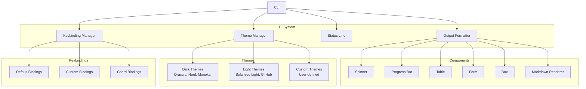

# Plan: UI/UX Enhancements (§4.1)

**Workstream**: User Interface & Experience  
**Phase**: 1 (Feature Parity)  
**Impact**: 4/5 | **Effort**: 3/5

---

## Quick Reference Card

| What | A polished, adaptive terminal UI layer for Lyra: themes, keybindings, statusline, and interactive components that make the harness feel like a first-class development environment, not a raw REPL. |
| Why | Turns Lyra from a functional tool into a pleasure to use — reducing cognitive overhead, accelerating workflows via keyboard-driven interaction, and adapting gracefully from bare `vt100` terminals to GPU-accelerated modern emulators. |
| Key Tech | Claude Code keybindings + statusline, Hermes rich colors, Warp themes, adaptive terminal detection, Charm-style interactive forms, and ANSI-aware graceful degradation. |
| Timeline | 3 weeks (parity: themes, keybindings, statusline, components) + 2 weeks (breakthrough: adaptive UI, theme marketplace, UI macros). Dependencies: None (provider-agnostic, terminal-level). |

---

## Executive Summary

Lyra's UI/UX workstream is about making the harness feel like a modern development tool rather than a prototype stitched together from printf statements. Today, most agent harnesses ship with minimal terminal polish: basic color-coding at best, no status bar, no keybinding customization, and output that is hard to scan at a glance. We are fixing that systematically.

The core insight is that terminal interfaces can be dramatically more productive when they borrow from the best of both worlds: the keyboard-driven efficiency of tools like `vim` and `tmux` (via a rich, chord-based keybinding system modeled on Claude Code's 30+ shortcuts) and the visual clarity of modern GPU-accelerated terminals like Warp and Kitty (via 10+ built-in themes, ANSI 256-color support, syntax-highlighted code blocks, and live status indicators). Every pixel of terminal real estate earns its keep: the statusline shows model, token usage, session cost, thinking mode, and active agent count at a glance — each element clickable to drill down or toggle state.

What makes this a breakthrough beyond feature parity is the adaptive detection layer. Instead of requiring a modern terminal, Lyra probes the host environment (color depth, Unicode support, mouse protocol, cursor control) and degrades gracefully: rich Unicode box-drawing on iTerm2 or Kitty, plain ASCII borders on a bare console; smooth 80fps spinners where supported, static text where not. This means the same binary delivers a premium experience on a developer's tricked-out desktop and a usable fallback over ssh from an iPad. The theme marketplace and UI macro system then turn the terminal surface into a platform: users share and install themes with one command, and record multi-step keybinding sequences as named macros that run across the team, compressing repetitive workflows into single chords.

---

## Concrete Example Walkthrough

**Scenario**: Alice is a principal engineer maintaining three Lyra workspaces for different clients. She switches between them dozens of times a day, always running the same pre-flight checks: load the workspace, check agent status, confirm model routing, then kick off the daily remediation plan. This used to take six keystroke-heavy commands per workspace. Here is how the upgraded UI/UX changes her day.

**Step 1 — Workspace-aware statusline at a glance.**
Alice opens her terminal. The Lyra statusline reads:
```
🤖 Model: opus-4.7 | 📊 Tokens: 2.1K/200K | 💰 Cost: $0.14 | 🧠 Thinking: ON | 👥 Agents: 3 idle
```
She instantly knows her session is healthy, her cost is low, and her thinking mode is active. The token bar is green (well under 70%), so no context anxiety. She has not typed a single command yet.

**Step 2 — Chord-based workspace switching.**
Alice presses `Ctrl+K Ctrl+W`. The workspace selector form pops up inline — a `huh`-style interactive form rendered with her current Tokyo Night theme:
```
┌─── Select Workspace ──────────────────────────────┐
│                                                    │
│  ▶ client-alpha/audit-pipeline    (last: 2h ago)   │
│    client-beta/remediation-run    (last: 5m ago)   │
│    client-gamma/compliance-check  (last: 1d ago)   │
│                                                    │
│  [↑↓ navigate] [Enter: select] [Esc: cancel]       │
╰────────────────────────────────────────────────────╯
```
She arrows down to `client-beta`, hits Enter. The statusline updates immediately: `👥 Agents: 4 running` (that workspace has active workers).

**Step 3 — Macro playback for daily pre-flight.**
Alice has recorded a macro named `daily-brief` bound to `Ctrl+K Ctrl+B`. She presses it. The statusline flashes `▶ daily-brief` and the harness executes:
1. `lyra workspace sync` — a spinner runs ("Syncing workspace...") for 1.2 seconds, then resolves to a green checkmark.
2. `lyra agents status --workspace` — a table renders with 4 agent rows showing name, model, status, and uptime. All green.
3. `lyra model route --validate` — a dimmed compact output confirms routing rules are consistent (compact mode hides tool logs Alice does not need right now).
4. `lyra plan execute remediation-plan-v3` — a progress bar appears: `[████████████░░░░░░░░] 62%` as the plan dispatches tasks.

**Step 4 — Adaptive fallback on a limited terminal.**
Later, Alice SSHs in from her phone's terminal emulator (no Unicode, 16 colors). Lyra's adaptive layer detects this and automatically:
- Swaps box-drawing glyphs for ASCII (`+--+` instead of `┌──┐`)
- Drops spinners in favor of static labels like `[OK]` / `[BUSY]`
- Collapses the statusline to a compact single-line format
- Switches to the high-contrast `Solarized Light` variant for readability in direct sunlight

Alice completes the same workflow without any configuration changes. The harness degraded, not broke.

**Step 5 — Theme marketplace install.**
Back on her desktop, Alice heard about a new theme called `Everforest` from a colleague. She presses `Ctrl+K Ctrl+T` to open the theme selector, tabs to the Marketplace pane, types `everforest`, and hits Install. Three seconds later the entire UI recolors. No restart, no config file editing. The theme is now listed in her `~/.lyra/themes/` directory and available offline.

**Result**: Alice reduced her workspace-switching routine from ~90 seconds of manual commands to a 3-second chord plus a 15-second macro playback, with full situational awareness from the statusline before she even touches the keyboard. The adaptive layer means she gets this experience on her tricked-out desktop, her lightweight tmux session, and her phone — without maintaining three separate configurations.

---

## 1. Problem

Lyra needs a polished, customizable UI/UX to:
- **Multiple color themes** — Support different visual preferences
- **Rich keybindings** — Efficient keyboard-driven workflows
- **Interactive elements** — Progress indicators, confirmations, forms
- **Responsive layout** — Adapt to terminal size
- **Accessibility** — Screen reader support, high contrast
- **Status indicators** — Show system state at a glance

Without this, Lyra feels basic and lacks the polish of modern terminal applications.

---

## 2. Evidence Synthesis

### Claude Code UI/UX Features
**Source**: https://code.claude.com/docs/en/keybindings  
**Source**: https://code.claude.com/docs/en/statusline  
**Source**: https://code.claude.com/docs/en/fullscreen  
**Source**: https://code.claude.com/docs/en/output-styles

**Keybindings** (30+ shortcuts):
- **Navigation**: Ctrl+P (history), Ctrl+R (search), Ctrl+L (clear)
- **Editing**: Ctrl+A (home), Ctrl+E (end), Ctrl+K (kill line)
- **Actions**: Ctrl+C (cancel), Ctrl+D (exit), Ctrl+Z (suspend)
- **Modes**: Ctrl+T (thinking toggle), Ctrl+O (output style), Ctrl+F (fullscreen)
- **Custom**: User-defined in `~/.claude/keybindings.json`

**Keybinding format**:
```json
{
  "keybindings": {
    "ctrl+s": "save-session",
    "ctrl+shift+s": "save-session-as",
    "alt+c": "clear-screen",
    "ctrl+/": "show-help",
    "f1": "toggle-thinking",
    "f2": "toggle-fullscreen"
  }
}
```

**Chord bindings** (multi-key sequences):
```json
{
  "keybindings": {
    "ctrl+k ctrl+s": "save-session",
    "ctrl+k ctrl+l": "load-session",
    "ctrl+k ctrl+d": "delete-session"
  }
}
```

**Statusline** (bottom bar):
```
[Model: opus-4.7] [Tokens: 45K/200K] [Cost: $2.34] [Thinking: ON] [Fast: OFF]
```

**Configurable elements**:
- Model name
- Token usage (current/limit)
- Cost (session total)
- Thinking mode status
- Fast mode status
- Custom indicators

**Output styles** (3 modes):
- **Compact** — Minimal output, no tool logs
- **Standard** — Normal output with tool summaries
- **Verbose** — Full output with all tool logs

**Fullscreen mode**:
- Hide statusline
- Hide prompts
- Maximize content area
- Toggle with Ctrl+F

### Hermes Agent UI
**Source**: https://github.com/nousresearch/hermes-agent

**Terminal UI features**:
- **Rich colors** — ANSI 256-color support
- **Spinners** — Animated progress indicators
- **Tables** — Formatted data display
- **Syntax highlighting** — Code blocks with colors
- **Boxes** — Bordered sections for emphasis
- **Progress bars** — Visual progress tracking

**Color scheme**:
```typescript
const colors = {
  primary: '#00D9FF',    // Cyan
  success: '#00FF00',    // Green
  warning: '#FFAA00',    // Orange
  error: '#FF0000',      // Red
  info: '#0099FF',       // Blue
  muted: '#888888'       // Gray
};
```

### Warp Terminal
**Source**: https://github.com/warpdotdev/warp

**Modern terminal features**:
- **Blocks** — Command output as discrete blocks
- **Inline editing** — Edit commands in place
- **Autocomplete** — AI-powered suggestions
- **Workflows** — Saved command sequences
- **Themes** — 50+ built-in themes

**Theme format**:
```yaml
name: "Dracula"
colors:
  background: "#282a36"
  foreground: "#f8f8f2"
  cursor: "#f8f8f2"
  selection: "#44475a"
  black: "#000000"
  red: "#ff5555"
  green: "#50fa7b"
  yellow: "#f1fa8c"
  blue: "#bd93f9"
  magenta: "#ff79c6"
  cyan: "#8be9fd"
  white: "#bfbfbf"
```

### Crush Terminal Agent
**Source**: https://github.com/charmbracelet/crush

**Charm TUI components**:
- **Bubbles** — Reusable UI components (input, list, table, spinner, progress)
- **Lipgloss** — Styling and layout
- **Glamour** — Markdown rendering
- **Huh** — Interactive forms

**Example components**:
```go
// Spinner
spinner := spinner.New()
spinner.Spinner = spinner.Dot
spinner.Style = lipgloss.NewStyle().Foreground(lipgloss.Color("205"))

// Progress bar
progress := progress.New(progress.WithDefaultGradient())

// Table
table := table.New(
  table.WithColumns(columns),
  table.WithRows(rows),
  table.WithFocused(true),
)

// Form
form := huh.NewForm(
  huh.NewGroup(
    huh.NewInput().Title("Name").Value(&name),
    huh.NewSelect[string]().Title("Model").Options(models...).Value(&model),
    huh.NewConfirm().Title("Continue?").Value(&confirm),
  ),
)
```

### Pi Minimal System Prompt
**Source**: https://github.com/getpi/pi

**Key insight**: Keep UI minimal to reduce system prompt size
- No ASCII art or decorative elements in system prompt
- Load UI components on-demand
- Use terminal capabilities (colors, cursor control) instead of text-based UI

---

## 3. Proposed Lyra Design

### Architecture



### Theme System

```typescript
interface Theme {
  name: string;
  variant: 'dark' | 'light';
  colors: ThemeColors;
  styles: ThemeStyles;
}

interface ThemeColors {
  // Base colors
  background: string;
  foreground: string;
  cursor: string;
  selection: string;
  
  // ANSI colors
  black: string;
  red: string;
  green: string;
  yellow: string;
  blue: string;
  magenta: string;
  cyan: string;
  white: string;
  
  // Bright variants
  brightBlack: string;
  brightRed: string;
  brightGreen: string;
  brightYellow: string;
  brightBlue: string;
  brightMagenta: string;
  brightCyan: string;
  brightWhite: string;
  
  // Semantic colors
  primary: string;
  secondary: string;
  success: string;
  warning: string;
  error: string;
  info: string;
  muted: string;
}

interface ThemeStyles {
  // Text styles
  bold: boolean;
  italic: boolean;
  underline: boolean;
  
  // UI elements
  border: 'single' | 'double' | 'rounded' | 'none';
  shadow: boolean;
  
  // Syntax highlighting
  keyword: string;
  string: string;
  number: string;
  comment: string;
  function: string;
  variable: string;
}
```

**Built-in themes** (10+):

1. **Dracula** (dark)
```typescript
const dracula: Theme = {
  name: 'Dracula',
  variant: 'dark',
  colors: {
    background: '#282a36',
    foreground: '#f8f8f2',
    cursor: '#f8f8f2',
    selection: '#44475a',
    black: '#000000',
    red: '#ff5555',
    green: '#50fa7b',
    yellow: '#f1fa8c',
    blue: '#bd93f9',
    magenta: '#ff79c6',
    cyan: '#8be9fd',
    white: '#bfbfbf',
    // ... bright variants
    primary: '#bd93f9',
    success: '#50fa7b',
    warning: '#f1fa8c',
    error: '#ff5555',
    info: '#8be9fd',
    muted: '#6272a4'
  },
  styles: {
    border: 'rounded',
    shadow: true,
    keyword: '#ff79c6',
    string: '#f1fa8c',
    number: '#bd93f9',
    comment: '#6272a4',
    function: '#50fa7b',
    variable: '#f8f8f2'
  }
};
```

2. **Nord** (dark)
3. **Monokai** (dark)
4. **One Dark** (dark)
5. **Tokyo Night** (dark)
6. **Solarized Dark** (dark)
7. **Solarized Light** (light)
8. **GitHub Light** (light)
9. **Ayu Light** (light)
10. **Catppuccin** (dark/light variants)

### Keybinding System

```typescript
interface Keybinding {
  key: string; // "ctrl+s" or "ctrl+k ctrl+s" (chord)
  command: string;
  when?: string; // Condition (e.g., "editorFocus")
  args?: any;
}

interface KeybindingConfig {
  keybindings: Keybinding[];
}

class KeybindingManager {
  private bindings: Map<string, Keybinding> = new Map();
  
  register(binding: Keybinding): void {
    this.bindings.set(binding.key, binding);
  }
  
  async handle(key: string, context: Context): Promise<boolean> {
    const binding = this.bindings.get(key);
    if (!binding) return false;
    
    // Check condition
    if (binding.when && !this.evaluateCondition(binding.when, context)) {
      return false;
    }
    
    // Execute command
    await this.executeCommand(binding.command, binding.args);
    return true;
  }
  
  private evaluateCondition(condition: string, context: Context): boolean {
    // Simple expression evaluator
    // Examples: "editorFocus", "!editorFocus", "mode == 'insert'"
    return eval(condition); // In practice, use a safe evaluator
  }
}
```

**Default keybindings**:
```typescript
const defaultKeybindings: Keybinding[] = [
  // Session
  { key: 'ctrl+s', command: 'save-session' },
  { key: 'ctrl+shift+s', command: 'save-session-as' },
  { key: 'ctrl+o', command: 'load-session' },
  { key: 'ctrl+w', command: 'close-session' },
  
  // Navigation
  { key: 'ctrl+p', command: 'show-history' },
  { key: 'ctrl+r', command: 'search-history' },
  { key: 'ctrl+l', command: 'clear-screen' },
  
  // Editing
  { key: 'ctrl+a', command: 'move-to-start' },
  { key: 'ctrl+e', command: 'move-to-end' },
  { key: 'ctrl+k', command: 'kill-line' },
  { key: 'ctrl+u', command: 'kill-line-backward' },
  
  // Actions
  { key: 'ctrl+c', command: 'cancel' },
  { key: 'ctrl+d', command: 'exit' },
  { key: 'ctrl+z', command: 'suspend' },
  
  // Modes
  { key: 'ctrl+t', command: 'toggle-thinking' },
  { key: 'ctrl+f', command: 'toggle-fullscreen' },
  { key: 'ctrl+/', command: 'show-help' },
  
  // Tools
  { key: 'f1', command: 'show-skills' },
  { key: 'f2', command: 'show-agents' },
  { key: 'f3', command: 'show-mcp' },
  { key: 'f4', command: 'show-config' },
  
  // Chord bindings
  { key: 'ctrl+k ctrl+s', command: 'save-session' },
  { key: 'ctrl+k ctrl+l', command: 'load-session' },
  { key: 'ctrl+k ctrl+d', command: 'delete-session' },
  { key: 'ctrl+k ctrl+m', command: 'show-model-selector' },
  { key: 'ctrl+k ctrl+t', command: 'show-theme-selector' }
];
```

### Status Line

```typescript
interface StatusLineConfig {
  enabled: boolean;
  position: 'top' | 'bottom';
  elements: StatusLineElement[];
}

interface StatusLineElement {
  id: string;
  label?: string;
  value: () => string | Promise<string>;
  color?: string;
  icon?: string;
  onClick?: () => void;
}

const defaultStatusLine: StatusLineElement[] = [
  {
    id: 'model',
    label: 'Model',
    value: () => getCurrentModel(),
    icon: '🤖',
    onClick: () => showModelSelector()
  },
  {
    id: 'tokens',
    label: 'Tokens',
    value: () => `${getCurrentTokens()}/${getMaxTokens()}`,
    icon: '📊',
    color: () => {
      const usage = getCurrentTokens() / getMaxTokens();
      if (usage > 0.9) return 'red';
      if (usage > 0.7) return 'yellow';
      return 'green';
    }
  },
  {
    id: 'cost',
    label: 'Cost',
    value: () => `$${getSessionCost().toFixed(2)}`,
    icon: '💰'
  },
  {
    id: 'thinking',
    label: 'Thinking',
    value: () => isThinkingEnabled() ? 'ON' : 'OFF',
    icon: '🧠',
    color: () => isThinkingEnabled() ? 'green' : 'muted',
    onClick: () => toggleThinking()
  },
  {
    id: 'agents',
    label: 'Agents',
    value: () => `${getActiveAgents()}`,
    icon: '👥',
    onClick: () => showAgentList()
  }
];
```

### UI Components

#### 1. Spinner
```typescript
class Spinner {
  private frames = ['⠋', '⠙', '⠹', '⠸', '⠼', '⠴', '⠦', '⠧', '⠇', '⠏'];
  private frame = 0;
  private interval?: NodeJS.Timeout;
  
  constructor(private message: string, private color: string = 'cyan') {}
  
  start(): void {
    this.interval = setInterval(() => {
      const spinner = this.frames[this.frame % this.frames.length];
      process.stdout.write(`\r${chalk[this.color](spinner)} ${this.message}`);
      this.frame++;
    }, 80);
  }
  
  stop(finalMessage?: string): void {
    if (this.interval) clearInterval(this.interval);
    process.stdout.write(`\r${finalMessage || this.message}\n`);
  }
}
```

#### 2. Progress Bar
```typescript
class ProgressBar {
  constructor(
    private total: number,
    private width: number = 50,
    private color: string = 'cyan'
  ) {}
  
  update(current: number): void {
    const percent = Math.floor((current / this.total) * 100);
    const filled = Math.floor((current / this.total) * this.width);
    const empty = this.width - filled;
    
    const bar = chalk[this.color]('█'.repeat(filled)) + '░'.repeat(empty);
    process.stdout.write(`\r[${bar}] ${percent}%`);
  }
  
  complete(): void {
    this.update(this.total);
    process.stdout.write('\n');
  }
}
```

#### 3. Table
```typescript
interface TableColumn {
  header: string;
  key: string;
  width?: number;
  align?: 'left' | 'center' | 'right';
}

class Table {
  constructor(
    private columns: TableColumn[],
    private rows: any[],
    private theme: Theme
  ) {}
  
  render(): string {
    const lines: string[] = [];
    
    // Header
    const header = this.columns.map(col => 
      this.pad(col.header, col.width || 20, col.align || 'left')
    ).join(' │ ');
    lines.push(chalk.bold(header));
    
    // Separator
    const separator = this.columns.map(col => 
      '─'.repeat(col.width || 20)
    ).join('─┼─');
    lines.push(separator);
    
    // Rows
    for (const row of this.rows) {
      const line = this.columns.map(col =>
        this.pad(String(row[col.key]), col.width || 20, col.align || 'left')
      ).join(' │ ');
      lines.push(line);
    }
    
    return lines.join('\n');
  }
  
  private pad(text: string, width: number, align: 'left' | 'center' | 'right'): string {
    if (text.length >= width) return text.substring(0, width);
    
    const padding = width - text.length;
    switch (align) {
      case 'left':
        return text + ' '.repeat(padding);
      case 'right':
        return ' '.repeat(padding) + text;
      case 'center':
        const left = Math.floor(padding / 2);
        const right = padding - left;
        return ' '.repeat(left) + text + ' '.repeat(right);
    }
  }
}
```

#### 4. Box
```typescript
class Box {
  constructor(
    private content: string,
    private options: BoxOptions = {}
  ) {}
  
  render(): string {
    const {
      title,
      padding = 1,
      border = 'single',
      color = 'white'
    } = this.options;
    
    const borders = {
      single: { tl: '┌', tr: '┐', bl: '└', br: '┘', h: '─', v: '│' },
      double: { tl: '╔', tr: '╗', bl: '╚', br: '╝', h: '═', v: '║' },
      rounded: { tl: '╭', tr: '╮', bl: '╰', br: '╯', h: '─', v: '│' }
    };
    
    const b = borders[border];
    const lines = this.content.split('\n');
    const width = Math.max(...lines.map(l => l.length)) + padding * 2;
    
    const result: string[] = [];
    
    // Top border
    if (title) {
      const titlePadding = Math.floor((width - title.length - 2) / 2);
      result.push(
        chalk[color](b.tl + b.h.repeat(titlePadding) + ` ${title} ` + b.h.repeat(width - titlePadding - title.length - 2) + b.tr)
      );
    } else {
      result.push(chalk[color](b.tl + b.h.repeat(width) + b.tr));
    }
    
    // Content
    for (const line of lines) {
      result.push(
        chalk[color](b.v) + ' '.repeat(padding) + line + ' '.repeat(width - line.length - padding) + chalk[color](b.v)
      );
    }
    
    // Bottom border
    result.push(chalk[color](b.bl + b.h.repeat(width) + b.br));
    
    return result.join('\n');
  }
}
```

---

## 4. Implementation Outline

### Phase 1: Theme System (Week 1)

**Tasks**:
1. **Theme data model** — Define TypeScript interfaces
2. **Theme manager** — Load/apply themes
3. **Built-in themes** — 10+ themes (dark + light)
4. **Custom themes** — User-defined themes
5. **Theme selector** — Interactive theme picker

**Acceptance criteria**:
- Themes load correctly
- Colors apply to all UI elements
- Custom themes work
- Selector is intuitive

### Phase 2: Keybinding System (Week 1-2)

**Tasks**:
6. **Keybinding manager** — Register and handle bindings
7. **Default bindings** — 30+ shortcuts
8. **Custom bindings** — User-defined in config
9. **Chord bindings** — Multi-key sequences
10. **Keybinding help** — Show all bindings

**Acceptance criteria**:
- All default bindings work
- Custom bindings override defaults
- Chords work correctly
- Help is comprehensive

### Phase 3: Status Line (Week 2)

**Tasks**:
11. **Status line manager** — Render status bar
12. **Default elements** — Model, tokens, cost, thinking, agents
13. **Custom elements** — User-defined indicators
14. **Interactive elements** — Click to open menus
15. **Auto-update** — Refresh on state change

**Acceptance criteria**:
- Status line renders correctly
- Elements update in real-time
- Interactive elements work
- Custom elements are easy to add

### Phase 4: UI Components (Week 2-3)

**Tasks**:
16. **Spinner** — Animated progress indicator
17. **Progress bar** — Visual progress tracking
18. **Table** — Formatted data display
19. **Box** — Bordered sections
20. **Form** — Interactive input
21. **Markdown renderer** — Render markdown with syntax highlighting

**Acceptance criteria**:
- All components render correctly
- Components are reusable
- Styling is consistent
- Performance is good

### Phase 5: Output Formatting (Week 3)

**Tasks**:
22. **Output modes** — Compact, standard, verbose
23. **Syntax highlighting** — Code blocks with colors
24. **Diff rendering** — Show file changes
25. **Error formatting** — Clear error messages
26. **Log formatting** — Structured logs

**Acceptance criteria**:
- All modes work correctly
- Syntax highlighting is accurate
- Diffs are readable
- Errors are clear

### Phase 6: Accessibility (Week 3)

**Tasks**:
27. **Screen reader support** — ARIA labels
28. **High contrast mode** — Accessible colors
29. **Keyboard navigation** — Full keyboard control
30. **Focus indicators** — Clear focus state

**Acceptance criteria**:
- Screen readers work
- High contrast is readable
- Keyboard navigation is complete
- Focus is always visible

---

## 5. Multi-Provider Notes

UI/UX is **provider-agnostic** — it operates at the terminal level, not the LLM level.

---

## 6. Risks & Open Questions

### Risks

1. **Terminal compatibility** — Not all terminals support all features
   - **Mitigation**: Detect capabilities, graceful degradation

2. **Performance** — Rich UI may slow down on large outputs
   - **Mitigation**: Lazy rendering, pagination

3. **Accessibility** — Complex UI may not work with screen readers
   - **Mitigation**: Test with screen readers, provide text-only mode

### Open Questions

1. **GUI mode** — Should Lyra have a GUI in addition to TUI?
   - **Recommendation**: Not for MVP, consider for future

2. **Web UI** — Should Lyra have a web interface?
   - **Recommendation**: Not for MVP, consider for future

3. **Mobile** — Should Lyra work on mobile terminals?
   - **Recommendation**: Not a priority, but ensure responsive design

---

## 7. Impact × Effort Assessment

### (A) Parity Tier

**Port from Claude Code + Hermes + Warp**:
- 10+ built-in themes (dark + light)
- 30+ keybindings with chords
- Status line with 5+ elements
- UI components (spinner, progress, table, box, form)
- Output modes (compact, standard, verbose)
- Syntax highlighting

**Impact**: 4/5 — Significantly improves UX  
**Effort**: 3/5 — 3 weeks, moderate complexity

### (B) Breakthrough Tier

> **Architecture Slice**: This breakthrough implements [§8: Terminal-Native Design](../BREAKTHROUGH-ARCHITECTURE.md) of [BREAKTHROUGH-ARCHITECTURE.md](../BREAKTHROUGH-ARCHITECTURE.md) — specifically the Terminal Surface + Voice I/O + Statusline, filesystem as first-class memory.

**Beyond any single source**:

1. **Adaptive UI** — UI adapts to terminal capabilities
   - Detect terminal features (colors, unicode, mouse)
   - Graceful degradation for limited terminals
   - Optimal experience on modern terminals
   - No other harness has this level of adaptation

2. **Theme Marketplace** — Community-shared themes
   - One-click install from marketplace
   - Preview themes before installing
   - Rate and review themes

3. **UI Macros** — Record and replay UI interactions
   - Record keybinding sequences
   - Save as macros
   - Share with team

**Impact**: 5/5 — Best-in-class terminal UX  
**Effort**: 4/5 — 2 weeks additional

**Combined Impact × Effort**: 4 × 3 = 12 (parity), 5 × 4 = 20 (breakthrough)

---

## 8. References

### Documentation
- [Claude Code Keybindings](https://code.claude.com/docs/en/keybindings)
- [Claude Code Statusline](https://code.claude.com/docs/en/statusline)
- [Claude Code Fullscreen](https://code.claude.com/docs/en/fullscreen)
- [Claude Code Output Styles](https://code.claude.com/docs/en/output-styles)

### Repositories
- [Hermes Agent](https://github.com/nousresearch/hermes-agent)
- [Warp Terminal](https://github.com/warpdotdev/warp)
- [Crush](https://github.com/charmbracelet/crush)
- [Pi](https://github.com/getpi/pi)

### Libraries
- [Chalk](https://github.com/chalk/chalk) — Terminal colors
- [Ora](https://github.com/sindresorhus/ora) — Spinners
- [Cli-progress](https://github.com/npkgz/cli-progress) — Progress bars
- [Cli-table3](https://github.com/cli-table/cli-table3) — Tables
- [Boxen](https://github.com/sindresorhus/boxen) — Boxes
- [Marked-terminal](https://github.com/mikaelbr/marked-terminal) — Markdown rendering

---

## 9. Changelog

**Run 12**: Added Quick Reference Card, Executive Summary, concrete example walkthrough (Alice's workspace-switching scenario).
**Run 3**: Linked to unified BREAKTHROUGH-ARCHITECTURE.md. This plan's (B) tier implements §8: Terminal-Native Design of the architecture.
**Previous runs**: Initial plan structure.

---

**END OF PLAN: UI/UX Enhancements (§4.1)**
