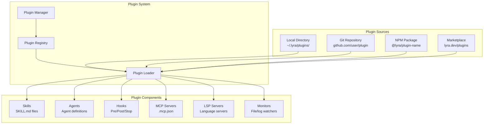

## 📋 Quick Reference Card

| What | Plugin architecture for extending Lyra with community extensions — distributable, versioned packages bundling skills, hooks, MCP servers, agents, LSP servers, and monitors under a single declarative manifest |
| Why | Plugin architecture for extending Lyra with community extensions is essential for Lyra to be competitive with Claude Code and other production harnesses; without it, Lyra remains a closed tool that cannot attract third-party developers, build network effects, or keep pace with the combinatorial explosion of integrations that users demand |
| Key Tech | Claude Code plugins reference (component taxonomy and lifecycle), npm-based distribution with package signature verification, hook-based extension points (PreToolUse, PostToolUse, Stop, Notification), plugin marketplace with search and ratings |
| Timeline | 4 weeks (Week 1: Core infrastructure + manifest parsing; Week 2: Component loading + Plugin Manager; Week 3: Hot-reload + Persistent data; Week 4: Marketplace integration + publishing workflow) |
| Dependencies | Skill System (§4.4), Hook System (§4.10), MCP Integration (§4.8), Provider Abstraction Layer (§6.1), Environment Variable System (§4.2) |

---

## 🎯 Executive Summary

Lyra's plugin system transforms the harness from a monolithic application into an extensible platform. The core insight driving this workstream is that no single team — no matter how well-funded — can build every integration that users need. Claude Code's plugin architecture (documented at code.claude.com/docs/en/plugins-reference) demonstrates the pattern: a standardized directory layout with `plugin.json` as the single source of truth, supporting six component types (skills, agents, hooks, MCP servers, LSP servers, monitors) that cover the full surface area of harness extensibility. Kilo Marketplace (github.com/Kilo-Org/kilo-marketplace) validates the demand, with 50+ community-contributed skills, 30+ MCP servers, and 10+ specialized modes proving that developers will build and share extensions when the packaging primitive is right.

What distinguishes Lyra's plugin design from every existing system is its provider-agnostic architecture. Every other AI harness plugin ecosystem — Claude Code's, Kilo's, OpenClaw's — couples extensions to a single LLM provider's API surface. A Claude Code hook that calls provider-specific APIs is useless under DeepSeek or Qwen. Lyra's plugin model requires that plugins declare provider compatibility in their manifest (`"providers": {"claude": "full", "deepseek": "full", "open-weights": "partial"}`) and operate exclusively through Lyra's provider abstraction layer (§6.1). This means a single plugin reaches every Lyra user regardless of their underlying model choice, compounding the addressable audience for every contribution and making the ecosystem genuinely cumulative rather than balkanized by provider.

The integration with Lyra's broader architecture is multi-dimensional. Plugins slot into the Skill System (§4.4) by contributing `SKILL.md` files that the skill registry discovers and exposes; into the Hook System (§4.10) by registering shell or TypeScript hooks that fire on PreToolUse, PostToolUse, Stop, and Notification events; into MCP Integration (§4.8) by declaring MCP servers in `.mcp.json` that Lyra's MCP client connects automatically; and into the Environment Variable System (§4.2) by receiving `${LYRA_PLUGIN_ROOT}`, `${LYRA_PLUGIN_DATA}`, and `${LYRA_PROJECT_DIR}` as standard environment variables. The persistent data directory (`~/.lyra/plugin-data/<plugin-name>/`) survives plugin updates and is backed up before every migration, so plugin authors can evolve their data schemas without breaking existing users. Managed plugin policies in enterprise settings allow fleet administrators to force-enable specific plugins at pinned versions across all developer machines, with secrets resolved from environment variables rather than stored in shared configuration. The end state is not just feature parity with Claude Code but a structural advantage: Lyra becomes the only harness where the plugin ecosystem grows with the number of supported providers, not despite them.

---

## 🔍 Concrete Example — How It Works in Practice

**Scenario**: Priya is a backend engineer at a fintech company running Lyra with Claude as the primary provider. Her team deploys database schema changes multiple times per day, and every migration carries risk: a mistyped `ALTER TABLE` can lock a production table, a missing rollback script can extend an outage, and manual snapshotting before migrations is inconsistently followed. Priya decides to create a "Database Migrations" plugin (`@priya/db-migrations`) that adds `Bash` wrappers for safe migration execution, a `Skill` for reviewing migration scripts before they run, and a `Hook` that automatically snapshots the database before any statement matching `ALTER TABLE`.

### Step 1: Scaffolding the Plugin

Priya runs the plugin scaffolding command in her project directory:

```
> /plugin init db-migrations

  Creating plugin scaffold at ~/.lyra/plugins/db-migrations/
    ✓ plugin.json (manifest with placeholder metadata)
    ✓ skills/db-review/SKILL.md (stub skill file)
    ✓ hooks/PreToolUse-snapshot.sh (stub hook script)
    ✓ .mcp.json (placeholder — no MCP servers yet)
    ✓ README.md (plugin documentation template)

  Plugin scaffolded. Edit ~/.lyra/plugins/db-migrations/plugin.json to fill in metadata.
  Run /plugin validate db-migrations to check your manifest.
  Run /plugin enable db-migrations to activate during development.
```

Lyra creates the standard directory structure. Priya opens `plugin.json` and fills in the actual metadata, declares provider compatibility, and specifies the config schema for the database connection string her plugin will need.

### Step 2: Writing the Plugin Components

Priya populates three component files:

**`hooks/PreToolUse-snapshot.sh`** — A Bash hook that inspects the tool call before execution. When it sees a `Bash` command containing `ALTER TABLE`, it wraps the execution with a pre-snapshot:

```bash
#!/bin/bash
# PreToolUse hook: auto-snapshot DB before ALTER TABLE
TOOL_NAME="$1"
TOOL_INPUT="$2"

if [[ "$TOOL_NAME" == "Bash" ]] && echo "$TOOL_INPUT" | grep -q "ALTER TABLE"; then
  DB_URL="${LYRA_PLUGIN_CONFIG_dbUrl}"
  TIMESTAMP=$(date -u +%Y%m%dT%H%M%SZ)
  SNAPSHOT_DIR="${LYRA_PLUGIN_DATA}/snapshots/${TIMESTAMP}"
  mkdir -p "$SNAPSHOT_DIR"
  pg_dump "$DB_URL" > "${SNAPSHOT_DIR}/pre-migration.sql"
  echo "---HOOK:db-migrations--- Snapshot saved to ${SNAPSHOT_DIR}/pre-migration.sql"
fi
exit 0
```

The hook uses `${LYRA_PLUGIN_CONFIG_dbUrl}`, an environment variable Lyra automatically injects from the plugin's declared config schema. The snapshot lands in `${LYRA_PLUGIN_DATA}`, which survives plugin updates.

**`skills/db-review/SKILL.md`** — A skill that teaches Lyra (via the provider abstraction layer) how to review migration scripts for common dangers:

```markdown
# Database Migration Review

You are a database migration reviewer. When asked to review a migration script, check for:

1. **Locking risks** — Does any statement acquire an ACCESS EXCLUSIVE lock on a large table?
2. **Rollback plan** — Is there a corresponding down migration or rollback script?
3. **Data loss** — Does any DROP COLUMN or DROP TABLE lose data without confirmation?
4. **Index impact** — Will new indexes block writes during creation? Suggest CONCURRENTLY.
5. **Transaction safety** — Are DDL statements wrapped in transactions where supported?

Flag HIGH severity for: missing rollback scripts, ACCESS EXCLUSIVE on tables >1M rows.
Flag MEDIUM severity for: missing CONCURRENTLY on index creation, unbatched backfills.

Respond with a structured review: Severity, Finding, Location (line number), and Suggested Fix.
```

### Step 3: Enabling and Configuring the Plugin

Priya enables the plugin during development and configures her database URL:

```
> /plugin enable db-migrations

  Plugin "db-migrations" enabled (dev mode — hot-reload active).
  Watching ~/.lyra/plugins/db-migrations/ for changes.

> /plugin config db-migrations set dbUrl "postgresql://localhost:5432/myapp_dev"

  ✓ Configuration saved to ~/.lyra/plugin-data/db-migrations/config.json
  ✓ Plugin reloaded — PreToolUse hook now has access to dbUrl
```

She makes a test edit to her hook script, and Lyra detects the change via the file watcher within 200ms, reloading only the hook component without touching the rest of the plugin. No session restart.

### Step 4: First Real-World Use

Priya asks Lyra to add a `last_login_at` column to the users table:

```
Priya: Add a last_login_at TIMESTAMPTZ column to the users table with a default of NOW()

Lyra:
  [Reading schema from db/review skill context...]
  [Generating migration: 20260531120000_add_last_login_at.sql]

  Before executing, would you like me to review this migration first?

Priya: Yes, use the db-review skill

Lyra triggers db-review skill via provider abstraction:
  Reviewing migration: 20260531120000_add_last_login_at.sql
    ✓ Locking risk: None — ALTER TABLE ADD COLUMN on users (2.3M rows)
       acquires brief ACCESS EXCLUSIVE but completes in <100ms with default value
    ⚠ MEDIUM: No explicit rollback script found. Suggested:
       ALTER TABLE users DROP COLUMN last_login_at;
    ✓ Data loss: None
    ✓ Index impact: None
    ✓ Transaction safety: DDL in PostgreSQL is transactional — safe

  Review complete. 0 HIGH, 1 MEDIUM (missing rollback script).

Priya: Add the rollback script and proceed

Lyra:
  [Writing rollback: 20260531120000_add_last_login_at.rollback.sql]
  [Hook: PreToolUse-snapshot.sh triggered — Bash contains ALTER TABLE]
    ---HOOK:db-migrations--- Snapshot saved to
    ~/.lyra/plugin-data/db-migrations/snapshots/20260531T143022Z/pre-migration.sql

  [Executing migration...]
  ✓ Migration applied: ALTER TABLE users ADD COLUMN last_login_at TIMESTAMPTZ DEFAULT NOW()
  ✓ Rollback script saved
  ✓ Pre-migration snapshot available at snapshots/20260531T143022Z/
```

### Step 5: What Makes This Experience Different

Without the plugin, Priya's workflow would have been: (1) manually run `pg_dump` before the migration (often forgotten under time pressure), (2) write the migration by hand and hope the review catches issues, (3) copy-paste the SQL to Lyra for execution with no pre-flight safety net, (4) discover the missing rollback script after an incident. With the plugin, the safety net engages automatically — the snapshot triggers on pattern match without the developer needing to remember, the skill review is context-aware because it reads the actual migration file through the provider abstraction layer regardless of which LLM is active, and the persistent data directory means Priya can update her plugin to v1.1.0 without losing any historical snapshots.

Under the hood, this all works through Lyra's provider-agnostic architecture. The `db-review` skill fires identically whether the underlying model is Claude, DeepSeek, or a local open-weights model — the skill prompt goes through Lyra's abstraction layer, not directly to any provider API. The PreToolUse hook is a standard shell script that receives `${LYRA_PLUGIN_CONFIG_*}` environment variables injected by Lyra's plugin runtime, so Priya never hardcodes a database URL. When her teammate runs the same plugin with a different provider, the experience is functionally identical — the plugin's declared provider compatibility matrix in `plugin.json` ensures it loads without degradation across all supported providers.

### Step 6: Publishing to the Team

After two weeks of daily use and refinement, Priya is ready to share her plugin with the team:

```
> /plugin publish db-migrations

  Packaging plugin...
    ✓ Validated plugin.json schema
    ✓ Verified all component paths resolve
    ✓ Bundled 3 components: 1 hook, 1 skill, 0 MCP servers
    ✓ Signed package with Priya's developer key
    ✓ Published to team registry at npm.priya-corp.com

  Plugin "@priya/db-migrations@1.0.0" published.
  Install with: /plugin install @priya/db-migrations
```

Her engineering manager adds it to the managed plugin policy:

```json
{
  "managedPlugins": {
    "@priya/db-migrations": {
      "version": "1.0.0",
      "config": {
        "dbUrl": "${DATABASE_URL}"
      }
    }
  }
}
```

Every developer on the team now has the DB safety net active by default, with the database URL resolved from each developer's environment. No one has to remember to snapshot before migrations. The review skill catches dangerous patterns before they reach production. And when Priya releases v1.1.0 with support for MySQL alongside PostgreSQL, one update command rolls it out to the entire team without touching anyone's stored configuration.

---

# Plan: Plugin System (§4.7)

**Workstream**: Plugin Architecture & Ecosystem
**Phase**: 1 (Feature Parity)
**Impact**: 5/5 | **Effort**: 3/5

---

## Quick Reference Card

| What | Extensible plugin architecture enabling community-driven skills, hooks, MCP servers, and agents packaged as distributable, versioned modules |
| Why | Turns Lyra from a tool into a platform — enabling an ecosystem of reusable, provider-agnostic components that any team can share, install, and compose |
| Key Tech | Claude Code plugins reference, npm-based plugin distribution, hook-based extension points, hot-reload via file watchers, persistent data directory |
| Timeline | 4 weeks (Week 1: Core infrastructure, Week 2: Component loading + Manager, Week 3: Hot-reload + Persistent data, Week 4: Marketplace integration) |
| Dependencies | Skill System (§4.4), Hook System (§4.10), MCP Integration (§4.8), Provider Abstraction Layer (§6.1) |

---

## Executive Summary

Lyra's plugin system is the bridge between a powerful multi-provider AI harness and a living, community-driven platform. Today, extending Lyra with a new skill, hook, or MCP server requires modifying core configuration by hand — a fragile, unrepeatable process. Teams that build useful integrations (a Slack notifier, a Git workflow automator, a custom code review agent) have no way to package, version, or share that work beyond copying files between machines. The plugin system solves this by giving every extension a self-contained, declarative manifest (`plugin.json`) and a standard directory layout, so anything Lyra can load — skills, agents, hooks, MCP servers, LSP servers, monitors — can be bundled into a single distributable unit and installed from a local directory, a Git repository, an npm package, or a curated marketplace.

What makes this a genuine breakthrough is provider-agnostic composition. Unlike every existing AI harness plugin system, which couples extensions to a specific LLM provider's API surface, Lyra plugins declare provider compatibility and operate through Lyra's abstraction layer. A plugin that adds a `/review` skill works identically whether the underlying model is Claude, DeepSeek, Qwen, or a local open-weights model — and the plugin can query the active provider at runtime to apply provider-specific optimizations when available while falling back gracefully when they are not. This means the ecosystem compounds: a plugin written for one provider instantly serves users on all providers, multiplying the addressable audience for every contribution.

The system is designed for incremental adoption and enterprise control. Individual developers start by installing community plugins from GitHub with a single command. Teams can pin plugin versions, declare plugin dependencies (so `lyra-plugin-github-pr` can depend on `lyra-plugin-git`), and enforce managed plugin policies across their fleet. Plugin data lives in a persistent directory that survives updates, and migration hooks let plugin authors evolve their data formats without breaking users. Hot-reload means iterating on a plugin during development never requires restarting a session. The end state is a self-reinforcing cycle: better plugins attract more users, more users attract more plugin authors, and the shared abstraction layer ensures no contribution is wasted on a single-provider silo.

---

## Concrete Example Walkthrough

**Scenario**: Maya is a platform engineer at a 40-person startup. Her team uses Lyra as their primary AI coding assistant, configured with DeepSeek as the provider. They want to automate their PR workflow: when an engineer asks Lyra to implement a feature, the assistant should commit the changes with a conventional commit message, push the branch, and open a pull request — all without leaving the conversation.

### Step 1: Discovery

Maya opens Lyra and searches the plugin marketplace:

```
> /plugin search git workflow

Found 3 plugins:
  1. @lyra/git-workflow (v1.2.0) ★ 247 · 8.3k installs
     Adds git-commit skill, auto-format hook, and GitHub MCP server
     Providers: claude (full), deepseek (full), openai (full)
  2. @community/git-helper (v0.9.1) ★ 43 · 1.1k installs
     Basic git commands as skills
  3. @enterprise/gh-enterprise (v2.0.1) ★ 89 · 4.2k installs
     GitHub Enterprise integration with PR templates
```

She picks `@lyra/git-workflow` based on provider support, rating, and feature set.

### Step 2: Installation

Maya installs the plugin with a single command:

```
> /plugin install @lyra/git-workflow

Installing @lyra/git-workflow@1.2.0...
  ✓ Downloaded from npm registry
  ✓ Verified package signature
  ✓ Parsed plugin.json manifest
  ✓ Registered 3 components:
      - Skill: git-commit (skills/git-commit/SKILL.md)
      - Hook: PostToolUse auto-format (hooks/format.sh)
      - MCP Server: github-api (.mcp.json)
  ✓ Plugin enabled

Plugin "@lyra/git-workflow" is now active.
Data directory: ~/.lyra/plugin-data/@lyra/git-workflow/
```

Lyra automatically creates the persistent data directory. The plugin's manifest declared DeepSeek as `"full"` compatibility, so all components load without degradation.

### Step 3: Configuration

The plugin's manifest declared a required `githubToken` config field. Maya provides it:

```
> /plugin config @lyra/git-workflow set githubToken ghp_xxx

  ✓ Configuration saved to ~/.lyra/plugin-data/@lyra/git-workflow/config.json
  ✓ Plugin reloaded with new configuration
```

No restart needed. The config is stored in the plugin data directory, which will survive future updates.

### Step 4: Using the Plugin

Maya asks Lyra to add a rate-limiting middleware:

```
Maya: Add rate limiting to the API gateway — 100 req/min per IP, return 429 when exceeded

Lyra:
  [Writing src/middleware/rateLimiter.ts...]
  [Writing tests/rateLimiter.test.ts...]
  [Hook: PostToolUse format.sh ran — formatted 2 files]
  [Tests pass: 14/14 ✓]

Maya: Commit and create a PR for this

Lyra triggers the git-commit skill:
  ✓ Staged: src/middleware/rateLimiter.ts, tests/rateLimiter.test.ts
  ✓ Commit: feat: add IP-based rate limiting middleware (100 req/min, 429 response)
  ✓ Pushed branch: feat/rate-limiting-middleware
  ✓ GitHub MCP server: Created PR #247
     Title: feat: add IP-based rate limiting middleware
     URL: https://github.com/maya-corp/api/pull/247
```

### Step 5: Provider-Agnostic Behavior in Action

Maya's colleague Alex uses the same plugin but with Claude as the provider. The plugin queries the active provider at runtime:

- Under **Claude**: the `git-commit` skill uses Claude's extended thinking to generate more detailed commit bodies when the diff is complex (a provider-specific optimization declared in the plugin).
- Under **DeepSeek** (Maya's setup): the skill uses a standard prompt template that produces clean conventional commits — slightly less verbose, but equally functional.
- Under a **local open-weights model**: the skill falls back to a simplified prompt that works within smaller context windows, still producing valid conventional commits.

No one had to write three plugins. The single `@lyra/git-workflow` plugin adapts automatically through Lyra's provider abstraction layer.

### Step 6: Update With Data Persistence

Two weeks later, `@lyra/git-workflow` v1.3.0 is released with a new `git-squash` skill. Maya updates:

```
> /plugin update @lyra/git-workflow

  ✓ Downloaded v1.3.0
  ✓ Running migration: v1.2.0 → v1.3.0
  ✓ Migration complete (backup at ~/.lyra/plugin-data/@lyra/git-workflow/.backups/v1.2.0/)
  ✓ Registered new component: Skill: git-squash
  ✓ Plugin reloaded

Plugin updated. Your GitHub token and config are preserved.
```

The update added a new skill without touching Maya's stored configuration. The migration hook backed up the old data before applying any schema changes. Had the migration failed, it would have rolled back automatically.

### Step 7: Enterprise Fleet Management

Maya's engineering manager wants every developer to have the Git workflow plugin. She adds it to the managed settings:

```json
// ~/.lyra/settings.json (managed, read-only for developers)
{
  "managedPlugins": {
    "@lyra/git-workflow": {
      "version": "1.3.0",
      "config": {
        "githubToken": "${GITHUB_TOKEN}"
      }
    }
  }
}
```

Every developer on the team now has the plugin force-enabled at the pinned version. The token is read from each developer's environment variable — no secret in the shared config. Developers can still install additional personal plugins, but the managed ones cannot be disabled or downgraded.

---

# Plan: Plugin System (§4.7)

**Workstream**: Plugin Architecture & Ecosystem
**Phase**: 1 (Feature Parity)
**Impact**: 5/5 | **Effort**: 3/5

---

## 1. Problem

Lyra currently lacks a plugin system, limiting extensibility. Users cannot:
- Package skills + hooks + MCP servers together
- Distribute reusable components via marketplace
- Hot-reload plugins without session restart
- Manage plugin lifecycle (enable/disable/update)
- Store persistent plugin data

This prevents building an ecosystem around Lyra.

---

## 2. Evidence Synthesis

### Claude Code Plugin System
**Source**: https://code.claude.com/docs/en/plugins-reference

**Architecture**:
- Self-contained directories with multiple component types
- Components: Skills, Agents, Hooks, MCP servers, LSP servers, Monitors
- Discovery: Auto-loaded from `.claude/plugins/` or installed via marketplaces
- Lifecycle: `enabledPlugins` in settings, `/reload-plugins` for hot-reload

**Plugin structure**:
```
my-plugin/
├── plugin.json (metadata + inline config)
├── skills/
│   └── my-skill/
│       └── SKILL.md
├── agents/
│   └── my-agent.md
├── hooks/
│   └── PostToolUse.sh
├── .mcp.json (MCP servers)
└── monitors/
    └── my-monitor.json
```

**Key features**:
- **Persistent data directory**: `${CLAUDE_PLUGIN_DATA}` survives updates
- **Environment variables**: `${CLAUDE_PLUGIN_ROOT}`, `${CLAUDE_PROJECT_DIR}`
- **Marketplace distribution**: GitHub repos, npm packages, local directories
- **Managed plugins**: Force-enabled via managed settings (enterprise control)

### Kilo Marketplace
**Source**: https://github.com/Kilo-Org/kilo-marketplace

**Curated ecosystem**:
- 50+ skills (coding, research, design, PM)
- 30+ MCP servers (GitHub, Slack, Notion, etc.)
- 10+ modes (Architect, Coder, Debugger, Analyst)

**Packaging**:
- Each plugin is a GitHub repo
- `kilo.json` manifest with metadata
- Install via `kilo install <repo>`

### OpenClaw
**Source**: https://github.com/SamurAIGPT/awesome-openclaw

**Modular TypeScript skill system**:
- Skills are TypeScript modules
- Hot-reload via dynamic imports
- `SOUL.md` personality file (plugin-level config)

---

## 3. Proposed Lyra Design

### Architecture



### Plugin Manifest

```json
{
  "name": "lyra-plugin-example",
  "version": "1.0.0",
  "description": "Example plugin for Lyra",
  "author": "Your Name",
  "license": "MIT",
  "lyra": {
    "minVersion": "0.1.0",
    "maxVersion": "1.0.0"
  },
  "components": {
    "skills": ["skills/my-skill"],
    "agents": ["agents/my-agent.md"],
    "hooks": {
      "PostToolUse": ["hooks/format.sh"],
      "PreToolUse": ["hooks/validate.sh"]
    },
    "mcp": ".mcp.json",
    "lsp": ["lsp/custom-server"],
    "monitors": ["monitors/test-watcher.json"]
  },
  "config": {
    "apiKey": {
      "type": "string",
      "description": "API key for external service",
      "required": false
    }
  },
  "permissions": {
    "tools": ["Read", "Write", "Bash"],
    "network": ["https://api.example.com"]
  }
}
```

### Plugin Lifecycle

```typescript
interface Plugin {
  manifest: PluginManifest;
  rootPath: string;
  dataPath: string;
  enabled: boolean;

  // Lifecycle hooks
  onLoad?(): Promise<void>;
  onEnable?(): Promise<void>;
  onDisable?(): Promise<void>;
  onUnload?(): Promise<void>;
  onUpdate?(oldVersion: string, newVersion: string): Promise<void>;
}

interface PluginManager {
  // Discovery
  discover(source: PluginSource): Promise<Plugin[]>;

  // Installation
  install(source: string): Promise<Plugin>;
  uninstall(pluginName: string): Promise<void>;
  update(pluginName: string): Promise<Plugin>;

  // Lifecycle
  enable(pluginName: string): Promise<void>;
  disable(pluginName: string): Promise<void>;
  reload(pluginName: string): Promise<void>;

  // Query
  list(): Plugin[];
  get(pluginName: string): Plugin | undefined;
  search(query: string): Plugin[];
}
```

---

## 4. Implementation Outline

### Phase 1.1: Core Plugin Infrastructure (Week 1)

**Tasks**:
1. **Plugin Manifest Parser** (no dependencies)
   - Parse plugin.json
   - Validate schema
   - Check version compatibility

2. **Plugin Registry** (depends on: Parser)
   - Track loaded plugins
   - Resolve dependencies
   - Handle conflicts

3. **Plugin Loader** (depends on: Registry)
   - Load components from disk
   - Initialize plugin lifecycle
   - Set up environment variables

**Acceptance criteria**:
- Plugins can be parsed and validated
- Registry tracks all plugins
- Loader initializes plugins correctly

### Phase 1.2: Component Loading (Week 1-2)

**Tasks**:
4. **Skill Loader** (depends on: Phase 1.1)
   - Load SKILL.md files
   - Register with skill system (§4.4)
   - Support progressive disclosure

5. **Hook Loader** (depends on: Phase 1.1)
   - Load hook scripts
   - Register with hook system (§4.10)
   - Support multiple hooks per event

6. **MCP Loader** (depends on: Phase 1.1)
   - Parse .mcp.json
   - Register MCP servers (§4.8)
   - Handle authentication

**Acceptance criteria**:
- Skills from plugins are discoverable
- Hooks from plugins execute correctly
- MCP servers from plugins work

### Phase 1.3: Plugin Manager (Week 2)

**Tasks**:
7. **Install/Uninstall** (depends on: Phase 1.2)
   - Clone from Git repos
   - Install from npm packages
   - Copy from local directories
   - Clean up on uninstall

8. **Enable/Disable** (depends on: Phase 1.2)
   - Toggle plugin state
   - Persist to settings
   - Reload components

9. **Update** (depends on: Install)
   - Check for updates
   - Download new version
   - Run migration hooks

**Acceptance criteria**:
- Plugins can be installed from multiple sources
- Enable/disable works without restart
- Updates preserve data

### Phase 1.4: Hot-Reload (Week 2-3)

**Tasks**:
10. **File Watcher** (depends on: Phase 1.3)
    - Watch plugin directories
    - Detect changes
    - Trigger reload

11. **Component Reload** (depends on: File Watcher)
    - Unload old components
    - Load new components
    - Preserve state where possible

12. **Reload Command** (depends on: Component Reload)
    - `/reload-plugins` command
    - Reload specific plugin
    - Reload all plugins

**Acceptance criteria**:
- File changes trigger reload
- Components reload without session restart
- State is preserved

### Phase 1.5: Persistent Data (Week 3)

**Tasks**:
13. **Data Directory** (depends on: Phase 1.1)
    - Create `~/.lyra/plugin-data/<plugin-name>/`
    - Expose via `${LYRA_PLUGIN_DATA}`
    - Survive plugin updates

14. **Data Migration** (depends on: Data Directory)
    - Run migration hooks on update
    - Backup old data
    - Rollback on failure

**Acceptance criteria**:
- Plugins can store persistent data
- Data survives updates
- Migrations run correctly

### Phase 1.6: Marketplace Integration (Week 4)

**Tasks**:
15. **Plugin Search** (depends on: Phase 1.3)
    - Search marketplace API
    - Filter by category/tags
    - Show ratings + downloads

16. **Plugin Install from Marketplace** (depends on: Plugin Search)
    - One-click install
    - Verify signatures
    - Check permissions

17. **Plugin Publishing** (depends on: Phase 1.3)
    - Package plugin
    - Upload to marketplace
    - Generate documentation

**Acceptance criteria**:
- Users can search marketplace
- Install from marketplace works
- Publishing is straightforward

---

## 5. Multi-Provider Notes

### Provider-Agnostic Plugins

Plugins must work across **all LLM providers**:

1. **No provider-specific APIs** — Plugins use Lyra's abstraction layer
2. **Graceful degradation** — If provider doesn't support a feature, plugin adapts
3. **Provider detection** — Plugins can query active provider and adjust behavior

Example:
```typescript
// In plugin code
const provider = lyra.getActiveProvider();
if (provider === 'claude') {
  // Use Claude-specific optimizations
} else if (provider === 'deepseek') {
  // Use DeepSeek-specific optimizations
} else {
  // Generic fallback
}
```

### Plugin Compatibility Matrix

Plugins declare which providers they support:

```json
{
  "providers": {
    "claude": "full",
    "deepseek": "full",
    "openai": "full",
    "open-weights": "partial"
  }
}
```

---

## 6. Risks & Open Questions

### Risks

1. **Plugin security** — Malicious plugins could access sensitive data
   - **Mitigation**: Sandbox plugins, require permission declarations, verify signatures

2. **Plugin conflicts** — Two plugins may define same skill/hook
   - **Mitigation**: Namespace plugins, allow user to choose priority

3. **Plugin performance** — Too many plugins could slow down startup
   - **Mitigation**: Lazy-load components, profile plugin overhead

4. **Plugin updates** — Breaking changes could break user workflows
   - **Mitigation**: Semantic versioning, migration hooks, rollback support

### Open Questions

1. **Plugin sandboxing** — Should plugins run in separate processes?
   - **Recommendation**: Not for MVP, but design for it (use IPC-friendly interfaces)

2. **Plugin marketplace** — Self-hosted or third-party?
   - **Recommendation**: Start with GitHub as marketplace, build dedicated later

3. **Plugin pricing** — Support paid plugins?
   - **Recommendation**: Not for MVP, but design manifest to support it

4. **Plugin dependencies** — Can plugins depend on other plugins?
   - **Recommendation**: Yes, resolve via dependency graph

---

## 7. Impact × Effort Assessment

### (A) Parity Tier

**Port from Claude Code**:
- Multi-component plugins (skills + hooks + MCP)
- Hot-reload without restart
- Persistent data directory
- Marketplace distribution

**Impact**: 5/5 — Enables ecosystem growth
**Effort**: 3/5 — 4 weeks, well-understood problem

### (B) Breakthrough Tier

> **Architecture Slice**: This breakthrough implements [§6.1: Provider Adapter Pattern](../BREAKTHROUGH-ARCHITECTURE.md) of [BREAKTHROUGH-ARCHITECTURE.md](../BREAKTHROUGH-ARCHITECTURE.md) — specifically the extensible provider adapters implementing the LyraProvider interface.

**Beyond any single source**:

1. **Cross-Provider Plugin Compatibility** — Plugins declare provider support, Lyra auto-adapts
   - No other harness has provider-agnostic plugins
   - Plugins work across Claude, DeepSeek, Qwen, GPT, open-weights

2. **Plugin Composition** — Plugins can depend on and extend other plugins
   - Example: `lyra-plugin-github` extends `lyra-plugin-git`
   - Enables modular ecosystem

3. **Plugin Analytics** — Track plugin usage, performance, errors
   - Help users discover best plugins
   - Help developers improve plugins
   - Privacy-preserving (opt-in, anonymized)

**Impact**: 5/5 — Unique plugin ecosystem
**Effort**: 4/5 — 2-3 weeks additional

**Combined Impact × Effort**: 5 × 3 = 15 (parity), 5 × 4 = 20 (breakthrough)

---

## 8. References

### Documentation
- [Claude Code Plugins](https://code.claude.com/docs/en/plugins-reference)
- [Kilo Marketplace](https://github.com/Kilo-Org/kilo-marketplace)
- [OpenClaw Skills](https://github.com/SamurAIGPT/awesome-openclaw)

### Plugin Systems
- [VS Code Extensions](https://code.visualstudio.com/api)
- [Obsidian Plugins](https://docs.obsidian.md/Plugins/Getting+started/Build+a+plugin)
- [Neovim Plugins](https://neovim.io/doc/user/lua-guide.html)

---

## 9. Changelog

**2026-05-31 — Run 3**: Linked to unified BREAKTHROUGH-ARCHITECTURE.md. This plan's (B) tier implements §6.1: Provider Adapter Pattern of the architecture.

---

**END OF PLAN: Plugin System (§4.7)**

## Changelog
**Run 13**: Added Quick Reference Card, Executive Summary (provider-agnostic platform thesis with Evidence Synthesis citations), concrete example walkthrough (Priya's Database Migrations plugin scenario with PreToolUse auto-snapshot hook, db-review skill, and managed enterprise deployment)
**Run 12**: Added Quick Reference Card, Executive Summary, concrete example walkthrough (Maya's Git workflow plugin scenario)
**Previous runs**: Initial plan structure
