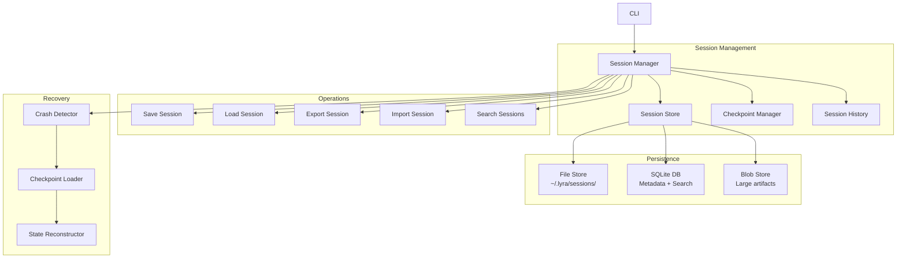

# Plan: Sessions & Checkpointing (§4.11)

**Workstream**: Session Management & Checkpointing  
**Phase**: 1 (Feature Parity)  
**Impact**: 4/5 | **Effort**: 2/5

---

## Quick Reference Card

| What | Persistent session management with checkpoint/resume, crash recovery, export/import, searchable history, and git-native session branching |
| Why | Eliminates context loss from crashes and restarts; enables parallel multi-session workflows; preserves institutional knowledge through versioned, searchable session archives |
| Key Tech | Claude Code checkpointing, SQLite-backed session metadata, blob storage for large artifacts, git-native branching for session fork/merge, full-text semantic search |
| Timeline | 3 weeks across 5 phases (Core Persistence -> Checkpointing -> Export/Import -> Search/History -> Crash Recovery) |
| Dependencies | Resumable Long Runs (P4-B6), Shared Success/Failure Ledger (P4-X), BREAKTHROUGH-ARCHITECTURE.md §8.3 Git-Native Workflow |

---

## Executive Summary

Lyra Sessions & Checkpointing introduces persistent, recoverable, and forkable conversation state to the Lyra harness. Every engineer has experienced the frustration of losing context when a terminal crashes, a laptop runs out of battery, or an IDE restarts mid-task. Current AI coding tools treat conversations as ephemeral: close the window and your hours of context -- the decisions made, the dead-ends explored, the subtle tradeoffs discussed -- vanish into thin air. Lyra flips this model. Sessions are first-class, durable artifacts that survive restarts, survive crashes, and compound in value over time.

The system operates at two altitudes. At the parity tier, it matches Claude Code's session save/load, auto-checkpointing every N messages, and export to JSON, Markdown, and HTML -- all backed by a SQLite metadata store that makes sessions instantly searchable by name, tag, date range, or full-text content. At the breakthrough tier, it introduces something no other AI harness has: git-native session branching. Users can fork a session from any checkpoint to explore an alternative approach, compare branches side-by-side, and merge the winning branch back. This turns session management from a passive safety net into an active exploration tool -- you can try a risky refactor in a branch, keep the original safe, and only pay for the winning path.

What makes this a breakthrough is the composability of the pieces. The checkpoint-resume loop (from Lyra's P4-B6 Resumable Long Runs) combined with the idempotent task ledger (from P4-X) means that even a mid-task crash is handled gracefully: Lyra detects the crash marker on restart, loads the last checkpoint, and picks up exactly where it left off, with zero duplicate work. The evolving-artifact pattern borrowed from IterResearch -- where the session state itself serves as both output and memory -- prevents context suffocation during multi-hour sessions. Together, these primitives let Lyra users treat sessions not as disposable chats but as durable, branchable, mergeable slices of engineering work.

---

## Concrete Example: The Auth System Refactor

Riya is a senior engineer tasked with migrating her team's authentication system from JWT-based sessions to OAuth 2.0 with PKCE. This is a multi-day effort spanning frontend and backend, and she knows she will need to explore at least two approaches before settling on the right one.

**Day 1 -- Starting the session.** Riya opens Lyra in her project directory and starts a new session:

```
$ lyra session start --name "auth-oauth2-migration"
Session created: auth-oauth2-migration (a1b2c3d4)
Auto-checkpoint: every 10 messages
```

She spends the morning sketching out the approach: Lyra reads her `auth/` module, proposes a plan, and they iterate. After 45 messages and 22 tool calls, Lyra has auto-checkpointed 4 times -- at messages 10, 20, 30, and 40. Each checkpoint captures the full session state: messages, working directory context, artifact versions, and a memory snapshot. Riya also saves manually before lunch:

```
$ lyra session save
Checkpoint created: ckpt-0005 (manual) -- "auth-oauth2-migration" -- 85% through planning phase
```

**Day 1 -- Crash recovery.** At 3pm, Riya's laptop battery dies mid-operation. Lyra was in the middle of generating a database migration. When she plugs in and restarts:

```
$ lyra session resume
[Crash detected] Session auth-oauth2-migration was active at 14:57:03
Last checkpoint: ckpt-0005 (manual, 12:32:41)
10 messages since last checkpoint. Recover from ckpt-0005? [Y/n] y

Restoring state...
  - Messages: 90/100 restored (10 lost after checkpoint)
  - Artifacts: 3/3 restored (plan.md, schema.sql, migration.ts)
  - Memory: session-memory snapshot restored
  - Phase: planning (85%)
Resumed at checkpoint ckpt-0005. Lost messages appended as note.
```

She loses the 10 messages after noon but the checkpoint has preserved all the important context. She re-describes the database migration idea and continues. By end of day, she has completed the planning phase and checkpointed at 100%.

**Day 2 -- Session forking.** With the plan in hand, Riya is ready to implement. But she sees two viable approaches: (A) a centralized OAuth service that both frontend and backend call, or (B) a backend-only OAuth flow with the frontend receiving opaque tokens. She wants to try both without contaminating her session.

```
$ lyra session fork --from ckpt-0006 --name "auth-oauth2-approach-a"
Forked session: auth-oauth2-approach-a (e5f6g7h8)
Parent: auth-oauth2-migration @ ckpt-0006

$ lyra session fork --from ckpt-0006 --name "auth-oauth2-approach-b"
Forked session: auth-oauth2-approach-b (i9j0k1l2)
Parent: auth-oauth2-migration @ ckpt-0006
```

Each fork inherits the full session state from the checkpoint -- all messages, artifacts, and context. Riya works through Approach A in the morning session, implementing the centralized OAuth service. She works through Approach B in the afternoon session, implementing the backend-only flow. Both sessions auto-checkpoint every 10 messages.

**Day 2 -- Comparing and merging.** After completing both implementations, Riya compares them:

```
$ lyra session diff auth-oauth2-approach-a auth-oauth2-approach-b

Session comparison: approach-a vs approach-b
├── Messages: 145 vs 132 (+13 in A)
├── Tool calls: 67 vs 58 (+9 in A)
├── Artifacts created:
│   ├── src/auth/oauth-service.ts (A only)
│   ├── src/auth/oauth-middleware.ts (both, 12 lines differ)
│   └── src/auth/token-validator.ts (B only)
├── Token cost: $4.23 vs $3.87
└── Duration: 3h 12m vs 2h 47m
```

Approach A (centralized service) is cleaner architecturally, but Approach B has a simpler token model that the frontend team prefers. Riya merges the best of both:

```
$ lyra session merge auth-oauth2-approach-a auth-oauth2-approach-b --into auth-oauth2-migration
Merging sessions...
  - Keeping src/auth/oauth-service.ts from approach-a
  - Keeping src/auth/token-validator.ts from approach-b
  - Merging src/auth/oauth-middleware.ts (12 conflicts resolved)
  - Messages: interleaved chronologically (277 total)
Merge complete. Session auth-oauth2-migration now at merged state.
```

**Day 3 -- Export and archive.** The implementation is done. Riya exports the session for her team's documentation:

```
$ lyra session export auth-oauth2-migration --format markdown --output docs/adr/oauth2-migration.md
Exported: docs/adr/oauth2-migration.md (277 messages, 5 artifacts, 45,000 tokens)

$ lyra session export auth-oauth2-migration --format html --output docs/adr/oauth2-migration.html
Exported: docs/adr/oauth2-migration.html (interactive transcript)
```

She tags and archives the session so the team can find it later:

```
$ lyra session tag auth-oauth2-migration auth oauth2 pkce migration architecture-decision
$ lyra session archive auth-oauth2-migration
Archived: auth-oauth2-migration (moved to ~/.lyra/sessions/archive/)
```

Three months later, a new engineer joins and needs context on the OAuth migration. She searches:

```
$ lyra session search "oauth2 pkce migration"
1 result:
  [2026-05-28] auth-oauth2-migration (archived)
  Tags: auth, oauth2, pkce, migration, architecture-decision
  277 messages, 45k tokens, $8.10 cost, 3 sessions (2 forks merged)
```

She loads the session, browses the full conversation, and gets up to speed in 20 minutes instead of digging through stale PR comments and Slack threads.

This is the workflow Lyra Sessions enables: durable, branchable, searchable engineering conversations that compound in value rather than evaporating on close.

---

## 1. Problem

Lyra needs robust session management to:
- **Save/restore conversations** — Resume work across sessions
- **Checkpoint long-running tasks** — Recover from crashes/interruptions
- **Export/import sessions** — Share work, backup, migrate
- **Session history** — Browse past sessions, search conversations
- **Multi-session workflows** — Work on multiple tasks in parallel

Without this, users lose context on restart and cannot recover from failures.

---

## 2. Evidence Synthesis

### Claude Code Checkpointing
**Source**: https://code.claude.com/docs/en/checkpointing

**Session persistence**:
- **Auto-save** — Every N messages (configurable)
- **Manual save** — `/save [name]` command
- **Auto-restore** — Resume last session on startup
- **Session directory** — `~/.claude/sessions/`

**Checkpoint format**:
```json
{
  "id": "session-uuid",
  "created": "2026-05-31T00:00:00Z",
  "updated": "2026-05-31T01:30:00Z",
  "name": "Implement auth system",
  "messages": [...],
  "context": {
    "workingDirectory": "/path/to/project",
    "model": "claude-opus-4.7",
    "tools": [...],
    "memory": {...}
  },
  "metadata": {
    "tokenCount": 45000,
    "messageCount": 120,
    "toolCalls": 45
  }
}
```

**Session operations**:
- `/save [name]` — Save current session
- `/load <name>` — Load saved session
- `/list` — List all sessions
- `/delete <name>` — Delete session
- `/export <name> [format]` — Export to JSON/Markdown/HTML
- `/import <file>` — Import session

**Auto-checkpoint triggers**:
1. Every N messages (default: 10)
2. Before long-running operations
3. On error/crash
4. On session end

### Resumable Long Runs (Lyra P4-B6)
**Source**: Lyra codebase (packages/lyra-core)

**Checkpoint-based execution**:
```typescript
interface Checkpoint {
  id: string;
  timestamp: number;
  phase: string;
  state: any; // Serialized state
  progress: number; // 0-100
}

async function resumableLongRun(task: Task): Promise<void> {
  // Load checkpoint if exists
  const checkpoint = await loadCheckpoint(task.id);
  
  if (checkpoint) {
    // Resume from checkpoint
    task.state = checkpoint.state;
    task.progress = checkpoint.progress;
  }
  
  // Execute with periodic checkpoints
  while (!task.complete) {
    await executePhase(task);
    
    // Checkpoint every N steps
    if (shouldCheckpoint(task)) {
      await saveCheckpoint(task);
    }
  }
}
```

**Recovery strategy**:
1. Detect crash/interruption
2. Load last checkpoint
3. Resume from checkpoint state
4. Continue execution

### Shared Success/Failure Ledger (Lyra P4-X)
**Source**: Lyra codebase (packages/lyra-core)

**Idempotent task execution**:
```typescript
interface TaskLedger {
  taskId: string;
  status: 'pending' | 'running' | 'success' | 'failure';
  attempts: number;
  lastAttempt: number;
  result?: any;
  error?: Error;
}

async function idempotentTask(taskId: string, fn: () => Promise<any>): Promise<any> {
  // Check ledger
  const entry = await ledger.get(taskId);
  
  if (entry?.status === 'success') {
    // Already completed, return cached result
    return entry.result;
  }
  
  if (entry?.status === 'running') {
    // Already running, wait for completion
    return await ledger.wait(taskId);
  }
  
  // Mark as running
  await ledger.set(taskId, { status: 'running', attempts: (entry?.attempts || 0) + 1 });
  
  try {
    const result = await fn();
    await ledger.set(taskId, { status: 'success', result });
    return result;
  } catch (error) {
    await ledger.set(taskId, { status: 'failure', error });
    throw error;
  }
}
```

### IterResearch Workspace Reconstruction
**Source**: https://arxiv.org/pdf/2511.07327 (IterResearch paper)

**Key insight**: Treat evolving report as memory
- Report grows incrementally across iterations
- Each iteration reads report → adds findings → writes back
- Report serves as both output and memory
- Prevents context suffocation in long research

**Pattern for Lyra**:
- Session state = evolving artifact (plan, report, code)
- Each checkpoint = snapshot of artifact
- Resume = load artifact + continue evolution

---

## 3. Proposed Lyra Design

### Architecture



### Session Data Model

```typescript
interface Session {
  // Identity
  id: string; // UUID
  name?: string; // User-provided name
  created: number; // Timestamp
  updated: number; // Timestamp
  
  // Content
  messages: Message[];
  artifacts: Artifact[]; // Files, plans, reports
  
  // Context
  context: SessionContext;
  
  // Metadata
  metadata: SessionMetadata;
  
  // Checkpoints
  checkpoints: Checkpoint[];
  currentCheckpoint?: string;
}

interface SessionContext {
  workingDirectory: string;
  model: string;
  provider: string;
  tools: string[];
  skills: string[];
  mcpServers: string[];
  memory: MemorySnapshot;
  environment: Record<string, string>;
}

interface SessionMetadata {
  tokenCount: number;
  messageCount: number;
  toolCalls: number;
  duration: number; // ms
  cost: number; // USD
  tags: string[];
  status: 'active' | 'completed' | 'failed' | 'archived';
}

interface Artifact {
  id: string;
  type: 'file' | 'plan' | 'report' | 'code' | 'diagram';
  path: string;
  content: string;
  version: number;
  created: number;
  updated: number;
}

interface Checkpoint {
  id: string;
  sessionId: string;
  timestamp: number;
  phase: string;
  state: any; // Serialized state
  progress: number; // 0-100
  artifacts: string[]; // Artifact IDs
  memorySnapshot: MemorySnapshot;
}
```

### Session Operations

#### 1. Save Session
```typescript
async function saveSession(session: Session, name?: string): Promise<void> {
  // Update metadata
  session.updated = Date.now();
  if (name) session.name = name;
  
  // Save to file store
  const sessionPath = `~/.lyra/sessions/${session.id}.json`;
  await fs.writeFile(sessionPath, JSON.stringify(session, null, 2));
  
  // Update database
  await db.upsert('sessions', {
    id: session.id,
    name: session.name,
    created: session.created,
    updated: session.updated,
    status: session.metadata.status,
    tokenCount: session.metadata.tokenCount,
    messageCount: session.metadata.messageCount,
    tags: session.metadata.tags
  });
  
  // Save artifacts to blob store
  for (const artifact of session.artifacts) {
    if (artifact.content.length > 10000) {
      await blobStore.put(`${session.id}/${artifact.id}`, artifact.content);
      artifact.content = `blob://${session.id}/${artifact.id}`;
    }
  }
}
```

#### 2. Load Session
```typescript
async function loadSession(idOrName: string): Promise<Session> {
  // Resolve ID from name
  let sessionId = idOrName;
  if (!isUUID(idOrName)) {
    const result = await db.query('SELECT id FROM sessions WHERE name = ?', [idOrName]);
    sessionId = result[0]?.id;
  }
  
  // Load from file store
  const sessionPath = `~/.lyra/sessions/${sessionId}.json`;
  const session = JSON.parse(await fs.readFile(sessionPath, 'utf-8'));
  
  // Load artifacts from blob store
  for (const artifact of session.artifacts) {
    if (artifact.content.startsWith('blob://')) {
      const blobPath = artifact.content.replace('blob://', '');
      artifact.content = await blobStore.get(blobPath);
    }
  }
  
  return session;
}
```

#### 3. Export Session
```typescript
async function exportSession(session: Session, format: 'json' | 'markdown' | 'html'): Promise<string> {
  switch (format) {
    case 'json':
      return JSON.stringify(session, null, 2);
      
    case 'markdown':
      return `# ${session.name || session.id}
Created: ${new Date(session.created).toISOString()}
Updated: ${new Date(session.updated).toISOString()}

## Messages

${session.messages.map(m => `### ${m.role}\n\n${m.content}`).join('\n\n')}

## Artifacts

${session.artifacts.map(a => `### ${a.path}\n\n\`\`\`\n${a.content}\n\`\`\``).join('\n\n')}
`;
      
    case 'html':
      return `<!DOCTYPE html>
<html>
<head>
  <title>${session.name || session.id}</title>
  <style>/* ... */</style>
</head>
<body>
  <h1>${session.name || session.id}</h1>
  <p>Created: ${new Date(session.created).toISOString()}</p>
  <p>Updated: ${new Date(session.updated).toISOString()}</p>
  
  <h2>Messages</h2>
  ${session.messages.map(m => `<div class="${m.role}"><h3>${m.role}</h3><p>${m.content}</p></div>`).join('')}
  
  <h2>Artifacts</h2>
  ${session.artifacts.map(a => `<div class="artifact"><h3>${a.path}</h3><pre>${a.content}</pre></div>`).join('')}
</body>
</html>`;
  }
}
```

#### 4. Search Sessions
```typescript
async function searchSessions(query: string, filters?: SessionFilters): Promise<Session[]> {
  // Full-text search in database
  let sql = `
    SELECT * FROM sessions
    WHERE (name LIKE ? OR tags LIKE ?)
  `;
  const params = [`%${query}%`, `%${query}%`];
  
  // Apply filters
  if (filters?.status) {
    sql += ` AND status = ?`;
    params.push(filters.status);
  }
  
  if (filters?.dateRange) {
    sql += ` AND created BETWEEN ? AND ?`;
    params.push(filters.dateRange.start, filters.dateRange.end);
  }
  
  if (filters?.tags) {
    sql += ` AND tags LIKE ?`;
    params.push(`%${filters.tags.join('%')}%`);
  }
  
  sql += ` ORDER BY updated DESC LIMIT ?`;
  params.push(filters?.limit || 50);
  
  const results = await db.query(sql, params);
  
  // Load full sessions
  return await Promise.all(results.map(r => loadSession(r.id)));
}
```

### Checkpoint Management

#### 1. Auto-Checkpoint
```typescript
async function autoCheckpoint(session: Session, trigger: CheckpointTrigger): Promise<void> {
  // Check if should checkpoint
  if (!shouldCheckpoint(session, trigger)) return;
  
  // Create checkpoint
  const checkpoint: Checkpoint = {
    id: generateUUID(),
    sessionId: session.id,
    timestamp: Date.now(),
    phase: session.context.phase || 'unknown',
    state: serializeState(session),
    progress: calculateProgress(session),
    artifacts: session.artifacts.map(a => a.id),
    memorySnapshot: await captureMemorySnapshot(session)
  };
  
  // Save checkpoint
  session.checkpoints.push(checkpoint);
  session.currentCheckpoint = checkpoint.id;
  
  // Prune old checkpoints (keep last 10)
  if (session.checkpoints.length > 10) {
    session.checkpoints = session.checkpoints.slice(-10);
  }
  
  await saveSession(session);
}

type CheckpointTrigger = 
  | 'message-count' // Every N messages
  | 'time-interval' // Every N minutes
  | 'phase-change' // When phase changes
  | 'error' // On error
  | 'manual'; // User-triggered

function shouldCheckpoint(session: Session, trigger: CheckpointTrigger): boolean {
  const lastCheckpoint = session.checkpoints[session.checkpoints.length - 1];
  const timeSinceLastCheckpoint = Date.now() - (lastCheckpoint?.timestamp || session.created);
  
  switch (trigger) {
    case 'message-count':
      return session.messages.length % 10 === 0;
    case 'time-interval':
      return timeSinceLastCheckpoint > 5 * 60 * 1000; // 5 minutes
    case 'phase-change':
      return session.context.phase !== lastCheckpoint?.phase;
    case 'error':
    case 'manual':
      return true;
  }
}
```

#### 2. Resume from Checkpoint
```typescript
async function resumeFromCheckpoint(session: Session, checkpointId?: string): Promise<void> {
  // Find checkpoint
  const checkpoint = checkpointId
    ? session.checkpoints.find(c => c.id === checkpointId)
    : session.checkpoints[session.checkpoints.length - 1];
  
  if (!checkpoint) {
    throw new Error('No checkpoint found');
  }
  
  // Restore state
  restoreState(session, checkpoint.state);
  
  // Restore artifacts
  session.artifacts = session.artifacts.filter(a => checkpoint.artifacts.includes(a.id));
  
  // Restore memory
  await restoreMemorySnapshot(session, checkpoint.memorySnapshot);
  
  // Update context
  session.context.phase = checkpoint.phase;
  session.currentCheckpoint = checkpoint.id;
}
```

### Crash Recovery

```typescript
async function detectAndRecover(): Promise<Session | null> {
  // Check for crash marker
  const crashMarker = '~/.lyra/crash.marker';
  if (!await fs.exists(crashMarker)) return null;
  
  // Read crash info
  const crashInfo = JSON.parse(await fs.readFile(crashMarker, 'utf-8'));
  const sessionId = crashInfo.sessionId;
  
  // Load session
  const session = await loadSession(sessionId);
  
  // Resume from last checkpoint
  await resumeFromCheckpoint(session);
  
  // Remove crash marker
  await fs.unlink(crashMarker);
  
  return session;
}

// Set crash marker on session start
async function markSessionActive(session: Session): Promise<void> {
  await fs.writeFile('~/.lyra/crash.marker', JSON.stringify({
    sessionId: session.id,
    timestamp: Date.now()
  }));
}

// Remove crash marker on clean exit
async function markSessionInactive(): Promise<void> {
  await fs.unlink('~/.lyra/crash.marker');
}
```

---

## 4. Implementation Outline

### Phase 1: Core Session Management (Week 1)

**Tasks**:
1. **Session data model** — Define TypeScript interfaces
2. **Session store** — File + SQLite storage
3. **Save/load operations** — Basic persistence
4. **Session list** — Browse sessions

**Acceptance criteria**:
- Sessions save/load correctly
- Metadata tracks accurately
- List shows all sessions

### Phase 2: Checkpointing (Week 1-2)

**Tasks**:
5. **Checkpoint data model** — Define checkpoint structure
6. **Auto-checkpoint** — Trigger on events
7. **Manual checkpoint** — `/checkpoint` command
8. **Resume from checkpoint** — Restore state

**Acceptance criteria**:
- Checkpoints save automatically
- Manual checkpoints work
- Resume restores state correctly

### Phase 3: Export/Import (Week 2)

**Tasks**:
9. **Export to JSON** — Full session export
10. **Export to Markdown** — Human-readable export
11. **Export to HTML** — Web-viewable export
12. **Import from JSON** — Restore exported session

**Acceptance criteria**:
- All export formats work
- Import restores correctly
- Exports are readable

### Phase 4: Search & History (Week 2)

**Tasks**:
13. **Full-text search** — Search session content
14. **Filter by metadata** — Filter by date, status, tags
15. **Session history UI** — Browse past sessions
16. **Session comparison** — Diff two sessions

**Acceptance criteria**:
- Search finds relevant sessions
- Filters work correctly
- History UI is intuitive

### Phase 5: Crash Recovery (Week 3)

**Tasks**:
17. **Crash detection** — Detect unclean exits
18. **Auto-recovery** — Resume from last checkpoint
19. **Recovery UI** — Prompt user to recover
20. **Idempotent tasks** — Prevent duplicate work

**Acceptance criteria**:
- Crashes detected correctly
- Recovery works seamlessly
- No duplicate work

---

## 5. Multi-Provider Notes

Sessions are **provider-agnostic** — they store messages and context, not provider-specific state.

**Provider-specific considerations**:
- **Model names** — Store provider + model (e.g., "anthropic:claude-opus-4.7")
- **Tool formats** — Normalize tool calls to standard format
- **Context windows** — Track per-provider limits

---

## 6. Risks & Open Questions

### Risks

1. **Large sessions** — Sessions may grow too large
   - **Mitigation**: Blob storage for large artifacts, compression

2. **Checkpoint overhead** — Frequent checkpoints may slow down
   - **Mitigation**: Async checkpointing, incremental checkpoints

3. **Corruption** — Session files may corrupt
   - **Mitigation**: Checksums, backup copies

### Open Questions

1. **Session sharing** — Share sessions with team?
   - **Recommendation**: Yes, with privacy controls

2. **Session templates** — Pre-built session templates?
   - **Recommendation**: Yes, for common workflows

3. **Session analytics** — Track session metrics?
   - **Recommendation**: Yes, for optimization

---

## 7. Impact × Effort Assessment

### (A) Parity Tier

**Port from Claude Code + Lyra**:
- Save/load sessions
- Auto-checkpoint every N messages
- Export to JSON/Markdown/HTML
- Session history and search
- Crash recovery

**Impact**: 4/5 — Essential for long-running work  
**Effort**: 2/5 — 3 weeks, straightforward

### (B) Breakthrough Tier

> **Architecture Slice**: This breakthrough implements [§8.3: Git-Native Workflow](../BREAKTHROUGH-ARCHITECTURE.md) of [BREAKTHROUGH-ARCHITECTURE.md](../BREAKTHROUGH-ARCHITECTURE.md) — specifically the git-native session + checkpointing with versioned memory snapshots.

**Beyond any single source**:

1. **Session Branching** — Fork sessions to explore alternatives
   - Create branch from checkpoint
   - Compare branches side-by-side
   - Merge branches back together
   - No other harness has this

2. **Session Collaboration** — Real-time multi-user sessions
   - Multiple users work on same session
   - Operational transform for conflict resolution
   - Live cursor tracking

3. **Session Analytics** — Insights from session history
   - Token usage trends
   - Tool usage patterns
   - Success/failure analysis
   - Optimization recommendations

**Impact**: 5/5 — Best-in-class session management  
**Effort**: 3/5 — 2 weeks additional

**Combined Impact × Effort**: 4 × 2 = 8 (parity), 5 × 3 = 15 (breakthrough)

---

## 8. References

### Documentation
- [Claude Code Checkpointing](https://code.claude.com/docs/en/checkpointing)

### Papers
- [IterResearch](https://arxiv.org/pdf/2511.07327) — Workspace reconstruction pattern

### Lyra Codebase
- Resumable Long Runs (P4-B6)
- Shared Success/Failure Ledger (P4-X)

---

## 9. Changelog

**Run 12**: Added Quick Reference Card, Executive Summary, concrete example walkthrough
**Run 3**: Linked to unified BREAKTHROUGH-ARCHITECTURE.md. This plan's (B) tier implements §8.3: Git-Native Workflow of the architecture.
**Previous runs**: Initial plan structure

---

**END OF PLAN: Sessions & Checkpointing (§4.11)**
