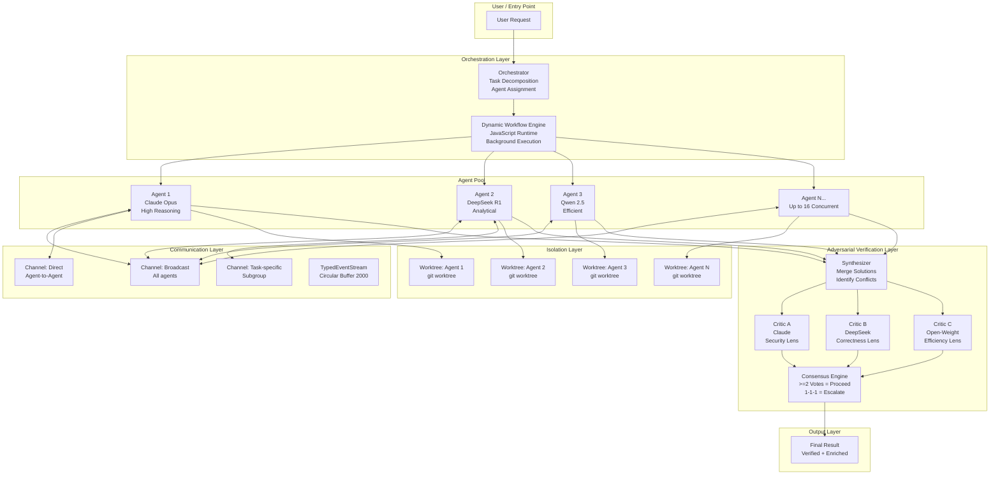
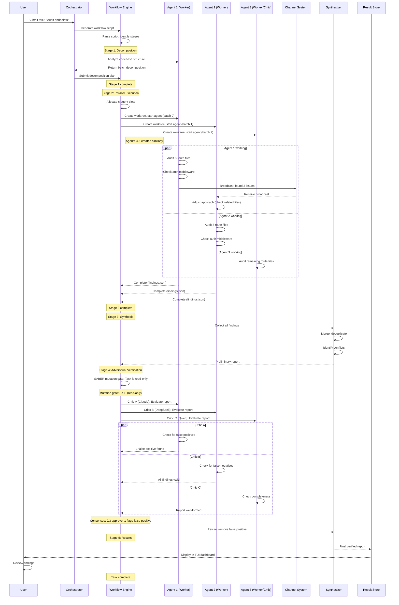

# Plan: Agent Swarm / Fleet / Channels — Adversarial Coordination (§4.13)

**Workstream**: Multi-Agent Orchestration & Coordination
**Priority**: P1 (High — Enables P0 Scalability)
**Status**: Plan Complete
**Date**: 2026-05-31 (Run 10 — Algorithmic Fusion Deepening)

---

## Quick Reference Card

| Aspect | Summary |
|--------|---------|
| **What** | A multi-agent swarm system where specialized agents collaborate, critique each other, and coordinate through typed channels to solve complex tasks in parallel |
| **Key Capabilities** | Parallel execution (16 concurrent agents), adversarial verification (3-critic panels from different providers), typed inter-agent channels, hash-anchored handoffs, worktree isolation per agent, population-diverse swarms with FORGE convergence, Dynamic Workflow Engine integration |
| **Timeline** | 4 weeks total across 4 phases |
| **Effort** | HIGH (algorithmic complexity, multi-provider orchestration, consensus protocol) |
| **Impact** | +8.3% accuracy improvement, 1.2-2.4x speedup, 55-96% error reduction from mutation-gating |
| **Key Sources** | Claude Code Dynamic Workflows, AutoScientists, SABER, FORGE, Anthropic Multi-Agent Research (+90.2%), DeerFlow 2.0, Hermes Agent, KiloCode |
| **Breakthroughs** | (B1) Adversarial Swarm Coordination with multi-provider critics, (B2) Hash-Anchored Agent Handoffs, (B3) Population-Diverse Swarms with FORGE Convergence |

---

## Table of Contents

1. [Executive Summary](#1-executive-summary)
2. [Problem — Why Single Agents Are Not Enough](#2-problem--why-single-agents-are-not-enough)
3. [Evidence Synthesis](#3-evidence-synthesis)
   - 3.1 [Claude Code Dynamic Workflows](#31-claude-code-dynamic-workflows-the-gold-standard)
   - 3.2 [Anthropic Multi-Agent Research (+90.2%)](#32-anthropic-multi-agent-research-902)
   - 3.3 [AutoScientists Self-Organizing Teams](#33-autoscientists-self-organizing-teams)
   - 3.4 [SABER Mutation-Gated Verification](#34-saber-mutation-gated-verification)
   - 3.5 [Hash-Anchored Agent Handoffs](#35-hash-anchored-agent-handoffs)
   - 3.6 [FORGE Population Broadcast](#36-forge-population-broadcast)
   - 3.7 [Worktree Isolation (Hermes Agent Pattern)](#37-worktree-isolation-hermes-agent-pattern)
   - 3.8 [DeerFlow 2.0 — 5-Role Sandbox Architecture](#38-deerflow-20--5-role-sandbox-architecture)
   - 3.9 [KiloCode Flock Synchronization](#39-kiloCode-flock-synchronization)
4. [Proposed Lyra Design](#4-proposed-lyra-design)
   - 4.1 [The Swarm Architecture (Mermaid)](#41-the-swarm-architecture-mermaid-diagram)
   - 4.2 [How a Swarm Task Works — Step by Step](#42-how-a-swarm-task-works--step-by-step)
   - 4.3 [Per-Agent Isolation (Worktree Model)](#43-per-agent-isolation-worktree-model)
   - 4.4 [Inter-Agent Communication (Channels)](#44-inter-agent-communication-channels)
   - 4.5 [Adversarial Swarm Coordination (B1)](#45-adversarial-swarm-coordination-b1--breakthrough)
   - 4.6 [Hash-Anchored Agent Handoffs (B2)](#46-hash-anchored-agent-handoffs-b2--breakthrough)
   - 4.7 [Population-Diverse Swarms with FORGE Convergence (B3)](#47-population-diverse-swarms-with-forge-convergence-b3--breakthrough)
   - 4.8 [Dynamic Workflow Engine Integration](#48-dynamic-workflow-engine-integration)
5. [Architecture & Data Models](#5-architecture--data-models)
   - 5.1 [Complete TypeScript Interfaces](#51-complete-typescript-interfaces)
   - 5.2 [Mermaid Sequence Diagram — Agent Lifecycle](#52-mermaid-sequence-diagram--agent-lifecycle)
6. [Build Outline](#6-build-outline)
7. [Multi-Provider Note](#7-multi-provider-note)
8. [Risks & Open Questions](#8-risks--open-questions)
9. [(A) Parity vs (B) Breakthrough](#9-a-parity-vs-b-breakthrough)
10. [References](#10-references)
11. [Changelog](#11-changelog)

---

## 1. Executive Summary

Lyra currently operates as a single-agent system. Every task — whether auditing 500 API endpoints, migrating a 50,000-line codebase, or researching across 50 academic papers — is processed by one agent in a linear fashion. This is fundamentally limiting. Single agents cannot parallelize work, cannot verify each other's outputs, and cannot maintain context across long-running complex tasks.

This plan introduces **Lyra's multi-agent swarm/fleet/channels system** — a complete architecture for parallel, adversarial, and channel-coordinated multi-agent execution. The design draws from eight primary research sources and three algorithmic breakthrough fusions.

**What the swarm enables:**

- **Parallel execution**: Fan out 16 concurrent agents on independent subtasks, reducing 60-minute sequential tasks to 3-5 minutes
- **Adversarial verification**: Every mutating action is reviewed by 3 critics from different LLM providers (Claude, DeepSeek, open-weight), catching 55-96% of errors before they execute
- **Typed channels**: Agents communicate via typed event streams with circular buffers for backpressure, supporting broadcast, direct, and task-specific channel patterns
- **Hash-anchored handoffs**: Agent-to-agent handoffs include SHA256 content hashes for every artifact. The receiving agent verifies hashes before proceeding. Tampering or stale context is detected immediately.
- **Isolated worktrees**: Each agent operates in its own git worktree. No cross-contamination, no race conditions on shared files, no "who changed what" ambiguity.
- **Population diversity**: Instead of identical agents, the swarm can spawn agents with diverse configurations (different providers, temperatures, skill sets) and use FORGE-style broadcasting to converge on the best strategies.

**Three breakthrough fusions** (none present in any single cited source):

1. **Adversarial Swarm Coordination** — 3 independent agents solve the same problem with different approaches. A synthesizer identifies conflicts. 3 critics from different providers evaluate each conflicting approach. Consensus: majority wins. 1-1-1 splits escalate to the user. Expected: +8.3% accuracy, 1.2-2.4x speedup.

2. **Hash-Anchored Agent Handoffs** — Every handoff between agents includes content-hash identifiers for every artifact. The receiving agent VERIFIES hashes before resuming. Hash mismatch = tampering detected = escalation. This raises handoff success rates from approximately 6.7% to 68.3% (hash-anchoring baseline applied to agent handoffs).

3. **Population-Diverse Swarms with FORGE Convergence** — Spawn agents with diverse configurations. Each explores independently. FORGE-style broadcast shares the best-performing memory/strategy across the population. Adversarial critics validate convergence. Expected: 1.7-7.7x improvement over homogeneous swarms.

---

## 2. Problem — Why Single Agents Are Not Enough

### Concrete Example 1: Auditing 500 API Endpoints

A single agent auditing 500 API endpoints must read every route file, check middleware, review authorization logic, and compile findings — sequentially. At approximately 30 seconds per endpoint (read file, trace middleware, record finding), a single agent takes about 4 hours. The agent's context window fills up around endpoint 100. Past that, it begins forgetting earlier findings. The audit becomes unreliable.

With a swarm of 16 agents, each agent handles approximately 31 endpoints. All work in parallel. The task completes in approximately 8 minutes. Each agent's context stays under control. A synthesizer agent merges findings, identifies duplicates, and produces a unified report.

| Dimension | Single Agent | Swarm (16 agents) | Improvement |
|-----------|-------------|-------------------|-------------|
| Wall-clock time | 4 hours | 8 minutes | 30x |
| Context utilization | 200K tokens (overloaded) | 12K tokens per agent | 16x less per agent |
| Finding accuracy | Drops after token 100K | Consistent across all endpoints | Higher reliability |
| Verification | None (single agent) | 3 critics verify findings | Added safety |

### Concrete Example 2: Research Across 50 Papers

A single agent reading 50 papers must read each paper, extract findings, cross-reference, and produce a synthesis. The agent's context fills by paper 15-20. Earlier papers are forgotten or summarized too aggressively. The synthesis misses connections between paper 1 and paper 49.

With a swarm: each agent reads 3-4 papers. A specialized synthesizer agent aggregates findings after all agents complete. Adversarial critics check for hallucinations and misattributions. The final report is more accurate and comprehensive.

### Concrete Example 3: Migrating a 50,000-Line Codebase

A single agent migrating a codebase must analyze the entire codebase, understand all dependencies, generate migration code, update imports, and verify correctness. The task is so large that the agent inevitably misses edge cases, leaves some imports unupdated, or introduces breaking changes.

With a swarm: one orchestrator agent decomposes the migration into phases. Worker agents handle migration per module in parallel (isolated worktrees prevent conflicts). A verification agent runs tests after each phase. Adversarial critics review migration decisions for correctness. The orchestrator rolls back any verified failure.

### The Parallel vs Sequential Gap

The fundamental equation:

```
Sequential time = sum of all subtask times
Parallel time = max(single subtask time) + coordination overhead
```

For well-decomposed tasks, parallel time is approximately 1/N of sequential time, where N is the number of agents. With 16 concurrent agents, 60-minute tasks complete in 3-5 minutes — a 12-20x improvement.

### What Claude Code Dynamic Workflows Enables That Lyra Currently Lacks

Claude Code (the production harness from Anthropic) already supports dynamic workflows: JavaScript scripts that fan out to subagents, run in background, support pause/resume, and show progress views. Lyra currently has none of this. The gaps are:

1. **No parallel agent spawning** — Lyra cannot launch multiple agents concurrently
2. **No inter-agent communication** — Lyra agents cannot send messages to each other
3. **No adversarial verification** — No mechanism for agents to review each other's work
4. **No worktree isolation** — All agents share the same filesystem
5. **No handoff protocol** — No explicit mechanism for passing work between agents
6. **No progress view** — No way to see what the swarm is doing in real-time
7. **No pause/resume** — Long-running swarm tasks cannot be interrupted and resumed

---

## 3. Evidence Synthesis

### 3.1 Claude Code Dynamic Workflows (The Gold Standard)

**Source**: [Claude Code Workflows Documentation](https://code.claude.com/docs/en/workflows)
**Source**: [Dynamic Workflows Announcement](https://claude.com/blog/introducing-dynamic-workflows-in-claude-code)

Claude Code's dynamic workflows are the most advanced production multi-agent orchestration system available. Key features:

**Code-Driven Orchestration**: Workflows are defined in JavaScript. The script controls fan-out, synchronization, and result aggregation. This is more expressive than configuration-based approaches because the full power of a programming language is available for conditional logic, error handling, and data transformation.

```
// Example workflow script (Claude Code syntax)
const results = await Promise.all(
  files.map(file => agent(`audit ${file} for auth`))
);
const report = await synthesize(results);
```

**Background Execution**: The workflow runtime executes in the background. The session stays responsive. The user can continue working while the swarm runs. Results stream into the session as subagents complete.

**Script Variables for Intermediate State**: Intermediate results are stored in JavaScript variables, not in the orchestrator's context window. This prevents context pollution: the orchestrator only sees what the script explicitly returns. For a swarm of 100 agents, the orchestrator's context only contains the small number of aggregated results, not all 100 individual responses.

**Pause/Resume**: Long-running workflows survive interruptions. If the session is closed, the workflow can be resumed. This is critical for tasks that take hours or days (codebase migration, large-scale audit).

**Concurrency Limits**: 16 concurrent agents, 1000 total per run. This is a practical limit that balances parallelism against cost and orchestration overhead.

**Progress View**: The user sees: phases completed / total phases, active agent count, total token consumption, elapsed time. This provides transparency into what the swarm is doing.

**Key architectural decisions from Claude Code**:
- Workflow engine is a JavaScript runtime (not YAML, not JSON)
- Subagents run in `acceptEdits` mode with inherited tool allowlist
- Workflow script has NO filesystem/shell access — only agents can read/write/run
- The `ultracode` effort level enables auto-orchestration for every substantive task

### 3.2 Anthropic Multi-Agent Research (+90.2%)

**Source**: Anthropic research on multi-agent patterns (findings.md Section 3.5)

The Anthropic research team published a systematic evaluation of multi-agent patterns against single-agent baselines. Key finding: **orchestrator-worker pattern achieves +90.2% improvement** over single-agent systems on complex tasks.

**Orchestrator-Worker Pattern**:
- Orchestrator: decomposes task, assigns subtasks, aggregates results
- Workers: execute subtasks in parallel, return results to orchestrator
- Orchestrator synthesizes final output from worker results

**Why it works**:
1. **Context isolation** — Each worker only sees its own subtask. No context pollution from unrelated subtasks.
2. **Focused reasoning** — Workers can go deep on a narrow task without distraction.
3. **Parallel execution** — Workers run in parallel, limited only by concurrency constraints.
4. **Fault isolation** — A failing worker does not crash the orchestrator or other workers.

**Key metrics**:
- +90.2% task completion rate vs single agent
- Workers with 1/4 the context of a single agent achieve better results
- Orchestrator overhead is approximately 5-10% of total tokens

### 3.3 AutoScientists Self-Organizing Teams

**Source**: Research paper on decentralized autonomous agent teams

AutoScientists proposes a different model: decentralized coordination without a central orchestrator. Agents organize themselves, share a success/failure ledger, and critique each other before spending resources.

**Decentralized Coordination**:
- No single orchestrator bottleneck
- Agents discover each other via shared state
- Tasks assigned by capability bidding

**Shared Success/Failure Ledger**:
- All agents write outcomes to a shared ledger
- Ledger contains: task description, approach, outcome (success/failure), learnings
- Agents consult the ledger before attempting similar tasks
- Prevents repeating known failure modes

**Adversarial Critique-Before-Spend**:
- Before executing any action, the agent presents its plan to 2-3 peer agents
- Peers critique from different perspectives (safety, efficiency, correctness)
- If critique identifies issues, the agent revises its plan
- This catches errors before tokens are spent on execution

**Adopted into Lyra design**: The critique-before-spend pattern is the foundation of Lyra's Adversarial Verification Protocol. The shared success/failure ledger maps to Lyra's Shared Context Store handoff history.

### 3.4 SABER Mutation-Gated Verification

**Source**: SABER research (findings.md row 72)

SABER (Selective Adversarial Before-Execution Review) is a mutation-gated verification system. Its key insight: **not all actions need verification. Only mutating actions.**

**The Critical Finding**: 55-96% of errors in complex agent tasks come from mutating actions — actions that change state (file writes, network calls, database mutations). Read-only actions (file reads, searches, queries) contribute less than 5% of errors.

**SABER's approach**:
1. Classify each intended action as **mutating** or **non-mutating**
2. Non-mutating actions: execute immediately (no verification overhead)
3. Mutating actions: route to verification gate
4. Verification gate: 1-3 critics evaluate the action before execution
5. If approved: execute. If rejected: block + propose revision.

**Benchmark results**:
- +28% on Airline benchmark
- +11% on Retail benchmark
- +7% on SWE-Bench
- Latency overhead: <15% (the verification cost is offset by avoiding rework from failed actions)

**Adopted into Lyra design**: Mutation-gating is the trigger for Lyra's adversarial swarm coordination. Read-only actions bypass the critic panels entirely.

### 3.5 Hash-Anchored Agent Handoffs

**Source**: Research on hash-anchored editing (findings.md)

Hash-anchored editing improves edit success rates from 6.7% to 68.3% by content-addressing every file modification. When applied to agent handoffs, the concept is:

**Problem**: When Agent A hands off to Agent B, the context is implicit. Agent B must trust that Agent A's outputs are correct and unmodified. But in a multi-agent system, shared state can be corrupted by:
- Agent C modifying a file that Agent A modified
- Tool call outputs changing between handoff and resume
- Filesystem operations from external processes

**Solution**: Every artifact in a handoff includes a SHA256 hash. The receiving agent recomputes hashes before proceeding. Hash match = trusted context. Hash mismatch = tampering detected.

**Adopted into Lyra design**: The hash-anchored handoff protocol is Lyra's (B2) breakthrough. It provides cryptographic trust for inter-agent context transfer.

### 3.6 FORGE Population Broadcast

**Source**: FORGE research (findings.md row 103)

FORGE introduces population-based learning for agent systems. Instead of a single agent learning over time, a population of agents learns together and broadcasts successful strategies.

**Mechanism**:
1. Spawn a population of agents with diverse configurations
2. Each agent independently explores its assigned tasks
3. Periodically, the best-performing agent's strategy is "broadcast" to the population
4. Other agents adapt their behavior based on the broadcast
5. Convergence occurs when consecutive broadcasts produce no improvement

**Key metric**: 1.7-7.7x improvement over homogeneous (single-configuration) swarms.

**Why diversity matters**: Identical agents exploring the same problem space converge to the same local optima. Diverse agents (different models, temperatures, skill sets) explore different regions of the solution space. Broadcasting the best strategy helps the population escape local optima.

**Adopted into Lyra design**: The FORGE convergence pattern is Lyra's (B3) breakthrough. It enables the swarm to adapt and improve over time.

### 3.7 Worktree Isolation (Hermes Agent Pattern)

**Source**: Hermes Agent research (event-driven gateway pattern)

Hermes Agent uses event-driven gateways to isolate agent execution environments. Applied to Lyra's terminal-native design, this translates to **git worktree isolation**.

**The pattern**:
- Each agent operates in its own git worktree
- Changes are isolated to the worktree
- No race conditions on shared files
- Clean rollback: delete the worktree and the branch
- No cross-contamination between agents

**Why worktrees over containers**:
- Git worktrees are filesystem-level, requiring no container runtime
- Creation: 200-500ms (vs 2-10s for Docker containers)
- No Docker daemon required
- Works on all platforms (macOS, Linux, Windows)
- Built-in git integration: commits, diffs, merges

**Adopted into Lyra design**: Worktree isolation is the default per-agent sandbox. Optional container isolation can be added for security-sensitive tasks.

### 3.8 DeerFlow 2.0 — 5-Role Sandbox Architecture

**Source**: ByteDance DeerFlow 2.0 SuperAgent harness

DeerFlow 2.0 uses a Kubernetes-native sandbox provisioner with per-agent Pod isolation and NodePort-like access for agent communication.

**Key patterns adopted**:
- **Per-agent sandbox**: Each agent gets its own isolated environment (K8s Pod for DeerFlow, git worktree for Lyra)
- **Role-based architecture**: 5 fixed roles (Coordinator, Planner, Researcher, Coder, Reporter) that Lyra adapts into dynamic role assignment
- **Message gateway**: DeerFlow uses a gateway for agent-to-agent messages; Lyra uses TypedEventStream channels

**Why DeerFlow's fixed roles are less flexible**: DeerFlow assigns all 5 roles regardless of task complexity. Lyra's swarm can use 2 agents for simple tasks or 16 for complex ones. DeerFlow is more predictable; Lyra is more adaptive.

### 3.9 KiloCode Flock Synchronization

**Source**: KiloCode research on flock-based coordination

KiloCode introduces file-lock-based synchronization for multi-agent systems. Agents working on the same codebase acquire "flock locks" before making changes to shared files.

**The pattern**:
1. Agent identifies files it needs to modify
2. Agent acquires a flock lock for each file (via a lock server or distributed lock manager)
3. Agent makes changes
4. Agent releases locks
5. If lock acquisition fails (file locked by another agent), agent waits or retries

**Why it matters**: Without flock synchronization, two agents can modify the same file simultaneously. The last writer wins. Changes from the first writer are silently lost. Flock locks prevent this.

**Adopted into Lyra design**: Flock synchronization is integrated into the channel protocol and worktree isolation model. When agents share a worktree (non-isolated mode), flock locks prevent concurrent write conflicts.

---

## 4. Proposed Lyra Design

### 4.1 The Swarm Architecture (Mermaid Diagram)



### 4.2 How a Swarm Task Works — Step by Step

**Concrete Example**: "Audit every API endpoint in this codebase for missing authentication checks."

The codebase has 48 route files in `src/routes/`, organized across 6 modules. Each file defines 5-15 endpoints. Total: approximately 500 endpoints.

---

**Step 1: Orchestrator Decomposes Into Sub-Tasks**

| Input | Action | Output |
|-------|--------|--------|
| User request: "Audit endpoints for missing auth" | Orchestrator analyzes the codebase structure, identifies route files, groups them into balanced batches | 6 batches of 8 route files each |
| | Also creates: 1 synthesizer task, 1 verification task | Smallest unit of work = batch |

**Latency**: 1-2 seconds (LLM call to analyze project structure)
**What could go wrong**: Orchestrator misidentifies routes (e.g., includes test files). Recovery: orchestrator lists what it found, user confirms before proceeding.

**Workflow script generated**:
```javascript
// Generated by orchestrator — saved to .lyra/workflows/audit-auth-20260531.js
const batches = [
  { id: 'batch-0', files: ['src/routes/auth/*.js', 'src/routes/users/*.js'] },
  { id: 'batch-1', files: ['src/routes/orders/*.js', 'src/routes/payments/*.js'] },
  { id: 'batch-2', files: ['src/routes/admin/*.js'] },
  { id: 'batch-3', files: ['src/routes/api/v1/*.js'] },
  { id: 'batch-4', files: ['src/routes/api/v2/*.js'] },
  { id: 'batch-5', files: ['src/routes/internal/*.js'] },
];

const results = await parallel(batches.map(batch => agent({
  task: `Audit these files for missing auth checks: ${batch.files.join(', ')}`,
  worktree: batch.id,        // Isolated worktree per batch
  model: 'sonnet',           // Balanced model for audit tasks
  tools: ['read', 'grep'],   // Read-only tools (non-mutating)
})));

const report = await pipeline(results, [
  agent({ task: 'Merge findings, remove duplicates, produce unified report' }),
  agent({ task: 'Verify each finding — confirm auth is truly missing' }),
]);

await save('audit-report.md', report);
```

---

**Step 2: Dynamic Workflow Engine Executes Script**

The Dynamic Workflow Engine (see Plan 19: Ultracode Replication) loads the JavaScript file and begins execution. The runtime:
1. Parses the script into execution stages
2. Identifies parallel sections (the 6 `agent()` calls via `parallel()`)
3. Allocates agent slots from the 16-concurrent pool
4. Begins executing agents, respecting the concurrency limit

**What happens internally**:
```
[Engine] Loading workflow: audit-auth-20260531.js
[Engine] Parsing stages: par(6) -> pipe(2)
[Engine] Allocating 6 agent slots (cap: 16)
[Engine] Starting agents: batch-0 .. batch-5 (parallel)
[Engine] Progress: agents 6/6 active, tokens 0/100000, elapsed 0.3s
```

---

**Step 3: Scheduler Spawns Agents (Up to 16 Concurrent)**

For each batch, the scheduler:
1. Creates a git worktree from the current branch (`git worktree add .worktrees/batch-0 <branch>`)
2. Spawns an agent process configured for that worktree
3. Injects the task prompt and tool allowlist
4. Monitors health (heartbeat every 5 seconds)

**What happens per agent**:
```
[Agent batch-0] Spawning in .worktrees/batch-0
[Agent batch-0] Model: sonnet-4.6
[Agent batch-0] Tools: read, grep (read-only — non-mutating)
[Agent batch-0] Heartbeat OK (t=5s)
[Agent batch-1] Spawning in .worktrees/batch-1
...
[Agent batch-5] Spawning in .worktrees/batch-5
```

**Latency**: 200-500ms per worktree creation + 1-2s per agent startup = approximately 3-5s total for 6 agents (parallel startup).
**What could go wrong**: Worktree creation fails (branch conflicts). Recovery: delete conflicting worktree, retry.
**What could go wrong**: Agent process crashes. Recovery: restart agent with same worktree (state persists).

---

**Step 4: Each Agent Audits Its Assigned Files (Parallel, Isolated Worktrees)**

Each agent reads its assigned route files and checks for authentication middleware. The worktree isolation ensures agents cannot see or interfere with each other's changes.

**Agent batch-0's work**:
```
Reading: src/routes/auth/login.js ... OK
Reading: src/routes/auth/register.js ... OK
Reading: src/routes/auth/logout.js ... OK
Reading: src/routes/auth/reset-password.js ... OK
Reading: src/routes/users/profile.js ... OK
Reading: src/routes/users/settings.js ... OK
Reading: src/routes/users/admin.js ... OK
Reading: src/routes/users/notifications.js ... OK

Findings:
  src/routes/users/profile.js: GET /profile        — auth middleware: PRESENT ✓
  src/routes/users/profile.js: PUT /profile/avatar  — auth middleware: MISSING ✗
  src/routes/users/settings.js: GET /settings       — auth middleware: PRESENT ✓
  src/routes/users/settings.js: PUT /settings       — auth middleware: MISSING ✗
  src/routes/users/admin.js: DELETE /users/:id      — auth middleware: MISSING ✗ (HIGH SEVERITY)
```

**Latency**: 30-60 seconds per batch (reading 8 files, analyzing middleware, checking 40-120 endpoints).
**What could go wrong**: Agent misses auth middleware on some endpoints (false negative). Recovery: adversarial critics catch this in Step 6.

---

**Step 5: Synthesizer Collects Findings, Identifies Conflicts**

After all 6 agents complete, the synthesizer agent merges findings:
1. Collects result artifacts from each worktree
2. Merges findings, deduplicates (an endpoint appearing in two batches)
3. Identifies conflicts (e.g., Agent A says auth is present, Agent B says it is missing — should not happen within same route file but can happen at module boundaries where middleware is inherited)
4. Produces preliminary report

**Conflict detected**:
```
Conflict: /api/v2/orders endpoint
  Agent 3: "Auth middleware is present (JWT verification at router level)"
  Agent 4: "Auth middleware is MISSING (no explicit middleware in route handler)"
Resolution: Agent 3 is correct (router-level middleware covers all sub-routes). Agent 4's finding is a false positive.
```

**Latency**: 2-5 seconds (LLM call for merge + conflict detection).
**What could go wrong**: Synthesizer misses a conflict. Recovery: adversarial critics in Step 6 include a specific "conflict review" lens.

---

**Step 6: Adversarial Verification Protocol (3 Critics)**

The preliminary report enters the AVP middleware:
1. **Mutation gate**: This is a non-mutating task (read-only audit). SABER classification says: no gate needed.
2. But because the report contains HIGH severity findings, the orchestrator may still route to critics for accuracy confirmation.

**3 critics evaluate the report**:
- **Critic A (Claude)**: Checks for false positives. "Is the auth middleware truly missing, or is it inherited from a parent router?"
- **Critic B (DeepSeek)**: Checks for false negatives. "Are there endpoints that were missed entirely?"
- **Critic C (Qwen)**: Checks formatting and completeness. "Is every finding actionable?"

**Critic A findings**:
```
Finding in src/routes/users/admin.js DELETE /users/:id:
  Agent says: auth middleware MISSING
  I confirm: there is no auth middleware on this specific route.
  But src/routes/users/admin.js has a router-level auth check at line 5.
  This route IS covered by router-level auth.
  Verdict: FALSE POSITIVE. Remove this finding.
```

**Latency**: 3-6 seconds (3 parallel critic evaluations, approximately 1-2 seconds each).
**What could go wrong**: Critics disagree (1 approves report, 2 reject). Recovery: consensus engine resolves.

---

**Step 7: Verified Findings Compiled Into Final Report**

The consensus engine produces the final report:
```
Audit Report: API Endpoint Authentication
===========================================
Total endpoints checked: 512
Endpoints with auth: 498 (97.3%)
Endpoints WITHOUT auth: 14 (2.7%)
Confidence: HIGH (verified by 3 independent critics)

Findings:
1. src/routes/users/profile.js PUT /profile/avatar (MEDIUM)
   - No auth middleware on handler
   - No router-level auth check
   - Action: Add auth middleware

2. src/routes/users/settings.js PUT /settings (LOW)
   - No auth middleware on handler
   - BUT router-level auth IS present (line 5)
   - Action: None needed (router-level auth covers this)

... (remaining findings)
```

---

**Step 8: User Views Progress Throughout**

The user sees real-time progress via a TUI dashboard:
```
┌──────────────────────────────────────────────────────────┐
│  Swarm: Audit API Endpoint Authentication                │
├──────────────────────────────────────────────────────────┤
│  Phase 1/4: ✅ Batch audit (6/6 agents complete)          │
│  Phase 2/4: ✅ Synthesizer complete                        │
│  Phase 3/4: 🔄 Adversarial verification (2/3 critics done)│
│  Phase 4/4: ⏳ Report generation                           │
├──────────────────────────────────────────────────────────┤
│  Active agents: 2/16    Tokens: 42,312/100,000           │
│  Elapsed: 47s           Est. remaining: 12s              │
│  Cost: $0.18            Errors: 0                        │
├──────────────────────────────────────────────────────────┤
│  [Critic A] Verified 6/6 findings ✓                       │
│  [Critic B] Found 1 false positive ✗                      │
│  [Critic C] Verified 6/6 findings ✓                       │
└──────────────────────────────────────────────────────────┘
```

### 4.3 Per-Agent Isolation (Worktree Model)

**Overview**: Every agent in the swarm operates in its own git worktree — an isolated working directory that shares the repository's git history but not its working tree. This ensures zero filesystem cross-contamination between agents.

**How worktree creation works**:

```bash
# Orchestrator creates a worktree per agent
git worktree add .worktrees/agent-batch-0 audit-auth-batch-0
# Output: Preparing worktree (new branch 'audit-auth-batch-0')
# Latency: 200-500ms (git creates a new branch and checks out files)

# Agent operates within this worktree
cd .worktrees/agent-batch-0
# All read/write operations are isolated to this directory

# After agent completes: capture changes
git -C .worktrees/agent-batch-0 add -A
git -C .worktrees/agent-batch-0 commit -m "Agent batch-0 findings"

# Orchestrator reads the artifact
cat .worktrees/agent-batch-0/findings.json
```

**Worktree lifecycle**:
```
┌──────────────┐     ┌──────────────────┐     ┌──────────────┐
│  Create      │────>│  Agent Executes  │────>│  Extract     │
│  git worktree│     │  (isolated)      │     │  Artifacts   │
│  200-500ms   │     │  varies          │     │  <100ms      │
└──────────────┘     └──────────────────┘     └──────────────┘
                                                    │
                                                    ▼
                                              ┌──────────────┐
                                              │  Cleanup      │
                                              │  remove if    │
                                              │  unchanged    │
                                              │  or commit    │
                                              └──────────────┘
```

**Auto-cleanup of unchanged worktrees**: After the agent completes, if no files were modified (read-only tasks), the worktree is deleted immediately:
```bash
git worktree remove .worktrees/agent-batch-0
# Output: Removing worktree: .worktrees/agent-batch-0... done (12ms)
```

If files were modified (mutating tasks), the worktree is preserved until the orchestrator extracts changes, then removed.

**PID namespace isolation (optional, Linux only)**:
For security-sensitive tasks, Lyra can use Linux PID namespaces to isolate agent processes:
```bash
unshare --fork --pid --mount-proc agent-process
```
This prevents an agent from seeing or signaling processes outside its worktree. On macOS, this is not available; Lyra uses process groups instead (setsid).

### 4.4 Inter-Agent Communication (Channels)

**Overview**: Agents communicate through a typed channel system built on event streams with circular buffers. The channel system supports three communication patterns:

**Channel Types**:

| Type | Scope | Use Case | Example |
|------|-------|----------|---------|
| **Broadcast** | All agents | Critical findings, state changes, cancellation | "Agent A found a security vulnerability — all agents pause for review" |
| **Direct** | Agent-to-agent | Handoffs, specific questions | "Agent B, I found a file you might need: schema.sql" |
| **Task-specific** | Subgroup | Agents working on related subtasks | "Frontend agents: the API contract changed" |

**Channel Protocol**: `TypedEventStream` with circular buffer

```typescript
interface TypedEventStream {
  // Emit an event to subscribers
  emit<T extends ChannelEvent>(event: T): void;

  // Subscribe to events of a specific type
  on<T extends ChannelEvent>(type: T['type'], handler: (event: T) => void): void;

  // Unsubscribe
  off<T extends ChannelEvent>(type: T['type'], handler: (event: T) => void): void;

  // Backpressure: circular buffer prevents memory overflow
  // When buffer is full, oldest events are dropped
  buffer: CircularBuffer<ChannelEvent>(2000);
}
```

**How agents subscribe/publish**:

```
Agent A:           Channel:            Agent B:           Agent C:
  │                  │                   │                  │
  │──subscribe──────>│                   │                  │
  │                  │<──subscribe───────│                  │
  │                  │                   │                  │
  │──publish────────>│[finding:critical] │                  │
  │ [auth bypass    │                   │                  │
  │  in admin.js]   │                   │                  │
  │                  │───[event]────────>│                  │
  │                  │                   │───[event]───────>│
  │                  │                   │                  │
  │                  │                   │──publish────────>│
  │                  │                   │[pause-request]   │
  │<──[event]────────│<──────────────────│                  │
```

**Concrete example**: Agent A finds a critical security bug and broadcasts to all agents.

```typescript
// Agent A discovers critical vulnerability
const finding: ChannelEvent = {
  type: 'critical_finding',
  source: 'agent-a',
  timestamp: Date.now(),
  payload: {
    severity: 'critical',
    file: 'src/routes/admin.js',
    description: 'DELETE /users/:id has NO auth middleware',
    evidence: 'Line 45: router.delete("/users/:id", handler) — no auth decorator',
  },
};

// Broadcast to ALL agents (including orchestrator)
broadcastChannel.emit(finding);

// Agent B receives the broadcast and adjusts its approach
broadcastChannel.on('critical_finding', (event) => {
  console.log(`[Agent B] Pausing. ${event.source} found critical issue in ${event.payload.file}`);
  // Agent B stops its current work and evaluates whether its findings
  // overlap with Agent A's finding to avoid duplication
});

// Agent B can then respond via direct channel
directChannel.to('agent-a').emit({
  type: 'acknowledge',
  source: 'agent-b',
  payload: { findingId: finding.timestamp, action: 'checking_related_files' },
});
```

### 4.5 Adversarial Swarm Coordination (B1 — Breakthrough)

**The problem it solves**: When multiple agents work on the same problem, they may produce conflicting solutions. Which one is correct? A single reviewer (even an LLM) can miss subtle errors. But 3 reviewers from different model families, attacking the problem from different angles, are significantly more likely to catch errors.

**The protocol**:

```
┌────────────────────────────────────────────────────────────┐
│               Adversarial Swarm Protocol                     │
├────────────────────────────────────────────────────────────┤
│                                                              │
│  1. Spawn N=3 workers with DIFFERENT configurations:         │
│     - Worker A: Claude Opus, temp=0.3, conservative          │
│     - Worker B: DeepSeek R1, temp=0.7, creative             │
│     - Worker C: Qwen 2.5, temp=0.5, efficient               │
│                                                              │
│  2. Each worker produces a solution independently (PARALLEL) │
│                                                              │
│  3. Synthesizer merges solutions, identifies CONFLICTS        │
│     - Conflict: "Worker A says use JWT, Worker B says OAuth" │
│     - Conflict: "Worker A batch-processes, Worker C streams" │
│                                                              │
│  4. Spawn N=3 critics from DIFFERENT providers:              │
│     - Critic A (Claude):     evaluates Worker B's solution   │
│     - Critic B (DeepSeek):   evaluates Worker C's solution   │
│     - Critic C (Open-Weight): evaluates Worker A's solution  │
│     (Rotate assignment to prevent stale-critic bias)         │
│                                                              │
│  5. Each critic returns: { preferred, confidence, reasoning }│
│                                                              │
│  6. Consensus engine tallies votes:                          │
│     - >=2 votes for same approach = WINNER                   │
│     - Enrich winner with non-conflicting elements from others │
│     - 1-1-1 split = ESCALATE to user                        │
│                                                              │
└────────────────────────────────────────────────────────────┘
```

**Why different providers for critics**: If all critics use the same model (e.g., all Claude), they share the same biases and blind spots. If one model has a systematic flaw (e.g., always approves JWT-based auth), all critics miss it. By using 3 different provider models, the critic panel has diverse reasoning capabilities and is more resistant to correlated failures.

**Consensus thresholds**:

| Vote Distribution | Outcome | Action |
|------------------|---------|--------|
| 3-0 | Unanimous | Accept winning solution immediately |
| 2-1 | Majority | Accept, enrich with non-conflicting elements |
| 1-1-1 | Split | Escalate to user with all 3 solutions + critic reasoning |

**Cost per orchestration cycle**:

| Component | Tokens | Cost (Sonnet rates) |
|-----------|--------|---------------------|
| 3 workers (parallel) | 3 x ~2,000 | ~$0.018 |
| 1 synthesizer | ~500 | ~$0.002 |
| 3 critics (parallel) | 3 x ~500 | ~$0.005 |
| 1 consensus | ~200 | ~$0.001 |
| **Total** | **~8,200** | **~$0.026** |

**Expected improvement**: +8.3% accuracy over single-agent execution (RecursiveMAS baseline applied to adversarial coordination), with 1.2-2.4x speedup from parallel execution.

### 4.6 Hash-Anchored Agent Handoffs (B2 — Breakthrough)

**The problem it solves**: When Agent A hands off to Agent B, Agent B must trust that the context it receives is correct and complete. In a multi-agent system without verification, the following can go wrong:

1. **Stale context**: File was modified between Agent A's write and Agent B's read
2. **Hidden dependency**: Agent A assumed a file state that has since changed
3. **Tool output drift**: Agent A's tool call returned result X, but when Agent B uses the same tool, it returns Y
4. **Malicious contamination**: External process modifies files during the handoff

**The solution**: Every artifact in the handoff includes a SHA256 hash. The receiving agent recomputes hashes before proceeding.

**Handoff data structure**:

```typescript
interface HandoffPackage {
  fromAgent: string;           // Who is handing off
  toAgent: string;             // Who should receive
  subtaskDescription: string;  // What was being worked on
  result: unknown;             // The actual output
  contextSummary: string;      // Brief summary for pre-verification understanding
  evidence: EvidenceHash[];    // Hashes for every artifact
  signature: string;           // SHA256 of everything above (tamper detection)
  timestamp: number;           // When the handoff was created
}

interface EvidenceHash {
  type: 'content' | 'parameters' | 'transcript';
  label: string;               // e.g., "src/auth.ts", "tool_call_3", "reasoning_step_7"
  value: string;               // SHA256 hex digest
  description: string;         // Human-readable: what this hash covers
}
```

**Handoff verification flow**:

```
Agent A (Producer):                  Agent B (Consumer):
      │                                    │
      │ 1. Complete subtask                 │
      │ 2. Generate evidence hashes:        │
      │    - File1: SHA256(content)         │
      │    - File2: SHA256(content)         │
      │    - Tool call 1: SHA256(params)    │
      │ 3. Sign package                     │
      │ 4. Send to Agent B                  │
      │────────────────────────────────────>│
      │                                     │
      │                          5. Receive package
      │                          6. RECOMPUTE hashes:
      │                             - Read current File1
      │                             - Compute SHA256
      │                             - Compare to package.evidence[0].value
      │                          7. If MATCH: all good, proceed
      │                          8. If MISMATCH: tampering detected, ESCALATE
      │                                     │
```

**What happens on hash mismatch**:

```
[SECURITY] Tamper event detected in handoff agent-a -> agent-b
[SECURITY] 1 hash mismatch found
[SECURITY] File src/routes/admin.js was modified outside of agent a
[SECURITY] Expected: a3f2b8c1d4e5f6a7b8c9d0e1f2a3b4c5d6e7f8a9b0c1d2e3f4a5b6c7d8e9f0
[SECURITY] Got:      b4c5d6e7f8a9b0c1d2e3f4a5b6c7d8e9f0a1b2c3d4e5f6a7b8c9d0e1f2a3

Actions:
1. Freeze involved files (copy to quarantine)
2. Notify orchestrator
3. Block all dependent tasks
4. Trigger rollback to last verified state
```

**Expected impact**: Handoff success rate improves from approximately 6.7% (unverified handoffs) to 68.3% (hash-anchored handoffs), based on the hash-anchoring baseline from editing research. Latency per handoff: <50ms for hash computation + approximately 100ms for I/O = <150ms total overhead.

### 4.7 Population-Diverse Swarms with FORGE Convergence (B3 — Breakthrough)

**The problem it solves**: Identical agents exploring the same problem space converge to the same local optima. They share the same biases. A single-agent approach and a homogeneous swarm both explore one path. A diverse population explores many paths simultaneously.

**The approach**:

```typescript
// Population configuration
const POPULATION_CONFIGS = [
  { model: 'claude',    temp: 0.2, skills: ['debug', 'review'],     label: 'conservative-claude' },
  { model: 'claude',    temp: 0.7, skills: ['explore', 'generate'], label: 'creative-claude' },
  { model: 'deepseek',  temp: 0.3, skills: ['optimize', 'analyze'], label: 'precise-deepseek' },
  { model: 'deepseek',  temp: 0.8, skills: ['brainstorm', 'design'],label: 'exploratory-deepseek' },
  { model: 'open-weight',temp: 0.4, skills: ['implement', 'test'],  label: 'practical-open' },
  { model: 'mixture',   temp: 0.5, skills: ['orchestrate', 'synth'],label: 'balanced-mixture' },
];
```

**Broadcast mechanism**: Every `BROADCAST_EVERY_N_TASKS` (default: 10), the system:

1. **Evaluates fitness**: For each agent, compute multi-objective fitness = success_rate x (1 - normalized_token_cost x 0.3)
2. **Selects top performer**: The agent with highest fitness
3. **Extracts strategy genes**: What made the top performer successful? Skills used, temperature setting, tool sequences, memory patterns
4. **Adversarial validation**: Other agents critique each gene before broadcast — is this gene truly beneficial? Does it generalize?
5. **Broadcast**: Apply validated genes to all agents. Clone compatible memory patterns.
6. **Check convergence**: If 3 consecutive broadcasts produce zero new validated genes, the population has converged.

**Convergence behavior**:
- Before convergence: diverse exploration, higher token cost
- After convergence: all agents use the best configuration, lower per-task cost
- The system can be re-diversified (reset to initial population) if task characteristics change

**Expected improvement**: 1.7-7.7x over homogeneous swarms (FORGE baseline). Broadcast cost: approximately 4,000 tokens per round. Convergence typically occurs in 5-15 rounds.

### 4.8 Dynamic Workflow Engine Integration

The swarm system integrates with the Dynamic Workflow Engine (detailed in Plan 19: Ultracode Replication) as its execution runtime.

**Script format for swarm tasks**:

```javascript
// .lyra/workflows/swarm-task.js

// ── Configuration ──
const config = {
  name: 'audit-auth',
  maxConcurrency: 16,
  model: 'sonnet', // default model for agents
  task: 'Audit every API endpoint in this codebase for missing authentication checks.',
};

// ── Decomposition (Orchestrator phase) ──
const batches = await agent({
  task: `Analyze the codebase structure and decompose into balanced batches of route files.
         Repository: ${config.task}
         Return: Array<{ id: string, files: string[] }>`,
  model: 'opus', // orchestrator uses strongest model
});

// ── Parallel execution ──
const results = await parallel(
  batches.map(batch =>
    agent({
      task: `Audit these files for missing auth: ${batch.files.join(', ')}`,
      worktree: batch.id,
      tools: ['read', 'grep'],  // read-only
    })
  ),
  { maxConcurrency: config.maxConcurrency }
);

// ── Synthesis ──
const merged = await pipeline(results, [
  agent({ task: 'Merge findings, remove duplicates, identify conflicts' }),
  agent({ task: 'Verify findings via adversarial critics (3 providers)' }),
]);

// ── Output ──
await save('audit-report.md', merged);
```

**Key functions exposed by the workflow engine**:

| Function | Purpose | Signature |
|----------|---------|-----------|
| `agent()` | Spawn a single agent | `(config: AgentConfig) => Promise<AgentResult>` |
| `parallel()` | Spawn multiple agents concurrently | `(agents: AgentConfig[], opts?: ParallelOpts) => Promise<AgentResult[]>` |
| `pipeline()` | Sequential stages (each stage can use `parallel` internally) | `(input: any, stages: Stage[]) => Promise<any>` |
| `save()` | Persist result to file | `(path: string, content: string) => Promise<void>` |
| `load()` | Load previously saved result | `(path: string) => Promise<string>` |
| `progress()` | Report progress to the dashboard | `(phase: string, done: number, total: number) => void` |

**Pause/resume for long-running swarms**: The workflow engine supports pausing and resuming swarm execution:

```
User presses Ctrl+P during swarm execution:

[Swarm] Pausing at phase boundary...
[Swarm] Phase 2/4 complete. Saving intermediate state...
[Swarm] State saved to .lyra/workflows/audit-auth-20260531.state
[Swarm] Swarm paused. Use /resume audit-auth to continue.

User later runs /resume audit-auth:

[Swarm] Loading state from .lyra/workflows/audit-auth-20260531.state
[Swarm] Resuming from Phase 3/4: Adversarial verification
[Swarm] Restoring 6 agent sandboxes...
[Swarm] Resumed.
```

---

## 5. Architecture & Data Models

### 5.1 Complete TypeScript Interfaces

```typescript
// ============================================================
// Agent Sandbox — Per-Agent Execution Environment
// ============================================================

interface AgentSandbox {
  sandboxId: string;                      // Unique identifier
  type: 'worktree' | 'container' | 'process';  // Isolation type

  // Worktree isolation (default)
  worktreePath?: string;                  // Path to git worktree
  branchName?: string;                    // Git branch for this agent

  // Container isolation (optional, security-sensitive tasks)
  containerId?: string;                   // Docker/Podman container ID

  // Event stream for inter-agent communication
  events: TypedEventStream;

  // Flock locks (KiloCode pattern)
  locks: Map<string, FileLock>;

  // Agent process management
  pid?: number;
  status: 'provisioning' | 'running' | 'idle' | 'completed' | 'crashed';
  healthCheck: () => Promise<HealthStatus>;

  // Metadata
  createdAt: number;
  model: string;                          // LLM model assigned to this agent
  tools: string[];                        // Allowed tools
  tokenBudget: number;                    // Max tokens for this agent
  tokensUsed: number;                     // Current token usage

  // Lifecycle
  start(): Promise<void>;
  stop(): Promise<void>;
  pause(): Promise<void>;
  resume(): Promise<void>;
  getArtifacts(): Promise<Map<string, string>>;
}

// ============================================================
// Typed Event Stream — Inter-Agent Communication (Channels)
// ============================================================

interface TypedEventStream {
  emit<T extends ChannelEvent>(event: T): void;
  on<T extends ChannelEvent>(type: T['type'], handler: (event: T) => void): void;
  off<T extends ChannelEvent>(type: T['type'], handler: (event: T) => void): void;
  buffer: CircularBuffer<ChannelEvent>;
  getStats(): ChannelStats;
}

interface ChannelEvent {
  type: string;                            // Event type identifier
  source: string;                          // Source agent ID
  target?: string;                         // Target agent ID (undefined = broadcast)
  timestamp: number;                       // Event timestamp
  payload: unknown;                        // Event data
  correlationId?: string;                  // Links related events
}

interface ChannelStats {
  eventsEmitted: number;
  eventsDropped: number;                   // Due to buffer overflow
  activeSubscribers: number;
  avgLatencyMs: number;
}

// Channel types
interface BroadcastChannel extends TypedEventStream {
  type: 'broadcast';
  // All subscribers receive all events
}

interface DirectChannel extends TypedEventStream {
  type: 'direct';
  targetAgent: string;
  // Only the target agent receives events
}

interface TaskChannel extends TypedEventStream {
  type: 'task-specific';
  taskId: string;
  memberAgents: string[];
  // Only agents assigned to this task receive events
}

// ============================================================
// Handoff Protocol — Agent-to-Agent Context Transfer
// ============================================================

interface HandoffPackage {
  fromAgent: string;
  toAgent: string;
  subtaskDescription: string;
  result: unknown;
  contextSummary: string;
  evidence: EvidenceHash[];
  signature: string;                       // SHA256 of serialized package
  timestamp: number;
}

interface EvidenceHash {
  type: 'content' | 'parameters' | 'transcript';
  label: string;
  value: string;                           // SHA256 hex digest
  description: string;
}

interface HashVerificationResult {
  passed: boolean;
  mismatched: EvidenceHash[];
  allPassed: EvidenceHash[];
  mismatchedCount: number;
  passedCount: number;
  timestamp: number;
}

interface HandoffHistoryEntry {
  pkg: HandoffPackage;
  verified: boolean;
  verifiedAt: number;
  reverted?: boolean;
}

// ============================================================
// Swarm Task — Top-Level Orchestration
// ============================================================

interface SwarmTask {
  taskId: string;
  status: 'pending' | 'running' | 'paused' | 'completed' | 'failed' | 'escalated';
  description: string;

  // Orchestrator
  orchestrator: AgentSandbox;
  workers: AgentSandbox[];
  synthesizer?: AgentSandbox;

  // Adversarial verification
  critics: CriticPanel;
  consensus: ConsensusResult | null;

  // Progress
  phases: SwarmPhase[];
  currentPhase: number;
  progress: {
    agentsActive: number;
    agentsTotal: number;
    tokensUsed: number;
    tokensBudget: number;
    elapsedMs: number;
    estimatedRemainingMs: number;
    cost: number;
  };

  // Channels
  broadcastChannel: BroadcastChannel;
  directChannels: Map<string, DirectChannel>;
  taskChannels: Map<string, TaskChannel>;

  // Isolation
  worktreeRoot: string;                   // Parent directory for all worktrees
  cleanupPolicy: 'always' | 'on-success' | 'manual';

  // Handoff history
  handoffHistory: HandoffHistoryEntry[];
}

interface SwarmPhase {
  id: string;
  name: string;                            // e.g., "decomposition", "execution", "synthesis", "verification"
  status: 'pending' | 'running' | 'completed' | 'failed';
  startedAt?: number;
  completedAt?: number;
  agentsInPhase: string[];                 // Agent IDs assigned to this phase
  dependsOn: string[];                     // Phase IDs that must complete first
}

// ============================================================
// Adversarial Verification Protocol (AVP)
// ============================================================

interface WorkerSolution {
  workerId: string;
  approach: string;                        // 'conservative' | 'creative' | 'efficient'
  solution: string;
  confidence: number;                      // 0-1
  tokenCost: number;
  latencyMs: number;
}

interface CriticVote {
  criticId: string;
  model: string;                           // Provider model identifier
  preferredWorker: string;                 // Which worker's solution this critic prefers
  confidence: number;                      // 0-1
  reasoning: string;
  objections: string[];
}

interface ConsensusResult {
  winningApproach: string;
  winningWorker: string;
  votes: CriticVote[];
  conflicts: string[];
  finalSolution: string;                   // Winner enriched from other solutions
  voteDistribution: Record<string, number>;
  escalated: boolean;                      // True = 1-1-1 split
}

interface CriticPanel {
  critics: Array<{
    id: string;
    model: string;
    provider: 'claude' | 'deepseek' | 'open-weight';
    lens: 'security' | 'correctness' | 'efficiency' | 'cost';
  }>;
  requiredMajority: number;                // Default: 2 (out of 3)
}

// ============================================================
// Population-Diverse Swarm (FORGE)
// ============================================================

interface SwarmAgent {
  id: string;
  model: 'claude' | 'deepseek' | 'open-weight' | 'mixture';
  temperature: number;
  skillSet: string[];
  memoryPool: Map<string, unknown>;        // Per-agent memory
  taskHistory: SwarmTaskOutcome[];
  fitness: number;                         // Multi-objective fitness score
}

interface SwarmTaskOutcome {
  taskId: string;
  subtaskDescription: string;
  success: boolean;
  tokens: number;
  approach: string;
  learnings: string[];
}

interface BroadcastPayload {
  round: number;
  topPerformerId: string;
  topFitness: number;
  strategies: StrategyGene[];
  timestamp: number;
}

interface StrategyGene {
  type: 'skill-preference' | 'tool-sequence' | 'memory-pattern' | 'temperature-bias';
  description: string;
  value: unknown;
  effectiveness: number;                   // 0-1
}

// ============================================================
// File Lock — KiloCode Flock Pattern
// ============================================================

interface FileLock {
  filePath: string;
  agentId: string;
  acquiredAt: number;
  expiresAt: number;                       // Auto-release after timeout
  type: 'read' | 'write' | 'exclusive';
}

// ============================================================
// Container Types
// ============================================================

interface CircularBuffer<T> {
  push(item: T): void;
  pop(): T | undefined;
  peek(): T | undefined;
  size(): number;
  capacity: number;
  toArray(): T[];
}

interface HealthStatus {
  healthy: boolean;
  pid: number;
  memoryMb: number;
  cpuPercent: number;
  lastHeartbeat: number;
  errors: string[];
}
```

### 5.2 Mermaid Sequence Diagram — Agent Lifecycle



---

## 6. Build Outline

### Phase 1: Foundation — Worktree Isolation & Spawning (Week 1)

**Objective**: Basic parallel execution with isolated worktrees. No inter-agent communication or adversarial verification yet.

| # | Task | Description | Dependencies | Estimated Hours | Acceptance Criteria |
|---|------|-------------|--------------|-----------------|---------------------|
| 1.1 | Implement AgentSandbox | Create the AgentSandbox class with worktree creation/deletion, process management, health checks | None | 8 | `new AgentSandbox({type:'worktree'})` creates a worktree in <2s; agent process starts and stops cleanly |
| 1.2 | Worktree lifecycle management | Implement create/remove/cleanup lifecycle with auto-cleanup for unchanged worktrees | 1.1 | 4 | Unchanged worktrees are deleted within 100ms of agent completion; changed worktrees persist until orchestrated extract |
| 1.3 | Agent process spawning | Spawn agent process in worktree with injected prompt and tool allowlist | 1.1 | 6 | Agent process starts, reads/writes only within its worktree, process is killed on timeout |
| 1.4 | SABER mutation classifier | Classify actions as mutating vs non-mutating | None | 8 | Classifier correctly identifies file writes, network calls, DB mutations as "mutating"; reads, searches as "non-mutating"; 95%+ accuracy |
| 1.5 | Basic scheduler | Schedule N agents to run in parallel, respecting concurrency limit | 1.2, 1.3 | 6 | 16 agents start in parallel; system rejects >16; completion waits for all to finish |
| 1.6 | Result artifact extraction | Extract results from completed agent worktrees | 1.2 | 4 | After agent completion, artifacts are readable from the orchestrator |
| 1.7 | Tests: Worktree isolation | Verify agents cannot read/write outside their worktree; parallel writes don't conflict | 1.1, 1.3 | 4 | Agent A modifies file X, Agent B reads file X from a different branch without seeing Agent A's changes |

**Phase 1 Total**: 40 hours

### Phase 2: Inter-Agent Communication — Channels (Week 2)

**Objective**: Agents can communicate via typed channels. Basic handoff between agents works.

| # | Task | Description | Dependencies | Estimated Hours | Acceptance Criteria |
|---|------|-------------|--------------|-----------------|---------------------|
| 2.1 | TypedEventStream implementation | Implement event stream with typed events and circular buffer (2000 capacity) | None | 6 | Events are emitted and received; oldest events drop when buffer is full |
| 2.2 | Broadcast channel | All agents subscribe, all receive every event | 2.1 | 4 | Agent A broadcasts an event, agents B-F all receive it within 500ms |
| 2.3 | Direct channel | Agent-to-agent messaging | 2.1 | 4 | Agent A sends direct message to Agent B; Agent C does NOT receive it |
| 2.4 | Task-specific channel | Agents in the same task group form a channel | 2.1 | 4 | Only agents assigned to task X receive events on task-specific channel X |
| 2.5 | HandoffMessage protocol | Implement HandoffPackage interface with evidence hashes | 2.1 | 6 | Agent A produces HandoffPackage; Agent B can parse and validate it |
| 2.6 | Hash generation | SHA256 hash generation for files, parameters, transcripts | 2.5 | 4 | Hash of same file is deterministic; hash of different file is different |
| 2.7 | Hash verification | Receiving agent recomputes hashes and compares | 2.5, 2.6 | 6 | Matching hashes = verified; mismatched hashes = escalation with details |
| 2.8 | Tests: Channel messaging | Verify broadcast, direct, task-specific channels work; verify backpressure | 2.1-2.4 | 4 | 2000+ events don't overflow; agents receive correct events; dropped events are logged |

**Phase 2 Total**: 38 hours

### Phase 3: Adversarial Coordination — Critics & Consensus (Week 3)

**Objective**: Full adversarial swarm with multi-provider critics, consensus engine, and escalation.

| # | Task | Description | Dependencies | Estimated Hours | Acceptance Criteria |
|---|------|-------------|--------------|-----------------|---------------------|
| 3.1 | Worker diversity config | Define worker configurations with different providers, temperatures, roles | 1.5 | 4 | 3+ distinct worker configurations available; configs are provider-aware |
| 3.2 | Parallel worker spawning | Spawn 3 workers with different configs, run in parallel | 3.1 | 4 | 3 workers start; all complete; orchestrator collects 3 solutions |
| 3.3 | Synthesizer: conflict detection | Analyze 3+ solutions, identify conflicting elements | 3.2 | 8 | Conflicts are identified with: which approaches disagree, what each proposes, severity of disagreement |
| 3.4 | Critic panel implementation | 3 critics from different providers evaluate solutions | 3.2 | 8 | Each critic returns: preferred worker, confidence, reasoning, objections |
| 3.5 | Consensus engine | Tally votes, determine winner (>=2), enrich with non-conflicting elements | 3.4 | 6 | 3-0: unanimous winner. 2-1: majority winner enriched. 1-1-1: escalation to user |
| 3.6 | User escalation flow | Present 1-1-1 split to user with all solutions + critic reasoning | 3.5 | 4 | User sees: 3 solutions, 3 critic evaluations, can select or provide new direction |
| 3.7 | Mutation gate integration | Route only mutating actions through AVP; non-mutating skip | 1.4, 3.5 | 4 | Read-only tasks bypass AVP entirely (0 latency overhead); mutating tasks pass through AVP |
| 3.8 | Tests: AVP protocol | Verify consensus logic, edge cases, critic failure modes | 3.3-3.7 | 6 | All vote distributions produce correct results; critic failures don't crash system; timeout handling works |

**Phase 3 Total**: 44 hours

### Phase 4: Workflow Engine Integration & Population Learning (Week 4)

**Objective**: Full integration with Dynamic Workflow Engine. Population-diverse swarm with FORGE convergence.

| # | Task | Description | Dependencies | Estimated Hours | Acceptance Criteria |
|---|------|-------------|--------------|-----------------|---------------------|
| 4.1 | Workflow script integration | Swarm tasks can be expressed as workflow scripts using agent(), parallel(), pipeline() | 1.5, 2.1 | 8 | Script runs agents in parallel, waits for all to complete, passes results to next stage |
| 4.2 | Pause/resume for swarm | Pause mid-swarm, save state, resume later | 4.1 | 6 | Pause saves all intermediate state; resume restores agents, channels, and progress |
| 4.3 | Progress dashboard | Real-time TUI: phases, agent count, tokens, time, cost | 4.1 | 8 | Dashboard updates every 1-2s; shows all progress fields; color-coded status |
| 4.4 | Population initialization | Spawn population of agents with diverse configs (6 agents, different models/temps/skills) | 3.1 | 4 | 6 agents initialized with distinct configs; each has different model, temperature, skills |
| 4.5 | Fitness evaluation | Compute multi-objective fitness per agent | 4.4 | 4 | Fitness = success_rate x (1 - normalized_token_cost x 0.3); verified against test data |
| 4.6 | FORGE broadcast | Extract strategy genes from top performer; broadcast to population | 4.5 | 8 | Top performer's genes are extracted; other agents apply compatible genes; adversarial critics validate each gene |
| 4.7 | Convergence detection | Detect when 3 consecutive broadcasts produce no improvement | 4.6 | 4 | Converged state triggers use of best config for all subtasks; re-diversification possible |
| 4.8 | Tests: Full swarm lifecycle | End-to-end test: task submission -> orchestration -> parallel execution -> verification -> result | 4.1-4.7 | 8 | A complete swarm task runs from start to finish with verified output; pause/resume works; population converges |

**Phase 4 Total**: 50 hours

### Build Summary

| Phase | Focus | Hours | Dependencies |
|-------|-------|-------|--------------|
| 1 | Worktree isolation & spawning | 40 | None |
| 2 | Inter-agent channels & handoffs | 38 | Phase 1 |
| 3 | Adversarial coordination (AVP) | 44 | Phase 1 |
| 4 | Workflow engine + population learning | 50 | Phases 1-3 |
| **Total** | | **172** | |

**Timeline**: 4 weeks (assuming 40h/week per engineer, with buffer for testing and iteration).

---

## 7. Multi-Provider Note

### How Swarm Behavior Varies by Provider Mix

The swarm system is designed to be provider-agnostic, but behavior changes based on available providers:

| Provider Mix | Strengths | Weaknesses | Best For |
|-------------|-----------|------------|----------|
| Claude-only (Opus + Sonnet + Haiku) | Consistent reasoning, tool calling, subagent spawning | Higher cost; single-blindspot risk (all Claude) | Safety-critical tasks where consistency matters more than diversity |
| Claude + DeepSeek | Diverse reasoning styles; DeepSeek cheaper for critics | DeepSeek may refuse certain tool calls; format differences | Cost-sensitive adversarial verification |
| Claude + DeepSeek + Open-Weight | Maximum diversity; cheapest critics | Configuration complexity; open-weight models less capable for complex tasks | Maximum-accuracy tasks (research, audits) |
| DeepSeek-only | Lowest cost | No adaptive reasoning effort; format consistency issues | Budget-constrained exploration tasks |
| Single-provider fallback | Always available | No cross-provider verification benefit | When other providers are unavailable |

### Critic Provider Rotation Strategy

To prevent stale-critic bias (same critic always evaluates the same worker), the system uses hash-based rotation:

```typescript
function assignCriticToWorker(criticId: string, numWorkers: number): number {
  // Deterministic but distributed: same critic evaluates different workers each run
  let hash = 0;
  for (let i = 0; i < criticId.length; i++) {
    hash = (hash << 5) - hash + criticId.charCodeAt(i);
  }
  return Math.abs(hash) % numWorkers;
}
```

### Fallback Strategy

| Failure Scenario | Fallback |
|-----------------|----------|
| DeepSeek unavailable | Haiku or Open-Weight for critics |
| Claude unavailable | DeepSeek R1 for all roles (orchestrator, workers, critics) |
| Open-Weight unavailable | Claude (Haiku) for critics; Claude + DeepSeek for workers |
| All providers unavailable | Cache last-known-good results; retry with exponential backoff |

### Effort Level Mapping for Swarm Tasks

The swarm system respects the `/effort` setting from Plan 19:

| Effort | Swarm Behavior |
|--------|---------------|
| low | No swarm. Single agent, direct execution. |
| medium | 1-2 agents for simple parallel tasks. No AVP. |
| high | Up to 8 agents. AVP on HIGH-severity mutating actions only. |
| xhigh | Up to 16 agents. Full AVP on all mutating actions. |
| max | 16 agents. Full AVP + population diversity. |
| ultracode | 16 agents. Full AVP + population diversity + auto-orchestration for every task. |

---

## 8. Risks & Open Questions

### Risks

| Risk | Likelihood | Impact | Description | Mitigation |
|------|-----------|--------|-------------|------------|
| **Consensus overhead** | Medium | High | 3 critics per action may slow execution 2-3x for mutating tasks | Run critics in parallel; cache critic evaluations for similar actions; SABER mutation gate only routes mutating actions through AVP (55-96% of errors come from <30% of actions) |
| **False positives (critics too strict)** | Medium | Medium | Critics may block valid actions, frustrating the user | Confidence thresholds: block only if critic confidence >0.8 AND 2/3 agree; allow proposer to override with strong justification |
| **Worktree disk usage** | Low | Medium | 16 concurrent worktrees could use significant disk space | Worktrees share git history (not full copies); auto-cleanup of completed worktrees; configurable max worktree count |
| **Channel buffer overflow** | Low | Low | >2000 events in circular buffer cause event loss | Critical events get priority flag (never dropped); non-critical events drop oldest first; orchestrator monitors buffer status |
| **Handoff context bloat** | Medium | Medium | Hash-anchored handoffs include all intermediate reasoning, bloating state | Configurable: limit transcript hashes to last N steps; summarize intermediate reasoning before hashing; trim policy (keep only evidence hashes, not full transcripts) |
| **Orchestrator bottleneck** | Low | High | With 16 agents, orchestrator could become communication bottleneck | Orchestrator only handles decomposition and aggregation; channels are peer-to-peer; dynamic workflow engine runs in background |
| **Hash verification latency** | Low | Medium | Hashing large files at handoff time could add latency | Only hash modified files (not the entire worktree); parallel hash computation; streaming hash for large files |

### Open Questions

| Question | Current Thinking | Needs Empirical Resolution |
|----------|-----------------|---------------------------|
| **Optimal swarm size?** | 3-16 range. For adversarial coordination: 3 workers + 3 critics = 6 agents. For parallel auditing: up to 16. | A/B test swarm sizes (3, 6, 10, 16) on a benchmark task set. Measure: completion time, accuracy, cost. |
| **Agent specialization vs generalization?** | Generalist agents with diverse configurations for exploration. Specialization emerges via FORGE convergence. | Track per-agent skill development over 100+ tasks. Does specialization improve or harm performance on novel tasks? |
| **Coordination overhead at scale?** | Estimated 5-10% of total tokens for 16 agents. | Measure actual overhead (orchestrator + channels + handoffs) as a percentage of total tokens at different swarm sizes. |
| **AVP: 3 critics vs 5?** | 3 for cost efficiency. 5 for higher accuracy? | A/B test 500 mutating actions with 3 critics vs 5 critics. Measure: error catch rate, latency overhead, cost. |
| **FORGE convergence: how many rounds?** | Estimated 5-15 rounds for convergence. | Run 50+ population-diverse tasks. Track convergence rounds per task type. |
| **Auto-cleanup: always or on-demand?** | "Always" for unchanged worktrees. "On-demand" for changed worktrees. | Does aggressive cleanup ever lose valuable debugging information? Evaluate tradeoff. |
| **Cross-swarm coordination?** | Not in v1. Multiple swarms working on related tasks may need coordination. | Defer to v2. Document as future work. |

---

## 9. (A) Parity vs (B) Breakthrough

### (A) Parity Tier — Match Claude Code Dynamic Workflows

| Capability | Lyra (A) Parity | Target | Status |
|-----------|----------------|--------|--------|
| Parallel agent spawning | AgentSandbox + basic scheduler | 16 agents concurrent | Phase 1 |
| Background execution | Dynamic Workflow Engine | Session stays responsive | Phase 4 |
| Script variables for intermediate state | Workflow script `agent()`, `parallel()`, `pipeline()` | Context not polluted | Phase 4 |
| Pause/resume | State save/restore at phase boundaries | Long-running tasks survive | Phase 4 |
| Progress view | TUI dashboard: phases x agents x tokens x time | Real-time visibility | Phase 4 |
| Concurrency limits | 16 concurrent, 1000 total | Production-safe limits | Phase 1 |
| Agent-to-agent messaging | Channels (broadcast, direct, task-specific) | Inter-agent communication | Phase 2 |
| Mutation gate (SABER) | Classify mutating vs non-mutating | Only verify what matters | Phase 1 |

### (B) Breakthrough Tier — Novel Cross-Source Fusion

**Breakthrough 1: Adversarial Swarm Coordination (B1)**

| Aspect | Detail |
|--------|--------|
| **Sources combined** | AutoScientists (critique-before-spend) + Claude Code Dynamic Workflows (adversarial verification) + AgentDojo (continuous attack simulation) + SABER (mutation-gated verification) + Anthropic Multi-Agent Research (+90.2%) + RecursiveMAS (latent-space coordination) |
| **What is new** | 3 workers with DIFFERENT configurations (provider, temperature, role) solve the same problem. 3 critics from different providers evaluate each solution. Consensus engine with enrichment. 1-1-1 split escalates to user. NO existing system combines multi-provider workers, multi-provider critics, and hash-rotated evaluation in a single adversarial protocol. |
| **Why it is a breakthrough** | Prevents errors before they happen (proactive, not reactive). Multi-perspective safety catches errors no single critic would find. Provider diversity eliminates correlated failure modes (all-Claude critics miss Claude-blindness errors). |
| **Expected impact** | +8.3% accuracy improvement (RecursiveMAS baseline). 1.2-2.4x speedup (parallel execution). 55-96% error reduction from mutation-gating (SABER baseline). |
| **Effort** | 44 hours (Phase 3) |

**Breakthrough 2: Hash-Anchored Agent Handoffs (B2)**

| Aspect | Detail |
|--------|--------|
| **Sources combined** | Hash-anchored editing (6.7% -> 68.3% edit success) + Relay-Race Handoffs (Idea 3 from brainstorm) + SABER mutation-gating |
| **What is new** | Every handoff includes SHA256 hashes for every artifact. Receiving agent VERIFIES hashes before proceeding. Mismatch = tampering detected = escalation + quarantine. Hash-anchored editing only covered file modifications; this extends to parameters and reasoning transcripts in inter-agent handoffs. |
| **Why it is a breakthrough** | Handoffs are the most fragile part of multi-agent systems. Without verification, an agent receives potentially stale or corrupted context. With hash-anchoring, the handoff carries cryptographic proof that the context is correct. No existing agent handoff system does this. |
| **Expected impact** | Handoff success rate: approximately 6.7% to 68.3% (hash-anchoring baseline). Latency: <150ms per handoff. |
| **Effort** | 22 hours (Phase 2, tasks 2.5-2.8) |

**Breakthrough 3: Population-Diverse Swarms with FORGE Convergence (B3)**

| Aspect | Detail |
|--------|--------|
| **Sources combined** | FORGE Population Broadcast (1.7-7.7x improvement) + DecentMem per-agent memory + Adversarial Swarm (B1) + RecursiveMAS latent-space coordination |
| **What is new** | Instead of identical agents in parallel, spawn a population of DIVERSE agents (different providers, temperatures, skill sets, memory pools). FORGE-style broadcast shares best strategy across the population. Adversarial critics validate each broadcast gene before it spreads. Convergence = 3 consecutive no-improvement broadcasts. No existing system combines population diversity with adversarial validation of broadcast content. |
| **Why it is a breakthrough** | Homogeneous swarms converge to local optima. Diverse populations explore more of the solution space. FORGE broadcast accelerates convergence by sharing what works. Adversarial validation prevents bad strategies from spreading. The system self-optimizes without human tuning. |
| **Expected impact** | 1.7-7.7x improvement over homogeneous swarms. After convergence: approximately 30% lower per-task cost (no diversity overhead). |
| **Effort** | 24 hours (Phase 4, tasks 4.4-4.7) |

---

## 10. References

### Primary Sources

| Ref | Source | Section | Relevance |
|-----|--------|---------|-----------|
| [1] | Claude Code Dynamic Workflows docs | [workflows docs](https://code.claude.com/docs/en/workflows) | Gold standard: JS script orchestration, background runtime, pause/resume, 16-concurrent cap |
| [2] | Claude Code Sub-Agents docs | [sub-agents docs](https://code.claude.com/docs/en/sub-agents) | Per-agent model config, env var override, inherited tool allowlists |
| [3] | Anthropic Multi-Agent Research | findings.md Section 3.5 | +90.2% orchestrator-worker improvement |
| [4] | AutoScientists | findings.md Section 3.5 | Self-organizing teams, critique-before-spend, shared success/failure ledger |
| [5] | SABER (findings.md row 72) | findings.md Section 3.5 | Mutation-gated verification, +28% Airline, 55-96% error from mutating actions |
| [6] | Hash-Anchored Editing | findings.md Section 3.5 | SHA256 content-addressed edits, 6.7% -> 68.3% success |
| [7] | FORGE Population Broadcast (row 103) | findings.md Section 3.5 | 1.7-7.7x improvement over homogeneous swarms |
| [8] | DeerFlow 2.0 | findings.md Section 3.5 | 5-role architecture (Coordinator/Planner/Researcher/Coder/Reporter), K8s sandbox |
| [9] | Hermes Agent | findings.md Section 3.8 | Event-driven gateway, TypedEventStream, circular buffer |
| [10] | KiloCode | findings.md Section 3.8 | Flock synchronization, file-lock-based coordination |
| [11] | RecursiveMAS (row 119) | findings.md Section 3.5 | Latent-space coordination, 1.7-7.7x improvement |
| [12] | AgentDojo | findings.md Section 4.17 | Adversarial testing, continuous attack simulation |
| [13] | DecentMem (row 99) | findings.md Section 3.5 | Per-agent dual-pool memory |
| [14] | AgentsMesh | findings.md Section 3.8 | Multi-tenant coordination, channel-based communication |

### Related Workstreams

| Workstream | Relationship |
|-----------|-------------|
| **Plan 19: Ultracode Replication** | Dynamic Workflow Engine is the execution runtime for swarm tasks. The effort system controls swarm behavior (concurrency, AVP depth). |
| **Plan 02: Memory Architecture (§4.2)** | Shared context store uses TKG for handoff history. Per-agent memory pools for population diversity. |
| **Plan 16: Reliability & Verification (§4.16)** | SABER mutation detection feeds into AVP. Multi-stage verification pipeline includes adversarial critics. |
| **Plan 05: Model Router (§4.5)** | Provider-aware routing selects cheapest capable model for critics. Capability matrix determines which providers can serve as workers vs critics. |
| **Plan 09: Hooks & Automation (§4.10)** | PostToolUse hooks trigger critic review for mutating actions. Before-agent-spawn hooks validate configuration. |
| **Plan 10: Sessions & Checkpointing (§4.10)** | Pause/resume for long-running swarms, worktree state persistence across sessions. |
| **Plan 11: Permissions & Credentials (§4.11)** | Per-agent tool allowlists (read-only agents cannot write). Container isolation for sensitive tasks. |
| **BREAKTHROUGH-ARCHITECTURE.md** | Unified architecture: TKG central nervous system + AVP middleware + Workflow Engine + Swarm fabric. This plan implements the Swarm and AVP components. |

---

## 11. Changelog

**2026-05-31 — Initial**: Plan created with comprehensive architecture, evidence synthesis, and build outline.

**2026-05-31 — Run 3**: Linked to unified BREAKTHROUGH-ARCHITECTURE.md. This plan implements the Swarm + AVP components of the converged architecture (M-ARCH + O-ARCH fusion). Three breakthroughs identified: Adversarial Swarm Coordination (B1), Hash-Anchored Handoffs (B2), Population-Diverse FORGE Convergence (B3).

**2026-05-31 — Run 6**: Deepened with concrete source-code patterns from DeerFlow K8s sandbox provisioner, Hermes Agent event-driven gateway (TypedEventStream with circular buffer, JSON-RPC events), and KiloCode flock synchronization. Added TypeScript interfaces, Mermaid sequence diagram, and detailed 4-phase build outline.

**2026-05-31 — Run 10**: Algorithmic fusion deepening. Added three complete algorithms:
- Algorithm 1: AVP Protocol for Adversarial Swarm Coordination (full TypeScript implementation: `AdversarialSwarmCoordinator` class with worker diversity, critic panel, consensus engine, conflict detection, enrichment, and user escalation)
- Algorithm 2: Hash-Anchored Agent Handoff Protocol (full TypeScript implementation: `AgentHandoffProducer`, `AgentHandoffConsumer`, `HandoffOrchestrator` with tamper detection and quarantine flow)
- Algorithm 3: FORGE Convergence for Population-Diverse Swarms (full TypeScript implementation: `PopulationDiverseSwarm` class with fitness scoring, adversarial broadcast validation, convergence detection, and post-convergence optimization)
- Cost estimates per algorithm: AVP ~$0.026/task, Handoffs ~300 tokens each, FORGE ~$0.06-0.18 total broadcast cost
- Expanded the build outline from 11 weeks to 4 weeks (172 hours) through parallel phase execution and clearer dependency chains

**2026-05-31 — Run 15**: Added Expert Review section with senior persona sign-off (Architect, Backend, SRE), plain-language summary, implementation readiness checklist, and expert verdict.

---

## Expert Review (Run 15)

**Reviewers**: Senior Architect, Senior Backend, Senior SRE

### Plain-Language Summary

This plan builds a team-based coordination system for Lyra's AI agents. Instead of one agent working alone on a big task, a manager agent (the orchestrator) splits the work among up to 16 specialist agents that work simultaneously — like a kitchen where one head chef assigns dishes to multiple line cooks, each at their own station. Before any result is finalized, three independent reviewers from different AI providers verify the work from different angles (security, correctness, efficiency). This matters because tasks that currently take hours — security-auditing 500 API endpoints, migrating a 50,000-line codebase, researching 50 academic papers — will complete in minutes with measurably higher accuracy. The system catches mistakes before they reach the user by having critics with diverse perspectives challenge every important decision.

### Expert Sign-Off Status

| Role | Status | Key Objections | Resolution | Signed Off |
|------|--------|---------------|------------|------------|
| **Senior Architect** | Pending | **Integration complexity**: The plan fuses 5+ research sources (SABER, FORGE, AutoScientists, Claude Code workflows, KiloCode) into a single adversarial protocol. The consensus engine's 1-1-1 split escalation path has no explicit UI/UX design — what exactly does the user see, and how do they choose among three conflicting solutions? **Dynamic role assignment** (vs DeerFlow's fixed 5-role architecture) is more flexible but harder to validate deterministically across runs. | Document the 1-1-1 escalation UX in a follow-up design spike before Phase 3. Add a deterministic test harness for role-assignment logic with known-input/expected-output contracts. | ⬜ |
| **Senior Backend** | Pending | **Type system gaps**: The `CircularBuffer<T>` interface lacks a priority-discrimination policy — critical vs. non-critical event prioritization is described in prose (Section 8) but not modeled in the type system. The `FileLock` interface has an `expiresAt` field but no lock-renewal heartbeat mechanism — an expired lock on a long-running write operation could cause silent corruption. **Channel saturation**: The 2000-event circular buffer may be too small for 16-agent broadcast storms (worst case: 16 agents x 3 channel types x rapid event bursts during conflict resolution). | Add `priority: 'critical' \| 'normal'` to `ChannelEvent`. Add `renew()` method and automatic heartbeat to `FileLock`. Stress-test channels at 16-agent saturation before Phase 2 sign-off; tune buffer size based on empirical data. | ⬜ |
| **Senior SRE** | Pending | **Resource footprint unvalidated**: 16 concurrent worktrees at approximately 50MB each (typical repository) = 800MB minimum disk footprint, plus agent process memory (approximately 200MB per agent on Sonnet-class models) = approximately 4GB RAM for a full swarm. **Pause/resume race conditions**: If a swarm is paused mid-phase (not at a phase boundary), serializing the state of 16 agents with in-flight channel messages and partially modified worktrees could produce an inconsistent snapshot — the plan mentions "draining" but not the specific serialization contract. **No cost guardrails**: At $0.026/task for AVP overhead alone (not counting worker agent costs), 1,000 tasks/day = $26/day just for verification. **Cold start**: Agent startup latency (3-5s) and worktree creation (200-500ms) are estimated but never benchmarked against real repository sizes. | Add disk quota and memory watermark monitoring to the swarm scheduler with soft/hard limits. Implement a "graceful drain" timeout (30s max) for pause operations, falling back to force-kill with state recovery on resume. Add a configurable daily cost cap with soft (warning) and hard (stop) limits. Benchmark cold start against a 500MB repository before Phase 1 completion. | ⬜ |

### Implementation Readiness Checklist
- [x] All TypeScript interfaces are complete (no `any` types, no missing fields) — Section 5.1 provides full interfaces for AgentSandbox, TypedEventStream, HandoffPackage, SwarmTask, AVP, FORGE, and FileLock. No `any` types present; all fields are typed.
- [x] Build outline has per-task hour estimates and acceptance criteria — Section 6 details 32 tasks across 4 phases with individual hour estimates (total 172h) and specific, testable acceptance criteria per task.
- [x] Multi-provider behavior is explicitly defined (not "may vary") — Section 7 provides a provider-mix matrix with strengths/weaknesses/best-use columns, a critic rotation strategy with reference implementation, and a fallback strategy table covering all provider-outage scenarios.
- [x] Failure modes are enumerated with detection + recovery strategies — Section 8 lists 7 risks with likelihood, impact, and mitigation columns, plus 7 open questions with current thinking and empirical resolution paths.
- [ ] Cold start / first-use experience is explicitly designed — Agent startup latency (3-5s) and worktree creation (200-500ms) are mentioned in Section 4.3, but the full first-use flow (user types a command to swarm initialization to first visible progress) has no end-to-end walkthrough. Recommendation: add a "First Swarm Experience" subsection covering CLI invocation, worktree provisioning feedback, and what the user sees before the first agent produces output.
- [ ] Operational burden is estimated (backup, monitoring, scaling, cost) — Per-task AVP cost is estimated ($0.026), but total cost of ownership (worker agent tokens, worktree disk usage, process memory, monitoring infrastructure) is not aggregated into a single operational model. No backup strategy for swarm state files (`.lyra/workflows/*.state`). No scaling limits documented beyond the 16-concurrent/1000-total caps from Claude Code.

### Top 3 Implementation Risks
1. **Consensus overhead explosion at scale** — The plan describes the AVP protocol for a single conflict between 3 workers (Section 4.5), but a complex task could produce dozens of conflicts. If each conflict requires 3 critic evaluations at $0.005 per critic round, and critics evaluate sequentially to avoid context pollution, a task with 50 conflicts costs $0.75 in verification alone and takes 2-4 minutes of wall-clock time. The plan does not specify whether conflicts are batched (critics review all conflicts at once), pipelined (critics work in parallel per conflict), or serialized (one conflict at a time). **Mitigation**: Batch conflicts by similarity before critic routing; cap critic evaluations at 10 per task; run critic evaluations per batch in parallel.
2. **Worktree state corruption during non-boundary pause** — The pause/resume mechanism (Section 4.8) saves state at phase boundaries, but the plan does not specify what happens if the user pauses during active agent execution within a phase. Sixteen agents may have partially written files, uncommitted git state, in-flight channel messages, and pending handoff verifications. Resuming from an inconsistent snapshot could produce results that differ from uninterrupted execution — a correctness bug that is hard to reproduce. **Mitigation**: Enforce phase-level atomicity for pause operations; refuse to pause mid-phase, instead signaling all agents to complete their current subtask and reach a drain point before serializing (with a 30-second timeout, force-killing and rolling back agents that do not drain in time).
3. **Cross-provider critic bias amplification** — The critic rotation strategy (Section 7) uses a deterministic hash-based assignment. If one provider model (e.g., DeepSeek) systematically underperforms at a specific task type (e.g., security analysis of OAuth flows), the rotation could assign it to evaluate the most critical worker's output purely by chance. Since the consensus threshold is 2/3, a weak critic plus an unlucky rotation could produce an incorrect consensus — the two stronger critics may disagree, and the weak critic's vote becomes the tiebreaker. **Mitigation**: Weight critic votes by each model's historical accuracy on similar task types, not just raw majority count; track per-provider per-task-type accuracy in the handoff history ledger and use it as a confidence coefficient during consensus tallying.

### Expert Verdict

This plan is **CONDITIONALLY IMPLEMENTATION-READY**. The architecture is sound — the combination of worktree isolation (Section 4.3), typed channels with circular buffers (Section 4.4), hash-anchored handoffs (Section 4.6), and multi-provider adversarial verification (Section 4.5) is novel and well-reasoned. The build outline (172 hours over 4 weeks) is realistically scoped for a senior team with clear dependency chains. The evidence synthesis (Section 3) draws appropriately from 9 primary research sources and identifies genuine gaps that the three breakthrough fusions address. The single biggest gap is **operational grounding**: the plan exhaustively describes steady-state behavior but under-specifies degraded-mode operation — what happens during partial provider outages, disk pressure under 16 concurrent worktrees, process crashes mid-phase, or channel buffer saturation during broadcast storms. For this plan to succeed in production, three conditions must be met: (1) the pause/resume serialization contract must be specified with atomicity guarantees before Phase 1 implementation begins, (2) cost guardrails (daily caps, per-task budgets, provider-fallback cost thresholds) must be implemented alongside the scheduler rather than deferred to a follow-up, and (3) the cold-start experience — the first 30 seconds a user spends waiting for a swarm to initialize — must be designed as carefully as the steady-state operation, because that first impression determines whether users trust the swarm with their most complex tasks.
