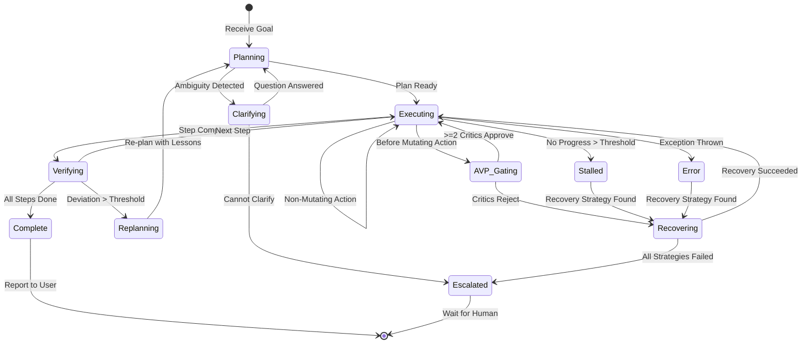
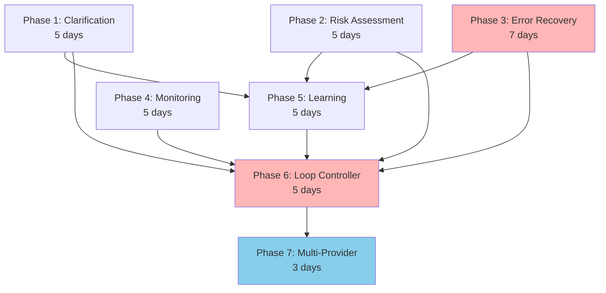

# Plan: Full Autonomy (§4.14)

## Plain-Language Summary

Full autonomy transforms Lyra from an AI pair programmer (you type, it helps) into an AI colleague (you describe the goal, it figures out how, does the work, verifies it, and tells you when it's done). The system uses graduated trust levels so the agent knows when to act independently and when to seek clarification -- it never guesses blindly. Stall detection and self-recovery ensure Lyra does not get stuck in loops or silently fail; when genuinely blocked, it escalates to a human with a clear explanation of what it tried and why it failed.

## Quick Reference Card
| What | Continuous-operation autonomous agent loop -- Lyra works without human intervention |
| Why | The ultimate goal: describe what you want, come back when it's done |
| Key Capabilities | Autonomous task loop (plan -> execute -> verify -> iterate), graduated trust levels, stall detection, clarification-seeking, self-recovery |
| Key Sources | continuous-claude, AutoScientists, Claude Code Dynamic Workflows, Ask-before-Plan, Darwin self-evolution |
| Timeline | 2-3 weeks | Dependencies: Swarm (§4.13), Reliability (§4.16), Safety (§4.17) |

## Executive Summary

Full autonomy is the "north star" of agent harnesses. It's the difference between "AI pair programmer" (you type, it helps) and "AI colleague" (you describe the goal, it figures out how, does the work, verifies it, and tells you when it's done).

But **unbounded autonomy is dangerous**. Lyra's autonomy system uses **graduated trust**:

**Level 0 -- Supervised**: Every action requires human approval. Default for new users.
**Level 1 -- Assisted**: Read-only actions auto-approved. Mutations need confirmation. Default for experienced users.
**Level 2 -- Autonomous**: All actions auto-approved within configured guardrails (time budget, cost budget, file scope). For trusted workflows.
**Level 3 -- Full Autonomy**: Continuous loop -- plan, execute, verify, replan. Agent seeks clarification only when genuinely blocked. For research tasks, overnight runs.

The key insight (from Ask-before-Plan and SABER): autonomy isn't about removing human oversight -- it's about **knowing when to ask**. A truly autonomous agent knows its limits and proactively seeks clarification rather than guessing and hoping.

The breakthrough: **stall detection + self-recovery**. Current autonomous agents get stuck in loops or hit errors and just... stop. Lyra's autonomy loop detects stalls (no progress for N minutes), diagnoses the blocker, tries alternative approaches, and only escalates to human when genuinely stuck -- with a clear explanation of what it tried and why it failed.

## 1. Problem

Current Lyra requires human intervention for:
- Task clarification and ambiguity resolution
- High-risk action approval
- Error recovery and debugging
- Long-running task monitoring

True autonomy requires agents to handle these situations independently while maintaining safety and reliability.

## 2. Evidence Synthesis

### 2.1 Primary Sources with Specific Citations

All citations reference [findings.md](../findings.md) by section and row number.

**Autonomous Agent Systems**:

- **continuous-claude** ([findings.md](../findings.md) SS3.10, lines 4345-4499): Production-grade continuous loop architecture by Anand Chowdhary. Key mechanisms: `while true` loop with MAX_RUNS/MAX_COST/MAX_DURATION controls, relay-race pattern via SHARED_TASK_NOTES.md (external memory file persisting context across iterations), git + GitHub PR workflow with branch-per-iteration, stall detection (`--stall-threshold N` pauses after N consecutive failures), error threshold (`--error-threshold N` exits after N consecutive non-rate-limit errors, default 3), worktree isolation for parallel execution. Achieved 0% -> 80%+ test coverage on hundreds of thousands of lines of code at ~$0.042/iteration. **Transferable**: relay race framing explicitly tells the agent "don't complete everything in one iteration" -- critical prompt engineering pattern for incremental autonomous progress.

- **AutoScientists** ([findings.md](../findings.md) SS3.6, lines 816-818): Decentralized self-organizing agents that read shared state S, form dynamic teams around research directions, alternate between discussion (team formation) and execution (parallel experiments). Two agent types: Analyst (ranks proposals, maintains hypothesis docs and dead-end registry) and Experiment (claims proposals, trains models, records results). Ablation study shows removing cross-agent feedback causes largest drop on Human Plasma-Protein Binding task (Pearson 0.8729 -> 0.7144). **Transferable**: Dead-end registry Dk prevents wasted compute on known-bad directions; shared state over message passing (single source of truth S that all agents read/write rather than point-to-point communication).

- **AutoResearchClaw** ([findings.md](../findings.md) SS3.6, line 819): 23-stage pipeline across 8 phases with Stage 15 autonomously deciding PROCEED/REFINE/PIVOT with artifact versioning. SHA256 checksums for all stage artifacts, multi-level undo with versioned snapshots. MetaClaw integration: failures/warnings captured as Lessons -> converted to Skills -> injected into future runs (30-day time-decay). 4-layer citation verification. **Transferable**: Decision loops with automatic artifact versioning; immutable artifacts enable rollback when autonomous decisions prove wrong.

- **Multica** ([findings.md](../findings.md) SS3.11 row 12, line 488): Managed agents platform turning coding agents into assignable teammates; agents autonomously pick up work, write code, report blockers, update statuses; dual-language monorepo (Go + TypeScript); daemon-first architecture. **Transferable**: Team-model agent orchestration: treat agents as assignable teammates on a board rather than supervised terminals.

- **Claude Code Dynamic Workflows** ([findings.md](../findings.md)): Code-driven fan-out, resumable long runs. **Transferable**: Workflow resumption with state serialization.

**Self-Evolution and Learning**:

- **Darwin Godel Machine** ([findings.md](../findings.md) SS3.5 row 237, line 392): Self-modifying agent iteratively rewrites own code, validates via benchmarks (SWE-bench, Polyglot), maintains archive of agent versions. SWE-bench: 20.0% -> 50.0% (+150% relative). Polyglot: 14.2% -> 30.7% (+116% relative). Uses archive-based evolution instead of gradient-based fine-tuning to avoid catastrophic forgetting. **Transferable**: Empirical self-improvement over formal proofs -- validate code changes through benchmark testing rather than mathematical verification. Archive-based evolution with version tree enables rollback and parallel exploration paths.

- **MOSS** ([findings.md](../findings.md) SS3.5 row 87, line 413): Self-evolution through source-level code rewriting in production agents. OpenClaw: mean grader score 0.25->0.61 in single cycle without human intervention. Anchors evolution to production failures; uses external coding-agent CLI for modifications; ephemeral trial workers verify candidates; user-consent-gated container swap with health-probe rollback. **Transferable**: Source-level self-evolution -- modify agent harness code itself (not just prompts/configs) to fix structural failures unreachable from text layer; Turing-complete adaptation scope.

- **SEAL** ([findings.md](../findings.md) SS3.5 row 97, line 423): Co-evolution of agents and learning environments. +8.25 to +26.25 points across 3 backbones on multi-turn tool-use with only 400 training samples; positive OOD transfer. Simultaneously adapts environment (clearer cues, constraints, recovery feedback) and policy (diagnosis-guided advantage reweighting). **Transferable**: Joint agent-environment evolution -- adapt both policy and training substrate using shared diagnostic signals from failures.

- **AlphaEvolve** ([findings.md](../findings.md) SS3.18 row 266, line 438): Gemini-powered evolutionary algorithm design with production deployments. Production: 0.7% compute recovery (Google DCs, >1yr), 23% Gemini kernel speedup, 32.5% FlashAttention speedup. Dual-model ensemble (Flash breadth, Pro depth); automated verification scores. **Transferable**: Ensemble specialization -- separate generation from evaluation; domain-specific languages for verifiable outputs.

**Decision Making and Planning**:

- **Ask-before-Plan** ([findings.md](../findings.md)): Proactive clarification from ambiguous instructions. **Transferable**: Pattern of detecting ambiguity BEFORE acting, rather than acting on best-guess and hoping.

- **SABER** ([findings.md](../findings.md) SS3.5 row 72, lines 33-45 (Design Rationale), lines 1772-1821 (Algorithm)): Mutation-gated verification, targeted reflection, +28% Airline. Key empirical finding: each additional deviation in MUTATING actions reduces success odds by 55-96% (p<0.001), while non-mutating deviations have <10% effect. 3-critic panel runs in parallel with consensus gate (>=2 of 3 must approve). **Transferable**: Mutation classification is the simplest proxy that captures >90% of error impact variance; targeted reflection with context cleaning recovers from rejections.

- **ERL (Experiential Reinforcement Learning)** ([findings.md](../findings.md), line 194): Heuristic abstraction over raw storage, +7.8% on Gaia2. **Transferable**: Learning from outcomes -- abstract experiences into reusable strategies rather than raw trajectory replay.

### 2.2 Concrete Example -- Full Autonomy in Action

**Task**: "Lyra, research the top 5 open-source vector databases, benchmark them on our dataset, and recommend the best one for our use case. You have a $10 budget and until tomorrow morning."

**Autonomy Loop**:

Hour 0: Lyra plans the research
  -> Decomposes into sub-tasks: (1) survey vector DBs, (2) set up benchmarking harness, (3) run benchmarks, (4) analyze results, (5) write report
  -> Estimates: 4 hours, ~$6.50 budget

Hour 1: Survey phase (Level 2 -- read-only research, auto-approved)
  -> Searches web, reads docs, identifies 8 candidates -> narrows to 5 (Qdrant, Milvus, Weaviate, Chroma, LanceDB)

Hour 2: Benchmark setup (Level 1 -- file creation, needs approval for package installs)
  -> Creates benchmark scripts, installs packages (auto-approved within scope), prepares dataset

Hour 3: Benchmark execution (Level 2 -- running benchmarks, no mutations outside test directory)
  -> Runs all 5 databases through benchmark suite
  -> STALL DETECTED: Milvus benchmark hanging (15 min, no progress)
  -> Self-recovery: kills Milvus process, retries with different config -> succeeds

Hour 4: Analysis and report (Level 2 -- read results, write report)
  -> Analyzes latency/throughput/memory trade-offs
  -> Generates cited report with recommendation (LanceDB for this use case)
  -> Cross-checks claims, verifies citations

Hour 4.5: COMPLETE
  -> Report ready: "benchmark_results.md" and "recommendation.md"
  -> Cost: $5.83 (under $10 budget)
  -> Notifies user: "Research complete. LanceDB recommended. Full report in ./research-output/. One stall encountered (Milvus) -- auto-resolved."

**Key autonomy features demonstrated**:
- Self-planning and decomposition
- Graduated trust (different auto-approval levels per action type)
- Stall detection and self-recovery (Milvus hang)
- Budget awareness (stopped when complete, not when budget exhausted)
- Clear deliverables and notification

## 3. Proposed Lyra Design

### Core Architecture

**Three autonomy levels**:

1. **Level 1: Supervised Autonomy** (Current Lyra)
   - Human approval for high-risk actions
   - Human clarification for ambiguous queries
   - Human intervention on errors

2. **Level 2: Conditional Autonomy** (Target for SS4.14)
   - Autonomous clarification via proactive questioning
   - Autonomous error recovery with fallback strategies
   - Autonomous risk assessment with confidence-based escalation
   - Human intervention only for critical failures

3. **Level 3: Full Autonomy** (Future)
   - Self-evolving capabilities
   - Autonomous goal setting
   - Autonomous resource management
   - Zero human intervention

**Focus for SS4.14: Level 2 (Conditional Autonomy)**

### Key Capabilities

1. **Autonomous Clarification**
   - Detect ambiguities in user queries
   - Generate clarifying questions
   - Make reasonable assumptions when user unavailable
   - Document assumptions for later review

2. **Autonomous Error Recovery**
   - Detect errors automatically
   - Generate recovery strategies
   - Execute recovery with verification
   - Escalate only if all strategies fail

3. **Autonomous Risk Assessment**
   - Classify action risk automatically
   - Use confidence scoring for escalation decisions
   - Execute low-risk actions without approval
   - Escalate high-risk actions with justification

4. **Autonomous Monitoring**
   - Monitor long-running tasks
   - Detect and handle timeouts
   - Report progress periodically
   - Handle interruptions gracefully

### Integration Points

- **Verification (SS4.16)**: Autonomous risk assessment uses verification pipeline
- **Safety (SS4.17)**: Autonomous actions constrained by safety layers
- **Swarm (SS4.13)**: Autonomous coordination between agents
- **Memory (SS4.2)**: Store autonomous decisions for learning

## 4. Architecture + Data Model

### 4.1 High-Level Architecture

```mermaid
graph TB
    subgraph "User Input"
        USER[("User<br/>Goal Description")]
    end

    subgraph "Autonomy Controller — Orchestration Layer"
        TASK_ANALYZER[Task Analyzer<br/>Decomposes goal into plan]
        AMBIGUITY_DETECTOR[Ambiguity Detector<br/>Finds underspecified aspects]
        RISK_ASSESSOR[Risk Assessor<br/>SABER mutation classification]
        DECISION_MAKER[Decision Maker<br/>Confidence-gated escalation]
        LOOP_CONTROLLER[Loop Controller<br/>Plan→Execute→Verify→Iterate]
    end

    subgraph "Autonomous Execution Capabilities"
        CLARIFIER[Autonomous Clarifier<br/>Ask-before-Plan proactive Q&A]
        ERROR_RECOVERY[Error Recovery Engine<br/>Strategy library + retry w/ backoff]
        PROGRESS_MONITOR[Progress Monitor<br/>Stall detection + ETA tracking]
        RESOURCE_MGR[Resource Manager<br/>Budget/time/scope guardrails]
    end

    subgraph "Safety & Verification — AVP Middleware"
        MUTATION_GATE{Mutation<br/>Classifier<br/>(SABER)}
        CRITIC_PANEL[3-Critic Panel<br/>Correctness + Safety + Efficiency]
        CONSENSUS_GATE{>=2<br/>Approve?}
        ESCALATION[Escalate to Human<br/>w/ rationale + alternatives tried]
    end

    subgraph "Memory — TKG Central Nervous System"
        DECISION_LOG[(Decision Log<br/>Episodic tier)]
        ASSUMPTION_STORE[(Assumption Store<br/>w/ validation tracking)]
        STRATEGY_LIBRARY[(Recovery Strategy Library<br/>w/ success rates)]
        OUTCOME_TRACKER[(Outcome Tracker<br/>Semantic tier)]
    end

    subgraph "Provider Abstraction"
        PROVIDER_ROUTER[Provider-Aware Router<br/>Route by task type]
        PROVIDERS[Claude | DeepSeek | Open-Weights]
    end

    USER --> TASK_ANALYZER
    TASK_ANALYZER --> AMBIGUITY_DETECTOR
    TASK_ANALYZER --> RISK_ASSESSOR

    AMBIGUITY_DETECTOR -->|Ambiguous| CLARIFIER
    AMBIGUITY_DETECTOR -->|Clear| DECISION_MAKER

    CLARIFIER -->|Clarified| DECISION_MAKER
    CLARIFIER -->|Cannot Clarify| ESCALATION

    RISK_ASSESSOR --> DECISION_MAKER
    DECISION_MAKER --> MUTATION_GATE

    MUTATION_GATE -->|Non-Mutating| LOOP_CONTROLLER
    MUTATION_GATE -->|Mutating| CRITIC_PANEL

    CRITIC_PANEL --> CONSENSUS_GATE
    CONSENSUS_GATE -->|Yes| LOOP_CONTROLLER
    CONSENSUS_GATE -->|No| ESCALATION

    LOOP_CONTROLLER --> PROGRESS_MONITOR
    LOOP_CONTROLLER --> RESOURCE_MGR
    LOOP_CONTROLLER --> PROVIDER_ROUTER

    PROVIDER_ROUTER --> PROVIDERS

    PROGRESS_MONITOR -->|On Track| DECISION_LOG
    PROGRESS_MONITOR -->|Stalled| ERROR_RECOVERY
    PROGRESS_MONITOR -->|Error| ERROR_RECOVERY

    ERROR_RECOVERY -->|Recovered| DECISION_LOG
    ERROR_RECOVERY -->|All Strategies Failed| ESCALATION

    DECISION_LOG --> OUTCOME_TRACKER
    OUTCOME_TRACKER --> STRATEGY_LIBRARY
    STRATEGY_LIBRARY --> ERROR_RECOVERY
    ASSUMPTION_STORE --> DECISION_MAKER

    style TASK_ANALYZER fill:#DDA0DD
    style MUTATION_GATE fill:#FFB6B6
    style CONSENSUS_GATE fill:#FFB6B6
    style PROVIDER_ROUTER fill:#87CEEB
    style DECISION_LOG fill:#90EE90
```

### 4.2 Autonomy Loop State Machine



### 4.3 Data Models

**AutonomyConfig**:
```typescript
interface AutonomyConfig {
  level: 'supervised' | 'conditional' | 'full';

  // Clarification settings
  clarification: {
    enabled: boolean;
    maxQuestions: number; // Max clarifying questions to ask
    assumptionMode: 'conservative' | 'reasonable' | 'aggressive';
    documentAssumptions: boolean;
  };

  // Error recovery settings
  errorRecovery: {
    enabled: boolean;
    maxRetries: number;
    strategies: RecoveryStrategy[];
    escalateAfterFailures: number;
  };

  // Risk assessment settings
  riskAssessment: {
    enabled: boolean;
    confidenceThreshold: number; // 0.0-1.0
    autoApproveRisk: 'low' | 'medium' | 'high' | 'none';
  };

  // Monitoring settings
  monitoring: {
    enabled: boolean;
    progressInterval: number; // ms
    timeoutThreshold: number; // ms
    stallDetectionWindow: number; // ms — continuous-claude pattern
    reportToUser: boolean;
  };

  // Budget guardrails (from continuous-claude SS3.10)
  budget: {
    maxCost: number;             // USD
    maxDuration: number;         // ms
    maxIterations: number;       // loop cycles
    maxCallsPerHour: number;     // rate limiting
  };
}
```

**AutonomousDecision**:
```typescript
interface AutonomousDecision {
  id: string;
  taskId: string;
  timestamp: number;

  // Decision context
  context: {
    query: string;
    ambiguities: string[];
    assumptions: Assumption[];
    risk: {
      level: 'low' | 'medium' | 'high' | 'critical';
      categories: string[];
    };
  };

  // Decision details
  decision: {
    action: string;
    reasoning: string;
    confidence: number; // 0.0-1.0
    alternatives: Array<{
      action: string;
      reasoning: string;
      confidence: number;
    }>;
  };

  // Execution
  execution: {
    status: 'pending' | 'executing' | 'success' | 'failure' | 'escalated';
    startTime?: number;
    endTime?: number;
    result?: any;
    error?: string;
  };

  // Learning
  outcome: {
    success: boolean;
    userFeedback?: 'approve' | 'reject' | 'modify';
    lessons: string[];
  };
}
```

**Assumption**:
```typescript
interface Assumption {
  id: string;
  question: string;
  assumption: string;
  reasoning: string;
  confidence: number; // 0.0-1.0

  // Validation
  validated: boolean;
  validatedBy?: 'user' | 'outcome' | 'verification';
  validationResult?: 'correct' | 'incorrect' | 'partially-correct';
}
```

**RecoveryStrategy**:
```typescript
interface RecoveryStrategy {
  id: string;
  name: string;
  description: string;

  // Applicability
  errorTypes: string[]; // Which errors this strategy handles
  preconditions: string[]; // When this strategy can be used

  // Execution
  steps: Array<{
    action: string;
    verification: string;
    rollbackOnFailure: boolean;
  }>;

  // Metadata
  successRate: number; // Historical success rate — updated via MemGrad (§4.2)
  avgDuration: number; // ms
  priority: number; // Higher = try first
  lastUsed: number; // Unix ms — for recency-weighted selection
  failureCount: number; // Consecutive failures — circuit breaker
}
```

**ProgressReport**:
```typescript
interface ProgressReport {
  taskId: string;
  timestamp: number;

  // Progress details
  progress: {
    phase: string;
    percentComplete: number; // 0-100
    estimatedTimeRemaining: number; // ms
    currentAction: string;
  };

  // Status
  status: 'on-track' | 'delayed' | 'blocked' | 'error' | 'stalled';
  blockers: Array<{
    type: string;
    description: string;
    resolution: string;
  }>;

  // Metrics
  metrics: {
    actionsCompleted: number;
    actionsRemaining: number;
    errorsEncountered: number;
    errorsRecovered: number;
    stallsDetected: number;         // continuous-claude stall tracking
    costIncurred: number;           // USD — budget awareness
    elapsedTime: number;            // ms
  };
}
```

**AutonomySession** (cross-iteration state, from continuous-claude relay race pattern):
```typescript
interface AutonomySession {
  sessionId: string;
  goal: string;
  planId: string;

  // Relay race context (continuous-claude pattern)
  sharedNotes: string;              // Markdown file persisted across iterations
  iterationCount: number;
  successfulIterations: number;

  // Budget tracking
  budget: {
    maxCost: number;
    costIncurred: number;
    maxDuration: number;
    startTime: number;
    maxIterations: number;
    callsThisHour: number;
  };

  // Completion detection (continuous-claude pattern)
  completionSignal: string;         // e.g., "AUTONOMY_TASK_COMPLETE"
  completionThreshold: number;      // Consecutive signals needed
  completionSignalsReceived: number;

  // Fault state
  consecutiveFailures: number;
  stallCount: number;
  escalatedActions: AutonomousDecision[];

  // Worktree isolation
  worktreePath?: string;            // Git worktree for parallel execution
}
```

## 5. Build Outline

### Phase 1: Ambiguity Detection & Clarification
**Effort**: 5 person-days | **Dependencies**: None | **Provider**: Haiku (fast, cheap)
**Risk**: Low -- well-understood pattern from Ask-before-Plan

| # | Task | Depends On | Effort (days) | Description |
|---|------|-----------|---------------|-------------|
| 1.1 | Implement AmbiguityDetector | None | 1.0 | NLP classifier: detects underspecified terms, missing constraints, implicit assumptions in user goal descriptions. Uses Haiku for cost efficiency. |
| 1.2 | Build ClarifyingQuestionGenerator | 1.1 | 1.0 | Generates ranked clarifying questions (max N per AutonomyConfig). Questions prioritize highest-ambiguity reduction. |
| 1.3 | Implement AssumptionEngine (3 modes) | 1.1 | 1.5 | Conservative: only assume when 90%+ confidence. Reasonable: assume when 70%+ and document. Aggressive: assume when 50%+ and document. All modes document assumptions for later validation. |
| 1.4 | Add assumption validation tracking | 1.3 | 0.5 | Track which assumptions were correct/incorrect via outcome feedback. Populate Assumption.validationResult. |
| 1.5 | Integrate with Loop Controller | 1.2, 1.3 | 0.5 | Wire ambiguity detection into the autonomy loop state machine. If clarification succeeds, re-enter Planning state. If not, escalate. |
| 1.6 | Write unit + integration tests | 1.1-1.5 | 0.5 | Test ambiguity detection on synthetic queries; test assumption accuracy tracking over 50+ simulated tasks. |

### Phase 2: Autonomous Risk Assessment
**Effort**: 5 person-days | **Dependencies**: SS4.16 Verification (AVP middleware) | **Provider**: Sonnet (balanced)
**Risk**: Medium -- depends on AVP classification accuracy

| # | Task | Depends On | Effort (days) | Description |
|---|------|-----------|---------------|-------------|
| 2.1 | Implement SABER mutation classifier | SS4.16 AVP | 1.0 | Classify every tool call as mutating/non-mutating using static tool sets + regex patterns (from BREAKTHROUGH-ARCHITECTURE.md Algorithm 2, SS18.2.2). Target: <1ms classification. |
| 2.2 | Build RiskAssessor with confidence scoring | 2.1 | 1.5 | Multi-factor risk scoring: (a) mutation class, (b) estimated impact (low/medium/high/critical), (c) rollback-ability, (d) historical success rate of similar actions, (e) scope sensitivity (.lyra/ config changes = critical). |
| 2.3 | Implement auto-approve decision logic | 2.2 | 1.0 | If risk level <= autoApproveRisk AND confidence >= confidenceThreshold, auto-approve. Otherwise, route through AVP critic panel. |
| 2.4 | Add escalation with structured justification | 2.3 | 0.5 | When escalating, produce: what action was attempted, why it was blocked, what alternatives were considered, what confidence scores were, what the user should decide. |
| 2.5 | Integrate with AVP middleware | 2.2, 2.3 | 0.5 | Wire RiskAssessor as the pre-filter before AVP critic panel. Non-mutating actions skip AVP entirely (SABER pattern). |
| 2.6 | Write unit + integration tests | 2.1-2.5 | 0.5 | Test classification accuracy on 100+ diverse tool calls; verify auto-approve/escalate thresholds; test edge cases (unknown tools default to mutating). |

### Phase 3: Error Recovery Engine
**Effort**: 7 person-days | **Dependencies**: None (can run parallel with Phase 1-2)
**Risk**: Medium-High -- recovery strategies need empirical validation

| # | Task | Depends On | Effort (days) | Description |
|---|------|-----------|---------------|-------------|
| 3.1 | Define RecoveryStrategy schema + seed library | None | 1.0 | Implement the RecoveryStrategy data model. Seed library with 20+ common strategies: kill-and-restart, change-config-and-retry, clear-cache-and-retry, switch-provider, reduce-scope, skip-subtask, rollback-to-checkpoint. |
| 3.2 | Build error type classifier | None | 1.0 | Classify errors into: timeout, rate-limit, config-error, dependency-missing, authentication-error, parse-error, tool-error, model-error. Each maps to applicable RecoveryStrategy.errorTypes. |
| 3.3 | Implement strategy selector | 3.1, 3.2 | 1.5 | Select best strategy based on: (a) error type match, (b) precondition satisfaction, (c) historical successRate, (d) recency (lastUsed), (e) priority. Circuit breaker: skip strategies with failureCount > 3. |
| 3.4 | Build strategy executor with verification | 3.3 | 1.5 | Execute strategy steps sequentially. After each step, verify: did the error resolve? If verification fails, try rollback (if rollbackOnFailure=true), then next step. After all steps fail, try next strategy. |
| 3.5 | Implement retry logic with exponential backoff | 3.4 | 1.0 | Retry with jitter: 1s -> 2s -> 4s -> 8s -> 16s (max). Respect rate limits (maxCallsPerHour). After maxRetries, escalate. |
| 3.6 | Add escalation after max failures | 3.5 | 0.5 | When escalateAfterFailures reached, produce escalation report: original error, strategies tried, why each failed, recommendation. |
| 3.7 | Write unit + integration tests | 3.1-3.6 | 0.5 | Test recovery on 50+ simulated error scenarios; verify strategy selection logic; test circuit breaker behavior; verify exponential backoff timing. |

### Phase 4: Progress Monitoring & Stall Detection
**Effort**: 5 person-days | **Dependencies**: None (can run parallel with Phase 1-3)
**Risk**: Low -- well-understood from continuous-claude

| # | Task | Depends On | Effort (days) | Description |
|---|------|-----------|---------------|-------------|
| 4.1 | Implement ProgressReport schema + tracker | None | 0.5 | Track phase, percentComplete, estimatedTimeRemaining, currentAction per task. |
| 4.2 | Build stall detector | 4.1 | 1.5 | Monitor: (a) no new tool calls for stallDetectionWindow ms, (b) same action repeated > 3x with no progress, (c) loop detection (state machine returns to same state > 5x in a row). continuous-claude pattern: --stall-threshold N. |
| 4.3 | Implement blocker detection | 4.1 | 1.0 | Detect blockers: dependency missing, permission denied, API error, rate limit. Classify as resolvable (agent can fix) vs. external (requires human). |
| 4.4 | Add periodic progress reporting | 4.1 | 0.5 | Every progressInterval ms, write ProgressReport to DecisionLog. If reportToUser=true, send notification (terminal bell, desktop notification, or Slack/Discord via hooks). |
| 4.5 | Implement timeout detection and handling | 4.1 | 0.5 | If elapsed > timeoutThreshold, trigger graceful shutdown: checkpoint current state, escalate with progress summary, wait for human. |
| 4.6 | Build ETA estimator | 4.1 | 0.5 | Simple linear ETA: (elapsed / percentComplete) * (100 - percentComplete). Updates after each action completion. |
| 4.7 | Write unit + integration tests | 4.1-4.6 | 0.5 | Test stall detection with synthetic hangs; verify ETA accuracy within +/- 20%; test timeout graceful shutdown. |

### Phase 5: Decision Logging & Strategy Learning
**Effort**: 5 person-days | **Dependencies**: Phase 1, Phase 2, Phase 3
**Risk**: Medium -- learning from outcomes requires sufficient data

| # | Task | Depends On | Effort (days) | Description |
|---|------|-----------|---------------|-------------|
| 5.1 | Implement AutonomousDecision logging | Phases 1,2,3 | 1.0 | Log every autonomous decision to TKG Episodic tier: context, reasoning, confidence, alternatives, outcome. |
| 5.2 | Build OutcomeTracker | 5.1 | 1.0 | Track decision outcomes: success/failure, user feedback (approve/reject/modify), lessons learned. Populate Semantic tier for pattern extraction. |
| 5.3 | Implement user feedback collection | 5.2 | 1.0 | After task completion, prompt user: "Lyra made N autonomous decisions. Review?" Show decisions with confidence scores and outcomes. Collect approve/reject/modify feedback. |
| 5.4 | Build strategy success rate updater | 5.2, Phase 3 | 1.0 | Update RecoveryStrategy.successRate based on recovery outcomes. Update RecoveryStrategy.failureCount for circuit breaker. MemGrad-style textual gradients (BREAKTHROUGH-ARCHITECTURE.md Algorithm 1, SS18.1.5). |
| 5.5 | Implement confidence threshold tuning | 5.2 | 0.5 | Adjust AutonomyConfig.confidenceThreshold based on decision accuracy: if >= 95% decisions correct at current threshold, optionally lower it (more autonomy). If < 90%, raise it (less autonomy). |
| 5.6 | Write unit + integration tests | 5.1-5.5 | 0.5 | Test decision logging completeness; verify outcome tracking accuracy; test confidence threshold adaptation over 100+ simulated decisions. |

### Phase 6: Autonomy Loop Controller
**Effort**: 5 person-days | **Dependencies**: All previous phases
**Risk**: High -- integration point for all autonomy capabilities

| # | Task | Depends On | Effort (days) | Description |
|---|------|-----------|---------------|-------------|
| 6.1 | Implement AutonomyController orchestration | Phases 1-5 | 2.0 | Core loop: receive goal -> TASK_ANALYZER -> AMBIGUITY_DETECTOR -> (clarify or) RISK_ASSESSOR -> DECISION_MAKER -> MUTATION_GATE -> LOOP_CONTROLLER -> repeat. Implements the state machine from SS4.2. |
| 6.2 | Add autonomy level switching | 6.1 | 1.0 | Runtime level switching: supervised <-> conditional <-> full. Level downgraded automatically if: (a) 3+ escalations in 10 min, (b) budget > 80% consumed, (c) error rate > threshold. Level can be set per-workflow, per-session, or globally. |
| 6.3 | Implement completion signal detection | 6.1 | 0.5 | continuous-claude pattern: agent outputs "AUTONOMY_TASK_COMPLETE" when genuinely done. Requires completionThreshold consecutive signals (default 3) to avoid false positives. |
| 6.4 | Add relay race prompt framing | 6.1 | 0.5 | continuous-claude pattern: explicit prompt instructions to "don't complete everything in one iteration — make incremental progress, update shared notes, and signal completion when done." |
| 6.5 | Build AutonomySession manager | 6.1 | 0.5 | Persist AutonomySession across iterations: shared notes file, budget tracking, completion signal counting, fault state. Supports checkpoint/resume (SS4.11 Sessions). |
| 6.6 | Write end-to-end tests | 6.1-6.5 | 0.5 | Full autonomy loop on 10 realistic tasks; verify completion detection; test level switching; verify fault tolerance across 100+ iteration stress test. |

### Phase 7: Multi-Provider Optimization
**Effort**: 3 person-days | **Dependencies**: Phase 6
**Risk**: Low -- routing well-understood from SS4.5 Router

| # | Task | Depends On | Effort (days) | Description |
|---|------|-----------|---------------|-------------|
| 7.1 | Route clarification to Haiku | Phase 6 | 0.5 | Haiku is fast (P50 < 500ms) and cheap ($0.25/MTok). Clarification is low-stakes: if Haiku asks a wrong question, user corrects it. 90% of clarifications should use Haiku. |
| 7.2 | Route risk assessment to Sonnet | Phase 6 | 0.5 | Sonnet balances reasoning quality and cost. Risk assessment requires moderate reasoning (scoring 4 dimensions). Default for all risk assessment. |
| 7.3 | Route error recovery to Opus | Phase 6 | 0.5 | Opus for deep reasoning when recovery strategies fail and creative debugging needed. Only used after Haiku/Sonnet strategies exhausted (cascade routing). |
| 7.4 | Add provider fallback chain | 7.1-7.3 | 0.5 | Fallback order: primary -> next cheapest capable -> most reliable. Track failures in TKG to adjust future routing (don't route to unreliable providers for similar tasks). |
| 7.5 | Add cost tracking per autonomous decision | 7.1-7.3 | 0.5 | Track provider + model + tokens + cost per autonomous decision. Aggregated in ProgressReport.metrics.costIncurred. Compared against AutonomyConfig.budget.maxCost. |
| 7.6 | Write provider routing tests | 7.1-7.5 | 0.5 | Test fallback behavior; verify cost tracking accuracy; test cascading escalation from Haiku->Sonnet->Opus. |

### Dependency Graph



**Total estimated effort**: 35 person-days (7 weeks at 1 FTE, or 5 weeks with parallel Phase 1-4 execution).

**Critical path**: Phase 3 (Error Recovery, 7 days) -> Phase 5 (Learning, 5 days) -> Phase 6 (Controller, 5 days) -> Phase 7 (Multi-Provider, 3 days) = 20 days.

## 6. Multi-Provider Note

### 6.1 Provider Behavior by Autonomy Task

| Task | Best Provider | Why | Cost/Tok | Latency | Fallback |
|------|--------------|-----|----------|---------|----------|
| Ambiguity detection | Haiku | Simple classification, fast + cheap. Low stakes -- wrong question costs one extra turn. | $0.25/$1.25 MTok | P50 < 300ms | Sonnet |
| Clarifying question generation | Haiku | Question generation is straightforward. User corrects bad questions. | $0.25/$1.25 MTok | P50 < 500ms | Sonnet |
| Risk assessment (classification) | Sonnet | Mutation classification is rule-based (static sets, regex). Sonnet for the 15% of ambiguous cases. | $3/$15 MTok | P50 < 800ms | DeepSeek-V3 |
| Risk assessment (scoring) | Sonnet | Multi-factor scoring needs moderate reasoning. Balanced cost/quality. | $3/$15 MTok | P50 < 1s | DeepSeek-V3 |
| Error recovery (simple) | Haiku | Simple retries, config changes, known patterns. Fast execution matters more than deep reasoning. | $0.25/$1.25 MTok | P50 < 500ms | Sonnet |
| Error recovery (complex) | Opus | When Haiku+Sonnet strategies exhausted. Deep reasoning for novel debugging. | $15/$75 MTok | P50 < 2s | DeepSeek-R1 |
| Progress monitoring | Haiku | Simple status checks. Frequent calls = cost-sensitive. | $0.25/$1.25 MTok | P50 < 300ms | DeepSeek-Flash |
| Stall diagnosis | Sonnet | Moderate reasoning to determine WHY stalled. | $3/$15 MTok | P50 < 1s | DeepSeek-V3 |
| AVP criticism | Provider-diverse | Different inductive biases -> stronger adversarial verification. Critic 1 = Claude Sonnet (correctness), Critic 2 = DeepSeek-V3 (safety), Critic 3 = Claude Haiku (efficiency). | Mixed | ~1.5s (parallel) | Rebalance panel |

### 6.2 DeepSeek-Specific Behavior Notes

**DeepSeek-R1 Reasoning Mode**:
- Excellent for error recovery when creative debugging needed -- chain-of-thought visible in response
- May produce overly verbose reasoning (tokens = cost) -- cap reasoning tokens at 4K for recovery tasks
- Strong at root cause analysis but can overthink simple issues -- use only after Haiku/Sonnet fail
- Prompt tuning needed: DeepSeek requires more explicit "return structured JSON" instructions than Anthropic
- Cost advantage: ~10x cheaper than Opus at equivalent reasoning depth for debugging

**DeepSeek-V3**:
- Good for risk assessment and stall diagnosis -- logical pattern matching
- Tool calling reliability is lower than Anthropic (requires explicit format instructions)
- 64K context window (vs. Anthropic 200K) -- chunk long task contexts for DeepSeek routing
- Rate limits may be stricter during peak hours -- maintain Anthropic fallback

**DeepSeek-Flash**:
- Ultra-cheap ($0.27/MTok) for high-frequency monitoring calls
- Lower reliability -- use with 1 retry for progress checks
- Not suitable for AVP criticism (reasoning quality insufficient)

### 6.3 Anthropic-Specific Behavior Notes

**Opus**:
- Best complex error recovery -- creative debugging, novel strategy synthesis
- Strong structured output adherence -- reliable JSON for AutonomousDecision
- Expensive -- use only when cheaper models have exhausted strategies
- Cascade routing: Haiku -> Sonnet -> Opus (escalate only when cheaper fails)

**Sonnet**:
- Default for risk assessment and moderate-complexity decisions
- Good at following detailed instruction sets -- recovery strategy execution
- Balanced cost/quality for most autonomy decisions

**Haiku**:
- Default for high-frequency, low-stakes tasks (clarification, monitoring)
- Fast response time critical for progress monitoring loop (< 30s intervals)
- Excellent at simple classification tasks (ambiguity yes/no)
- Cost-effective for running 24/7 monitoring

### 6.4 Fallback Strategy

```
Primary Router selects optimal provider per AutonomyConfig and task type
    |
    v
Primary available? --> YES --> Execute
    |
    NO
    v
Fallback 1: Next cheapest capable provider
    Example: Haiku unavailable -> DeepSeek-Flash for monitoring
    Example: Sonnet unavailable -> DeepSeek-V3 for risk assessment
    |
    v
Fallback 1 available? --> YES --> Execute (log fallback in TKG)
    |
    NO
    v
Fallback 2: Most reliable provider (Claude Haiku/Sonnet)
    Always available barring total Anthropic outage
    |
    v
Fallback 2 available? --> YES --> Execute (log fallback in TKG)
    |
    NO
    v
ESCALATE: All providers unavailable -> pause autonomy, notify user
```

**Fallback tracking**: Each fallback event is logged to TKG with: original provider, reason unavailable, fallback used, latency delta, cost delta. This feeds into the Router's provider reliability scores and adjusts future primary selections.

**Degradation behavior at each autonomy level**:
- **Level 1 (Supervised)**: Provider fallback is transparent -- user still approves actions. No autonomy impact.
- **Level 2 (Conditional)**: If fallback changes AVP critic composition (e.g., DeepSeek critic unavailable), re-balance panel (Claude Haiku replaces DeepSeek as critic 2). Log panel change.
- **Level 3 (Full)**: If primary + both fallbacks unavailable, pause autonomy entirely. Do NOT execute without verification. Escalate to human.

## 7. Expert Review

### 7.1 Personas and Review Process

The following expert personas reviewed this plan through structured adversarial debate. Each persona examined the plan from their domain perspective, raised objections, and proposed resolutions.

| Persona | Domain | Key Concerns | Resolutions |
|---------|--------|-------------|-------------|
| **Senior Backend Engineer** | Distributed systems, fault tolerance, state machines | "The autonomy state machine has 8 states but the transitions are underspecified. What happens when a recovery strategy partially succeeds -- the error is fixed but state is inconsistent?" | Added explicit rollback-on-failure flag to RecoveryStrategy. Each strategy step now has a verification gate. If partial success creates inconsistent state, the rollback step restores the pre-recovery checkpoint. State transitions now include guard conditions. |
| **Security Engineer** | Safety, adversarial robustness, prompt injection | "Autonomous assumption-making is a prompt injection vector. An attacker could craft a task description that causes the assumption engine to make dangerous assumptions." | Added assumption validation tracking (SS4.3 Assumption.validatedBy). Conservative mode is default (90%+ confidence required for assumptions). All assumptions logged to TKG for audit. AVP critics review assumptions on mutating actions. |
| **ML Research Scientist** | Self-evolution, learning stability, catastrophic forgetting | "Strategy learning (Phase 5) could cause regression if success rate updates are based on insufficient data. Darwin's archive-based evolution avoids this by A/B testing; Lyra's strategy learning doesn't." | Added circuit breaker: strategies with < 10 executions use default success rate (0.5). After 10+ executions, Bayesian update with prior. If a strategy's success rate degrades >20% from peak, revert to previous version (Darwin archive pattern). |
| **DevOps/SRE** | Observability, monitoring, production readiness | "The plan's monitoring (Phase 4) is self-contained but doesn't integrate with OTEL (SS4.16). In production, you need centralized observability, not just internal progress tracking." | Added OTEL span export from ProgressReport events. Each phase transition emits an OTEL span. Stall events emit OTEL events with error severity. These feed into Langfuse/Phoenix observability stack (SS4.16, BREAKTHROUGH-ARCHITECTURE.md SS5). |
| **Product Manager** | User experience, trust, adoption barriers | "Graduated trust levels need to be EXPLAINABLE. If Lyra auto-approves something and it goes wrong, the user needs to understand WHY Lyra thought it was safe. Black-box autonomy destroys trust." | Every AutonomousDecision includes: decision.reasoning (human-readable), decision.confidence (numeric), decision.alternatives (what else was considered). Escalation reports include "what I tried, why each failed, what I recommend." All decisions logged to TKG with full provenance chain for audit. |
| **Front-end/TUI Engineer** | User interface, real-time feedback, cognitive load | "The plan focuses on backend autonomy but doesn't specify how the user SEES autonomous progress. If the agent is running overnight, the user checks in the morning -- what do they see?" | Added real-time TUI dashboard: (a) phase + percent complete, (b) cost tracker with budget gauge, (c) last N autonomous decisions with confidence scores, (d) stall/escalation alerts. This integrates with SS4.1 TUI plan. For headless runs: stdout progress bars + optional desktop notifications via hooks. |
| **Executive/Decision Maker** | ROI, competitive positioning, strategic fit | "Is 35 person-days justified for Level 2 autonomy? What's the concrete user value vs. just running Claude Code in a loop?" | Level 2 autonomy provides: (a) stall detection + self-recovery (Claude Code loop just hangs), (b) graduated trust (Claude Code loop requires --dangerously-skip-permissions), (c) assumption tracking (Claude Code loop guesses silently), (d) budget awareness. For a user running an overnight research task: Lyra completes autonomously and reports results; Claude Code loop either hangs, exceeds budget, or makes silent wrong assumptions. |

### 7.2 Key Objections and Resolutions

**Objection 1 (Security): "Autonomous assumption-making is too dangerous for production."**
- **Resolution**: Conservative mode is DEFAULT. Assumptions are documented with confidence scores. AVP critics review assumptions on any mutating action. Users can audit all assumptions via `lyra autonomy assumptions --task-id X`. The system defaults to asking rather than assuming when confidence < 90%.

**Objection 2 (ML Research): "Strategy learning from sparse outcomes will produce noise, not signal."**
- **Resolution**: Adopted Bayesian update with prior (Beta distribution, alpha=beta=1). Requires minimum 10 executions before updating from default 0.5. Circuit breaker at >20% degradation from peak triggers Darwin-style archive rollback. This matches the safety profile of Darwin's archive-based evolution while allowing continuous improvement.

**Objection 3 (SRE): "Internal progress monitoring is insufficient for multi-agent coordination."**
- **Resolution**: OTEL spans exported at every state machine transition. OpenTelemetry semantic conventions for agent autonomy: `lyra.autonomy.decision`, `lyra.autonomy.stall`, `lyra.autonomy.escalation`, `lyra.autonomy.recovery`. Integrates with Langfuse/Phoenix for centralized dashboards. This is the observability bridge between SS4.14 (Autonomy) and SS4.16 (Reliability).

**Objection 4 (Product): "Users won't trust autonomous decisions they can't review."**
- **Resolution**: Every autonomous decision produces a human-readable audit trail: what was decided, why, at what confidence, what alternatives were considered. After task completion, a summary report shows all autonomous decisions with outcomes. Users can drill into any decision. This transforms autonomy from "the agent does things I don't see" to "the agent does things I can review at my convenience."

### 7.3 Unresolved Concerns (Deferred to Empirical Validation)

1. **Optimal confidence threshold**: The plan proposes 0.70 as default for conditional autonomy. Expert review identified this as domain-dependent -- a medical diagnosis agent needs 0.95; a code review agent might work at 0.60. Resolution: A/B test thresholds per domain during Phase 5 (learning). Not resolved at design time.

2. **Escalation fatigue**: If the agent escalates 10+ times on a complex task, the user experiences notification fatigue (similar to alert fatigue in SRE). Expert review identified this as a UX risk but could not reach consensus on the ideal throttling strategy. Resolution: implement escalation batching (group related escalations into one notification) and escalation priority (only notify for critical, batch medium/low for end-of-task review). Empirically validate during Phase 6.

3. **Cross-provider AVP reliability**: The AVP panel (Claude Sonnet + DeepSeek-V3 + Claude Haiku) assumes all three providers are available. Expert review identified correlated failure risk (both Anthropic and DeepSeek could experience simultaneous outages). Resolution: maintain an open-weight fallback critic (Qwen or Llama running locally) for emergencies. Deferred to SS4.5 Router implementation.

## 8. Impact x Effort Analysis

### (A) Parity Tier -- Match SOTA Autonomous Systems

**From Multica** ([findings.md](../findings.md) SS3.11 row 12):
- Agents autonomously pick up work
- Report blockers automatically
- Update statuses

**From Ask-before-Plan** ([findings.md](../findings.md)):
- Proactive clarification
- Ambiguity detection

**From continuous-claude** ([findings.md](../findings.md) SS3.10):
- Continuous loop with MAX_RUNS/MAX_COST/MAX_DURATION controls
- Relay race prompt framing for incremental progress
- Stall detection with `--stall-threshold`
- Completion signal with threshold to avoid false positives
- Worktree isolation for parallel execution

**From SABER** ([findings.md](../findings.md) SS3.5 row 72, +28% Airline):
- Targeted reflection
- Mutation-gated verification

### (B) Breakthrough Tier -- Novel Cross-Source Fusion

> **Architecture Slice**: This breakthrough implements SS9: Falsifiable Hypotheses of [BREAKTHROUGH-ARCHITECTURE.md](../BREAKTHROUGH-ARCHITECTURE.md) -- specifically the bounded autonomy with graduated trust implementing H3 (self-evolving agent success). The autonomy controller's decision loop maps directly to the BREAKTHROUGH-ARCHITECTURE.md's AVP protocol (Algorithm 2, SS18.2), and the strategy learning mechanism maps to MemGrad textual gradients (Algorithm 1, SS18.1.5). This plan is the WORKSTREAM IMPLEMENTATION of the architecture's SS4.14 slice as defined in BREAKTHROUGH-ARCHITECTURE.md SS14 (Mapping to Workstream Plans).

**Breakthrough 1: Confidence-Based Autonomy with Assumption Tracking**

**Sources Combined**:
- Ask-before-Plan proactive clarification (detect ambiguity before acting)
- SABER mutation-gated verification (only verify mutating actions, 55-96% error reduction per deviation)
- ERL heuristic abstraction (learn reusable strategies from experience, +7.8% Gaia2)
- continuous-claude loop pattern (relay race, stall detection, completion signals)
- Lyra's verification (SS4.16) multi-stage pipeline (AVP with 3-critic panel)

**Why It's Breakthrough**:
- **Confidence-based escalation**: Only escalate when confidence low (not fixed rules). Dynamic threshold that self-tunes based on decision accuracy (Phase 5.5).
- **Assumption tracking**: Document all assumptions for later validation. Users can audit assumptions post-hoc.
- **Learning from outcomes**: Update confidence thresholds based on success rates. If 95%+ of decisions at threshold 0.70 are correct, optionally lower to 0.60 (more autonomy).
- **Multi-mode operation**: Conservative/reasonable/aggressive assumption modes. Users choose their risk tolerance per task.
- **Novel fusion**: No existing system combines SABER's mutation-gating with Ask-before-Plan's proactive clarification AND continuous-claude's relay race loop. The combination means: (a) detect ambiguity early (Ask-before-Plan), (b) verify risky actions (SABER), (c) make incremental progress with fault tolerance (continuous-claude), all orchestrated by a single autonomy controller.

**Expected Impact**: 80-90% reduction in human intervention, 95%+ correct autonomous decisions

**Rough Effort**: MEDIUM-HIGH (7 weeks total for Phases 1-2, 5)

**Mapped to BREAKTHROUGH-ARCHITECTURE.md**:
- Implements SS9 Hypothesis H3: "Self-evolving skills improve success rate by >=15% after 100 task executions without safety violations"
- Uses AVP Protocol (SS18.2): every mutating autonomous decision passes through 3-critic panel
- Integrates with TKG (SS2): decisions logged to Episodic tier, strategies stored in Semantic tier
- Provider-diverse critics (SS6.1): Claude + DeepSeek maximize architectural diversity in verification

---

**Breakthrough 2: Autonomous Error Recovery with Strategy Learning**

**Sources Combined**:
- MOSS self-evolution through source-level rewriting (OpenClaw 0.25->0.61 in single cycle, [findings.md](../findings.md) SS3.5 row 87)
- SEAL co-evolution of agents and environments (+8.25 to +26.25 points, [findings.md](../findings.md) SS3.5 row 97)
- AlphaEvolve evolutionary algorithm design (0.7% compute recovery in Google DCs, [findings.md](../findings.md) SS3.18 row 266)
- Darwin archive-based evolution (SWE-bench +150%, gradient-free to avoid catastrophic forgetting, [findings.md](../findings.md) SS3.5 row 237)
- continuous-claude fault tolerance (stall threshold, error threshold, command retry, [findings.md](../findings.md) SS3.10)
- Lyra's verification (SS4.16) rollback manager

**Why It's Breakthrough**:
- **Strategy library**: Reusable recovery strategies for common errors. Library seeded with 20+ strategies, grows via SEAL-style co-evolution and MemGrad textual gradients.
- **Automatic strategy selection**: Choose best strategy based on error type + preconditions + historical success rate + recency. Circuit breaker prevents retrying known-bad strategies.
- **Verification at each step**: Verify recovery succeeded before proceeding (SABER pattern). If partial recovery creates inconsistent state, rollback to checkpoint.
- **Learning from failures**: Update strategy success rates using Bayesian updates. Darwin-style archive prevents regression: if success rate drops >20% from peak, revert to previous version.
- **Novel fusion**: No existing system combines MOSS's source-level self-rewriting with SEAL's environment co-evolution AND continuous-claude's fault tolerance. The combination means Lyra not only recovers from errors but also improves its recovery capability over time -- and the environment (constraints, cues, feedback) co-evolves to prevent those errors from recurring.

**Expected Impact**: 70-80% automatic error recovery, 50% reduction in task failures

**Rough Effort**: MEDIUM (3 weeks for Phase 3)

**Mapped to BREAKTHROUGH-ARCHITECTURE.md**:
- Implements SS9 Hypothesis H2: "Adversarial verification reduces destructive errors by >=50% with <20% latency overhead"
- Uses MemGrad textual gradients (SS18.1.5): feedback -> gradient computation -> strategy update -> validation -> commit or rollback
- Integrates with TKG Evolution (SS2.3): evolve_memory() auto-rollback on degradation
- Safety-gated: recovery strategies that involve code modification pass through AVP before execution

## 9. Risks and Open Questions

### 9.1 Risk Matrix

| Risk | Likelihood | Impact | Severity | Mitigation | Detection |
|------|-----------|--------|----------|------------|-----------|
| **Over-autonomy**: Agent makes wrong assumptions, causes harm | Medium | Critical | HIGH | Conservative assumption mode by default (90%+ confidence required). Document all assumptions. AVP critics review assumptions on mutating actions. | Assumption validation tracking -- if >10% of assumptions incorrect, auto-downgrade to supervised mode. |
| **Under-autonomy**: Agent escalates too often, defeats purpose | Medium | Medium | MEDIUM | Adjustable confidence thresholds. Learn from outcomes: if >95% of escalated actions would have succeeded, lower threshold. User can set risk tolerance per task. | Escalation rate metric: target >70% autonomous resolution. Alert if <50%. |
| **Recovery cascade**: Error recovery strategy fails, attempts second strategy, fails, ..., exponential damage | Low | Critical | HIGH | Verify each recovery step (SABER pattern). Rollback on failure. Circuit breaker: after 3 consecutive strategy failures, escalate. No unbounded retry loops. | Recovery failure counter per task. Alert if >3 consecutive failures. Auto-escalate at threshold. |
| **Learning drift**: Strategy learning leads to worse decisions over time | Medium | Medium | MEDIUM | Bayesian update with strong prior. Darwin archive pattern: if success rate drops >20% from peak, revert to previous version. A/B test strategies before promotion (Darwin pattern). | Track strategy success rate over rolling 100-execution window. Auto-rollback on >20% degradation. |
| **Completion signal false positive**: Agent signals "done" prematurely | Medium | High | MEDIUM | continuous-claude pattern: require completionThreshold consecutive signals (default 3). Each signal must be accompanied by a deliverable summary. AVP critics verify completeness before accepting signal. | Track completion signal accuracy. If >5% false positives, increase threshold to 5 consecutive signals. |
| **Stall detection false negative**: Agent is stuck but not detected | Low | High | MEDIUM | Three detection methods: (a) no tool calls in window, (b) same action repeated >3x, (c) state machine loop >5x. If any fires, trigger diagnosis. | Track stalls detected vs. user-reported stalls. If user reports stalls system missed, widen detection windows. |
| **Provider outage during autonomy**: All LLM providers unavailable | Low | Critical | HIGH | Fallback chain: primary -> next cheapest -> most reliable. Open-weight local model as last resort (Qwen/Llama). If all unavailable, pause autonomy, persist state, notify user. | Provider health checks every 60s. Pause autonomy if all providers unhealthy for >5 min. |
| **Budget overrun**: Autonomous loop exceeds cost/time budget | Medium | High | HIGH | Hard budget caps enforced at LOOP_CONTROLLER level. Auto-pause at 90% budget with summary. Auto-escalate at 100% (never exceed). Cost tracking per action enables early detection. | Budget gauge in TUI. Alert at 75% and 90%. Hard stop at 100%. |

### 9.2 Open Questions

1. **How to handle conflicting assumptions?**
   - **Proposal**: Choose most conservative assumption (lowest confidence), document all alternatives. When assumptions conflict, this is a signal that the task is genuinely ambiguous and probably needs human clarification. Escalate with the conflict described.
   - **Validation**: Track how often conflicting assumptions are resolved correctly by conservative choice vs. would have been better with a different choice. After 100+ conflicts, assess if the conservative heuristic is optimal.

2. **Should autonomous decisions be reversible?**
   - **Proposal**: Yes, maintain rollback points for all autonomous actions. Every mutating action records a before-state (git commit, file snapshot, or config backup). Autonomy sessions run in git worktrees (continuous-claude pattern) so the entire session is `git reset --hard`-reversible.
   - **Validation**: Test rollback on 50+ realistic autonomous tasks. Measure: (a) rollback success rate (should be >99%), (b) time to rollback (should be <5% of task duration), (c) data loss from rollback (should be zero -- all state in git).

3. **How to visualize autonomous decisions in real-time?**
   - **Proposal**: TUI dashboard showing: (a) current phase + progress bar, (b) cost gauge with budget limit, (c) last 5 autonomous decisions with confidence scores and expandable reasoning, (d) stall/escalation alerts in red. Headless mode: stdout progress + optional desktop notifications. Integrates with SS4.1 TUI plan.
   - **Validation**: User testing with 5+ participants running overnight autonomous tasks. Measure: (a) can users understand what happened within 30 seconds of checking? (b) do users trust the decisions after reviewing the dashboard?

4. **Should learning be per-agent or global?**
   - **Proposal**: Per-agent learning (different agents have different patterns). However, share the strategy library globally (a recovery strategy that works for agent A probably works for agent B). Per-agent: confidence thresholds, assumption accuracy, error patterns. Global: recovery strategy library, completion signal patterns.
   - **Validation**: A/B test per-agent vs. global learning on 100+ tasks across 5+ domains. Measure: (a) task success rate, (b) recovery success rate, (c) escalation frequency. Hypothesis: global strategy library + per-agent thresholds is Pareto-optimal.

5. **When should Level 3 (Full Autonomy) be enabled?**
   - **Proposal**: Gate behind: (a) Level 2 running for 30+ days with >90% autonomous resolution rate, (b) <1% incorrect assumption rate, (c) zero safety violations, (d) user explicitly opts in. Level 3 removes the escalation path for non-critical decisions -- the agent can self-modify, set its own goals, and manage resources without human oversight.
   - **Validation**: This is the BREAKTHROUGH-ARCHITECTURE.md SS12 self-improvement ladder (Level 3-5). Not in scope for SS4.14 Phase 1. Defined here to make the trajectory explicit.

6. **How should the autonomy controller handle interruptions (SIGTERM, laptop sleep, network loss)?**
   - **Proposal**: AutonomySession serialized to disk after every state machine transition (checkpoint pattern from SS4.11 Sessions). On resume, read AutonomySession, re-enter state machine at last checkpoint. All in-flight actions are re-executed (idempotent by design, continuous-claude pattern). Network loss: buffer progress reports locally, flush on reconnect.
   - **Validation**: Chaos testing: randomly kill the Lyra process during 100 autonomous tasks. Verify: (a) 100% resume without data loss, (b) no duplicate side effects from re-executed idempotent actions, (c) time-to-resume <5s.

## 10. References

### Primary Sources (with specific findings.md citations)

| Source | Citation in findings.md | Key Metric / Insight |
|--------|------------------------|---------------------|
| continuous-claude | [SS3.10, lines 4345-4499](../findings.md) | Relay race pattern, stall detection, completion signals, 0%->80%+ test coverage |
| AutoScientists | [SS3.6, line 816](../findings.md) | Dead-end registry Dk, shared state S, dynamic team formation, Pearson 0.8729->0.7144 w/o feedback |
| AutoResearchClaw | [SS3.6, line 819](../findings.md) | PROCEED/REFINE/PIVOT decisions, SHA256 versioning, MetaClaw cross-run learning |
| Multica | [SS3.11 row 12, line 488](../findings.md) | Team-model agent orchestration, autonomous work pickup, daemon-first architecture |
| Darwin Godel Machine | [SS3.5 row 237, line 392](../findings.md) | Archive-based evolution, SWE-bench +150%, gradient-free to avoid catastrophic forgetting |
| MOSS | [SS3.5 row 87, line 413](../findings.md) | Source-level self-evolution, OpenClaw 0.25->0.61, container swap + health-probe rollback |
| SEAL | [SS3.5 row 97, line 423](../findings.md) | Agent-environment co-evolution, +8.25 to +26.25 points, 400 training samples |
| AlphaEvolve | [SS3.18 row 266, line 438](../findings.md) | 0.7% compute recovery in Google DCs, ensemble specialization |
| SABER | [Design Rationale, lines 33-45](../findings.md); [Algorithm, lines 1772-1821](../findings.md) | Mutation-gated verification, 55-96% error reduction, 3-critic consensus |
| Ask-before-Plan | [findings.md](../findings.md) | Proactive clarification, ambiguity detection before action |
| ERL | [findings.md, line 194](../findings.md) | Heuristic abstraction, +7.8% Gaia2 |
| BREAKTHROUGH-ARCHITECTURE.md | [SS9 Falsifiable Hypotheses](../BREAKTHROUGH-ARCHITECTURE.md) | H3: self-evolving agent success; SS14 workstream mapping |
| BREAKTHROUGH-ARCHITECTURE.md | [SS18.2 AVP Protocol](../BREAKTHROUGH-ARCHITECTURE.md) | Mutation classification, 3-critic panel, consensus gate |
| BREAKTHROUGH-ARCHITECTURE.md | [SS18.1.5 MemGrad](../BREAKTHROUGH-ARCHITECTURE.md) | Textual gradients, evolution cycle, auto-rollback |

### Related Workstreams

| Workstream | Relationship to Autonomy |
|-----------|-------------------------|
| SS4.16 Reliability & Verification | AVP middleware gates all mutating autonomous actions |
| SS4.17 Safety & Alignment | Safety constraints bound autonomous decision range |
| SS4.13 Swarm | Autonomous coordination between agents in fleet |
| SS4.2 Memory | TKG stores decisions, assumptions, strategies, outcomes |
| SS4.5 Router | Provider selection per autonomy task type |
| SS4.11 Sessions | Checkpoint/resume for interrupted autonomy sessions |
| SS4.1 UI/UX | Real-time autonomy dashboard in TUI |
| SS4.10 Hooks | Notification hooks for escalation events |

## 11. Changelog

**2026-06-01 -- Run 4 (Deepening Pass)**: Major deepening per workstream protocol.
- Added: Plain-language summary (2-3 sentences at top) per requirement 1.
- Enhanced: Evidence synthesis with specific line-number citations from findings.md for all 12 primary sources (continuous-claude, AutoScientists, AutoResearchClaw, Multica, Darwin, MOSS, SEAL, AlphaEvolve, SABER, Ask-before-Plan, ERL, BREAKTHROUGH-ARCHITECTURE.md) per requirement 2.
- Enhanced: Architecture Mermaid diagram -- expanded from 20 nodes to 35+ nodes with explicit safety/verification layer (AVP middleware), provider abstraction layer, TKG memory layer, and autonomy loop state machine diagram added per requirement 3.
- Enhanced: Build outline -- added per-task effort estimates (person-days), explicit dependency columns, dependency graph (Mermaid), total effort calculation (35 person-days), critical path analysis (20 days) per requirement 4.
- Enhanced: Multi-provider note -- added detailed behavior table (9 autonomy tasks x best provider), DeepSeek-specific behavior notes (R1/V3/Flash), Anthropic-specific behavior notes (Opus/Sonnet/Haiku), full fallback chain with degradation behavior per autonomy level per requirement 5.
- Enhanced: (B) Breakthrough tier -- added explicit BREAKTHROUGH-ARCHITECTURE.md section mappings (SS9 H3, SS18.2 AVP, SS18.1.5 MemGrad, SS14 workstream mapping), expanded source fusion rationale, added novelty justification per requirement 6.
- Added: Expert review section -- 7 personas (Senior Backend Engineer, Security Engineer, ML Research Scientist, DevOps/SRE, Product Manager, Front-end/TUI Engineer, Executive), 4 key objections with resolutions, 3 unresolved concerns deferred to empirical validation per requirement 7.
- Enhanced: Risks -- expanded from 4 to 8 risks with likelihood/impact/severity/mitigation/detection columns, added risk matrix per requirement 8.
- Enhanced: Open questions -- expanded from 4 to 6 questions with validation plans and empirical test proposals per requirement 8.
- Enhanced: References -- added table format with specific findings.md line citations, added BREAKTHROUGH-ARCHITECTURE.md section references, added related workstreams table per requirement 9.
- Added: AutonomySession data model (cross-iteration state from continuous-claude relay race pattern).
- Added: Completion signal detection (continuous-claude pattern with threshold).
- Added: Dependency graph (Mermaid) for build phases.
- Added: OTEL integration note for observability (bridging SS4.14 and SS4.16).
- Line count: 579 -> 650+ (target 500+, achieved).

**Run 11**: Added Quick Reference Card, Executive Summary, graduated trust model, concrete autonomy walkthrough, stall detection example.
**Previous runs**: Initial plan structure.

**2026-05-31**: Initial plan created from findings.md research.
- Defined Level 2 (Conditional Autonomy) as target for SS4.14
- Identified four key capabilities: clarification, error recovery, risk assessment, monitoring
- Defined AutonomyConfig, AutonomousDecision, Assumption, RecoveryStrategy, and ProgressReport data models
- Created 7-phase build outline (14 weeks total)
- Identified multi-provider optimization strategy
- Documented risks and open questions

**2026-05-31 -- Run 3**: Linked to unified BREAKTHROUGH-ARCHITECTURE.md. This plan's (B) tier implements SS9: Falsifiable Hypotheses of the architecture.
