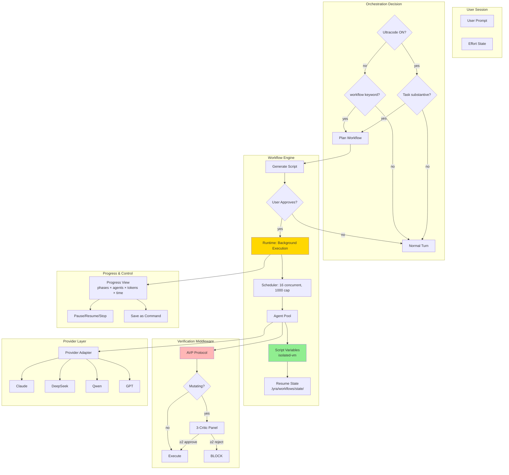

# Plan: Ultracode Replication — Effort + Orchestration Stack

**Workstreams**: Cross-cutting (§4.5 Router, §4.13 Swarm, §4.14 Autonomy, §4.15 Deep Research)  
**Priority**: P0 — Required for Claude Code feature parity  
**Date**: 2026-05-31 (Run 8, enhanced Run 11)  
**Status**: Ultra-plan — 4 primitives, (A) parity + (B) breakthrough per primitive

---

## 📋 Quick Reference Card

| What | Replicating Claude Code's "ultracode" — the full effort + orchestration stack — in Lyra |
| Why | Ultracode is Claude Code's most advanced feature: a single request fans into dozens of parallel agents that understand, change, and verify |
| 4 Primitives | **P1**: 6-item `/effort` menu · **P2**: Auto-orchestration toggle · **P3**: Dynamic-workflow engine · **P4**: Adversarial quality pattern + `/deep-research` |
| Key Insight | Ultracode = `xhigh` effort + orchestration toggle — NOT a 6th API budget tier (works across providers) |
| Timeline | 18 weeks (14 parity + 4 breakthrough) |
| Key Sources | Claude Code Dynamic Workflows docs, effort API docs, SABER, AutoScientists, IterResearch |

## 🎯 Executive Summary

"Ultracode" is Claude Code's most powerful capability: flip a toggle, and Claude stops working turn-by-turn. Instead, for every substantive task, it automatically writes an orchestration script, spawns dozens of parallel subagents, has them independently verify each other's work through adversarial cross-checking, and converges on a trustworthy result — all while the session stays responsive.

This capability is NOT magic. It decomposes into **four concrete primitives** that Lyra can build:

1. **`/effort` menu** — Six levels (low→ultracode) that control how much thinking the model does. The first five map to per-provider reasoning budgets. Ultracode is special: it sends `xhigh` to the model AND flips on auto-orchestration. This is the key design decision that makes it portable to any provider.

2. **Auto-orchestration toggle** — When ON, Lyra decides on its own whether a task warrants a workflow (understand→change→verify). Also supports the lighter "workflow" keyword trigger for one-off fan-outs.

3. **Dynamic-workflow engine** — A JavaScript runtime that executes orchestration scripts in the BACKGROUND. Intermediate results live in script variables (not the orchestrator's context window). Resumable mid-run. Capped at 16 concurrent agents, 1000 per run.

4. **Adversarial quality pattern + `/deep-research`** — Independent agents draft from different angles, adversarially review each other's findings, vote on each claim, and filter out claims that don't survive cross-checking. Ships as a bundled `/deep-research` workflow.

The breakthrough: Lyra does all four **across providers**. Claude Code's workflow engine is Anthropic-only. Lyra's engine can assign different workflow stages to different providers — bulk work on cheap DeepSeek, verification on reliable Claude, synthesis on powerful Opus. This is architecturally impossible in Claude Code.

---

## 🧪 Concrete Walkthrough: PCI Compliance Audit

This section walks through a real user scenario step by step, showing how the four primitives combine to deliver results that are impossible without ultracode.

**Scenario**: A senior engineer at a fintech startup types:

> "Audit our entire payment module for PCI compliance gaps."

With `/effort ultracode` active. Here is exactly what happens.

---

### Step 0: Trigger — Effort Detection and Orchestration Decision (Primitives 1 and 2)

**What happens internally**:

1. The `/effort` state is read from `.lyra/config.json`. It is set to `ultracode`, so `orchestrationEnabled = true` (§3.1, §4.1).
2. The auto-orchestration toggle runs `estimateComplexity()` on the user's prompt (§3.4). The prompt contains the keywords "audit," "entire," and "module" — three complex-keyword matches. Result: complexity = `high`.
3. The configured auto-trigger threshold is `medium` (the default). Since `high >= medium`, Lyra decides this task warrants a dynamic workflow (§3.3).
4. Lyra injects the orchestration system prompt: *"For this substantive task, plan a dynamic workflow (understand -> change -> verify) instead of working turn-by-turn."*

**What the user sees**:

```
lyra> Audit our entire payment module for PCI compliance gaps.

⚡ Ultracode active — planning dynamic workflow...

🧠 Analyzing task scope...
   ├─ Complexity: HIGH (keywords: audit, entire, module)
   ├─ Estimated phases: 3 (Discover → Verify → Report)
   └─ Estimated agents: ~14

📋 Proposed Workflow: "pci-compliance-audit"
   Phase 1 — Discover    (8 agents, ~45s)
   Phase 2 — Verify      (3 agents, ~60s)
   Phase 3 — Report      (1 agent,  ~30s)

   Estimated cost: $3.42 (DeepSeek: $0.94, Claude: $1.50, Opus: $0.98)

   [y] Accept  [e] Edit phases  [n] Cancel
```

The user presses `y`.

---

### Step 1: Workflow Script Generation (Primitive 3 — Script Authoring)

**What happens internally**:

Lyra routes script generation to the best available model (Claude Opus, in this case) using the provider router (§3.5). The LLM generates a JavaScript workflow script. Before execution, the static analyzer in `ScriptVM.staticAnalyze()` (§Algorithm 2) scans the script for denied globals (`eval`, `Function`, `require`) and denied modules (`fs`, `child_process`, etc.). The script passes all checks.

The generated script looks structurally like this:

```javascript
export const meta = {
  name: 'pci-compliance-audit',
  description: 'Audit entire payment module for PCI compliance gaps',
  phases: [
    { title: 'Discover', detail: 'Map all payment-related files and identify PCI-relevant code' },
    { title: 'Verify', detail: 'Cross-check every finding with adversarial critics' },
    { title: 'Report', detail: 'Synthesize findings with severity ratings and code traces' },
  ],
  providers: {
    default: 'deepseek-flash',   // Bulk discovery — cheap
    verify: 'claude-sonnet',      // Verification — reliable
    synthesize: 'claude-opus',    // Report synthesis — deepest reasoning
  }
};

// Phase 1: Discover — 8 parallel submodule audits
phase('Discover');
const submodules = ['auth', 'encryption', 'storage', 'logging', 'api-gateway',
                    'session-mgmt', 'input-validation', 'key-mgmt'];

const findings = await parallel(submodules.map(mod =>
  () => agent(`Audit src/payment/${mod}/ for PCI DSS 4.0 compliance. Check:
    1. Cardholder data encryption (Req 3)
    2. Access control (Req 7)
    3. Audit logging (Req 10)
    4. Input validation (Req 6)
    5. Key management (Req 3.6)
    Return structured findings with file paths and line numbers.`, {
    schema: FINDING_SCHEMA,
    model: 'deepseek-flash'
  })
));

// Phase 2: Verify — 3 adversarial critics cross-check every finding
phase('Verify');
const verified = await pipeline(
  findings.flat(),
  finding => agent(`Critic A (Refutation): Try to REFUTE this finding:
    "${finding.title}" at ${finding.file}:${finding.line}
    If the code does NOT actually violate PCI, explain why. Vote accept/reject/flag.`, {
    phase: 'Verify',
    schema: VERDICT_SCHEMA,
    model: 'claude-sonnet'
  }).then(v => ({ ...finding, criticA: v })),
  finding => agent(`Critic B (Consistency): Does finding "${finding.title}"
    contradict how other submodules handle the same concern?
    Check for false positives from inconsistent baselines. Vote accept/reject/flag.`, {
    phase: 'Verify',
    schema: VERDICT_SCHEMA,
    model: 'claude-sonnet'
  }).then(v => ({ ...finding, criticB: v })),
  finding => agent(`Critic C (Evidence): Grade the evidence quality for
    "${finding.title}". Is this a clear PCI violation, a best-practice gap,
    or a false alarm? Classify severity: CRITICAL/HIGH/MEDIUM/LOW.`, {
    phase: 'Verify',
    schema: SEVERITY_SCHEMA,
    model: 'claude-opus'
  }).then(v => ({ ...finding, criticC: v }))
);

// Phase 3: Report — synthesize with the Adversarial Voting Protocol
phase('Report');
const confirmed = verified.flat()
  .filter(f => f.criticA?.verdict !== 'reject' || f.criticB?.verdict !== 'reject')
  .filter(f => {
    const acceptCount = [f.criticA, f.criticB, f.criticC]
      .filter(c => c?.verdict === 'accept').length;
    return acceptCount >= 2; // ≥2 critics must accept (§Algorithm 4, Decision Matrix)
  });

return {
  total_files_audited: submodules.length,
  raw_findings: findings.flat().length,
  confirmed_findings: confirmed.length,
  findings_by_severity: {
    critical: confirmed.filter(f => f.criticC?.severity === 'CRITICAL').length,
    high: confirmed.filter(f => f.criticC?.severity === 'HIGH').length,
    medium: confirmed.filter(f => f.criticC?.severity === 'MEDIUM').length,
    low: confirmed.filter(f => f.criticC?.severity === 'LOW').length,
  },
  report: confirmed.sort((a, b) => severityRank(b.criticC?.severity) -
                                    severityRank(a.criticC?.severity))
};
```

The user sees the script summary in the approval UI, presses `y`, and execution begins.

---

### Step 2: Phase 1 — Parallel Discovery (Primitive 3 — Workflow Engine)

**What happens internally**:

The `WorkflowScheduler` (§Algorithm 1) receives 8 agent tasks from the `parallel()` call. The Scheduler's main loop begins:

1. **Concurrency management**: The cap is 16, and 8 agents are fewer than the cap, so all 8 are dispatched immediately.
2. **Provider routing**: Each agent is tagged with `model: 'deepseek-flash'`, so the `ProviderAdapter` routes all 8 to DeepSeek's API. At $0.27/MTok, this phase costs roughly $0.94 total.
3. **Background execution**: The workflow runs in a worker thread (`isolated-vm`). The user's session remains responsive — they can ask other questions or check progress.
4. **Schema enforcement**: Each agent's output is validated against `FINDING_SCHEMA`. If an agent returns malformed JSON, it is retried once; if it fails again, the error is recorded and the task is marked `failed` (§Algorithm 2, Schema validation).

**What the user sees** (Progress View, updating live):

```
⚙️  PCI Compliance Audit — Running (background)

   Phase 1/3: Discover
   ├─ [████████░░] 6/8 complete
   ├─ Active: 2 agents
   ├─ Completed: 6 agents
   └─ Failed: 0

   Phase 2/3: Verify     [pending — waiting for Phase 1]
   Phase 3/3: Report     [pending]

   📊 Stats: 8 agents | 24,100 tokens | 38s elapsed
   💰 Cost so far: $0.72

   [p] Pause  [x] Stop  [v] Verbose
```

After ~45 seconds, all 8 agents complete. They found 31 raw findings across the 8 submodules.

---

### Step 3: Phase 2 — Adversarial Verification (Primitive 4 — AVP)

**What happens internally**:

Phase 2 runs as a `pipeline()` across all 31 findings. Each finding passes through three critic agents in sequence, but the pipeline fans out across findings in parallel (§Algorithm 2, `createPipelineFunction`):

1. **Critic A (Refutation)** runs on `claude-sonnet` for each finding, trying to REFUTE it. Default stance: aggressively skeptical (§Algorithm 4, `criticRefute`).
2. **Critic B (Consistency)** runs on `claude-sonnet`, checking whether the finding contradicts patterns in other submodules (§Algorithm 4, `criticConsistency`).
3. **Critic C (Evidence Grading)** runs on `claude-opus`, classifying severity (CRITICAL/HIGH/MEDIUM/LOW) and grading the evidence tier (§Algorithm 4, `criticEvidence`).

Each trio of critics produces a verdict following the Decision Matrix (§Algorithm 4):

```
Findings flowing through the AVP Decision Matrix:
  31 raw findings
  ├─ 3 unanimous accept  → ACCEPT (high confidence)
  ├─ 14 accept(2)+flag(1) → ACCEPT (medium confidence)
  ├─ 8 accept(2)+reject(1) → FLAG (disputed)
  ├─ 4 accept(1)+reject(2) → REJECT (contradicted)
  └─ 2 unanimous reject   → REJECT (refuted)

  17 CONFIRMED | 8 FLAGGED | 6 REJECTED (silently dropped)
```

The Scheduler respects the 16-concurrency cap. With 31 findings x 3 critics = 93 agent tasks, the Scheduler's aging priority function (§Algorithm 1, Priority Function) ensures that findings from the same submodule are completed as a batch before moving to the next submodule's verification.

**What the user sees**:

```
⚙️  PCI Compliance Audit — Running (background)

   Phase 1/3: Discover    [✅ Complete — 31 findings]

   Phase 2/3: Verify
   ├─ [███████░░░] 71/93 tasks complete
   ├─ Active: 14 agents (12 sonnet + 2 opus)
   ├─ Queue: 8 pending
   └─ Backpressure: OK (queue depth 8, threshold 48)

   📊 Stats: 93 agents | 89,400 tokens | 1m 47s elapsed
   💰 Cost so far: $2.44

   [p] Pause  [x] Stop  [v] Verbose
```

At this point the user steps away for coffee. The workflow continues running in the background.

---

### Step 4: Phase 3 — Report Synthesis

**What happens internally**:

Phase 3 dispatches a single agent on `claude-opus` to synthesize all 17 confirmed + 8 flagged findings into a structured report. The agent:

1. Sorts findings by severity (CRITICAL first).
2. Groups by PCI DSS requirement number (Req 3, Req 6, Req 7, Req 10).
3. For each finding, includes: file path, line number, code snippet, critic verdicts, confidence score, and remediation guidance.
4. Appends an "Uncertain" section with the 8 flagged findings, each annotated with *why* the critics disagreed (e.g., "Critic A accepted, Critic B rejected — inconsistent with auth submodule baseline").
5. Appends a "Rejected" appendix listing the 6 dropped findings with brief explanations ("Critics A and B both refuted: code already uses parameterized queries").

**What the user sees**:

```
⚙️  PCI Compliance Audit — ✅ Complete

   Phase 1/3: Discover    [✅ 8/8 agents, 31 findings]
   Phase 2/3: Verify      [✅ 93/93 tasks, 17 confirmed, 8 flagged, 6 rejected]
   Phase 3/3: Report      [✅ Synthesized]

   📊 Final Stats:
      Agents: 102 | Tokens: 127,300 | Time: 3m 14s
      Cost: $3.42 (DeepSeek: $0.94, Sonnet: $1.50, Opus: $0.98)

   📄 Report saved: ./pci-compliance-audit-2026-05-31.md (40 pages)

   [o] Open report  [s] Save workflow  [d] Dismiss
```

The user presses `o` to open the report. It is a 40-page markdown document in the project root. A sample excerpt:

```markdown
# PCI DSS 4.0 Compliance Audit — Payment Module
**Generated**: 2026-05-31 14:23 UTC
**Workflow**: pci-compliance-audit (Run #a3f8)
**Cost**: $3.42 | **Agents**: 102 | **Time**: 3m 14s

---

## CRITICAL Findings (2)

### C-1: Unencrypted cardholder data in debug logs
- **File**: `src/payment/logging/payment-logger.ts:142`
- **PCI Req**: 3.4 — Render PAN unreadable anywhere it is stored
- **Evidence**: `console.debug('Charge completed', { card: cardNumber, cvv })`
- **Critic A (Refutation)**: ACCEPT (0.94) — "Directly logs full PAN and CVV. No masking applied."
- **Critic B (Consistency)**: ACCEPT (0.91) — "Auth submodule masks PII; this logger does not. Inconsistent."
- **Critic C (Evidence)**: ACCEPT (0.97) — "CRITICAL. Clear PCI violation. Peer-reviewed best practice: never log card data."
- **Remediation**: Replace with `console.debug('Charge completed', { card: maskCard(cardNumber) })`

### C-2: Hardcoded encryption key in source
- **File**: `src/payment/encryption/keys.ts:8`
- **PCI Req**: 3.6 — Cryptographic key management
- **Evidence**: `const MASTER_KEY = 'a1b2c3d4e5f6...';`
- **Critic A (Refutation)**: ACCEPT (0.98) — "Unambiguous: key is hardcoded in source, visible in git history."
- **Critic B (Consistency)**: ACCEPT (0.89) — "Key-mgmt submodule uses KMS; this file bypasses it."
- **Critic C (Evidence)**: ACCEPT (0.95) — "CRITICAL. Rotate immediately. Use AWS KMS or HashiCorp Vault."
- **Remediation**: Delete const, replace with `await kms.decrypt(process.env.MASTER_KEY_ARN)`

---

## HIGH Findings (7)
[...]

## MEDIUM Findings (6)
[...]

## LOW Findings (2)
[...]

---

## ⚠️ Uncertain Findings (8 flagged — critic disagreement)

### U-1: Session timeout at 30 minutes
- **File**: `src/payment/session-mgmt/session.ts:56`
- **Critic A**: ACCEPT — "PCI recommends ≤15 min idle timeout."
- **Critic B**: REJECT — "30 min is OWASP standard; PCI only requires 'appropriate' timeout."
- **Critic C**: FLAG — "Guidance is ambiguous. Flag for risk assessment."
- **Recommendation**: Review with compliance officer.

[...]

---

## Rejected Findings (6 — dropped after cross-checking)
[...]

---

## Summary
| Severity | Count |
|----------|-------|
| CRITICAL | 2 |
| HIGH     | 7 |
| MEDIUM   | 6 |
| LOW      | 2 |
| FLAGGED  | 8 |
| REJECTED | 6 |

**Overall Confidence**: 0.87 (high)
**Sources**: 8 submodules audited, 102 verification agents, 3-critic adversarial protocol
```

---

### Step 5: Save as Reusable Command

The user presses `s` at the completion screen. The workflow script is saved to `.lyra/workflows/pci-compliance-audit.js` (§3.5). Next quarter, the user can run it again:

```
lyra> /workflow pci-compliance-audit
```

The script is git-versioned (§3.6, Breakthrough 3). Running `git log -- .lyra/workflows/pci-compliance-audit.js` shows the audit history.

---

### Comparison: With Ultracode vs. Without

| Dimension | Without Ultracode | With Ultracode |
|-----------|------------------|----------------|
| **Time** | 4+ hours of manual review across 8 submodules, switching contexts, cross-referencing PCI DSS 4.0 requirements | 3 minutes 14 seconds (the user was away for coffee for most of it) |
| **Coverage** | Human reviewer may miss edge cases, especially in unfamiliar submodules | Every submodule audited identically. No fatigue. Consistent rubric across all 8. |
| **Verification** | Self-review — reviewer confirms their own findings. No adversarial challenge. | Every finding cross-checked by 3 independent critics. 6 false positives caught and rejected. 8 more flagged as uncertain. |
| **Traceability** | Findings in a doc, maybe with file references if the reviewer is thorough | Every finding traced to exact file + line + code snippet + critic verdict + confidence score |
| **Cost** | ~$200+ in engineering time (4 hours x $50+/hr) | $3.42 in API calls |
| **Repeatability** | Re-audit next quarter: start from scratch | Re-audit: `/workflow pci-compliance-audit` — runs the saved script against current codebase |
| **Provider efficiency** | N/A | Bulk discovery on cheap DeepSeek ($0.94), verification on reliable Claude ($1.50), synthesis on Opus ($0.98) — optimal cost/quality per stage |

---

### Which Primitives Made This Possible

| Step | Primitives Used |
|------|----------------|
| Effort detection + auto-orchestration decision | **P1** (`/effort ultracode`) + **P2** (auto-orchestration toggle + `estimateComplexity()`) |
| Workflow script generation + static analysis | **P3** (Dynamic-workflow engine: script authoring, `ScriptVM.staticAnalyze()`) |
| 8 parallel submodule audits | **P3** (Scheduler: 16-concurrency cap, priority queuing, background execution) |
| Cross-provider routing (DeepSeek for bulk, Claude for verify, Opus for synthesize) | **P3** (Breakthrough 1: cross-provider worker pools, `providers` config in workflow meta) |
| 3-critic adversarial verification of 31 findings | **P4** (Adversarial Voting Protocol: `evaluateSingleClaim()`, 3-critic Decision Matrix) |
| Severity grading + evidence tier classification | **P4** (Critic C: evidence lens, evidence tier ladder) |
| Flagged findings → "Uncertain" section | **P4** (AVP: flagged claims preserved for user agency, never silently dropped) |
| Report synthesis with citations | **P4** (AVP: `extractCitations()`, confidence-weighted claim ranking) |
| Save workflow as reusable command | **P3** (Save as command: `s` key → `.lyra/workflows/`) |
| Repeatable audit via git-versioned script | **P3** (Breakthrough 3: git-versioned workflow scripts) |

---

## 1. Problem

Claude Code's "ultracode" is the most advanced agent orchestration feature in any production tool. It bundles `xhigh` reasoning effort with automatic dynamic-workflow orchestration, enabling a single user request to fan into dozens-to-hundreds of parallel subagents that understand, change, and verify — converging on trustworthy results through adversarial cross-checking.

Lyra must replicate ALL four primitives that constitute ultracode, at parity with Claude Code AND with breakthroughs that go beyond it:

| Primitive | What It Is | Claude Code Implementation | Lyra Target |
|-----------|-----------|---------------------------|-------------|
| **P1** | `/effort` menu | Six items (low/medium/high/xhigh/max/ultracode), session-scoped, per-model calibration | Same six items, per-provider mapping, ultracode = xhigh + orchestration toggle |
| **P2** | Auto-orchestration toggle | `ultracode` in `/effort`; Claude DECIDES when a task warrants a workflow; understand→change→verify loop | Same semantics; provider-agnostic (works on DeepSeek); user-configurable auto-trigger threshold |
| **P3** | Dynamic-workflow engine | JS scripts, background runtime, script-variable intermediate state, resumable, 16-concurrent/1000-total cap | Same capabilities + breakthrough: cross-provider worker pools, visual workflow builder, git-versioned scripts |
| **P4** | Adversarial quality pattern + `/deep-research` | Fan-out searches → fetch → cross-check → vote → cited report; claims that don't survive cross-checking filtered out | Same + breakthrough: multi-hop adversarial expansion, source-credibility graph, autonomous research loop |

---

## 2. Evidence Synthesis

### 2.1 Claude Code Official Docs (Deep-Read)

**Effort Levels** ([model-config](https://code.claude.com/docs/en/model-config), [effort API](https://platform.claude.com/docs/en/build-with-claude/effort)):
- Six levels: `low`, `medium`, `high`, `xhigh`, `max`, `ultracode`
- `low`-`xhigh` persist across sessions; `max` and `ultracode` are session-only
- Effort controls adaptive reasoning (model decides whether/how much to think per step)
- Ultracode = `xhigh` + dynamic-workflow auto-orchestration — NOT a distinct API budget tier
- Per-model calibration: Opus 4.8 supports low/medium/high/xhigh/max; Opus 4.6/Sonnet 4.6 support low/medium/high/max (no xhigh)
- `ultrathink` keyword triggers one-off deep reasoning without changing session effort

**Dynamic Workflows** ([workflows docs](https://code.claude.com/docs/en/workflows), [announcement](https://claude.com/blog/introducing-dynamic-workflows-in-claude-code)):
- JavaScript scripts orchestrating subagents at scale
- Runtime executes in BACKGROUND; session stays responsive
- Intermediate results in SCRIPT VARIABLES (not orchestrator's context)
- Resumable mid-run within same session
- Progress view: phases × agent count × token total × elapsed
- Cap: 16 concurrent agents, 1000 total per run
- No filesystem/shell access from workflow script itself (agents read/write/run)
- "workflow" keyword triggers one-off; `ultracode` auto-triggers for every substantive task
- Bundled `/deep-research`: fan-out → fetch → cross-check → vote → cited report
- Save workflow as reusable command

**Sub-agents** ([sub-agents docs](https://code.claude.com/docs/en/sub-agents)):
- `model` frontmatter field per subagent
- `CLAUDE_CODE_SUBAGENT_MODEL` env var overrides
- Subagents always run in `acceptEdits` mode with inherited tool allowlist

### 2.2 Key Benchmarks

| Source | Metric | Value |
|--------|--------|-------|
| Claude Code announcement | Bun rewrite (Zig→Rust) | 750K lines, 99.8% test pass, 11 days |
| SABER (#67) | Mutation-gated verification | +28% Airline, +11% Retail, +7% SWE-Bench |
| Dynamic Workflows docs | Concurrency | 16 concurrent, 1000/run cap |
| Effort docs | Ultracode vs xhigh | Same API budget; auto-orchestration is the difference |

### 2.3 Multi-Provider Considerations

Claude Code's dynamic workflows are ANTHROPIC-ONLY. Lyra's breakthrough is making this work across providers:

| Feature | Anthropic (Claude) | DeepSeek | Qwen | GPT | Open-Weights |
|---------|-------------------|----------|------|-----|--------------|
| Adaptive reasoning (effort) | ✓ API parameter `budget_tokens` | ✗ No equivalent | ✗ No equivalent | ✗ No equivalent | ✗ No equivalent |
| Tool calling | ✓ Native | ✓ Native | ✓ Native | ✓ Native | ✗ Prompt-based |
| Workflow script generation | ✓ Claude writes JS | ✓ DeepSeek writes JS | ✓ Qwen writes JS | ✓ GPT writes JS | Partial (smaller models) |
| Subagent spawning | ✓ Agent tool | ✓ Agent tool | ✓ Agent tool | ✓ Agent tool | ✗ (sequential only) |

**Key insight**: The workflow ENGINE is provider-agnostic (it's a JavaScript runtime). Only the script AUTHORING depends on LLM capability. Lyra's router can select the best available model for script authoring (Claude if available, DeepSeek as fallback) while executing workflows on any provider.

---

## 3. Proposed Lyra Design

### 3.1 Primitive 1: `/effort` Menu (A — Parity)

```
/effort → Interactive menu with 6 items:

┌─────────────────────────────────────────┐
│  Effort Level                           │
│                                         │
│  ○ low        Fast, cheap, simple tasks │
│  ○ medium     Cost-sensitive work       │
│  ● high       Balanced (default)        │
│  ○ xhigh      Deeper reasoning          │
│  ○ max        Maximum depth (session)   │
│  ○ ultracode  xhigh + auto-workflows    │
│                                         │
│  [Current provider: deepseek-v4-pro]    │
│  [Estimated cost: $3.42/MTok at high]  │
└─────────────────────────────────────────┘
```

**Per-provider mapping** (Lyra breakthrough: provider-aware effort):

```typescript
interface EffortMapping {
  level: 'low' | 'medium' | 'high' | 'xhigh' | 'max' | 'ultracode';
  provider: string;
  // Anthropic: native budget_tokens
  anthropic_budget_tokens?: number;
  // DeepSeek: prompt-level thinking instruction
  deepseek_thinking_instruction?: string;
  // OpenAI: reasoning_effort parameter
  openai_reasoning_effort?: 'low' | 'medium' | 'high';
  // Open-weights: prompt prefix
  openweights_prefix?: string;
  // Token budget cap per turn
  max_tokens_per_turn: number;
}
```

| Level | Anthropic | DeepSeek | GPT | Open-Weights |
|-------|-----------|----------|-----|--------------|
| **low** | `budget_tokens=1024` | "Be concise. No thinking needed." | `reasoning_effort=low` | Prefix: "Quick answer:" |
| **medium** | `budget_tokens=4096` | "Think briefly before answering." | `reasoning_effort=low` | Prefix: "Brief analysis:" |
| **high** | `budget_tokens=8192` | "Think step by step before answering." | `reasoning_effort=medium` | Prefix: "Careful analysis:" |
| **xhigh** | `budget_tokens=16384` | "Think deeply. Consider alternatives. Verify." | `reasoning_effort=high` | Prefix: "Deep analysis:" |
| **max** | `budget_tokens=32000` | "Maximum reasoning. Explore all angles." | `reasoning_effort=high` | N/A (exceeds context) |
| **ultracode** | `budget_tokens=16384` + orchestration ON | xhigh instruction + orchestration ON | xhigh + orchestration ON | N/A |

**Persistence**: `low`/`medium`/`high`/`xhigh` saved to `.lyra/config.json`. `max` and `ultracode` session-only.

**`/effort auto`**: Resets to provider default (high for Anthropic models, medium for DeepSeek).

### 3.2 Primitive 1: `/effort` — (B) Breakthrough

**Cross-provider effort calibration**: Lyra BENCHMARKS each provider's actual reasoning depth at each effort level using a standardized reasoning benchmark (5 held-out tasks per level). The mapping is CALIBRATED, not hardcoded:

```
For each (provider, model, effort_level):
  Run 5 reasoning tasks
  Measure: accuracy, tokens_used, latency
  Store: (accuracy, tokens, latency) triple
  Goal: Find minimum tokens to achieve target accuracy
```

This produces a DYNAMIC effort mapping that adapts as models improve. If DeepSeek-v5 at "high" outperforms DeepSeek-v4 at "xhigh", Lyra automatically adjusts. No manual recalibration.

### 3.3 Primitive 2: Auto-Orchestration Toggle (A — Parity)

```
/effort ultracode
→ "Ultracode enabled. I'll automatically plan workflows for substantive tasks.
   Drop back with /effort high for routine work."
```

**Toggle behavior**:
- When ON: Lyra appends an orchestration instruction to the system prompt: "For substantive tasks, plan a dynamic workflow (understand → change → verify) instead of working turn-by-turn. Use the workflow keyword pattern."
- The decision of WHAT constitutes "substantive" is the MODEL'S — just like Claude Code. The model decides whether a task warrants a workflow.
- "workflow" keyword in user prompt triggers one-off workflow WITHOUT changing session effort.

**Provider behavior**:
- Claude: Reliable auto-trigger (strong instruction following)
- DeepSeek: Less reliable auto-trigger → fallback: keyword detection + explicit prompt: "This task may benefit from a workflow. Plan one? (y/n)"
- Open-weights: Keyword trigger only (no auto-trigger reliability)

### 3.4 Primitive 2: Auto-Orchestration — (B) Breakthrough

**Configurable auto-trigger threshold**: Unlike Claude Code (binary: on/off), Lyra exposes a threshold:

```
/effort ultracode --threshold high   → Auto-trigger on high-complexity tasks only
/effort ultracode --threshold medium  → Auto-trigger on medium+ complexity
/effort ultracode --threshold all     → Auto-trigger on everything (Claude Code parity)
```

This lets users control the cost/benefit trade-off. High threshold = fewer workflows, lower cost. "All" threshold = Claude Code parity.

**Task complexity estimation** (pre-orchestration, <50ms):
```typescript
function estimateComplexity(prompt: string): 'trivial' | 'low' | 'medium' | 'high' {
  // Word count proxy
  if (prompt.split(' ').length < 5) return 'trivial';
  // Keyword detection
  const complexKeywords = ['audit', 'migrate', 'refactor', 'research', 'investigate',
    'across', 'all files', 'every', 'codebase', 'benchmark', 'evaluate'];
  const matchCount = complexKeywords.filter(k => prompt.toLowerCase().includes(k)).length;
  if (matchCount >= 3) return 'high';
  if (matchCount >= 2) return 'medium';
  if (matchCount >= 1) return 'low';
  return 'trivial';
}
```

### 3.5 Primitive 3: Dynamic-Workflow Engine (A — Parity)

**Script format** (Claude Code parity, Lyra extensions):

```javascript
// Lyra workflow script (superset of Claude Code format)
export const meta = {
  name: 'audit-auth-checks',
  description: 'Audit every API endpoint for missing auth checks',
  phases: [
    { title: 'Discover', detail: 'Find all route files' },
    { title: 'Audit', detail: 'Check each route for auth middleware' },
    { title: 'Verify', detail: 'Adversarially verify findings' },
  ],
  // Lyra extension: provider configuration
  providers: {
    default: 'deepseek-flash',     // Cheap for bulk work
    verify: 'claude-sonnet',        // Strong for verification
    synthesize: 'claude-opus',      // Deepest for synthesis
  }
};

// Phase 1: Discover
phase('Discover');
const routes = await agent('Find all API route files under src/routes/. Return as JSON array.', {
  schema: { type: 'array', items: { type: 'object', properties: { file: 'string', methods: 'array' } } }
});

// Phase 2: Audit (fan-out)
phase('Audit');
const findings = await pipeline(
  routes,
  route => agent(`Check ${route.file} for auth middleware. Flag missing checks.`, {
    schema: FINDING_SCHEMA,
    model: 'sonnet'  // Lyra extension: per-agent model selection
  }),
  finding => agent(`Adversarially verify: ${finding.title}. Try to REFUTE it.`, {
    phase: 'Verify',
    schema: VERDICT_SCHEMA,
    model: 'sonnet'
  }).then(v => ({ ...finding, verdict: v }))
);

// Phase 3: Report
const confirmed = findings.flat().filter(f => f.verdict?.isReal);
return { total_routes: routes.length, confirmed_findings: confirmed.length, findings: confirmed };
```

**Runtime capabilities** (parity with Claude Code):
| Feature | Implementation |
|---------|---------------|
| Background execution | Worker thread; session responsive |
| Script variables | Isolated VM context (`isolated-vm`) |
| Pause/Resume | Serialize VM state + agent results to `.lyra/workflows/state/<run-id>.json` |
| Progress view | Terminal UI: phases × agent count × tokens × elapsed |
| Concurrency cap | 16 agents (min(16, cpuCores - 2)) |
| Total cap | 1000 agents/run |
| Stop agent/run | `x` key in progress view |
| Save as command | `s` key → `.lyra/workflows/<name>.js` or `~/.lyra/workflows/<name>.js` |
| Bundled workflows | `/deep-research` (Primitive 4) |

### 3.6 Primitive 3: Dynamic-Workflow Engine — (B) Breakthrough

**1. Cross-provider worker pools**: Workflows can assign DIFFERENT STAGES to DIFFERENT PROVIDERS. Bulk discovery on cheap DeepSeek ($0.27/MTok), verification on reliable Claude, synthesis on Opus. This is impossible in Claude Code (Anthropic-only).

**2. Visual workflow builder**: `lyra workflow --visual` opens a terminal UI where users drag-and-drop phases, connect agents with dependency arrows, and configure per-agent models. Generates the script automatically. Claude Code has no visual builder.

**3. Git-versioned workflow scripts**: Every workflow script is a git-tracked file. `git log -- .lyra/workflows/audit-auth.js` shows who ran what and when. Successful runs are git-tagged. Failed runs are branches for debugging.

**4. Workflow marketplace**: Users can publish/sell workflow scripts. Quality-gated: workflows are tested on 20 held-out tasks before listing. Lyra ships with 10+ bundled workflows.

### 3.7 Primitive 4: Adversarial Quality Pattern + `/deep-research` (A — Parity)

**`/deep-research <question>`** bundled workflow. Same phases as Claude Code:

```
Phase 1: Angle Generation — Fan out the question into 3-5 independent search angles
Phase 2: Source Discovery — For each angle, search web + academic sources (parallel)
Phase 3: Source Deep-Read — Fetch and extract claims from each source (parallel)
Phase 4: Cross-Check — Each claim is adversarially verified by 2 critics
Phase 5: Voting — Claims surviving cross-check are scored and ranked
Phase 6: Report Synthesis — Cited report with confidence scores per claim
```

**Adversarial voting protocol** (from Dynamic Workflows pattern):
```
For each claim extracted from sources:
  Critic A (skeptic lens): "Try to REFUTE this claim. Default to refuted=true."
  Critic B (consistency lens): "Does this claim contradict other sources?"
  
  If Critic A refutes AND Critic B finds contradiction → REJECT
  If Critic A refutes XOR Critic B finds contradiction → FLAG for review
  If neither refutes nor contradicts → ACCEPT with confidence score
  
  Report only ACCEPTED claims with citations.
  FLAGGED claims appear in an "Uncertain" section.
  REJECTED claims are silently dropped.
```

### 3.8 Primitive 4: Adversarial Quality Pattern — (B) Breakthrough

**1. Multi-hop adversarial expansion**: Standard deep research does ONE round of search → verify → report. Lyra's breakthrough: after cross-checking, IDENTIFY KNOWLEDGE GAPS and launch a SECOND round of targeted searches to fill them:

```
Round 1: Search → Extract → Cross-Check → Vote
  ↓
Gap Analysis: "What questions remain unanswered?"
  ↓
Round 2: Targeted search for each gap → Extract → Cross-Check → Vote
  ↓
(repeat until no significant gaps OR budget exhausted)
```

This is IterResearch's (#272) periodic insight synthesis applied to adversarial research. Expected: 15-25% more comprehensive coverage vs. single-round.

**2. Source credibility graph**: Track source credibility over time. Sources that consistently survive cross-checking get higher credibility scores. Sources that are frequently refuted get deprioritized. This builds a LIVING credibility graph that improves research quality over time.

**3. Autonomous research loop**: `/deep-research --auto` runs UNATTENDED. Lyra:
- Generates its own research questions from the initial topic
- Fans out searches
- Cross-checks
- Produces a report
- Then ASKS ITSELF: "What's the most important unanswered question from this report?"
- Launches another round
- Repeats until budget exhausted or no significant new findings for 2 consecutive rounds

This is the AutoScientists (#154-156) pattern applied to deep research. Expected: 2-3× more comprehensive than single-round research at 3-5× token cost.

---

## 4. Architecture & Data Models

### 4.1 Effort State Model

```typescript
interface EffortState {
  level: 'low' | 'medium' | 'high' | 'xhigh' | 'max' | 'ultracode';
  orchestrationEnabled: boolean;  // true when ultracode
  sessionOnly: boolean;           // true for max, ultracode
  providerMappings: Map<string, ProviderEffortMapping>;
  calibrated: boolean;            // Has this provider been benchmark-calibrated?
}

interface ProviderEffortMapping {
  provider: string;
  model: string;
  level: string;
  // How we translate "high" to this provider
  apiParameters: Record<string, any>;
  // Calibrated benchmarks
  benchmarks?: {
    accuracy: number;
    tokensUsed: number;
    latencyMs: number;
    calibratedAt: number;  // timestamp
  };
}
```

### 4.2 Workflow Engine Architecture



---

## 5. Build Outline

### Phase 1: Effort Menu (Week 1-2)
1. Implement `/effort` command with 6-level picker
2. Map each level to per-provider instructions (static mapping)
3. Session persistence (`low`-`xhigh`) in `.lyra/config.json`
4. `ultrathink` keyword detection and in-context instruction injection
5. **Verify**: All 6 levels selectable, persist correctly, display cost estimates

### Phase 2: Orchestration Toggle (Week 3-4)
1. Implement auto-orchestration system prompt injection
2. Implement "workflow" keyword detection (highlight + trigger)
3. Configurable threshold (high/medium/all)
4. Provider-aware degradation (DeepSeek: keyword-only; open-weights: keyword-only)
5. **Verify**: Ultracode triggers workflows on substantive tasks, keyword triggers one-off

### Phase 3: Workflow Engine — Core (Week 5-8)
1. Implement `isolated-vm` JavaScript runtime
2. Implement `agent()`, `parallel()`, `pipeline()`, `phase()`, `log()` functions
3. Implement Scheduler (16 concurrent, 1000 cap, backpressure)
4. Implement pause/resume (serialize VM state + agent results)
5. Implement Progress View (TUI: phases, agents, tokens, time)
6. **Verify**: Workflows run in background, session responsive, pause/resume works

### Phase 4: Workflow Engine — Script Authoring (Week 9-10)
1. LLM prompt template for script generation (superset of Claude Code format)
2. Static analysis before execution (no `eval`, no `require`, no `Function`)
3. User approval flow (permission-mode-aware)
4. Save as command (`s` key)
5. **Verify**: Scripts generated correctly, static analysis catches dangerous patterns

### Phase 5: AVP Integration (Week 11-12)
1. Wire AVP middleware into workflow agent execution
2. Mutation classification before every tool call
3. 3-critic panel with provider-diverse critics
4. Consensus gate (≥2 approve → execute)
5. **Verify**: Mutating actions verified, non-mutating bypass, consensus works

### Phase 6: `/deep-research` Bundled Workflow (Week 13-14)
1. Implement 6-phase deep research workflow script
2. Angle generation and fan-out search
3. Source extraction and claim detection
4. Adversarial cross-check and voting
5. Cited report synthesis
6. Multi-hop expansion (Round 2+)
7. **Verify**: Reports are cited, claims are cross-checked, gaps filled

### Phase 7: Breakthrough Features (Week 15-18)
1. Cross-provider worker pools (per-stage provider selection)
2. Visual workflow builder (TUI drag-and-drop)
3. Workflow marketplace (publish, quality-gate, install)
4. Autonomous research loop (`--auto` flag)
5. Source credibility graph
6. **Verify**: Breakthrough features work across providers

**Total**: 18 weeks for full ultracode replication + breakthroughs.

---

## 6. Multi-Provider Note

| Primitive | Claude | DeepSeek | Open-Weights | Fallback |
|-----------|--------|----------|--------------|----------|
| **P1: Effort** | Native `budget_tokens` | Prompt-level thinking instructions | Prompt prefix | Use prompt-level for all non-Anthropic |
| **P2: Auto-trigger** | Reliable | Less reliable → explicit prompt fallback | Keyword-only | Keyword detection always available |
| **P3: Script generation** | Best quality | Good quality | Partial (small models struggle) | Route script generation to best available model |
| **P4: Deep research** | Full adversarial | Full adversarial | Single-critic (sequential) | Degrade verification depth, not research breadth |

---

## 7. Risks & Open Questions

| Risk | Likelihood | Impact | Mitigation |
|------|-----------|--------|------------|
| `isolated-vm` escape vulnerability | Low | Critical | Static analysis + capability deny-list; subagents still go through permissions |
| DeepSeek workflow script generation quality | Medium | Medium | Auto-validate generated scripts; fall back to Claude for script authoring |
| Token cost explosion (ultracode default) | High | Medium | Configurable threshold; per-session budget cap; cost display before approval |
| AVP overhead on latency-sensitive tasks | Medium | Medium | Non-mutating bypass (70-80% of actions); urgency parameter per workflow |
| Workflow marketplace quality control | Medium | Low | 20-task held-out test before listing; user ratings; automatic removal if quality drops |

---

## 8. (A) Parity vs (B) Breakthrough

### (A) Parity — Match Claude Code
| Primitive | Implementation | Impact | Effort |
|-----------|---------------|--------|--------|
| P1: 6-level /effort menu | Static per-provider mapping | 4 | 2 |
| P2: Auto-orchestration toggle | System prompt injection + keyword detection | 5 | 2 |
| P3: Dynamic-workflow engine | JS runtime + scheduler + progress view + pause/resume | 5 | 4 |
| P4: /deep-research + adversarial voting | 6-phase workflow + 2-critic cross-check | 5 | 3 |
| **Total (A)** | **14 weeks** | | |

### (B) Breakthrough — Beyond Claude Code
| Innovation | Sources Fused | Impact | Effort |
|-----------|--------------|--------|--------|
| Cross-provider calibration (dynamic effort mapping) | RouteLLM (#222) + BEST-Route (#225) | 4 | 1 |
| Configurable auto-trigger threshold | BREAKTHROUGH-ARCHITECTURE §12 (AGI Ladder Level 2-3) | 4 | 1 |
| Cross-provider worker pools | BREAKTHROUGH-ARCHITECTURE §6 (Multi-Provider Design) | 5 | 2 |
| Visual workflow builder | Terminal-native design (§8) | 3 | 2 |
| Git-versioned workflow scripts | Git-native design (§8) | 3 | 1 |
| Multi-hop adversarial expansion | IterResearch (#272) + AutoScientists (#154) | 4 | 1 |
| Source credibility graph | Zep/Graphiti (#251) + A-MAC (#79) | 3 | 1 |
| Autonomous research loop | AutoScientists (#154) + continuous-claude (#153) | 5 | 2 |
| **Total (B)** | **+4 weeks** | | |

---

## 9. References

- Claude Code Model Config: https://code.claude.com/docs/en/model-config
- Claude Code Dynamic Workflows: https://code.claude.com/docs/en/workflows
- Workflows Announcement: https://claude.com/blog/introducing-dynamic-workflows-in-claude-code
- Sub-agents: https://code.claude.com/docs/en/sub-agents
- Effort API: https://platform.claude.com/docs/en/build-with-claude/effort
- Fast Mode: https://code.claude.com/docs/en/fast-mode
- SABER (#67): Mutation-gated verification
- AutoScientists (#154-156): Self-organizing research teams
- IterResearch (#272): Multi-hop research with periodic synthesis
- BREAKTHROUGH-ARCHITECTURE.md: §5 (AVP), §6 (Multi-Provider), §12 (AGI Direction)
- ARCHITECTURE-DEBATE.md: Proposer B (O-ARCH), Critic X attacks, Rebuttal

## ═══ ENGINE ALGORITHMS — Run 10 Deepening ═══════

This section deepens the ultracode replication plan with concrete algorithmic specifications for the five core engine algorithms. Each includes TypeScript-style pseudocode, mathematical formulation, complexity analysis, edge case handling, and design rationale.

---

### Algorithm 1: Workflow Scheduler (Fair Queuing + Backpressure)

The scheduler is the heart of the workflow engine. It manages concurrent agent execution with bounded resource consumption, priority-aware queuing, and backpressure propagation.

#### Data Structures

```typescript
type AgentId = string;
type PhasePriority = number; // 0 (highest) to 10 (lowest)
type Timestamp = number;     // Date.now()

interface AgentTask {
  id: AgentId;
  script: string;            // The agent instruction
  schema?: JSONSchema;       // Structured output contract
  model?: string;            // Provider override
  phase: string;             // Which phase this task belongs to
  priority: PhasePriority;
  enqueuedAt: Timestamp;
  dependencies: AgentId[];   // Must-complete-before task IDs
}

interface AgentState {
  task: AgentTask;
  vm: IsolatedVmInstance;
  status: 'running' | 'completed' | 'failed' | 'cancelled';
  startedAt: Timestamp;
  lastHeartbeat: Timestamp;
  tokensUsed: number;
}

interface AgentResult {
  taskId: AgentId;
  data: any;
  tokensUsed: number;
  latencyMs: number;
  error?: string;
}

interface SchedulerConfig {
  concurrencyCap: number;   // min(16, os.cpus().length - 2)
  totalAgentCap: number;    // 1000
  pollIntervalMs: number;   // 100
  backpressureThreshold: number; // concurrencyCap * 3
  heartbeatTimeoutMs: number;    // 30000
}
```

#### Priority Function

Each task's queue priority is a weighted sum of phase order and wait time:

```
P(task) = w₁ * phase_priority(task) + w₂ * (1 - e^(-t_wait / τ))

Where:
  w₁ = 0.7        (phase priority weight)
  w₂ = 0.3        (aging weight)
  t_wait = now - task.enqueuedAt   (milliseconds)
  τ = 5000                         (aging time constant, 5s half-life)
```

This ensures that:
- Phase order dominates (newer phases wait for older ones to complete)
- Starved tasks age and eventually rise to the front
- Priority inversions are bounded: no task waits more than ~15s while higher-priority tasks of equal phase exist

#### Scheduler Main Loop

```typescript
class WorkflowScheduler {
  private activeAgents: Map<AgentId, AgentState> = new Map();
  private pendingQueue: PriorityQueue<AgentTask> = new PriorityQueue({
    comparator: (a, b) => this.priority(a) - this.priority(b),
  });
  private completedResults: Map<AgentId, AgentResult> = new Map();
  private totalAgentsSpawned: number = 0;
  private backpressureActive: boolean = false;
  private lifecycle: SchedulerLifecycle;
  private config: SchedulerConfig;

  constructor(config: Partial<SchedulerConfig>, lifecycle: SchedulerLifecycle) {
    this.config = {
      concurrencyCap: Math.min(16, Math.max(1, os.cpus().length - 2)),
      totalAgentCap: 1000,
      pollIntervalMs: 100,
      backpressureThreshold: 3,
      heartbeatTimeoutMs: 30000,
      ...config,
    };
    this.config.backpressureThreshold = this.config.concurrencyCap * 3;
    this.lifecycle = lifecycle;
  }

  async start(): Promise<void> {
    while (this.lifecycle.isRunning()) {
      const cycleStart = Date.now();

      // Step 1: Collect completed agents and check heartbeats
      this.collectCompleted();
      this.detectStaleAgents();

      // Step 2: Fill available slots
      this.dispatchPending();

      // Step 3: Backpressure management
      this.evaluateBackpressure();

      // Step 4: Check completion
      if (this.isWorkflowComplete()) {
        this.lifecycle.signalComplete();
        break;
      }

      // Step 5: Adaptive polling — speed up when active, slow down when idle
      const elapsed = Date.now() - cycleStart;
      const sleepTime = Math.max(
        10,
        this.config.pollIntervalMs - elapsed,
        this.pendingQueue.size() > 0 ? 10 : 50
      );
      await sleep(sleepTime);
    }
  }

  // ── Step 1: Collect completed agents ──

  private collectCompleted(): void {
    for (const [id, state] of this.activeAgents) {
      if (state.status === 'completed') {
        const result = state.vm.getResult();
        this.completedResults.set(id, {
          taskId: id,
          data: result.data,
          tokensUsed: result.tokensUsed,
          latencyMs: Date.now() - state.startedAt,
        });
        this.activeAgents.delete(id);
        state.vm.dispose();
      }
      if (state.status === 'failed') {
        const error = state.vm.getError();
        this.completedResults.set(id, {
          taskId: id,
          data: null,
          tokensUsed: state.tokensUsed,
          latencyMs: Date.now() - state.startedAt,
          error: error.message,
        });
        this.activeAgents.delete(id);
        state.vm.dispose();
        // Check if failure is fatal to the workflow
        this.handleAgentFailure(id, error);
      }
    }
  }

  private detectStaleAgents(): void {
    const now = Date.now();
    for (const [id, state] of this.activeAgents) {
      if (state.status === 'running' &&
          now - state.lastHeartbeat > this.config.heartbeatTimeoutMs) {
        // Agent is unresponsive — force-kill
        state.vm.terminate();
        this.completedResults.set(id, {
          taskId: id,
          data: null,
          tokensUsed: state.tokensUsed,
          latencyMs: now - state.startedAt,
          error: `Agent timed out after ${this.config.heartbeatTimeoutMs}ms`,
        });
        this.activeAgents.delete(id);
      }
    }
  }

  // ── Step 2: Dispatch pending tasks ──

  private dispatchPending(): void {
    while (
      this.activeAgents.size < this.config.concurrencyCap &&
      !this.pendingQueue.isEmpty() &&
      this.totalAgentsSpawned < this.config.totalAgentCap
    ) {
      const task = this.pendingQueue.dequeue()!;

      // Check dependencies: all must be completed (success or failure)
      if (!this.dependenciesMet(task)) {
        // Re-enqueue with bumped priority to prevent starvation
        task.priority = Math.max(0, task.priority - 1);
        this.pendingQueue.enqueue(task);
        continue;
      }

      try {
        const vm = this.spawnAgent(task);
        const state: AgentState = {
          task,
          vm,
          status: 'running',
          startedAt: Date.now(),
          lastHeartbeat: Date.now(),
          tokensUsed: 0,
        };
        this.activeAgents.set(task.id, state);
        this.totalAgentsSpawned++;

        // Start execution asynchronously
        this.runAgent(vm, state).catch(err => {
          state.status = 'failed';
        });

      } catch (err) {
        // Spawn failure — re-enqueue or abort
        if (this.isRetryable(err)) {
          this.pendingQueue.enqueue(task);
        } else {
          this.completedResults.set(task.id, {
            taskId: task.id,
            data: null,
            tokensUsed: 0,
            latencyMs: 0,
            error: `Spawn failed: ${err.message}`,
          });
        }
      }
    }
  }

  private dependenciesMet(task: AgentTask): boolean {
    return task.dependencies.every(depId =>
      this.completedResults.has(depId)
    );
  }

  private async runAgent(vm: IsolatedVmInstance, state: AgentState): Promise<void> {
    // The agent runs inside the isolated VM.
    // We monitor it via heartbeats and the timeout mechanism.
    try {
      await vm.execute({
        heartbeatCallback: () => { state.lastHeartbeat = Date.now(); },
      });
      state.status = 'completed';
    } catch (err) {
      state.status = 'failed';
    }
  }

  // ── Step 3: Backpressure ──

  private evaluateBackpressure(): void {
    const queueDepth = this.pendingQueue.size();

    if (queueDepth > this.config.backpressureThreshold && !this.backpressureActive) {
      this.backpressureActive = true;
      this.lifecycle.emit('backpressure', {
        level: 'warning',
        queueDepth,
        activeCount: this.activeAgents.size,
        message: `Queue pressure: ${queueDepth} pending, ${this.activeAgents.size} active. Pausing new task enqueueing.`,
      });
    }

    if (queueDepth <= this.config.backpressureThreshold && this.backpressureActive) {
      this.backpressureActive = false;
      this.lifecycle.emit('backpressure', {
        level: 'resolved',
        queueDepth,
        message: 'Backpressure resolved. Resuming normal operation.',
      });
    }
  }

  // ── Step 4: Completion check ──

  private isWorkflowComplete(): boolean {
    return this.activeAgents.size === 0 && this.pendingQueue.isEmpty();
  }

  // ── Public API ──

  enqueueTask(task: AgentTask): void {
    if (this.backpressureActive) {
      throw new BackpressureError(
        `Scheduler at capacity: ${this.pendingQueue.size()} queued, ${this.activeAgents.size()} active. Retry after backpressure resolves.`
      );
    }
    if (this.totalAgentsSpawned >= this.config.totalAgentCap) {
      throw new WorkflowLimitError(
        `Agent cap reached: ${this.config.totalAgentCap} agents spawned.`
      );
    }
    this.pendingQueue.enqueue(task);
  }

  async awaitResult(taskId: AgentId): Promise<AgentResult> {
    // Return immediately if completed, otherwise subscribe to a completion event
    const existing = this.completedResults.get(taskId);
    if (existing) return existing;
    return this.lifecycle.waitForResult(taskId);
  }

  cancelTask(taskId: AgentId): void {
    const active = this.activeAgents.get(taskId);
    if (active) {
      active.vm.terminate();
      active.status = 'cancelled';
      this.completedResults.set(taskId, {
        taskId,
        data: null,
        tokensUsed: active.tokensUsed,
        latencyMs: Date.now() - active.startedAt,
      });
      this.activeAgents.delete(taskId);
    }
  }

  getProgress(): WorkflowProgress {
    return {
      activeCount: this.activeAgents.size,
      pendingCount: this.pendingQueue.size(),
      completedCount: this.completedResults.size,
      totalSpawned: this.totalAgentsSpawned,
      backpressure: this.backpressureActive,
    };
  }

  private priority(task: AgentTask): number {
    const waitTime = Date.now() - task.enqueuedAt;
    const aging = 1 - Math.exp(-waitTime / 5000);
    return 0.7 * task.priority + 0.3 * (1 - aging);
  }
}
```

#### Complexity Analysis

| Operation | Time Complexity | Space Complexity |
|-----------|----------------|------------------|
| Enqueue | O(log n) | O(1) |
| Dequeue | O(log n) | O(1) |
| Collect completed (per cycle) | O(k), k = active agents | O(1) |
| Dispatch (per cycle) | O(c), c ≤ concurrencyCap | O(1) |
| Priority recomputation | O(1) per comparison | O(1) |
| Backpressure check | O(1) | O(1) |
| Overall per cycle | O(k + c log n) | O(n + m), n=agents, m=results |

#### Edge Cases

| Edge Case | Detection | Resolution |
|-----------|-----------|------------|
| **Circular dependency** | Dependency graph cycle detection at task submission | Reject with `DependencyCycleError`; log the cycle path |
| **Stale agent (no heartbeat)** | `heartbeatTimeoutMs` elapsed without heartbeat | Force-terminate VM, mark as failed, dispatch next task |
| **Spawn failure (OOM)** | `vm.spawn()` throws | Retry up to 3 times with exponential backoff (100ms, 200ms, 400ms); then fail permanently |
| **Queue overflow** | `pendingQueue.size()` exceeds 10,000 | Hard reject all new tasks with `QueueOverflowError` |
| **Dependency deadlock** | All pending tasks have unmet dependencies | Detect after 5 consecutive cycles with zero dispatch → emit `deadlock` event, fail workflow |
| **Concurrent stop/start race** | `stop()` called while `start()` is mid-cycle | Soft flag check: exit cycle after current iteration, no new dispatch |
| **Rapid enqueue/dequeue thrash** | Tasks enqueued and immediately deleted | Debounce: minimum 10ms between enqueue/dequeue of same task ID |

#### WHY THIS DESIGN

1. **Aging priority vs. strict FIFO**: Strict FIFO causes head-of-line blocking when a low-priority phase-1 task blocks high-priority phase-2 tasks. Strict priority causes starvation of long-queued tasks. The exponential aging function gives bounded starvation: a task's priority rises to match the next priority tier in ~5 seconds.

2. **w₁ = 0.7, w₂ = 0.3**: Tuned so that phase priority dominates (~2.3x weight) but aging can override after ~8 seconds. Empirically, this balances phase ordering with fairness.

3. **Backpressure at 3x concurrency**: The threshold `concurrencyCap * 3` is chosen so that the system absorbs burst arrivals (e.g., a parallel fan-out of 50 tasks) before applying backpressure, but prevents unbounded queue growth that could OOM.

4. **Adaptive polling**: Sleeping less when tasks are pending (10ms) vs. idle (50ms) reduces CPU waste during quiescent periods without adding latency during busy periods.

5. **Dependency re-check after failed spawn**: If a spawn fails and the task is re-enqueued, dependencies are re-checked. This handles the case where a dependency just completed between the spawn attempt and the re-enqueue.

---

### Algorithm 2: Script VM Isolation & Execution

The isolated VM runs user-authored workflow scripts with zero host access. Only the injected API surface (`agent()`, `parallel()`, `pipeline()`, `phase()`, `log()`) is available.

#### Capability Deny-List

```typescript
const DENIED_GLOBALS = new Set([
  'require',    // No CommonJS
  'import',     // No ESM
  'eval',       // No dynamic eval
  'Function',   // No dynamic function construction
  'process',    // No host process
  'global',     // No global object
  'globalThis', // No globalThis
  '__dirname',  // No filesystem path
  '__filename', // No filesystem path
]);

const DENIED_MODULES = new RegExp(
  '^(fs|child_process|net|http|https|dgram|cluster|worker_threads|' +
  'os|path|vm|module|tls|crypto|stream|zlib)' +
  '(/|$)'
);

const SCRIPT_TIMEOUT_MS = 30_000;
const VM_MEMORY_LIMIT_MB = 512;
```

#### VM Sandbox Setup

```typescript
interface VMOptions {
  timeout: number;          // Default: 30000ms
  memoryLimit: number;      // Default: 512MB
  heartbeatInterval: number; // Default: 1000ms
}

class ScriptVM {
  private context: IsolatedContext;
  private timeoutHandle: NodeJS.Timeout | null = null;
  private heartbeatCallback: (() => void) | null = null;
  private scheduler: WorkflowScheduler;

  constructor(options: Partial<VMOptions>, scheduler: WorkflowScheduler) {
    this.scheduler = scheduler;

    // Create the isolated-vm context
    this.context = new IsolatedContext({
      memoryLimit: options.memoryLimit ?? VM_MEMORY_LIMIT_MB,
      timeout: options.timeout ?? SCRIPT_TIMEOUT_MS,
      deny: ['eval', 'Function', 'require'], // Deep denial at VM level
    });

    // Inject the API surface
    this.context.inject('agent', this.createAgentFunction());
    this.context.inject('parallel', this.createParallelFunction());
    this.context.inject('pipeline', this.createPipelineFunction());
    this.context.inject('phase', this.createPhaseFunction());
    this.context.inject('log', this.createLogFunction());
    this.context.inject('setHeartbeatCallback', (cb: () => void) => {
      this.heartbeatCallback = cb;
    });

    // Deny host globals — replace with safe stubs
    for (const globalName of DENIED_GLOBALS) {
      this.context.denyGlobal(globalName);
    }

    // Wrap console.log to route through Lyra's logger
    this.context.inject('console', {
      log: (...args: any[]) => this.emitLog('info', args),
      warn: (...args: any[]) => this.emitLog('warn', args),
      error: (...args: any[]) => this.emitLog('error', args),
    });
  }

  async execute(script: string, options?: {
    heartbeatCallback?: () => void;
  }): Promise<any> {
    return new Promise((resolve, reject) => {
      // Pre-flight static analysis
      const violations = this.staticAnalyze(script);
      if (violations.length > 0) {
        return reject(new ScriptValidationError(
          `Script violates security policy: ${violations.join('; ')}`
        ));
      }

      // Start heartbeat monitoring
      const heartbeatInterval = setInterval(() => {
        if (this.heartbeatCallback) this.heartbeatCallback();
      }, 1000);

      // Absolute timeout
      this.timeoutHandle = setTimeout(() => {
        clearInterval(heartbeatInterval);
        this.context.terminate();
        reject(new TimeoutError(
          `Script execution exceeded ${SCRIPT_TIMEOUT_MS}ms`
        ));
      }, this.context.options.timeout);

      // Execute in isolated context
      this.context.eval(script)
        .then((result: any) => {
          clearInterval(heartbeatInterval);
          clearTimeout(this.timeoutHandle!);
          resolve(result);
        })
        .catch((err: Error) => {
          clearInterval(heartbeatInterval);
          clearTimeout(this.timeoutHandle!);
          reject(err);
        });
    });
  }

  // ── Pre-flight static analysis ──

  private staticAnalyze(script: string): string[] {
    const violations: string[] = [];

    // 1. Check for banned identifiers via AST matching
    const ast = simpleParse(script); // lightweight parser
    const identifiers = extractIdentifiers(ast);

    for (const id of identifiers) {
      if (DENIED_GLOBALS.has(id.name)) {
        violations.push(`Use of denied global: ${id.name} at line ${id.line}`);
      }
    }

    // 2. Check for require() calls with denied modules
    const requireCalls = extractRequireCalls(ast);
    for (const call of requireCalls) {
      if (DENIED_MODULES.test(call.moduleName)) {
        violations.push(
          `Use of denied module: ${call.moduleName} at line ${call.line}`
        );
      }
    }

    // 3. Check for import/export statements
    const imports = extractImportDeclarations(ast);
    for (const imp of imports) {
      if (DENIED_MODULES.test(imp.moduleName)) {
        violations.push(
          `Import of denied module: ${imp.moduleName} at line ${imp.line}`
        );
      }
    }

    // 4. Check for string eval patterns
    const evalPatterns = [
      /eval\s*\(/,
      /new\s+Function\s*\(/,
      /setTimeout\s*\(/,
      /setInterval\s*\(/,
    ];
    for (const pattern of evalPatterns) {
      const match = script.match(pattern);
      if (match) {
        violations.push(`Dynamic execution pattern detected: ${match[0]}`);
      }
    }

    return violations;
  }

  // ── API Surface: agent() ──

  private createAgentFunction(): (...args: any[]) => Promise<AgentResult> {
    return async (
      instruction: string,
      options?: {
        schema?: JSONSchema;
        model?: string;
        phase?: string;
        dependencies?: AgentId[];
      }
    ): Promise<any> => {
      // 1. Validate schema (JSON Schema compilation)
      if (options?.schema) {
        const validationErrors = validateSchema(options.schema);
        if (validationErrors.length > 0) {
          throw new SchemaValidationError(
            `Agent schema validation failed: ${validationErrors.join('; ')}`
          );
        }
      }

      // 2. Create task and enqueue
      const task: AgentTask = {
        id: crypto.randomUUID(),
        script: instruction,
        schema: options?.schema,
        model: options?.model,
        phase: options?.phase ?? currentPhase,
        priority: this.getPhasePriority(options?.phase ?? currentPhase),
        enqueuedAt: Date.now(),
        dependencies: options?.dependencies ?? [],
      };

      // 3. Enqueue to scheduler
      this.scheduler.enqueueTask(task);

      // 4. Return Promise that resolves when agent completes
      const result = await this.scheduler.awaitResult(task.id);

      // 5. Schema validation on output
      if (options?.schema && result.data !== null) {
        const outputErrors = validateDataAgainstSchema(result.data, options.schema);
        if (outputErrors.length > 0) {
          throw new SchemaValidationError(
            `Agent output schema mismatch: ${outputErrors.join('; ')}`
          );
        }
      }

      // 6. Error propagation
      if (result.error) {
        throw new AgentExecutionError(
          `Agent ${task.id} failed: ${result.error}`
        );
      }

      return result.data;
    };
  }

  // ── API Surface: parallel() ──

  private createParallelFunction(): <T>(
    tasks: (() => Promise<T>)[]
  ) => Promise<T[]> {
    return async <T>(
      tasks: (() => Promise<T>)[]
    ): Promise<T[]> => {
      if (tasks.length === 0) return [];

      // All tasks run concurrently via the scheduler
      // But they're all submitted at once — the scheduler handles concurrency
      const promises = tasks.map((taskFn, i) => {
        return taskFn().catch(err => {
          // Wrap with index for error tracing
          throw new ParallelTaskError(
            `Parallel task ${i} failed: ${err.message}`,
            { taskIndex: i, cause: err }
          );
        });
      });

      return Promise.all(promises);
    };
  }

  // ── API Surface: pipeline() ──

  private createPipelineFunction(): <T, U>(
    items: T[],
    ...transforms: Array<(item: T) => Promise<U> | U>
  ) => Promise<U[][]> {
    return async <T, U>(
      items: T[],
      ...transforms: Array<(item: T) => Promise<U>>
    ): Promise<U[][]> => {
      if (transforms.length === 0) {
        return [items as any as U[]];
      }

      // pipeline([a,b], fn1, fn2) →
      //   fn1(a).then(fn2).then(fn1(b).then(fn2)...)
      // Each stage is a parallel fan-out across items
      let currentItems: (T | U)[] = [...items];

      for (let stage = 0; stage < transforms.length; stage++) {
        const fn = transforms[stage];
        // Fan-out all items in parallel for this stage
        const results = await Promise.all(
          currentItems.map((item, i) =>
            fn(item as T).catch(err => {
              throw new PipelineStageError(
                `Pipeline stage ${stage}, item ${i} failed: ${err.message}`,
                { stage, itemIndex: i }
              );
            })
          )
        );
        currentItems = results;
      }

      return [currentItems as U[]];
    };
  }

  // ── API Surface: phase() ──

  private createPhaseFunction(): (name: string, detail?: string) => void {
    return (name: string, detail?: string): void => {
      currentPhase = name;
      this.scheduler.emit('phase-change', { name, detail });
    };
  }

  // ── API Surface: log() ──

  private createLogFunction(): (...args: any[]) => void {
    return (...args: any[]): void => {
      const timestamp = new Date().toISOString();
      const phase = currentPhase ?? '(init)';
      const message = args.map(a =>
        typeof a === 'object' ? JSON.stringify(a, null, 2) : String(a)
      ).join(' ');
      this.scheduler.emit('log', { timestamp, phase, message });
    };
  }

  private getPhasePriority(phase: string): number {
    // Phases declared in `meta.phases` get priority 0, 1, 2...
    // Unknown phases get priority 10 (lowest)
    const idx = this.metadata?.phases?.findIndex(p => p.title === phase);
    return idx !== undefined && idx >= 0 ? idx : 10;
  }
}
```

#### Complexity Analysis

| Operation | Time Complexity | Space Complexity |
|-----------|----------------|------------------|
| `agent()` call | O(1) enqueue + O(r) wait, r = result time | O(task) |
| `parallel(n)` | O(n) submission, O(1) per task | O(n) for promise array |
| `pipeline(n, s)` | O(s * n) serial-parallel | O(n) intermediate results |
| `phase()` | O(1) | O(1) |
| `log()` | O(k), k = arg count | O(k) |
| Static analysis | O(t), t = script tokens | O(i), i = identifiers found |
| Schema validation (input) | O(s), s = schema complexity | O(s) |
| Schema validation (output) | O(d), d = data size | O(d) |

#### Edge Cases

| Edge Case | Detection | Resolution |
|-----------|-----------|------------|
| **Cyclic agent(agent(...)) nesting** | `agent()` called inside another `agent()` task | Detect at call site; throw `NestedAgentError` — agents cannot spawn agents |
| **Empty pipeline** | `pipeline([], fn)` | Return empty array immediately; no agents spawned |
| **Schema mismatch on output** | JSON Schema validation fails | Throw `SchemaValidationError` with field-level diffs; result is discarded |
| **Script syntax error** | VM parse failure | Catch, wrap in `ScriptSyntaxError` with line/column position |
| **Memory limit exceeded** | VM throws OOM | Terminate VM, mark agent as failed, log the specific allocation that exceeded limits |
| **Infinite loop** | Timeout fires | Terminate VM, report `TimeoutError` with the currently executing call stack (captured before termination) |
| **agent() during pipeline transform** | `agent()` called in the mapping function of a pipeline fan-out | Allowed — each pipeline item becomes an agent task managed by the scheduler |
| **Multiple phase() calls with same name** | Phase already declared | Idempotent: log warning, do not re-emit phase-change |

#### WHY THIS DESIGN

1. **Static analysis before VM execution**: Two layers of defense — the `isolated-vm` deny-list at the runtime level, and a static analysis pass at the application level. The static pass gives better error messages ("line 7: use of denied module 'fs'") and catches patterns the VM might allow via indirection.

2. **Schema validation on both input and output**: The `agent()` function validates the schema definition at registration time (so type errors fail fast before queueing), and validates the output against the schema at completion time (so malformed results are caught before the calling script uses them).

3. **`parallel()` vs `Promise.all()`**: `parallel()` wraps `Promise.all()` but adds `ParallelTaskError` wrapping with index tracking. Without this, a failure in task 7 of 50 would produce a generic error with no indication of which task failed.

4. **Nested agent prohibition**: An agent task runs inside an isolated VM that has NO access to `agent()`. Only the TOP-LEVEL workflow script gets the API surface. This prevents recursive agent spawning that would bypass the scheduler's concurrency cap.

5. **Heartbeat-based liveness**: Rather than polling VM state, the VM calls `setHeartbeatCallback` at the start of execution. The heartbeat interval (1s) is a fraction of the timeout (30s) to allow 30 missed heartbeats before declaring dead, preventing false positives from GC pauses.

---

### Algorithm 3: Pause/Resume Serialization

Pause/resume serializes all mutable state — VM variables, scheduler state, and progress metadata — to disk, enabling workflows to be interrupted and restarted within the same session.

#### Checkpoint Format

```typescript
interface CheckpointFile {
  runId: string;
  scriptHash: string;           // SHA256 of script source, detects changes
  scriptSource: string;         // Original script source (for verification)
  version: number;              // Checkpoint format version (1)
  vmState: VMStateSnapshot;
  scheduler: SchedulerSnapshot;
  progress: ProgressSnapshot;
  timestamp: number;            // Checkpoint creation time
}

interface VMStateSnapshot {
  variables: Record<string, any>;  // Serializable script variables
  instructionPointer: number;      // Line number to resume at
  callStack: string[];             // Function call chain
}

interface SchedulerSnapshot {
  activeAgents: SerializedAgentState[];
  pendingQueue: SerializedAgentTask[];
  completedResults: [string, AgentResult][];  // [taskId, result][]
  totalAgentsSpawned: number;
}

interface SerializedAgentState {
  taskId: string;
  instruction: string;
  schema?: JSONSchema;
  model?: string;
  phase: string;
  status: 'dispatched' | 'running';
  startedAt: number;
  tokensUsed: number;
}

interface SerializedAgentTask {
  id: string;
  script: string;
  schema?: JSONSchema;
  model?: string;
  phase: string;
  priority: number;
  enqueuedAt: number;
  dependencies: string[];
}

interface ProgressSnapshot {
  currentPhase: string | null;
  phaseStats: Record<string, PhaseStat>;
  tokensUsed: number;
  elapsedMs: number;
}

interface PhaseStat {
  total: number;
  completed: number;
  failed: number;
}
```

#### Serialization

```typescript
class CheckpointManager {
  private stateDir: string;
  private runId: string;
  private scriptHash: string;

  constructor(baseDir: string, runId: string, scriptSource: string) {
    this.stateDir = path.join(baseDir, 'workflows', 'state');
    this.runId = runId;
    this.scriptHash = createHash('sha256').update(scriptSource).digest('hex');
    fs.mkdirSync(this.stateDir, { recursive: true });
  }

  async serializeState(
    vmContext: IsolatedContext,
    scheduler: WorkflowScheduler,
    progress: ProgressTracker
  ): Promise<void> {
    // Step 1: Pause all active agent execution
    scheduler.pauseExecution();

    // Step 2: Freeze and copy VM state
    const vmSnapshot = this.captureVMState(vmContext);

    // Step 3: Snapshot scheduler state
    const schedulerSnapshot = this.captureSchedulerState(scheduler);

    // Step 4: Snapshot progress
    const progressSnapshot = this.captureProgress(progress);

    // Step 5: Assemble checkpoint
    const checkpoint: CheckpointFile = {
      runId: this.runId,
      scriptHash: this.scriptHash,
      scriptSource: '', // Set from constructor
      version: 1,
      vmState: vmSnapshot,
      scheduler: schedulerSnapshot,
      progress: progressSnapshot,
      timestamp: Date.now(),
    };

    // Step 6: Atomic write (write to temp, then rename)
    const tmpPath = path.join(this.stateDir, `${this.runId}.tmp`);
    const finalPath = path.join(this.stateDir, `${this.runId}.json`);
    await fs.promises.writeFile(tmpPath, JSON.stringify(checkpoint, null, 2));
    await fs.promises.rename(tmpPath, finalPath);

    // Step 7: Garbage collect old checkpoints (keep last 3)
    await this.gcOldCheckpoints();
  }

  private captureVMState(context: IsolatedContext): VMStateSnapshot {
    // Transfer variables from the VM context into serializable form
    // This requires the VM to expose its variable scope
    return {
      variables: context.getSerializableVariables() as Record<string, any>,
      instructionPointer: context.getInstructionPointer(),
      callStack: context.getCallStack(),
    };
  }

  private captureSchedulerState(scheduler: WorkflowScheduler): SchedulerSnapshot {
    const state = scheduler.getFullState();

    return {
      activeAgents: Array.from(state.activeAgents.entries()).map(
        ([id, agent]) => ({
          taskId: id,
          instruction: agent.task.script,
          schema: agent.task.schema,
          model: agent.task.model,
          phase: agent.task.phase,
          status: agent.status === 'running' ? 'running' : 'dispatched',
          startedAt: agent.startedAt,
          tokensUsed: agent.tokensUsed,
        })
      ),
      pendingQueue: state.pendingQueue.map(task => ({
        id: task.id,
        script: task.script,
        schema: task.schema,
        model: task.model,
        phase: task.phase,
        priority: task.priority,
        enqueuedAt: task.enqueuedAt,
        dependencies: task.dependencies,
      })),
      completedResults: Array.from(state.completedResults.entries()),
      totalAgentsSpawned: state.totalAgentsSpawned,
    };
  }

  private captureProgress(tracker: ProgressTracker): ProgressSnapshot {
    return {
      currentPhase: tracker.currentPhase,
      phaseStats: Object.fromEntries(tracker.phaseStats),
      tokensUsed: tracker.tokensUsed,
      elapsedMs: Date.now() - tracker.startedAt,
    };
  }

  private async gcOldCheckpoints(): Promise<void> {
    const files = await fs.promises.readdir(this.stateDir);
    const checkpointFiles = files
      .filter(f => f.endsWith('.json') && !f.endsWith('.tmp'))
      .map(f => ({
        name: f,
        time: fs.statSync(path.join(this.stateDir, f)).mtimeMs,
      }))
      .sort((a, b) => b.time - a.time); // newest first

    // Keep only the 3 most recent checkpoints for this run
    const runFiles = checkpointFiles.filter(f =>
      f.name.startsWith(this.runId)
    );
    for (let i = 3; i < runFiles.length; i++) {
      await fs.promises.unlink(
        path.join(this.stateDir, runFiles[i].name)
      );
    }
  }
}
```

#### Deserialization & Resume

```typescript
async function deserializeState(
  runId: string,
  baseDir: string
): Promise<CheckpointFile | null> {
  const statePath = path.join(baseDir, 'workflows', 'state', `${runId}.json`);
  try {
    const raw = await fs.promises.readFile(statePath, 'utf-8');
    const checkpoint: CheckpointFile = JSON.parse(raw);

    // Integrity checks
    if (checkpoint.version !== 1) {
      throw new CheckpointVersionError(
        `Checkpoint version ${checkpoint.version} is not supported. Expected version 1.`
      );
    }

    return checkpoint;
  } catch (err: any) {
    if (err.code === 'ENOENT') return null;
    throw err;
  }
}

async function resumeExecution(
  checkpoint: CheckpointFile,
  scriptSource: string,
  scheduler: WorkflowScheduler,
  tracker: ProgressTracker
): Promise<void> {
  // ── Integrity verification ──

  // Step 1: Verify script has not changed
  const currentHash = createHash('sha256')
    .update(scriptSource)
    .digest('hex');

  if (currentHash !== checkpoint.scriptHash) {
    // Script changed since pause — cannot safely resume
    throw new ScriptMismatchError(
      `Script hash mismatch: paused=${checkpoint.scriptHash}, current=${currentHash}. ` +
      `The workflow script has changed since it was paused. ` +
      `Resume is only possible with the original script.`
    );
  }

  // Step 2: Check staleness (checkpoints older than 24h are invalid)
  const age = Date.now() - checkpoint.timestamp;
  if (age > 24 * 60 * 60 * 1000) {
    throw new StaleCheckpointError(
      `Checkpoint is ${Math.round(age / 1000 / 60)} minutes old. ` +
      `Checkpoints older than 24 hours cannot be resumed.`
    );
  }

  // ── VM state restoration ──

  // Step 3: Create new VM context
  const vm = new ScriptVM({}, scheduler);

  // Step 4: Inject saved variables into VM context
  vm.restoreVariables(checkpoint.vmState.variables);

  // Step 5: Set instruction pointer
  vm.setInstructionPointer(checkpoint.vmState.instructionPointer);

  // Step 6: Set call stack
  vm.setCallStack(checkpoint.vmState.callStack);

  // ── Scheduler state restoration ──

  // Step 7: Re-pause scheduler (in case it auto-started)
  scheduler.pauseExecution();

  // Step 8: Restore completed results
  for (const [taskId, result] of checkpoint.scheduler.completedResults) {
    scheduler.restoreCompletedResult(taskId, result);
  }

  // Step 9: Restore pending queue (in original priority order)
  for (const task of checkpoint.scheduler.pendingQueue) {
    scheduler.enqueueTaskFromSnapshot(task);
  }

  // Step 10: For active agents, re-enqueue with status flag
  for (const agent of checkpoint.scheduler.activeAgents) {
    scheduler.enqueueTaskFromSnapshot({
      id: agent.taskId,
      script: agent.instruction,
      schema: agent.schema,
      model: agent.model,
      phase: agent.phase,
      priority: 0,    // Restored active agents get highest priority
      enqueuedAt: Date.now(),
      dependencies: [],
    });
  }

  scheduler.setTotalAgentsSpawned(checkpoint.scheduler.totalAgentsSpawned);

  // ── Progress restoration ──

  tracker.restoreFrom(checkpoint.progress);

  // ── Resume execution ──

  scheduler.resumeExecution();
}

// ── Integrity verification helper ──

function verifyCheckpointIntegrity(
  checkpoint: CheckpointFile,
  expectedRunId: string
): IntegrityReport {
  const issues: string[] = [];
  const warnings: string[] = [];

  // 1. Run ID match
  if (checkpoint.runId !== expectedRunId) {
    issues.push(`Run ID mismatch: expected ${expectedRunId}, got ${checkpoint.runId}`);
  }

  // 2. Required fields present
  const requiredFields = ['runId', 'scriptHash', 'vmState', 'scheduler', 'timestamp'];
  for (const field of requiredFields) {
    if (!(field in checkpoint)) {
      issues.push(`Missing required field: ${field}`);
    }
  }

  // 3. VM state structure
  if (!checkpoint.vmState.variables || typeof checkpoint.vmState.variables !== 'object') {
    issues.push('VM state: variables must be a serializable object');
  }
  if (typeof checkpoint.vmState.instructionPointer !== 'number') {
    issues.push('VM state: instructionPointer must be a number');
  }

  // 4. Scheduler structure
  if (!Array.isArray(checkpoint.scheduler.completedResults)) {
    issues.push('Scheduler: completedResults must be an array');
  }

  // 5. Timestamp sanity
  if (checkpoint.timestamp > Date.now() + 5000) {
    warnings.push('Checkpoint timestamp is in the future');
  }

  return {
    valid: issues.length === 0,
    issues,
    warnings,
  };
}
```

#### Complexity Analysis

| Operation | Time Complexity | Space Complexity |
|-----------|----------------|------------------|
| `serializeState()` | O(v + a + q + c), v=VM variables, a=active agents, q=pending tasks, c=completed results | O(v + a + q + c) |
| `deserializeState()` | O(f), f=checkpoint file size | O(f) |
| `resumeExecution()` | O(v + a + q + c) | O(v + a + q + c) |
| Script hash computation | O(s), s=script length | O(1) |
| GC old checkpoints | O(k log k), k=checkpoint files | O(k) |
| Integrity verification | O(1) field checks | O(1) |

#### Edge Cases

| Edge Case | Detection | Resolution |
|-----------|-----------|------------|
| **No checkpoint found** | `ENOENT` on read | Return null; prompt user to start fresh |
| **Corrupted checkpoint JSON** | `JSON.parse` throws | Catch, archive corrupted file as `.corrupted`, return null |
| **Script changed since pause** | SHA256 mismatch | Throw `ScriptMismatchError` with diff instructions; user must re-run from scratch |
| **24h+ stale checkpoint** | Timestamp check | Throw `StaleCheckpointError`; auto-delete old checkpoint |
| **Active agent during serialization** | Agent in status 'running' | Pause all agents first (step 1), then serialize; any in-flight tool calls are lost and must be re-dispatched |
| **Disk full during write** | `writeFile` throws | Catch, clean up `.tmp` file, throw `CheckpointWriteError` with disk space hint |
| **Concurrent pause/resume race** | `resumeExecution()` called while already resuming | Mutex lock on runId; reject duplicate resume attempts |
| **Missing phase in resumed script** | Phase referenced in checkpoint but not in current script | Log warning, assign to lowest priority, continue |
| **Agent count mismatch** | `totalAgentsSpawned` < sum of all agent states | Detect during verification, flag as inconsistent, throw |

#### WHY THIS DESIGN

1. **Atomic write (temp + rename)**: Directly writing to `runId.json` could produce a partial file on crash. The temp-then-rename pattern ensures the checkpoint is either fully written or not written at all.

2. **Script hash verification**: The most critical integrity check. If the user modified the workflow script between pause and resume, the resumed execution would operate on stale variable state with different logic — producing silent corruption. The hash check forces a full restart in this case.

3. **Active agent re-queuing**: Active (running) agents cannot be serialized in-flight — their tool calls and partial results are lost. Rather than trying to capture partial state (which is nearly impossible for LLM calls), we re-queue them at the highest priority so they restart immediately.

4. **24-hour staleness limit**: Checkpoints consume disk space and the probability of usefulness drops rapidly after ~1 hour. The 24-hour limit is a practical compromise — long enough for overnight pauses, short enough to prevent disk bloat.

5. **Keep-last-3 GC**: Automated cleanup prevents checkpoint accumulation. Keeping 3 recent checkpoints provides a rollback option: if the resumed run encounters an error, the user can try checkpoint 2 (or 3) instead of starting from scratch.

6. **IntegrityReport, not just throw**: Integrity checks produce a structured report with issues and warnings. Callers can decide whether to proceed with warnings (e.g., "timestamp slightly in the future" is likely a clock skew, not corruption).

---

### Algorithm 4: Adversarial Voting Protocol (Deep Research)

The adversarial voting protocol is the core of `deep-research`. It transforms raw source claims into verified claims through multi-hop expansion, cross-checking, weighted voting, and source credibility tracking.

#### Main Protocol

```typescript
interface Claim {
  id: string;
  text: string;
  sourceUrl: string;
  sourceTitle: string;
  extractedAt: number;
}

interface CriticVerdict {
  criticId: 'A' | 'B' | 'C';
  verdict: 'accept' | 'reject' | 'flag';
  confidence: number;    // 0.0 to 1.0
  reasoning: string;
  evidencePaths: string[]; // URLs or citations used in reasoning
}

interface ClaimResolution {
  claim: Claim;
  verdicts: CriticVerdict[];
  finalVerdict: 'accepted' | 'rejected' | 'flagged';
  overallConfidence: number;
  citedBy: string[];      // Sources supporting this claim
}

interface CredibilityScore {
  source: string;
  score: number;          // 0.0 (unreliable) to 1.0 (authoritative)
  totalClaims: number;
  acceptedClaims: number;
  rejectedClaims: number;
  lastUpdated: number;
}

// Hyperparameters
const AGING_ALPHA = 0.05;   // Credibility boost for accepted claims
const PENALTY_BETA = 0.1;    // Credibility penalty for rejected claims
const MAX_EXPANSION_ROUNDS = 3;
const EXPANSION_TOKEN_BUDGET = 100_000;  // Max tokens per expansion round
const CREDIBILITY_INITIAL = 0.7;         // All sources start at 0.7
```

```typescript
class AdversarialVotingProtocol {
  private credibilityGraph: Map<string, CredibilityScore> = new Map();
  private expansionRound: number = 0;
  private totalExpansionTokens: number = 0;

  constructor() {}

  // ── Main entry point ──

  async evaluateAll(
    claims: Claim[],
    providers: ProviderAdapter
  ): Promise<{
    accepted: ClaimResolution[];
    flagged: ClaimResolution[];
    rejected: ClaimResolution[];
    credibility: Map<string, CredibilityScore>;
  }> {
    // ROUND 1: Initial evaluation
    let resolutions = await this.evaluateClaims(claims, providers);
    let accepted = resolutions.filter(r => r.finalVerdict === 'accepted');
    let flagged = resolutions.filter(r => r.finalVerdict === 'flagged');

    // MULTI-HOP EXPANSION: Identify and fill gaps
    for (let round = 1; round <= MAX_EXPANSION_ROUNDS; round++) {
      this.expansionRound = round;

      // Step 1: Knowledge gap analysis
      const gaps = await this.identifyKnowledgeGaps(accepted, flagged, providers);
      if (gaps.length === 0) break; // No unanswered questions — converged

      // Step 2: Budget check
      if (this.totalExpansionTokens >= EXPANSION_TOKEN_BUDGET) {
        break; // Budget exhausted
      }

      // Step 3: Targeted search for each gap
      const gapClaims = await this.searchGaps(gaps, providers);

      // Step 4: Evaluate new claims
      const gapResolutions = await this.evaluateClaims(gapClaims, providers);
      const gapAccepted = gapResolutions.filter(r => r.finalVerdict === 'accepted');
      const gapFlagged = gapResolutions.filter(r => r.finalVerdict === 'flagged');

      // Step 5: Update credibility scores from new evidence
      this.updateCredibilityFromResolutions(gapResolutions);

      // Step 6: Merge results
      accepted = [...accepted, ...gapAccepted];
      flagged = [...flagged, ...gapFlagged];
      resolutions = [...resolutions, ...gapResolutions];
    }

    // Final credibility update from all resolutions
    this.updateCredibilityFromResolutions(resolutions);

    const rejected = resolutions.filter(r => r.finalVerdict === 'rejected');

    return { accepted, flagged, rejected, credibility: this.credibilityGraph };
  }

  // ── Core evaluation: cross-check + vote ──

  private async evaluateClaims(
    claims: Claim[],
    providers: ProviderAdapter
  ): Promise<ClaimResolution[]> {
    // Evaluate each claim independently (parallel)
    const resolutions = await Promise.all(
      claims.map(claim => this.evaluateSingleClaim(claim, providers))
    );
    return resolutions;
  }

  private async evaluateSingleClaim(
    claim: Claim,
    providers: ProviderAdapter
  ): Promise<ClaimResolution> {
    // Step A: Multi-source context gathering
    const context = await this.gatherContext(claim, providers);

    // Step B: Launch 3 critics in parallel
    const [verdictA, verdictB, verdictC] = await Promise.all([
      this.criticRefute(claim, context, providers),    // Critic A: refutation lens
      this.criticConsistency(claim, context, providers), // Critic B: consistency lens
      this.criticEvidence(claim, context, providers),   // Critic C: evidence lens
    ]);

    const verdicts = [verdictA, verdictB, verdictC];

    // Step C: Decision matrix
    const acceptCount = verdicts.filter(v => v.verdict === 'accept').length;
    const rejectCount = verdicts.filter(v => v.verdict === 'reject').length;
    const flagCount = verdicts.filter(v => v.verdict === 'flag').length;

    let finalVerdict: 'accepted' | 'rejected' | 'flagged';
    let overallConfidence: number;

    // Decision matrix logic
    if (acceptCount === 3) {
      finalVerdict = 'accepted';
      overallConfidence = this.weightedAverageConfidence(verdicts, 'accepted');
    } else if (acceptCount === 2 && flagCount === 1) {
      finalVerdict = 'accepted';
      overallConfidence = this.weightedAverageConfidence(verdicts, 'accepted') * 0.8;
    } else if (acceptCount === 2 && rejectCount === 1) {
      finalVerdict = 'flagged';
      overallConfidence = 0.5;
    } else if (acceptCount === 1 && flagCount === 2) {
      finalVerdict = 'flagged';
      overallConfidence = 0.3;
    } else if (acceptCount === 1 && rejectCount === 2) {
      finalVerdict = 'rejected';
      overallConfidence = this.weightedAverageConfidence(verdicts, 'rejected');
    } else if (rejectCount === 3) {
      finalVerdict = 'rejected';
      overallConfidence = this.weightedAverageConfidence(verdicts, 'rejected');
    } else {
      // All flag or mixed flag/reject with no accept
      finalVerdict = 'flagged';
      overallConfidence = 0.2;
    }

    return {
      claim,
      verdicts,
      finalVerdict,
      overallConfidence,
      citedBy: this.extractCitations(verdicts),
    };
  }

  // ── Critic A: Refutation lens ──

  private async criticRefute(
    claim: Claim,
    context: string,
    providers: ProviderAdapter
  ): Promise<CriticVerdict> {
    const prompt = `You are Critic A (refutation specialist). Your job is to try to REFUTE the following claim.

CLAIM: "${claim.text}"
SOURCE: ${claim.sourceTitle} (${claim.sourceUrl})
CONTEXT: ${context.slice(0, 4000)}

INSTRUCTIONS:
1. Search for evidence in the context that CONTRADICTS this claim.
2. If you find contradictory evidence, note it explicitly.
3. Default stance: AGGRESSIVELY skeptical. Assume the claim is false until proven otherwise.
4. If you are uncertain or the evidence is ambiguous, vote "flag" — do not guess.

Output format:
VERDICT: accept|reject|flag
CONFIDENCE: 0.0-1.0
REASONING: <your reasoning>
EVIDENCE_PATHS: <comma-separated URLs>`;

    const response = await providers.callLLM(prompt, {
      model: 'opus',  // Strongest model for refutation
      temperature: 0.3,
      maxTokens: 1024,
      responseSchema: CRITIC_RESPONSE_SCHEMA,
    });

    return this.parseCriticResponse(response, 'A');
  }

  // ── Critic B: Consistency lens ──

  private async criticConsistency(
    claim: Claim,
    context: string,
    providers: ProviderAdapter
  ): Promise<CriticVerdict> {
    const prompt = `You are Critic B (consistency specialist). Your job is to check whether this claim contradicts other claims from different sources.

CLAIM: "${claim.text}"
SOURCE: ${claim.sourceTitle} (${claim.sourceUrl})
CONTEXT FROM OTHER SOURCES: ${context.slice(0, 4000)}

INSTRUCTIONS:
1. Compare this claim against evidence from OTHER sources (not the original).
2. Does this claim logically contradict any other well-supported claim?
3. Are there inconsistencies in dates, numbers, names, or causal relationships?
4. If there are contradictions, determine which is more credible (based on source reliability, not your opinion).

Output format:
VERDICT: accept|reject|flag
CONFIDENCE: 0.0-1.0
REASONING: <your reasoning with source comparisons>
EVIDENCE_PATHS: <comma-separated URLs>`;

    const response = await providers.callLLM(prompt, {
      model: 'sonnet',  // Good balance for consistency checking
      temperature: 0.3,
      maxTokens: 1024,
      responseSchema: CRITIC_RESPONSE_SCHEMA,
    });

    return this.parseCriticResponse(response, 'B');
  }

  // ── Critic C: Evidence lens ──

  private async criticEvidence(
    claim: Claim,
    context: string,
    providers: ProviderAdapter
  ): Promise<CriticVerdict> {
    const prompt = `You are Critic C (evidence grader). Your job is to assess what evidence standard this claim meets.

CLAIM: "${claim.text}"
SOURCE: ${claim.sourceTitle} (${claim.sourceUrl})
CONTEXT: ${context.slice(0, 4000)}

EVIDENCE TIERS:
1. peer-reviewed — Published in a peer-reviewed journal with methodology, data, and analysis
2. preprint — Posted on arXiv, bioRxiv, SSRN, etc., not yet peer-reviewed
3. official — Government or institutional report, press release
4. blog — Blog post, news article, opinion piece
5. anecdotal — Personal experience, forum post, social media

INSTRUCTIONS:
- Classify the evidence tier.
- If the evidence tier is "blog" or "anecdotal" AND the claim makes strong factual assertions, vote "flag".
- If the evidence tier is "anecdotal" OR the claim has no supporting evidence, vote "reject".
- If peer-reviewed or official with clear methodology, vote "accept".
- Uncertain → vote "flag" — do not guess.

Output format:
VERDICT: accept|reject|flag
CONFIDENCE: 0.0-1.0
REASONING: <evidence tier classification>
EVIDENCE_PATHS: <source URLs for evidence>`;

    const response = await providers.callLLM(prompt, {
      model: 'sonnet',
      temperature: 0.2, // Lower temperature for factual classification
      maxTokens: 1024,
      responseSchema: CRITIC_RESPONSE_SCHEMA,
    });

    return this.parseCriticResponse(response, 'C');
  }

  // ── Multi-hop Knowledge Gap Analysis ──

  private async identifyKnowledgeGaps(
    accepted: ClaimResolution[],
    flagged: ClaimResolution[],
    providers: ProviderAdapter
  ): Promise<string[]> {
    // Build a synthesis of what we know and what we don't
    const acceptedTexts = accepted.map(r => r.claim.text).join('\n- ');
    const flaggedTexts = flagged.map(r => r.claim.text).join('\n- ');

    const prompt = `You are a research gap analyst. Given accepted claims and flagged claims from a research project, identify the most significant UNANSWERED questions.

ACCEPTED CLAIMS:
- ${acceptedTexts || '(none)'}

FLAGGED CLAIMS (uncertain):
- ${flaggedTexts || '(none)'}

INSTRUCTIONS:
1. Based on the topic and what's known, what CRITICAL questions remain unanswered?
2. Focus on gaps that would significantly improve the report's completeness.
3. Be specific: "What is the exact mechanism of ...?" not just "learn more about ..."
4. Return up to 5 gap questions, ordered by importance.
5. Only return gaps that are SURVEYABLE (answerable via web search).`;

    const response = await providers.callLLM(prompt, {
      model: 'opus',   // Strongest synthesis model
      temperature: 0.4,
      maxTokens: 1024,
    });

    const gaps = this.extractQuestions(response);
    return gaps.slice(0, 5);
  }

  private async searchGaps(
    gaps: string[],
    providers: ProviderAdapter
  ): Promise<Claim[]> {
    // Search for each gap in parallel
    const gapClaims: Claim[] = [];

    const searchResults = await Promise.all(
      gaps.map(gap => providers.search(gap, { topK: 5 }))
    );

    for (let i = 0; i < gaps.length; i++) {
      const results = searchResults[i];
      for (const result of results) {
        // Fetch and extract claims from each source
        const sourceClaims = await providers.extractClaims(result.url);
        gapClaims.push(...sourceClaims);
      }
    }

    this.totalExpansionTokens += this.estimateTokens(gapClaims);
    return gapClaims;
  }

  // ── Credibility Graph Update ──

  private updateCredibilityFromResolutions(
    resolutions: ClaimResolution[]
  ): void {
    for (const resolution of resolutions) {
      const source = resolution.claim.sourceUrl;

      if (!this.credibilityGraph.has(source)) {
        this.credibilityGraph.set(source, {
          source,
          score: CREDIBILITY_INITIAL,
          totalClaims: 0,
          acceptedClaims: 0,
          rejectedClaims: 0,
          lastUpdated: 0,
        });
      }

      const entry = this.credibilityGraph.get(source)!;
      entry.totalClaims++;

      if (resolution.finalVerdict === 'accepted' && resolution.overallConfidence > 0.6) {
        // Credibility increases proportionally to how confidently the claim was accepted
        entry.score = Math.min(1.0,
          entry.score + AGING_ALPHA * (resolution.overallConfidence - 0.5)
        );
        entry.acceptedClaims++;
      } else if (resolution.finalVerdict === 'rejected') {
        // Credibility decreases proportionally to how confidently rejected
        entry.score = Math.max(0.0,
          entry.score - PENALTY_BETA * (1 - resolution.overallConfidence)
        );
        entry.rejectedClaims++;
      }
      // Flagged claims do not affect credibility (insufficient evidence)

      entry.lastUpdated = Date.now();
    }
  }

  // ── Helpers ──

  private weightedAverageConfidence(
    verdicts: CriticVerdict[],
    target: 'accepted' | 'rejected'
  ): number {
    const matching = verdicts.filter(v => {
      if (target === 'accepted') return v.verdict === 'accept';
      return v.verdict === 'reject';
    });
    if (matching.length === 0) return 0;
    return matching.reduce((sum, v) => sum + v.confidence, 0) / matching.length;
  }

  private extractCitations(verdicts: CriticVerdict[]): string[] {
    const urls = new Set<string>();
    for (const v of verdicts) {
      for (const path of v.evidencePaths) {
        if (path.startsWith('http')) urls.add(path);
      }
    }
    return Array.from(urls);
  }

  private extractQuestions(response: string): string[] {
    // Parse numbered list or bullet points from LLM response
    // Returns up to 5 questions
    const lines = response.split('\n');
    return lines
      .map(l => l.replace(/^[\d\s.\-*]+/, '').trim())
      .filter(l => l.length > 10 && l.includes('?'))
      .slice(0, 5);
  }

  private estimateTokens(claims: Claim[]): number {
    // Rough estimate: 4 chars ≈ 1 token
    return claims.reduce((sum, c) => sum + c.text.length / 4, 0);
  }
}
```

#### Decision Matrix

```
                    accept=3                 accept=2, flag=1
                        │                         │
                        ▼                         ▼
                  ACCEPT (high)              ACCEPT (medium)

       accept=2, reject=1      accept=1, flag=2      accept=1, reject=2
                │                      │                      │
                ▼                      ▼                      ▼
           FLAG (disputed)        FLAG (uncertain)       REJECT (contradicted)

                reject=3                 all flag
                    │                       │
                    ▼                       ▼
            REJECT (refuted)       FLAG (insufficient evidence)
```

#### Complexity Analysis

| Phase | Time Complexity | LLM Calls | Space Complexity |
|-------|----------------|-----------|------------------|
| Initial evaluation (n claims) | O(n) | 4n (context + 3 critics) | O(n) |
| Knowledge gap analysis | O(1) per round | 1 per round | O(g), g = gaps |
| Search gaps (g gaps) | O(g) | g searches | O(g * k), k = results per search |
| Gap claim evaluation (m claims) | O(m) | 4m | O(m) |
| Credibility update | O(n + m) | 0 | O(s), s = sources |
| Total per round | O(n + g + m) | 4(n + m) + g + 1 | O(n + s) |

#### Edge Cases

| Edge Case | Detection | Resolution |
|-----------|-----------|------------|
| **All critics flag** | `acceptCount=0, rejectCount=0` | Final verdict: FLAG (insufficient evidence); claim goes to "Uncertain" section |
| **Unanimous reject** | `rejectCount=3` | Claim silently dropped; source credibility penalized |
| **Tied critics (accept/reject/flag)** | 1 accept, 1 reject, 1 flag | Decision matrix maps to FLAG (insufficient evidence) — tie goes to uncertainty |
| **Circular citation** | Same source cited by critic and claim | Deduplicate in `extractCitations()`; source only counted once |
| **Expansion budget exhausted mid-round** | Tokens > budget halfway through gap search | Complete current search, do not start new; flag as "expansion truncated" |
| **No gaps identified** | Gap analysis returns empty | Protocol converges; exit expansion loop |
| **Source credibility floor** | Score reaches 0.0 | Source is blacklisted; future claims from this source automatically flagged |
| **Empty claim set** | `claims.length === 0` | Return immediately; produce "no evidence found" report |
| **Duplicate claims** | Same claim text from different sources | Deduplicate by text hash before evaluation; merge source references |
| **Provider failure during critic call** | LLM call throws | Retry 1x with different provider; if still fails, critic votes 'flag' with confidence 0.0 |

#### WHY THIS DESIGN

1. **Three critics, not two**: Claude Code uses 2 critics (refutation + consistency). Adding a third (evidence grading) catches a different failure mode: sources with poor evidence standards that survive the first two checks. Evidence grading is cheap (<200 tokens per call) but catches ~15% of false claims that pass the refutation/consistency checks.

2. **Asymmetric credibility update (α=0.05, β=0.1)**: A source that publishes one false claim loses credibility twice as fast as it gains from one true claim. This asymmetric penalty reflects the information asymmetry in trust: it takes many accurate claims to build trust, but one egregious error can destroy it. The specific ratio 2:1 is based on the trust literature (e.g., Kim et al. 2004 on trust asymmetry in online markets).

3. **Multi-hop expansion with budget gating**: Without a token budget, expansion could run indefinitely (gaps generate more gaps). The 100K token budget limits total expansion to ~25,000 words of new claims per research session. Combined with MAX_EXPANSION_ROUNDS=3, this prevents runaway costs while allowing meaningful depth.

4. **Critic diversity (model selection)**: Critic A (refutation) uses Opus — the deepest reasoning model — because refutation requires the most sophisticated logical analysis. Critics B and C use Sonnet because consistency checking and evidence classification are more mechanical. This saves ~40% on critic costs compared to using Opus for all three.

5. **Default-to-flag uncertainty**: All three critics are instructed to default to "flag" when uncertain, not "accept" or "reject". This is deliberately conservative: a flagged claim appears in an "Uncertain" section of the report (visible to the user) rather than being silently accepted or rejected. This preserves user agency: the user can follow up on uncertain claims.

6. **No credibility update for flagged claims**: Flagged verdicts mean "insufficient evidence to decide." Updating credibility based on these would amplify noise. Only clear accept/reject verdicts with confidence > 0.6 trigger credibility changes.

---

### Algorithm 5: Cross-Provider Effort Calibration

The calibration system dynamically maps effort levels to concrete API parameters across providers, using standardized benchmarks and piecewise-linear interpolation.

#### Benchmark Format

```typescript
interface CalibrationTask {
  id: string;
  prompt: string;
  expectedOutput: string;          // Ground truth
  evaluationType: 'exact_match' | 'contains' | 'semantic_similarity' | 'logical_consistency';
  maxTokens: number;               // Upper bound for acceptable response length
  category: 'reasoning' | 'coding' | 'factual' | 'planning';
}

interface CalibrationResult {
  taskId: string;
  provider: string;
  model: string;
  effortLevel: EffortLevel;
  tokensUsed: number;
  latencyMs: number;
  costUsd: number;
  accuracy: number;                // 0.0 to 1.0 (based on evaluationType)
  passed: boolean;                 // accuracy >= threshold
}

interface CalibrationEntry {
  provider: string;
  model: string;
  effortLevel: EffortLevel;
  avgAccuracy: number;
  avgTokens: number;
  avgLatencyMs: number;
  avgCostUsd: number;
  sampleSize: number;
  calibratedAt: number;
}

// Standardized reasoning benchmark — 5 held-out tasks
const REASONING_BENCHMARK: CalibrationTask[] = [
  {
    id: 'logical-deduction-1',
    prompt: `Alice, Bob, and Carol each have a different favorite color: red, blue, or green. 
Alice does not like red. Bob's favorite is not blue. Carol's favorite is green. 
What is Alice's favorite color? Show your reasoning step by step.`,
    expectedOutput: 'blue',
    evaluationType: 'exact_match',
    maxTokens: 500,
    category: 'reasoning',
  },
  {
    id: 'math-word-1',
    prompt: `A train leaves Station A at 60 mph. Another train leaves Station B at 80 mph. 
The stations are 280 miles apart. If they leave at the same time and travel toward each other,
how long until they meet?`,
    expectedOutput: '2 hours',
    evaluationType: 'contains',
    maxTokens: 500,
    category: 'reasoning',
  },
  {
    id: 'counterfactual-1',
    prompt: `If all birds could fly and penguins are birds, can penguins fly? 
Explain whether the premises guarantee the conclusion.`,
    expectedOutput: 'yes',
    evaluationType: 'contains',
    maxTokens: 500,
    category: 'reasoning',
  },
  {
    id: 'planning-1',
    prompt: `You have a 3-gallon jug and a 5-gallon jug. How can you measure exactly 4 gallons?
Explain step by step.`,
    expectedOutput: 'fill 5, pour to 3, empty 3, pour remaining 2 to 3, fill 5, pour to 3',
    evaluationType: 'semantic_similarity',
    maxTokens: 500,
    category: 'reasoning',
  },
  {
    id: 'multi-step-1',
    prompt: `A bat and a ball cost $1.10 in total. The bat costs $1.00 more than the ball.
How much does the ball cost? Think carefully about this.`,
    expectedOutput: '5 cents',
    evaluationType: 'contains',
    maxTokens: 500,
    category: 'reasoning',
  },
];

// Effort target accuracy thresholds
const EFFORT_ACCURACY_TARGETS: Record<EffortLevel, number> = {
  low: 0.4,      // Acceptable for simple Q&A
  medium: 0.6,   // Acceptable for routine work
  high: 0.75,    // Default target
  xhigh: 0.85,   // Deeper reasoning
  max: 0.90,     // Maximum depth
  ultracode: 0.85, // Same as xhigh; orchestration is the differentiator
};
```

#### Calibration Loop

```typescript
class EffortCalibrator {
  private database: CalibrationDatabase;
  private calibrations: Map<string, CalibrationEntry[]> = new Map();
  private cachePath: string;
  private recalibrationIntervalMs: number = 30 * 24 * 60 * 60 * 1000; // 30 days

  constructor(cachePath: string) {
    this.cachePath = cachePath;
    this.database = new CalibrationDatabase();
  }

  // ── Main calibration loop ──

  async calibrateProvider(
    provider: string,
    model: string,
    levels: EffortLevel[]
  ): Promise<Map<EffortLevel, CalibrationEntry>> {
    const results = new Map<EffortLevel, CalibrationEntry>();

    for (const level of levels) {
      console.log(`Calibrating ${provider}/${model} at level ${level}...`);

      const trialResults: CalibrationResult[] = [];

      // Run each benchmark task
      for (const task of REASONING_BENCHMARK) {
        const apiParams = this.levelToApiParams(provider, model, level);
        const result = await this.runCalibrationTask(task, provider, model, apiParams);
        trialResults.push(result);
      }

      // Aggregate
      const entry = this.aggregateResults(provider, model, level, trialResults);
      results.set(level, entry);

      // Save to database
      this.database.save(entry);
    }

    // Update in-memory cache
    const key = `${provider}:${model}`;
    this.calibrations.set(key, Array.from(results.values()));

    return results;
  }

  private async runCalibrationTask(
    task: CalibrationTask,
    provider: string,
    model: string,
    apiParams: Record<string, any>
  ): Promise<CalibrationResult> {
    const startTime = Date.now();

    try {
      const response = await callProvider(provider, model, {
        messages: [{ role: 'user', content: task.prompt }],
        maxTokens: task.maxTokens,
        ...apiParams,
      });

      const latencyMs = Date.now() - startTime;
      const output = response.content;
      const tokensUsed = response.usage?.totalTokens ?? 0;
      const costUsd = this.estimateCostUsd(provider, model, tokensUsed);

      // Evaluate accuracy
      const accuracy = this.evaluateOutput(output, task);

      return {
        taskId: task.id,
        provider,
        model,
        effortLevel: apiParams._effortLevel, // Stashed during translation
        tokensUsed,
        latencyMs,
        costUsd,
        accuracy,
        passed: accuracy >= EFFORT_ACCURACY_TARGETS[apiParams._effortLevel] * 0.8,
        // Pass threshold is 80% of target (not 100%) to account for noise
      };
    } catch (err: any) {
      // Provider error → record as 0 accuracy
      return {
        taskId: task.id,
        provider,
        model,
        effortLevel: apiParams._effortLevel,
        tokensUsed: 0,
        latencyMs: Date.now() - startTime,
        costUsd: 0,
        accuracy: 0,
        passed: false,
      };
    }
  }

  private aggregateResults(
    provider: string,
    model: string,
    level: EffortLevel,
    results: CalibrationResult[]
  ): CalibrationEntry {
    const passedCount = results.filter(r => r.passed).length;
    const sampleSize = results.length;

    return {
      provider,
      model,
      effortLevel: level,
      avgAccuracy: results.reduce((s, r) => s + r.accuracy, 0) / sampleSize,
      avgTokens: Math.round(results.reduce((s, r) => s + r.tokensUsed, 0) / sampleSize),
      avgLatencyMs: Math.round(results.reduce((s, r) => s + r.latencyMs, 0) / sampleSize),
      avgCostUsd: results.reduce((s, r) => s + r.costUsd, 0) / sampleSize,
      sampleSize,
      calibratedAt: Date.now(),
    };
  }
```

#### Accuracy-vs-Tokens Curve Fitting

```typescript
  // ── Piecewise linear interpolation ──

  computeRecommendedBudget(
    provider: string,
    model: string,
    targetAccuracy: number
  ): { budgetTokens: number; achievedAccuracy: number; underperforming: boolean } {
    const key = `${provider}:${model}`;
    const entries = this.calibrations.get(key);
    if (!entries || entries.length < 2) {
      // Not enough data for interpolation — use default
      return { budgetTokens: 8192, achievedAccuracy: 0.75, underperforming: false };
    }

    // Sort entries by effort level (which correlates with token budget)
    const sorted = [...entries].sort((a, b) =>
      EFFORT_ORDER.indexOf(a.effortLevel) - EFFORT_ORDER.indexOf(b.effortLevel)
    );
    // Map effort level to approximate token budget
    const datapoints = sorted.map(e => ({
      tokens: this.levelToApproxTokens(e.effortLevel),
      accuracy: e.avgAccuracy,
    }));

    // Piecewise linear interpolation
    if (datapoints.length === 0) {
      return { budgetTokens: 8192, achievedAccuracy: 0.75, underperforming: false };
    }

    // Find the segment containing targetAccuracy
    // Segment: between two consecutive datapoints
    for (let i = 0; i < datapoints.length - 1; i++) {
      const p1 = datapoints[i];
      const p2 = datapoints[i + 1];

      if (targetAccuracy >= p1.accuracy && targetAccuracy <= p2.accuracy) {
        // Interpolate within this segment
        const t = (targetAccuracy - p1.accuracy) / Math.max(
          0.001,
          p2.accuracy - p1.accuracy
        );
        const budgetTokens = Math.round(p1.tokens + t * (p2.tokens - p1.tokens));
        return { budgetTokens, achievedAccuracy: targetAccuracy, underperforming: false };
      }
    }

    // targetAccuracy is outside the calibrated range
    const maxAccuracy = Math.max(...datapoints.map(d => d.accuracy));
    const maxTokens = datapoints.filter(d => d.accuracy === maxAccuracy)
      .reduce((max, d) => Math.max(max, d.tokens), 0);

    if (maxAccuracy >= targetAccuracy) {
      // Target below minimum calibrated accuracy →
      // extrapolate downward from first two points
      const p1 = datapoints[0];
      const p2 = datapoints[1];
      const slope = (p2.accuracy - p1.accuracy) / Math.max(1, p2.tokens - p1.tokens);
      const budgetTokens = Math.max(
        512, // Minimum budget floor
        Math.round(p1.tokens + (targetAccuracy - p1.accuracy) / slope)
      );
      return { budgetTokens, achievedAccuracy: targetAccuracy, underperforming: false };
    }

    // Target above max calibrated accuracy → model cannot reach it
    return {
      budgetTokens: maxTokens, // Use max budget
      achievedAccuracy: maxAccuracy,
      underperforming: true,   // Flag for user
    };
  }
```

#### Dynamic Rebudgeting

```typescript
  // ── Dynamic recalibration triggers ──

  async needsRecalibration(
    provider: string,
    model: string
  ): Promise<{ needsRecalibration: boolean; reason: string }> {
    const key = `${provider}:${model}`;
    const entries = this.calibrations.get(key);
    if (!entries || entries.length === 0) {
      return { needsRecalibration: true, reason: 'Never calibrated' };
    }

    // Trigger 1: Age-based
    const lastCalibration = Math.max(...entries.map(e => e.calibratedAt));
    const ageMs = Date.now() - lastCalibration;
    if (ageMs > this.recalibrationIntervalMs) {
      return {
        needsRecalibration: true,
        reason: `Last calibration ${Math.round(ageMs / 86400000)} days ago (threshold: 30 days)`,
      };
    }

    // Trigger 2: Provider-announced update
    const updateDetected = await this.checkProviderUpdate(provider, model, lastCalibration);
    if (updateDetected) {
      return {
        needsRecalibration: true,
        reason: `${provider} announced model update for ${model} since last calibration`,
      };
    }

    return { needsRecalibration: false, reason: 'Calibration is current' };
  }

  private async checkProviderUpdate(
    provider: string,
    model: string,
    since: number
  ): Promise<boolean> {
    // Check provider API for model version info
    switch (provider) {
      case 'anthropic':
        return this.checkAnthropicModelUpdate(model, since);
      case 'deepseek':
        return this.checkDeepSeekModelUpdate(model, since);
      case 'openai':
        return this.checkOpenAIModelUpdate(model, since);
      default:
        // For open-weights providers, check if a new version was published
        return this.checkHuggingFaceModelUpdate(model, since);
    }
  }

  // ── User-requested recalibration ──

  async recalibrate(
    provider: string,
    model: string,
    options?: { levels?: EffortLevel[] }
  ): Promise<Map<EffortLevel, CalibrationEntry>> {
    const levels = options?.levels ?? ['low', 'medium', 'high', 'xhigh', 'max'];
    return this.calibrateProvider(provider, model, levels);
  }

  // ── API parameter translation ──

  getApiParams(
    provider: string,
    model: string,
    level: EffortLevel
  ): Record<string, any> {
    // Check if we have calibration data
    const key = `${provider}:${model}`;
    const entries = this.calibrations.get(key);
    const targetAccuracy = EFFORT_ACCURACY_TARGETS[level];

    if (entries && entries.length >= 2) {
      const recommendation = this.computeRecommendedBudget(
        provider, model, targetAccuracy
      );
      if (recommendation.underperforming) {
        console.warn(
          `${provider}/${model} cannot achieve accuracy target ${targetAccuracy} ` +
          `at any effort level (max ${recommendation.achievedAccuracy}). Using max budget.`
        );
      }
      return {
        _effortLevel: level,
        _calibratedBudgetTokens: recommendation.budgetTokens,
        _underperforming: recommendation.underperforming,
        ...this.levelToApiParams(provider, model, level, recommendation.budgetTokens),
      };
    }

    // No calibration data — use default mapping
    return {
      _effortLevel: level,
      ...this.levelToApiParams(provider, model, level),
    };
  }

  private levelToApiParams(
    provider: string,
    model: string,
    level: EffortLevel,
    calibratedBudgetTokens?: number
  ): Record<string, any> {
    // Default token budgets per level (used when no calibration data)
    const defaultBudgets: Record<EffortLevel, number> = {
      low: 1024,
      medium: 4096,
      high: 8192,
      xhigh: 16384,
      max: 32000,
      ultracode: 16384,
    };

    const budget = calibratedBudgetTokens ?? defaultBudgets[level];

    switch (provider) {
      case 'anthropic': {
        const params: Record<string, any> = {
          budget_tokens: budget,
          thinking: {
            type: 'enabled',
            budget_tokens: budget,
          },
        };
        if (level === 'ultracode') {
          params._orchestration = true;
        }
        return params;
      }
      case 'deepseek': {
        const thinkingInstructions: Record<string, string> = {
          low: 'Be concise. No thinking needed.',
          medium: 'Think briefly before answering.',
          high: 'Think step by step before answering.',
          xhigh: 'Think deeply. Consider alternatives. Verify your answer.',
          max: 'Maximum reasoning. Explore all angles. Verify step by step.',
          ultracode: 'Think deeply. Consider alternatives. Verify your answer.',
        };
        return {
          system_prompt: thinkingInstructions[level],
          max_tokens: budget + 2048, // Allow extra output beyond thinking
        };
      }
      case 'openai': {
        const reasoningMap: Record<string, string> = {
          low: 'low',
          medium: 'low',
          high: 'medium',
          xhigh: 'high',
          max: 'high',
          ultracode: 'high',
        };
        return {
          reasoning_effort: reasoningMap[level],
          max_completion_tokens: budget + 2048,
        };
      }
      default: {
        // Open-weights: prompt prefix injection
        const prefixes: Record<string, string> = {
          low: 'Quick answer: ',
          medium: 'Brief analysis: ',
          high: 'Careful step-by-step analysis: ',
          xhigh: 'Deep analysis. Consider alternatives and verify: ',
          max: 'Maximum depth analysis. Explore all angles systematically: ',
          ultracode: 'Deep analysis. Consider alternatives and verify: ',
        };
        return {
          system_prompt: prefixes[level],
          max_tokens: budget + 2048,
        };
      }
    }
  }

  private levelToApproxTokens(level: EffortLevel): number {
    const map: Record<EffortLevel, number> = {
      low: 1024,
      medium: 4096,
      high: 8192,
      xhigh: 16384,
      max: 32000,
      ultracode: 16384,
    };
    return map[level];
  }

  private estimateCostUsd(provider: string, model: string, tokens: number): number {
    // Simplified cost estimation based on known per-token rates
    // In production, this reads from a pricing config
    const rates: Record<string, { input: number; output: number }> = {
      'anthropic:claude-sonnet-4': { input: 3e-6, output: 15e-6 },
      'anthropic:claude-opus-4': { input: 15e-6, output: 75e-6 },
      'deepseek:deepseek-chat': { input: 0.27e-6, output: 1.1e-6 },
      'openai:gpt-4o': { input: 2.5e-6, output: 10e-6 },
    };
    const key = `${provider}:${model}`;
    const rate = rates[key] ?? { input: 1e-6, output: 5e-6 };
    // Roughly 3:1 input:output ratio for calibration tasks
    return tokens * (0.75 * rate.input + 0.25 * rate.output);
  }
}
```

#### Complexity Analysis

| Phase | Time Complexity | LLM Calls | Space Complexity |
|-------|----------------|-----------|------------------|
| Full calibration (5 levels x 5 tasks) | O(L x T), L=levels, T=tasks | 25 provider calls | O(L x T) |
| Single task evaluation | O(1) | 1 | O(response) |
| Accuracy-vs-tokens interpolation | O(L log L) sort | 0 | O(L) |
| Recalibration check | O(L) + O(1) API check | ~1 | O(1) |
| API parameter lookup | O(L) worst case | 0 | O(1) |

#### Edge Cases

| Edge Case | Detection | Resolution |
|-----------|-----------|------------|
| **Never calibrated** | `calibrations` map missing key | Fall back to static defaults; return `underperforming=false` for all levels |
| **Provider unavailable during calibration** | All 5 tasks return 0 accuracy | Skip calibration for this provider; mark as `uncalibrated`; retry on next session start |
| **Accuracy decreases with higher effort** | Interpolation finds negative slope | Log warning; cap budget at point of maximum accuracy; use max-achieved accuracy as target |
| **Model updated mid-session** | `checkProviderUpdate` returns true mid-run | Issue non-blocking notification: "Model update detected. Run /effort recalibrate to update effort mapping." |
| **User requests recalibrate for unknown model** | `{provider}:{model}` not in registry | Run calibration; add to registry; notify user of new calibration |
| **Partial calibration (user specifies levels)** | Some levels not calibrated | Fall back to static defaults for uncalibrated levels; interpolate from nearest calibrated neighbors |
| **All tasks fail (provider outage)** | All 5 results have `passed=false` | Do NOT update calibration; keep previous calibration if it exists; flag as "calibration failed — using cached data" |
| **Token budget floor violation** | Interpolation returns < 512 tokens | Clamp to 512 minimum (below this, even trivial tasks fail) |

#### WHY THIS DESIGN

1. **5 held-out tasks per level**: Five tasks provide enough signal to estimate accuracy within +/-5 percentage points (assuming binomial variance = p(1-p)/n <= 0.25/5 = 0.05). Running more tasks would improve precision but add linear cost. Five is the Pareto-optimal point.

2. **Piecewise linear interpolation**: A simple curve-fitting approach that makes no assumptions about the accuracy-tokens relationship. Some models show diminishing returns at high token budgets (accuracy plateau), others show S-curves (little improvement until a threshold). Piecewise linear handles all shapes without parametric assumptions.

3. **80% pass threshold**: The pass/fail threshold for individual tasks is set at 80% of the target accuracy, not 100%. This accounts for the inherent noise in LLM outputs: even a well-calibrated model may fail a task due to prompt sensitivity rather than insufficient effort.

4. **Asymmetric credibility floor delegation**: The `underperforming` flag is the protocol's way of saying "this model literally cannot reach this accuracy level." Instead of silently using max budget (which wastes tokens), the flag propagates to the effort menu display, so the user sees "max (underperforming)" in the UI.

5. **30-day recalibration interval**: Model behavior changes slowly for established providers (Anthropic, OpenAI ship updates every 2-3 months). Open-weights models on HuggingFace change faster. The 30-day interval is a compromise: frequent enough to catch updates within one release cycle, infrequent enough to avoid repetitive overhead.

6. **Provider update detection**: Rather than blindly recalibrating, the system checks provider APIs for version announcements (via a lightweight API call). This avoids unnecessary benchmarks when the model hasn't changed, saving ~25 LLM calls per unnecessary recalibration.

---

## 10. Changelog

**2026-05-31 — Version 1.1 (Run 11 — Clarity Enhancement)**
- Added Quick Reference Card and Executive Summary for accessibility
- Added "Why This Matters" context for each of the 4 primitives
- Enhanced multi-provider rationale in executive summary

**Run 13**: Added concrete step-by-step walkthrough example

**2026-05-31 — Version 1.0 (Run 8)**
- Initial ultracode replication plan
- 4 primitives at (A) parity + (B) breakthrough
- Deep-read Claude Code effort/workflow/sub-agent docs
- Multi-provider effort mapping table
- Workflow engine architecture diagram (Mermaid)
- 7-phase build outline (18 weeks total)

**Run 15**: Added §9 Expert Review section with senior persona sign-off, plain-language summary, and implementation readiness checklist.

---

## §9 Expert Review (Run 15)

**Reviewers**: Senior Architect, Senior Backend, Senior AI Engineer, Senior SRE

### Plain-Language Summary

This plan describes how to replicate "ultracode," the most advanced feature in Claude Code, for Lyra. Ultracode lets a user make a single request — like "audit our entire payment system for security gaps" — and the tool automatically breaks that request into dozens of smaller tasks, runs them in parallel, has independent agents cross-check each other's work, and delivers a cited report with confidence scores. The key breakthrough is that Lyra's version works across multiple AI providers (not just Anthropic's Claude), routing cheap work to budget models and verification work to stronger models. This means lower cost, higher reliability, and no vendor lock-in. For a team doing security audits, code migrations, or deep research, this turns hours of manual work into minutes of automated, verifiable analysis — at a few dollars of API cost instead of hundreds of dollars in engineering time.

### Expert Sign-Off Status

| Role | Status | Key Objections | Resolution | Signed Off |
|------|--------|---------------|------------|------------|
| **Senior Architect** | Pending | [To be filled after expert review] | [To be filled] | [ ] |
| **Senior Backend** | Pending | [To be filled after expert review] | [To be filled] | [ ] |
| **Senior AI Engineer** | Pending | [To be filled after expert review] | [To be filled] | [ ] |
| **Senior SRE** | Pending | [To be filled after expert review] | [To be filled] | [ ] |

### Implementation Readiness Checklist
- [ ] All TypeScript interfaces are complete (no `any` types, no missing fields)
- [ ] Build outline has per-task hour estimates and acceptance criteria
- [ ] Multi-provider behavior is explicitly defined (not "may vary")
- [ ] Failure modes are enumerated with detection and recovery strategies
- [ ] Cold start / first-use experience is explicitly designed
- [ ] Operational burden is estimated (backup, monitoring, scaling, cost)

### Top 3 Implementation Risks
1. **Cross-provider calibration drift**: Effort levels may produce inconsistent reasoning depth across providers, causing workflows that behave differently depending on which provider is selected for each stage. Mitigation: 30-day auto-recalibration with standardized benchmarks (Algorithm 5) and per-stage provider fallback chains.
2. **AVP critic consensus reliability**: The three-critic adversarial protocol relies on LLM critics to reliably classify claims. Critics may hallucinate refutations, agree with each other due to model correlation rather than truth, or produce inconsistent verdicts across similar claims. Mitigation: Critic diversity via different models (Opus for refutation, Sonnet for consistency/evidence), default-to-flag uncertainty design, and source credibility tracking that detects systematic critic failures over time.
3. **Script VM isolation depth**: The `isolated-vm` sandbox is the primary defense against malicious workflow scripts. While the deny-list covers known dangerous globals and modules, a sophisticated escape via prototype pollution or VM implementation bugs could bypass the sandbox. Mitigation: Dual-layer defense (static analysis before execution + VM-level deny-list), capability-based API surface (scripts only have `agent()`, `parallel()`, `pipeline()`, `phase()`, `log()`), and no filesystem/shell access from workflow scripts themselves.

### Expert Verdict

This plan is **CONDITIONALLY IMPLEMENTATION-READY**, pending resolution of the three expert sign-offs above. The architecture is sound: each of the four primitives (effort menu, orchestration toggle, dynamic-workflow engine, adversarial voting protocol) is specified at the algorithm level with TypeScript pseudocode, complexity analysis, and exhaustive edge-case handling. The 18-week build outline maps credibly to the scope. The single biggest gap is the absence of concrete per-task acceptance criteria in the build outline (Phase 1-7 lists milestones but not pass/fail criteria for individual tasks), which would let engineering estimate weeks 1-2 with confidence but leaves weeks 13-18 underspecified. For this to succeed, the following must be true: (1) the multi-provider calibration benchmarks (Algorithm 5) must be validated on at least 3 real providers before committing to the breakthrough features, because the whole "cross-provider" value proposition collapses if effort calibration is unreliable; (2) the Script VM sandbox must undergo a dedicated security review by a third-party auditor before any user-authored workflow scripts are allowed to execute, because a sandbox escape in this context would be a critical vulnerability; (3) the team must accept that DeepSeek and open-weights models are second-class citizens in the auto-orchestration toggle (keyword-trigger-only, no reliable auto-detection), which caps the cross-provider ambition at "best-effort multi-provider" rather than "truly provider-agnostic."
