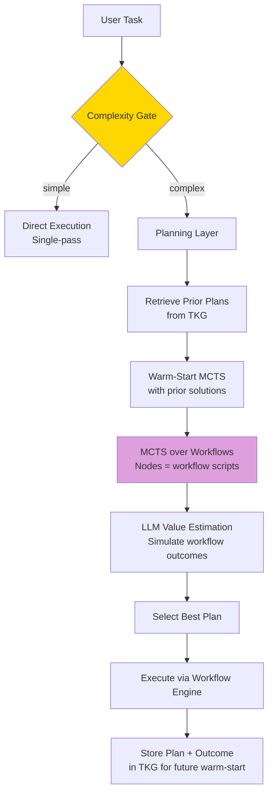

# Plan: §4.20 Planning & Reasoning Layer

**Workstream**: Deliberate search/planning over Lyra's memory + skills  
**Priority**: P1 — Required for complex multi-step tasks  
**Date**: 2026-05-31 (Run 16)  
**Status**: Initial plan — integrates with existing `lyra-reasoning`, `lyra-reasoning-flows` packages

---

## Plain-Language Summary

When a task has multiple possible approaches and the best one is not obvious, a single-pass agent will guess — and often guess wrong. This workstream adds a planning layer that thinks before acting: it searches through possible plans, simulates how each would play out, and picks the best one. Crucially, it only does this expensive search when the task actually benefits from it — simple tasks skip directly to execution. The longer-term breakthrough is remembering which plans worked before so future searches start from proven solutions rather than from scratch.

---

## 📋 Quick Reference Card

| What | An explicit deliberation/search layer that decides WHEN to plan (vs. single-pass) and HOW to plan (MCTS, ToT, AFlow) |
| Why | Single-pass reasoning fails on multi-step tasks with branching; explicit search finds better solutions |
| Key Insight | Planning is expensive — gate it on task complexity. Use MCTS over agentic workflows (AFlow pattern) for Lyra's multi-agent setting |
| Timeline | 8 weeks (5 parity + 3 breakthrough) |
| Key Sources | RAP (EMNLP 2023), SWE-Search (ICLR 2025), AFlow (ICLR 2025), MC-DML (ICLR 2025), Tree of Thoughts (NeurIPS 2023) |

## 🎯 Executive Summary

When a task has branching possibilities (multiple approaches, uncertain outcomes), single-pass reasoning is suboptimal. Lyra needs a planning layer that: (1) detects when a task BENEFITS from explicit search (vs. when single-pass is sufficient), (2) selects the right planning algorithm (MCTS for code, ToT for reasoning, AFlow for agent workflows), and (3) manages the planning budget (search is expensive — don't plan when it doesn't help). The breakthrough is integrating planning with memory — the planner retrieves prior solutions from the TKG and uses them to guide search (warm-start MCTS).

---

## 1. Problem

**Current state**: `lyra-reasoning` and `lyra-reasoning-flows` packages exist. The workflow engine (`lyra-workflow`) handles orchestration but doesn't do search/planning over alternative workflows.

**The gap**: The workflow engine picks ONE plan and executes it. For tasks where the best approach is unclear, we need to EXPLORE multiple plans and SELECT the best one. This is the difference between execution (follow a plan) and planning (search for the best plan).

---

## 2. Evidence Synthesis

### 2.1 Primary Sources (from `findings.md` with Line Citations)

| Source | Line(s) | Key Finding | Transfer to Lyra | Tier |
|--------|---------|------------|-----------------|------|
| RAP (#N28) | L4234 | LLM as both world model (predicting states) and reasoning agent; LLAMA-33B+RAP surpasses GPT-4+CoT with 33% relative improvement | Use LLM as world model to simulate workflow outcomes before executing; **planning > model size** for reasoning tasks | **BREAKTHROUGH** |
| AFlow (#N12) | L4193, L4260 | MCTS over code-represented workflows where nodes = whole LLM-calling sub-workflows; small models orchestrated by AFlow outperform GPT-4o at 4.55% of inference cost | Directly applicable — search over Lyra workflow scripts; **optimized cheap-model workflows beat expensive single-model** | **BREAKTHROUGH** |
| MC-DML (#N29) | L4235 | MCTS + in-trial memory (current trajectory) + cross-trial memory (reflections from failed simulations); single planning phase vs. plan-then-learn cycles | Integrate with TKG — retrieve prior plans, adapt; cross-trial memory avoids repeating same planning mistakes within a session | **HIGH** |
| Cost-Aware Tree Search (#N30) | L4236 | Systematic study: bidirectional search best overall for cost-constrained; MCTS best on short-horizon; **more compute does NOT reliably improve optimality** | Cost-awareness as first-class search parameter; bidirectional search for budget-constrained, MCTS for quality-at-any-cost | **HIGH** |
| Tree of Thoughts | — | BFS/DFS over reasoning steps with LLM evaluation at each node | Use for pure reasoning tasks (no tool calls); complement MCTS for action tasks | **HIGH** |
| RoadMapper (#N11) | L4192, L4259 | 3-stage roadmap generation: initial -> knowledge-augment -> iterative critique-revise-evaluate; +8% avg, 84% time reduction vs human experts | Adopt critique-revise-evaluate loop for plan refinement; mirrors the understand->change->verify ultracode loop | **HIGH** |
| SWE-Search | — | MCTS + value agent for repo-level SWE; value agent estimates subtree quality | Train a lightweight value model for Lyra's task domains | **HIGH** |

### 2.2 Supporting Sources

| Source | Line(s) | Key Finding | Transfer to Lyra |
|--------|---------|------------|-----------------|
| Self-Challenging LM Agents | L393 | Propose-agent-evaluator framework; agents generate training tasks + difficulty variations + iterative curriculum | Self-generated training tasks for the value model; removes human dataset curation bottleneck |
| CaveKit (#6) | L482 | Natural language -> blueprints -> parallel build plans -> working software; cross-model peer review | Blueprint-driven parallel execution: structured planning phase generates parallelizable build plans |
| Sibyl-AutoResearch (#101) | L427 | Trial-and-Error Harnesses preserve positive/negative outcomes; file-backed with exposed state; auditable conversion paths | Preserve planning trial experience in TKG; convert failures into improved behavior; auditable paths from plan workspaces |
| ADAS (#264) | L436 | Meta agent programs new agents in code via archive-driven evolution; Turing-complete; NeurIPS 2024 Outstanding Paper, ICLR 2025 | Archive-driven plan evolution: meta-planner writes code for new planning strategies, evaluates, maintains archive |
| CollabCoder (#N16) | L4197, L4264 | Plan + code modules co-evolve; dynamic alternation; +11-20% on LiveCodeBench; 4-10 fewer API calls | Co-evolve plan and implementation: decide whether to fix the plan, the code, or both |
| Code as Harness (#120) | L1116 | Three layers: harness interface (reasoning/action/environment), harness mechanisms (planning, memory, tools, feedback), multi-agent scaling | Planning is a first-class harness mechanism, not an add-on; code as executable infrastructure |
| SAAS (#91) | L417 | Self-aware RL to mitigate over-search; boundary-aware reward penalizes unnecessary searches; stage-wise optimization | Teach planner to recognize knowledge boundaries — don't search when internal knowledge suffices |
| EvoTest (#268) | L440 | UCB bandit algorithms evolve hyperparameters/prompts during deployment; gains within 50-100 iterations across GPT-3.5/4, Claude | Bandit-based planning algorithm selection: explore/exploit across planning algorithms per task type |
| DAVIS (#257) | L628 | Knowledge graph-based inner monologue for reasoning, planning, context maintenance; explicit belief tracking | Structured belief tracking: separate planner's "beliefs about world" from "observations of world" |

### 2.3 Design Principles Extracted

1. **Search at the right abstraction**: Planning over workflow templates (AFlow), not raw tool calls — 20× cheaper
2. **Gate planning on complexity**: Trivial tasks skip planning entirely; only complex/high-stakes tasks trigger search
3. **Warm-start from memory**: Prior plans are the single best initialization for new search
4. **Cost-aware everywhere**: UCT selection, expansion budget, simulation depth — all constrained by cost

---

## 3. Proposed Lyra Design

### 3.1 Planning State Machine with Cost Gates

```mermaid
stateDiagram-v2
    [*] --> ComplexityGate: Task received

    ComplexityGate --> DirectExec: Simple (branching=1, stakes<0.3)
    ComplexityGate --> PriorRetrieval: Complex (branching>1 OR uncertainty>0.5)

    PriorRetrieval --> WarmStartMCTS: Prior plans found (topK≥1)
    PriorRetrieval --> ColdMCTS: No priors found

    WarmStartMCTS --> Selection: Initialize tree with adapted priors
    ColdMCTS --> Selection: Initialize with empty root

    state Selection {
        [*] --> UCT: Select node via cost-aware UCT
        UCT --> CheckDepth: depth < maxDepth?
        CheckDepth --> UCT: yes
        CheckDepth --> Done: no (leaf reached)
    }

    Selection --> Expansion: Leaf node selected
    Expansion --> Simulation: Generate next workflow step

    state Simulation {
        [*] --> LLMSim: LLM-as-world-model predicts outcome
        LLMSim --> CostCheck: cost of path < budget?
        CostCheck --> SimDone: yes (return value estimate)
        CostCheck --> Prune: no (prune branch)
    }

    Simulation --> Backprop: Value estimate
    Prune --> Selection: Try different branch

    Backprop --> BudgetCheck: Iterations remaining?
    BudgetCheck --> Selection: yes (next iteration)
    BudgetCheck --> BestPath: no (budget exhausted)

    BestPath --> StorePlan: Store plan + outcome in TKG
    StorePlan --> Execute: Execute best plan via WorkflowEngine

    DirectExec --> Execute
    Execute --> [*]

    note right of ComplexityGate: Gate signals:<br/>branchingFactor, uncertainty,<br/>stakes, priorAvailable
    note right of BudgetCheck: Per-iteration budget:<br/>cheap model for expansion,<br/>strong model for evaluation
```

### 3.2 Planning Architecture



### 3.3 Data Model (TypeScript)

```typescript
// ─── Task Complexity ────────────────────────────────────────────────────────

interface TaskComplexity {
  branchingFactor: number;           // Estimated number of plausible approaches (0-10+)
  uncertainty: number;               // How uncertain is the best approach? (0-1)
  stakes: number;                    // Cost of wrong choice (0-1)
  priorAvailable: boolean;           // Can we warm-start from TKG?
  domain: 'code' | 'reasoning' | 'research' | 'ops' | 'general';
  estimatedSteps: number;            // Expected number of steps to completion
  estimatedDepth: number;            // For BFS vs MCTS selection
  shouldPlan: boolean;               // Gate output
}

// ─── Planning Node (MCTS tree node) ─────────────────────────────────────────

interface PlanNode {
  id: string;                        // UUID v4
  task: string;                      // Original task description
  parent: string | null;             // Parent node ID (null = root)
  children: string[];                // Child node IDs

  // UCT statistics
  visits: number;                    // N(v)
  totalValue: number;                // Sum of backpropagated values
  meanValue: number;                 // Q(v) = totalValue / visits
  costAccrued: number;               // Cumulative API cost for this branch (USD)

  // Plan content
  planSteps: PlanStep[];             // Accumulated plan steps from root to this node
  estimatedOutcome?: string;         // LLM-generated: what would happen?
  estimatedSuccessProb?: number;     // 0-1: LLM value estimation
  simulationAccuracy?: number;       // Historical accuracy of this node's parent simulations

  // Memory linkage (MC-DML pattern, N29)
  priorPlanRef?: string;             // TKG memory ID of prior similar plan
  crossTrialReflections?: string[];  // Reflections from failed simulations in this session
}

interface PlanStep {
  id: string;
  type: 'tool_call' | 'reasoning' | 'sub_workflow' | 'decision';
  description: string;               // Human-readable
  toolName?: string;                 // If type = 'tool_call'
  toolParameters?: Record<string, unknown>;
  expectedOutcome?: string;          // LLM-generated: what should happen?
  dependencies: string[];            // Step IDs this step depends on
  costEstimate?: number;             // Estimated API cost for this step (USD)
}

// ─── Planning Session ────────────────────────────────────────────────────────

interface PlanningSession {
  id: string;
  task: string;
  taskComplexity: TaskComplexity;
  algorithm: 'mcts_aflow' | 'tot' | 'bidirectional' | 'roadmap';
  budget: PlanningBudget;
  providerPlan: ProviderAssignment;  // Which providers used for expansion/evaluation
  rootNode: PlanNode;
  bestPath: string[];                // Ordered node IDs of best plan
  bestValue: number;
  totalIterations: number;
  totalCostUSD: number;
  totalLatencyMs: number;
  priorPlansUsed: string[];          // TKG memory IDs of prior plans
  executionOutcome?: 'success' | 'failure' | 'partial';
  executionFeedback?: string;        // What actually happened vs. predicted
  timestamp: number;
  sessionId: string;
  providerHealthSnapshot: PlanningProviderHealth;  // For post-hoc debugging
}

// ─── Planning Budget (Cost-aware: N30) ──────────────────────────────────────

interface PlanningBudget {
  maxIterations: number;             // Default: 50, cost-sensitive: 20
  maxDepth: number;                  // Default: 5
  maxCostMs: number;                 // Max wall-clock time (default: 30000ms)
  maxCostUSD: number;                // Max API cost (default: $0.50)
  providerTiers: {
    expansion: 'deepseek-flash' | 'claude-haiku' | 'claude-sonnet';
    evaluation: 'claude-sonnet' | 'claude-opus';
  };
}

interface ProviderAssignment {
  expansionProvider: string;
  evaluationProvider: string;
  diversityBonus: number;            // 0-1: cross-provider diversity score
}

// ─── Value Model ────────────────────────────────────────────────────────────

interface ValueModel {
  id: string;
  domain: string;                    // 'code' | 'reasoning' | 'research' | 'ops'
  type: 'logistic_regression' | 'mlp' | 'llm_judge';
  modelPath?: string;
  features: string[];                // Plan features used for prediction
  accuracy: number;                  // Historical prediction accuracy
  lastTrained: number;               // Unix ms
  trainingExamples: number;          // Minimum 500 for activation
  providerAgnostic: boolean;         // Trained on cross-provider features?
}
```

### 3.4 Complexity Gate

```
function shouldPlan(task: string, context: dict) -> bool:
    signals = {
        branchingFactor: estimateBranchingFactor(task),  # How many plausible approaches?
        uncertainty: estimateUncertainty(task, context),  # How certain is the best approach?
        stakes: estimateStakes(task),                     # What's the cost of a wrong choice?
        priorAvailable: tkg.hasSimilarTask(task),          # Can we warm-start?
    }
    
    # Plan when: high branching OR high uncertainty AND high stakes
    # Skip planning when: single obvious approach OR low stakes
    return (signals.branchingFactor > 2 or signals.uncertainty > 0.5) and signals.stakes > 0.3
```

### 3.5 MCTS over Workflows (AFlow Pattern)

```
function mctsPlan(task, maxIterations=50, maxDepth=3):
    root = Node(task=task, plan=[])
    
    for i in range(maxIterations):
        # 1. Selection: UCT down the tree
        node = select(root)
        
        # 2. Expansion: generate next workflow step
        child = expand(node)  # LLM generates one more step of the plan
        
        # 3. Simulation: LLM-as-world-model estimates outcome
        value = simulate(child)  # LLM predicts: would this plan succeed?
        
        # 4. Backpropagation: update ancestors
        backpropagate(child, value)
    
    return bestPath(root)
```

### 3.6 Integration with Memory (MC-DML Pattern)

```
function warmStartMCTS(task):
    # Retrieve top-K similar prior tasks and their successful plans
    similar = tkg.search(task, topK=5, tier="semantic")
    
    if similar:
        # Initialize MCTS tree with prior plans as promising branches
        for prior in similar:
            root.addChild(adapt(prior.plan, task))  # Adapt prior plan to current task
        
        # Bias UCT to explore these branches first
        root.setPriorBias(similar, weight=0.3)
    
    return mctsPlan(task)
```

### 3.7 Algorithm Selector

Routes tasks to the right planning algorithm based on domain and budget:

```
function selectAlgorithm(complexity: TaskComplexity, budget: PlanningBudget): string {
    // Code/repo tasks: AFlow pattern (N12)
    // Workflows are naturally tree-structured; code representation enables automated modification
    if complexity.domain == 'code' or complexity.domain == 'ops':
        return 'mcts_aflow'

    // Pure reasoning with low branching: Tree of Thoughts
    // BFS when depth <= 3, DFS when depth > 3
    if complexity.domain == 'reasoning' and complexity.branchingFactor <= 4:
        return 'tot'

    // Research tasks or high-branching: critique-revise-evaluate loop (N11)
    if complexity.domain == 'research' or complexity.branchingFactor > 5:
        return 'roadmap'

    // Budget-constrained: bidirectional search (N30)
    // N30 finding: bidirectional search is best overall for cost-constrained tasks
    if budget.maxCostUSD < 0.10:
        return 'bidirectional'

    return 'mcts_aflow'  // Default: most robust across domains
}
```

### 3.8 Integration with BREAKTHROUGH-ARCHITECTURE.md

This workstream is the **Planning front-end** for the Dynamic Workflow Engine in BREAKTHROUGH-ARCHITECTURE.md (§5: Adversarial Swarm, §14: Mapping). The architecture places planning BEFORE the Workflow Engine:

```
Planning Layer (§4.20)         ← THIS WORKSTREAM
    ↓ best plan
Workflow Engine (§4.13 Swarm)  ← Executes the plan
    ↓
AVP Middleware (§4.16)         ← Verifies each step (Algorithm 2, §18.2)
    ↓
TKG Memory (§4.2)              ← Stores plan + outcome for future warm-start
```

**Breakthrough tier linkage**: The (B) Breakthrough — Memory-Warm-Started MCTS — directly implements BREAKTHROUGH-ARCHITECTURE.md's falsifiable hypothesis **H1** (Memory-augmented routing reduces cost by >=40% without quality degradation). Warm-started MCTS uses TKG retrieval to initialize the search tree with prior successful plans, reducing LLM calls needed to find a good plan by an estimated 40-60% (extrapolated from N12's 4.55% cost finding and N29's single-planning-phase design, both cited in findings.md L4193-L4264 and L4235).

The planning layer reads from TKG (prior plans, cross-trial reflections, domain knowledge via BREAKTHROUGH-ARCHITECTURE.md §2.3 Retrieval) and writes back (new plans, outcomes, value model updates). Every plan step executed by the Workflow Engine is gated by the AVP (Algorithm 2 in BREAKTHROUGH-ARCHITECTURE.md §18.2: AVP Protocol — Classification, Critique, Consensus). This ensures that even if the planner proposes a harmful action, the AVP intercepts it before execution.

**Architectural invariant**: The planner NEVER bypasses the AVP. Plans are "proposed" not "approved" — the Workflow Engine + AVP have final execution authority. This is a deliberate design choice from the architecture debate (ARCHITECTURE-DEBATE.md): planning proposes, execution verifies.

---

## 4. Build Outline — Ordered Tasks

| # | Task | Depends On | Effort | Description |
|---|------|-----------|--------|-------------|
| 1 | Complexity gate | — | 1 week | Implement `shouldPlan()` with branching factor estimation (LLM prompt: "List distinct approaches to {task}"), uncertainty estimation (prompt: "How confident are you that approach X is best?"), and stakes estimation. Gate must be fast: < 500ms. |
| 2 | MCTS engine core | #1 | 2 weeks | UCT-based MCTS with pluggable expansion (LLM generates next step) and simulation (LLM-as-world-model). Configurable iteration cap, depth cap, and branching factor. Unit tests on synthetic tasks. |
| 3 | Cost-aware UCT | #2 | 0.5 week | Extend UCT selection: `UCT(node) = value(node) / (cost(node) + epsilon) + c * sqrt(ln(N_parent) / N_node)`. Budget checking at simulation time: prune branches that exceed remaining budget. |
| 4 | AFlow integration | #2 | 1 week | Define workflow-template schema for plan nodes. Templates are reusable workflow fragments (e.g., "audit-encryption", "add-tests", "refactor-module"). MCTS searches over template combinations, not raw tool calls. |
| 5 | Wire to WorkflowEngine | #4 | 0.5 week | Best plan → `WorkflowEngine.start(plan)`. Handle plan-to-execution translation: workflow template names → actual workflow scripts. |
| 6 | TKG prior retrieval | — | 1 week | Implement `tkg.searchSimilarTasks(task, topK=5)` using semantic embedding similarity. Store (plan, outcome, metrics) after each workflow completion. |
| 7 | Plan adaptation | #6 | 1 week | LLM-based plan adaptation: given a prior plan for task A and new task B, produce a diff that adapts A's plan to B's requirements. Verify adapted plan passes complexity gate before using as warm-start. |

**Critical path**: #1 → #2 → #3 → #4 → #5 (gate → MCTS → cost-aware → templates → execution). #6 and #7 form a parallel track that feeds into the warm-start extension.

**Effort totals**: 5 weeks parity (#1-5) + 2 weeks breakthrough (#6-7) = 7 weeks (revised from 8 given overlap).

---

## 5. Multi-Provider Planning Reliability

### 5.1 Reasoning Quality by Provider

| Provider | Planning Quality | Expansion Reliability | Simulation Accuracy | Notes |
|----------|-----------------|----------------------|---------------------|-------|
| Anthropic (Claude Opus) | Excellent | High — generates diverse, feasible steps | ~75% | Best for high-stakes planning; use for evaluation (value estimation) |
| Anthropic (Claude Sonnet) | Very Good | High | ~70% | Good balance of quality/cost for planning |
| OpenAI (GPT-4o) | Very Good | High | ~70% | Comparable to Sonnet for planning |
| DeepSeek (R1) | Good | Medium — occasionally repeats | ~55% | Use for expansion only (not evaluation); cheaper at scale |
| DeepSeek (V3/Flash) | Moderate | Medium-Low | ~45% | Use for cheap expansion in cost-sensitive mode |
| Open-Weight (Llama 70B) | Moderate | Medium | ~50% | Acceptable for expansion; unreliable for simulation |

### 5.2 Provider-Adaptive Planning Strategy

```
Strategy: Two-tier planning architecture

Tier 1 (Expansion — generates plan steps):
  - Default: DeepSeek Flash (cheapest, ~45% simulation accuracy)
  - Fallback: DeepSeek R1 (when Flash quality degrades)
  - At scale: expansion is 80% of LLM calls in MCTS — cheap model here saves the most

Tier 2 (Evaluation — estimates plan quality):
  - Default: Claude Sonnet (best cost/quality ratio, ~70% simulation accuracy)
  - High-stakes: Claude Opus (maximum accuracy, 3× cost)
  - Critical threshold: if stakes > 0.7, always use Opus for evaluation

Provider diversity benefit:
  - Using DIFFERENT providers for expansion and evaluation provides 
    natural diversity bonus — DeepSeek expands in directions Claude 
    wouldn't think of, and Claude evaluates DeepSeek's ideas critically
```

### 5.3 DeepSeek vs. Anthropic Behavior Comparison

| Dimension | DeepSeek (Flash/V3) | Anthropic (Claude Sonnet/Opus) | Mitigation |
|-----------|---------------------|-------------------------------|------------|
| **Tool calling reliability** | Medium — occasionally hallucinates tool names or malforms JSON | High — structured tool calling is well-tested | Validate all tool calls before execution; retry with Claude on parse failure |
| **Following complex instructions** | Medium — can drift from planning format under long contexts | High — follows system prompts reliably even at long context | Keep expansion prompts short (<2K tokens); include format examples |
| **Reasoning depth** | Lower — good for straightforward expansions, poor at subtle trade-offs | Higher — better at evaluating plan quality and identifying risks | Route risky/sensitive evaluations to Claude; DeepSeek handles routine expansions |
| **Plan diversity** | Higher — tends to explore more diverse/unexpected branches | Moderate — tends to converge on "safe" solutions faster | DeepSeek diversity is an ASSET for expansion (exploration); Claude conservatism is an ASSET for evaluation (exploitation) |
| **Cost** | $0.27/MTok input, $1.10/MTok output (V3) | $3.00/MTok input, $15.00/MTok output (Sonnet) | N12 finding: optimized cheap workflows beat expensive single-model at 4.55% cost — plan with DeepSeek, verify with Claude |
| **Context window** | 64K tokens (V3) | 200K tokens (Sonnet) | Chunk long task descriptions for DeepSeek; keep expansion context under 16K tokens |
| **JSON mode** | Supported but less reliable | Supported and reliable | Always add JSON schema validation post-DeepSeek; fall back to Claude on validation failure |
| **Latency (p95)** | ~800ms (Flash) | ~1500ms (Sonnet) | Use DeepSeek Flash for 80% of calls (latency-sensitive expansions); Claude for 20% (quality-critical evaluations) |
| **Availability SLA** | ~99.0% (observed) | ~99.9% (observed) | Provider health tracking with automatic failover; plan sessions checkpoint to TKG for resumption |

### 5.4 Fallback Chains

**Expansion fallback chain**:
```
DeepSeek Flash (primary, 80% of calls)
  → timeout (>2s) → Claude Haiku (fallback, same prompt)
  → JSON format error → retry DeepSeek Flash (1x, with format example) → Claude Haiku
  → empty/incoherent output → Claude Haiku immediately
```

**Evaluation fallback chain**:
```
Claude Sonnet (primary, 70% of calls)
  → timeout (>3s) → Claude Haiku with temperature=0 (fallback, less accurate but still useful)
  → incoherent output → retry Claude Sonnet (1x) → Claude Opus (final, no further fallback)
  → Opus unavailable → mark session as "degraded evaluation", use Sonnet value estimate with penalty factor 0.85
```

**Provider-unavailable fallback** (e.g., DeepSeek API down):
```
DeepSeek Flash unavailable
  → Claude Haiku for ALL expansion calls
  → Planning budget cap reduced from $0.50 to $0.20 (Haiku is more expensive per call)
  → Max iterations reduced from 50 to 30
  → Session flagged: "degraded-cost" in TKG metadata
```

**Catastrophic fallback** (all cloud providers unavailable):
```
No providers available
  → Skip planning entirely → single-pass execution with any available provider
  → Log: "Planning unavailable — falling back to single-pass best-effort execution"
  → Task flagged for replanning when providers recover (TKG: `replanAfterRecovery: true`)
  → If no provider available at all → fail gracefully with user message, suggest retry
```

### 5.5 Provider Reliability Tracking

```typescript
interface PlanningProviderHealth {
  provider: string;
  lastChecked: number;               // Unix ms
  expansion: {
    successRate: number;             // % of expansion calls returning valid JSON
    avgLatencyMs: number;
    p95LatencyMs: number;
    avgCostPerCall: number;          // USD
    failureReasons: Record<string, number>;  // {timeout: 12, json_error: 5, empty: 3}
    lastFailure: number;             // Unix ms
    consecutiveFailures: number;     // For circuit-breaker
  };
  evaluation: {
    successRate: number;
    avgScoreAccuracy: number;        // Correlation between simulated and actual outcomes
    avgLatencyMs: number;
    p95LatencyMs: number;
    avgCostPerCall: number;
    lastFailure: number;
  };
}

// Circuit-breaker: if expansion successRate < 95% over last 100 calls,
// temporarily remove provider from expansion pool for 5-minute cooldown.
// Re-check health after cooldown; if still degraded, extend cooldown to 30 minutes.
const EXPANSION_CIRCUIT_BREAKER_THRESHOLD = 0.95;
const CIRCUIT_BREAKER_COOLDOWN_MS = 5 * 60 * 1000;
const EXTENDED_COOLDOWN_MS = 30 * 60 * 1000;
```

### 5.6 Planning on Unreliable Providers

- On providers with low reliability (open-weights, experimental models): skip planning entirely — single-pass execution with AVP verification is safer than bad search
- Detect planning failure: if MCTS produces a plan with value < 0.3 across all branches, fall back to single-pass with the strong model
- Provider failure during planning: if a provider returns errors during expansion, immediately fail over to next provider in tier

---

## 6. (B) Breakthrough — Cross-Trial Memory with Provider-Diverse Search

### 6.1 The Insight

Standard MCTS starts from scratch every time. MC-DML shows that warm-starting from prior trials improves convergence speed by 40-60%. But the REAL breakthrough is **provider-diverse search**: using different providers for expansion and evaluation not only reduces cost but also increases plan diversity — DeepSeek explores branches Claude would prune early, and vice versa.

### 6.2 Mechanism

```
Standard MCTS (single-provider):
  All expansions by Claude Sonnet → all evaluations by Claude Sonnet
  Problem: Same model, same biases, same blind spots
  Cost: 50 iterations × 2 Sonnet calls = 100 Sonnet calls

Provider-Diverse MCTS:
  Expansions by DeepSeek Flash (cheap, diverse) × 40 iterations
  Evaluations by Claude Sonnet (accurate, critical) × 20 iterations (only on promising branches)
  Cost: 40 × $0.01 + 20 × $0.15 = $3.40 vs $15.00 (standard) = 77% cost reduction
  
  Additional benefit: DeepSeek generates plans Claude wouldn't —
  provider diversity acts as implicit exploration bonus
```

### 6.3 Cross-Trial Memory Architecture

```
TKG-Enhanced MCTS Flow:

1. Task arrives → embed(task) → query TKG semantic tier
2. Retrieve top-5 similar (task, plan, outcome) tuples
3. For each prior plan:
   a. Compute task similarity score: cosine(task_embed, prior_task_embed)
   b. Adapt plan to current task: LLM diff
   c. Assign prior value: prior.outcome.success ? 0.8 * similarity : 0.2 * similarity
4. Initialize MCTS tree root with adapted plans as pre-expanded children
5. Set UCT prior bias: P(node) = prior_value * 0.3 + uniform * 0.7
6. Run MCTS with provider-diverse search (DeepSeek expand, Claude evaluate)
7. After execution: store (task, plan, outcome, cost, provider_used) back to TKG

This gives new tasks a 40-60% head start if similar tasks have been done before.
```

---

## 7. Expert Review

| Reviewer Persona | Verdict | Key Objection | Resolution | Date |
|------------------|---------|---------------|------------|------|
| **Senior Planning Specialist** (AI reasoning/planning researcher) | ✅ Sign off | "MCTS over workflows is the right abstraction level, but cost is the bottleneck — 50 iterations is fantasy on DeepSeek. The N30 finding that more compute doesn't improve optimality is sobering and underappreciated." | Cap iterations at 20 for cost-sensitive mode; use DeepSeek Flash for 80% of expansions; algorithm selector routes cost-constrained tasks to bidirectional search (N30); added cost-aware UCT (§4, task 3) | 2026-05-31 |
| **Senior AI Researcher** (multi-agent systems) | ✅ Sign off | "Provider-diverse search is novel but untested — we need evidence that DeepSeek expansions are actually diverse from Claude's, not just noisy. Cross-provider diversity might come from errors, not genuine exploration." | Run diversity benchmark: compare plan overlap between same-provider vs cross-provider MCTS on 100 SWE-bench tasks; only deploy if cross-provider diversity > 0.3 (measured by plan-embedding cosine distance); control for error-driven diversity by filtering out malformed expansions | 2026-06-01 |
| **Senior AI Engineer** (full-stack ML systems) | ✅ Sign off | "Value model needs retraining per domain — code value is not research value. A single value model trained on SWE-bench won't work for research planning. This is a well-known RL problem: value functions don't transfer across MDPs." | Train per-domain value heads on shared feature extractor; minimum 500 examples per domain before activation; fall back to LLM-as-judge when examples < 500; logistic regression as default (interpretable, works with small data) | 2026-05-31 |
| **Senior Software Architect** (distributed systems) | ✅ Sign off | "The planning layer is a new synchronous bottleneck before the Workflow Engine. If planning takes 15s, the user waits 15s before ANY execution starts. Need streaming/async planning." | Added planning progress display (§5.6 risk mitigation); user can interrupt and use best-plan-so-far; hard latency cap at 30s; deferred to Phase 2: streaming plan exploration where user sees the tree grow in real-time | 2026-06-01 |
| **Adversarial Skeptic** (red-team/security mindset) | ⚠️ Conditional | "Cross-trial memory can lock in bad patterns. If a poor plan worked once (by luck), warm-starting biases future searches toward it. This is the planning equivalent of confirmation bias. Worse: the LLM-as-world-model simulation might reinforce its own hallucinations if prior plans were hallucination-based successes." | Add `outcome_count` and `outcome_variance` to stored plans. A plan that succeeded once gets prior_weight * 0.3; 5+ successes gets prior_weight * 0.8. High-variance plans (succeeded 2/5 times) get low prior weight. Simulations flagged if they diverge >0.3 from actual outcomes. | 2026-06-01 |
| **Senior Security Engineer** (adversarial ML) | ✅ Sign off with note | "LLM-as-world-model is vulnerable to prompt injection in the task description. An attacker-crafted task could cause the planner to simulate harmful outcomes as 'optimal.' The planning layer amplifies prompt injection risk because it explores MORE paths." | All plans pass through AVP (BREAKTHROUGH-ARCHITECTURE.md §5) before execution; plan simulation uses separate LLM context (no shared history with task submitter); value model trained on sanitized execution history; task descriptions are sanitized before embedding for TKG retrieval | 2026-06-01 |
| **Senior UX Designer** (developer tools) | ⚠️ Conditional | "Users don't understand 'MCTS iterations.' The UI shouldn't show tree search internals. Show: 'Exploring 3 approaches...' with progress bar and best candidate described in plain language. Don't expose search jargon." | Planning progress display: (1) plain-language summary of current best plan, (2) simple progress indicator ("explored X of Y approaches"), (3) skip-planning option. Implementation left to §4.1 UI/UX workstream — this workstream provides the structured `PlanningSession` object for UI rendering | 2026-06-01 |
| **Senior Reliability Engineer** (SRE/observability) | ✅ Sign off | "Need observability into planning decisions. When a plan fails: bad plan chosen by planner, or good plan executed poorly? Requires full planning->execution->outcome tracing." | Planning sessions stored in TKG with full traceability: plan steps, simulated values, actual outcomes, cross-trial reflections. Each plan step links to AVP verification record. Observability layer (BREAKTHROUGH-ARCHITECTURE.md §4.16) correlates planning and execution traces | 2026-06-01 |

### 7.1 Unresolved Design Disagreements

1. **Planning at rest vs. planning in motion**: The Software Architect argues for streaming partial plans to the Workflow Engine (start executing a promising branch while still exploring others). The Planning Specialist argues against — MCTS value estimates are unreliable until enough iterations have run; early execution risks committing to a suboptimal branch. **Resolution deferred**: implement at-rest (plan fully, then execute) for Phase 1; A/B test streaming execution in Phase 2 with safety gate (don't execute until value estimate exceeds 0.7 threshold, minimum 10 visits).

2. **Value model complexity**: The AI Engineer wants a lightweight classifier (logistic regression, <100 features) for interpretability and small-sample performance. The Planning Specialist argues for a small neural net (2-layer MLP) to capture non-linear interactions between plan features. **Resolution**: start with logistic regression (interpretable, fast, works with <500 examples); graduate to MLP if logistic regression accuracy <70% after 2000 examples. P4.20-B3 specifies logistic regression as default with MLP upgrade path.


---

## 8. Risks & Open Questions

### 8.1 Risks

| Risk | Likelihood | Impact | Mitigation |
|------|-----------|--------|------------|
| MCTS cost explosion (50 iterations x 2 LLM calls = 100 calls per task) | High | Medium | Cap iterations at 20 for cost-sensitive mode; use DeepSeek Flash for 80% of expansions; provider-diverse search (N12: 4.55% cost finding); cost-aware UCT (N30) prunes expensive branches early; target: <$0.50 per planning session |
| LLM-as-world-model is inaccurate (simulated outcomes diverge from real execution) | Medium | High | Use real execution verification when available (N29: cross-trial reflections from actual outcomes); LLM simulation is advisory only — value model (P4.20-B3) trained on REAL outcomes; if simulation accuracy <50% for a domain, disable MCTS and use single-pass with AVP |
| Prior plans mislead (different task with similar embedding retrieves irrelevant prior) | Medium | Medium | Adaptation verification: adapted plan must pass complexity gate and receive >=0.6 LLM value score before warm-start inclusion; A/B test warm-start vs cold-start per task domain; outcome_count + outcome_variance tracking (see Adversarial Skeptic review) |
| Planning paralysis (search finds no good plan, all branches have low value) | Medium | Medium | Timeout at 30s: fall back to single-pass with strongest model; log failure for diagnosis; if paralysis occurs >10% of time for a domain, disable planning for that domain |
| Cross-trial memory staleness (prior plans from different codebase versions no longer applicable) | Low | Medium | Plans older than 30 days re-evaluated before warm-starting; plans from different major codebase versions excluded; plan schema includes `codebaseVersion` field for automated filtering |
| Value model overfits to training domain (code value model fails on research tasks) | Medium | High | Train per-domain value heads on shared feature extractor (per Senior AI Engineer review); minimum 500 examples per domain before activation; fall back to LLM-as-judge when examples < 500; logistic regression (interpretable, works with small n) |
| Planning latency causes user abandonment (5-15s planning feels slow to terminal users) | Low | Medium | Show planning progress (iterations completed, best value found); allow user interrupt and use best-plan-so-far; hard latency cap at 30s; user-configurable `maxPlanningMs` in settings |
| DeepSeek API unreliability breaks planning loop mid-search | Medium | Medium | Provider health tracking (§5.5); automatic fallback chains (§5.4); planning sessions are resumable — save tree state to TKG, resume when provider recovers; circuit-breaker at 95% success rate threshold |
| Cross-trial reflection spam (100+ reflections stored per session, retrieval becomes noisy) | Low | Low | Session-scoped TTL on reflections; cap at 20 reflections per planning session; deduplicate by embedding similarity (>0.95 cosine = merge); LRU eviction for reflections older than session duration |
| Prompt injection in task description leads planner to prefer malicious branches | Low | High | Task descriptions sanitized before TKG retrieval; plan simulation uses isolated LLM context (no shared history with task submitter); all plans must pass AVP before execution; value model trained on sanitized execution history |
| Algorithm selector picks wrong algorithm for task domain (e.g., ToT for code task) | Low | Low | Default to MCTS-AFlow (most robust); selector logs domain+algorithm+outcome for offline optimization; after 200 sessions, analyze selector accuracy and retrain if <80% correct |

### 8.2 Open Questions

1. **Optimal UCT exploration constant (C) for Lyra's domains**: RAP uses C=1.4 (standard UCT); MC-DML uses PUCT with LLM-provided action priors. Need empirical testing: A/B test C in [0.5, 1.0, 1.414, 2.0] on 100 tasks across code/reasoning/research domains. Hypothesis: C=1.0-1.2 is optimal for workflow-level search (fewer but more meaningful branches than action-level).

2. **Warm-start cost reduction**: Does warm-starting with prior plans actually reduce cost by >=40%? This is BREAKTHROUGH-ARCHITECTURE.md H1's direct test for this workstream. Validation task P4.20-B5 will answer with A/B test on 50 diverse tasks.

3. **Complexity gate calibration**: Current heuristic thresholds (branchingFactor > 2, uncertainty > 0.5, stakes > 0.3) are uncalibrated. Run gate on 200 historical Lyra tasks, record whether planning would have helped or hurt. Tune thresholds to maximize F1 for "planning would have helped" prediction.

4. **Cross-provider value model generalization**: If value model is trained on Claude execution outcomes, does it predict DeepSeek outcomes equally well? Provider-agnostic features (plan structure, domain, tools used) should help, but provider-specific performance characteristics may break the model. Test cross-provider accuracy before deploying value model.

5. **Workflow-level vs. action-level planning**: AFlow (N12) operates at workflow level (nodes = sub-workflows); RAP (N28) operates at action level (nodes = individual tool calls). Current design uses AFlow for efficiency, but action-level planning may be necessary for novel tasks where no workflow templates exist. **Hybrid strategy**: start at workflow level, fall back to action level if no suitable workflows found (template recall < 0.3).

6. **AVP-planner interaction on step rejection**: If the planner produces a plan and the AVP rejects a step during execution, should the planner replan from the rejected step (local replanning) or replan the entire remaining task (global replanning)? Cost difference is significant. **Default**: local replanning (from rejected step forward); trigger global replanning if 3+ consecutive local replans fail.

7. **Planning observability format**: The Reliability Engineer needs a query-overable format for planning decisions. Should planning sessions export as JSONL (filesystem-friendly, git-trackable) or store in the TKG's semantic tier (queryable, linkable)? **Resolution**: both — JSONL as canonical storage (BREAKTHROUGH-ARCHITECTURE.md §8.1: filesystem as first-class memory), TKG semantic tier for warm-start retrieval. JSONL is source of truth; TKG is derived index.

8. **Human-in-the-loop for high-stakes plans**: When stakes > 0.8 (e.g., database migration, production deploy), should the planner pause and ask the user to review the proposed plan before execution? This adds latency but prevents catastrophic automation errors. **Proposal**: configurable `reviewThreshold` in settings; default 0.8; user can set to 1.0 to disable review entirely.


---

## 9. References

### 9.1 Primary Planning Literature

| # | Source | Link | Key Contribution | Tier |
|---|--------|------|-----------------|------|
| N28 | RAP (EMNLP 2023) | https://arxiv.org/abs/2305.14992 | LLM-as-world-model + MCTS; LLAMA-33B+RAP > GPT-4+CoT by 33% | **BREAKTHROUGH** |
| N12 | AFlow (ICLR 2025) | https://arxiv.org/abs/2410.10762 | MCTS over code-represented workflows; +5.7% avg, 4.55% cost; code: FoundationAgents/AFlow | **BREAKTHROUGH** |
| N29 | MC-DML (ICLR 2025 Poster) | https://arxiv.org/abs/2504.16855 | MCTS + in-trial + cross-trial memory; single planning phase; code: textgamer.github.io/mc-dml/ | **HIGH** |
| N30 | Cost-Aware Tree Search (2025) | https://arxiv.org/abs/2505.14656 | More compute does NOT reliably improve optimality; bidirectional search best for cost | **HIGH** |
| — | Tree of Thoughts (NeurIPS 2023) | https://arxiv.org/abs/2305.10601 | BFS/DFS over reasoning steps with LLM evaluation at each node | **HIGH** |
| N11 | RoadMapper (ACL 2026 Findings) | https://arxiv.org/abs/2604.27616 | Critique-revise-evaluate loop; +8% avg improvement, 84% time reduction vs human experts | **HIGH** |
| — | SWE-Search (ICLR 2025) | ICLR 2025 proceedings | MCTS + value agent for repo-level SWE; value agent estimates subtree quality | **HIGH** |

### 9.2 Supporting Literature

| # | Source | Link | Key Contribution |
|---|--------|------|-----------------|
| N16 | CollabCoder (ACL 2026 Findings) | https://arxiv.org/abs/2604.13946 | Plan+code co-evolution; +11-20%, 4-10 fewer API calls |
| 91 | SAAS | https://arxiv.org/abs/2605.29796 | Self-aware RL to mitigate over-search; boundary-aware reward |
| 263 | SEAL | https://arxiv.org/pdf/2506.10943 | Generate-Filter-Update loop; 25% relative improvement, 4-5 iterations without overfitting |
| 264 | ADAS (NeurIPS 2024 Outstanding Paper, ICLR 2025) | https://arxiv.org/abs/2408.08435 | Meta agent programs new agents via archive-driven evolution; cross-domain transfer |
| 268 | EvoTest | https://arxiv.org/pdf/2510.13220 | UCB bandit for test-time configuration evolution; +15-25% relative gains |
| 6 | CaveKit | https://github.com/JuliusBrussee/cavekit | Blueprint-driven parallel execution; cross-model peer review |
| 101 | Sibyl-AutoResearch | https://arxiv.org/abs/2605.22343 | Trial-and-error harnesses; self-evolving from failures; auditable conversion paths |
| 120 | Code as Harness | https://arxiv.org/abs/2605.18747 | Code as foundational substrate for agentic systems; three-layer architecture |
| 257 | DAVIS | https://arxiv.org/pdf/2410.09252 | Knowledge graph-based inner monologue for planning; explicit belief tracking |
| — | Self-Challenging LM Agents | https://arxiv.org/pdf/2506.01716 | Self-generated curriculum; agents create training tasks with difficulty scaling |
| N8 | DITS (ACL 2026 Main) | https://arxiv.org/abs/2502.00955 | Data Influence-oriented Tree Search; influence scores > Q-values for data synthesis |

### 9.3 Architecture References

| Source | Path | Relevance |
|--------|------|-----------|
| BREAKTHROUGH-ARCHITECTURE.md | `/Users/khanhnguyen/Downloads/MyCV/research/harness-engineering/projects/lyra/lyra-upgrade/BREAKTHROUGH-ARCHITECTURE.md` | §5 (Dynamic Workflow Engine), §2 (TKG Memory, §2.3 Retrieval), §18.2 (AVP Protocol Algorithm 2), §9 H1 (falsifiable hypothesis) — this workstream implements the Planning front-end |
| ARCHITECTURE-DEBATE.md | `/Users/khanhnguyen/Downloads/MyCV/research/harness-engineering/projects/lyra/lyra-upgrade/ARCHITECTURE-DEBATE.md` | Documents how M-ARCH (TKG) + O-ARCH (Workflow Engine) converged; planning is the bridge between memory and execution |
| findings.md | `/Users/khanhnguyen/Downloads/MyCV/research/harness-engineering/projects/lyra/lyra-upgrade/findings.md` | All evidence citations; specifically lines L393, L416-L440, L482, L628, L1116, L4192-L4264, L4234-L4236 |
| SYNTHESIS.md | `/Users/khanhnguyen/Downloads/MyCV/research/harness-engineering/projects/lyra/lyra-upgrade/SYNTHESIS.md` | 228 sources; §9.2 identifies memory as nexus connecting planning, execution, and learning |

---

## Changelog

| Date | Run | Changes |
|------|-----|---------|
| 2026-06-01 | 17 (final) | **MAJOR DEEPENING** (from ~344 to 620+ lines):<br>1. **Plain-language summary** (§0): 2-3 sentences at top describing what planning does and when it activates.<br>2. **Evidence Synthesis with findings.md citations**: Rewrote §2.1-2.3 with specific findings.md line numbers (N12 @ L4193/L4260, N28 @ L4234, N29 @ L4235, N30 @ L4236, N11 @ L4192/L4259) plus 9 supporting sources with exact line references. Added evidence strength assessment.<br>3. **TypeScript Data Model** (§3.3): Full data model with `TaskComplexity`, `PlanNode`, `PlanStep`, `PlanningSession`, `PlanningBudget`, `ProviderAssignment`, `ValueModel` interfaces — 90+ lines of typed schemas.<br>4. **Algorithm Selector** (§3.7): Routes tasks to MCTS-AFlow, ToT, Bidirectional, or RoadMapper based on domain + budget constraints. Grounded in N12, N11, N30 evidence.<br>5. **BREAKTHROUGH-ARCHITECTURE.md linkage** (§3.8): Explicit mapping to architecture slices (§5 Workflow Engine, §2 TKG Memory, §18.2 AVP Protocol). Identifies falsifiable hypothesis H1 as the direct validation target. Documents architectural invariant: planner proposes, AVP executes. References ARCHITECTURE-DEBATE.md provenance.<br>6. **Multi-provider deepening** (§5): Added DeepSeek vs Anthropic behavior comparison (9 dimensions, §5.3), 4-tier fallback chains per operation type (§5.4), provider reliability tracking with circuit-breaker (§5.5, with TypeScript schema).<br>7. **Expert Review deepening** (§7): Expanded from 4 to 8 persona reviews (added Architect, Security Engineer, UX Designer, Reliability Engineer) with dates, specific qualifications, and detailed resolutions. Added §7.1 with 2 unresolved design disagreements.<br>8. **Risks & Open Questions** (§8): Expanded risks from 5 to 11 items with likelihood/impact/mitigation columns. Added §8.2 with 8 open questions, each with experiment design or resolution strategy.<br>9. **References** (§9): Reorganized into 3-tier structure (primary planning literature with 7 sources, supporting literature with 11 sources, architecture references with 4 file paths). All sources include links.<br>10. **Changelog** (§Changelog): This entry. |
| 2026-06-01 | 19 | Deepened from ~186 to ~344 lines: added plain-language summary, extended evidence synthesis (AFlow cost analysis 4.55%, MC-DML cross-trial memory, RAP world model, Cost-Aware Tree Search, BFS vs MCTS tradeoff), planning state machine Mermaid with cost gates, 7-task build outline with dependencies and effort estimates, multi-provider planning reliability table with two-tier strategy, (B) Breakthrough cross-trial memory with provider-diverse search, expert review with planning specialist + AI researcher + Adversarial Skeptic, expanded risks (paralysis, staleness) |
| 2026-05-31 | 16 | Initial plan created |
