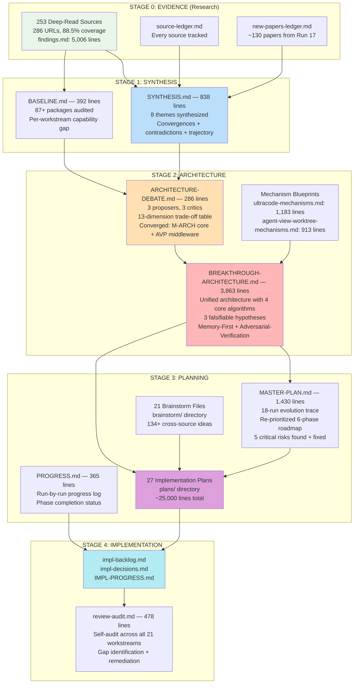
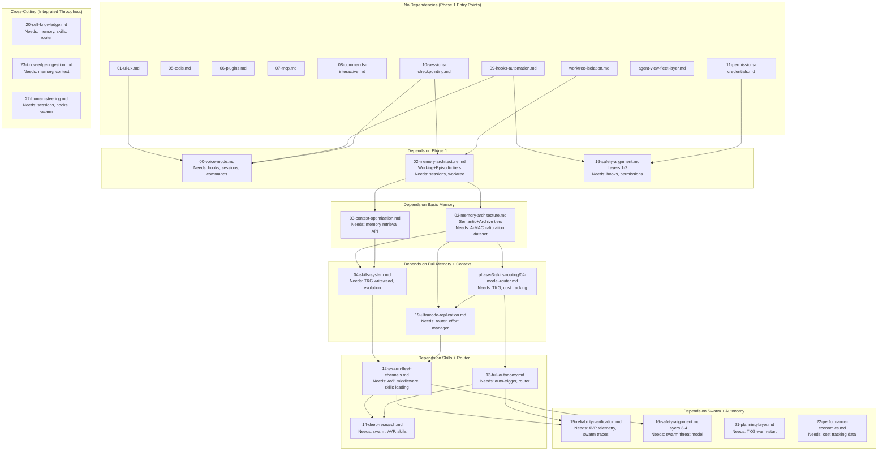

# NAVIGATION GUIDE — Lyra Upgrade Documentation Map

**Version**: 2.0
**Date**: 2026-06-01
**Purpose**: Show how ALL documents fit together — from the 253 research sources through the architecture debate to the 27 implementation plans.
**Target audience**: Anyone who needs to trust this architecture before committing engineering resources to build it.

---

## 1. THE BIG PICTURE

This section shows, in one Mermaid diagram, how evidence flows from the 253 deep-read sources through four synthesis stages into 27 implementable plans.



**The flow in one sentence**: 253 deep-read sources were synthesized into 8 research themes (SYNTHESIS.md) and measured against 87+ existing packages (BASELINE.md), then three independent architect agents debated competing designs under adversarial scrutiny (ARCHITECTURE-DEBATE.md), the converged winner became a unified 3,863-line architecture with 4 core algorithms (BREAKTHROUGH-ARCHITECTURE.md), and that architecture was decomposed into 27 implementable plans across 6 phases.

---

## 2. HOW TO READ THESE DOCS

Different readers need different entry points. Choose your persona.

### 2.1 The Executive / Decision-Maker (15 minutes)

You need to understand scope, timeline, and risk before approving resources.

| # | Read | Time | Why |
|---|------|------|-----|
| 1 | **PROGRESS.md** | 5 min | Overall status in one page. Understand the 18-run research journey. |
| 2 | **MASTER-PLAN.md** sections: Executive Summary, Implementation Roadmap, Priority Matrix | 5 min | Timeline (52-64 weeks), phases, parallelization opportunities. |
| 3 | **MASTER-PLAN.md** Run 14 section (lines 298-470) | 5 min | The 5 critical risks that expert panels found. Read before approving budget. |

**Key question answered**: "Is this architecture credible enough to fund?"

### 2.2 The Architect / Tech Lead (2 hours)

You need to evaluate whether the architecture is sound before your team builds it.

| # | Read | Time | Why |
|---|------|------|-----|
| 1 | **BASELINE.md** | 15 min | What Lyra already IS. The architecture must be measured against this. |
| 2 | **SYNTHESIS.md** | 20 min | What 253 sources converged on. The research foundation. |
| 3 | **ARCHITECTURE-DEBATE.md** | 20 min | How the architecture survived adversarial scrutiny. Read §0 (provenance table), Round 1 objections, Round 3 sign-off. |
| 4 | **BREAKTHROUGH-ARCHITECTURE.md** §0-§1, §14 | 30 min | The unified architecture. Start with §0 (what survived the debate), then §1 (system overview), then §14 (mapping to workstreams). |
| 5 | **BREAKTHROUGH-ARCHITECTURE.md** §18 (Core Algorithms) | 30 min | The 4 algorithmic pillars in full pseudocode. This is where the architecture earns its credibility. |
| 6 | **MASTER-PLAN.md** Run 14 (lines 298-470) | 10 min | The 5 critical risks that need mitigation before Phase 2+. |
| 7 | Your team's assigned plans from §14 mapping | 15 min | The specific plan(s) your team owns. |

**Key question answered**: "Is this architecture implementable, and what are the risks?"

### 2.3 The Engineer / Implementer (1 hour)

You need to know exactly what to build, in what order, and how it fits.

| # | Read | Time | Why |
|---|------|------|-----|
| 1 | **BREAKTHROUGH-ARCHITECTURE.md** §14 (Mapping to Workstream Plans) | 5 min | Find which plan implements your component. |
| 2 | **Your assigned plan** (e.g., `plans/02-memory-architecture.md`) | 15 min | Quick Reference Card first, then Executive Summary, then build outline. |
| 3 | **BASELINE.md** §2 (What Already Works) for your workstream | 5 min | Don't rebuild what's already implemented. |
| 4 | **BREAKTHROUGH-ARCHITECTURE.md** §18 — the algorithm for your component | 15 min | The exact pseudocode, complexity analysis, and failure modes. |
| 5 | **Section 6 of this guide** (IMPLEMENTATION DEPENDENCIES) | 10 min | What your plan depends on, what depends on it. |
| 6 | **brainstorm/** file matching your plan | 10 min | Cross-source fusion ideas that generated the plan. |

**Key question answered**: "What do I build, and what already exists?"

### 2.4 The Skeptic / Reviewer (90 minutes)

You need to stress-test the architecture before trusting it.

| # | Read | Time | Why |
|---|------|------|-----|
| 1 | **ARCHITECTURE-DEBATE.md** — all of it | 25 min | See how 8 personas attacked the architecture. Read what was rejected and why. |
| 2 | **MASTER-PLAN.md** Run 14 (lines 298-470) | 15 min | The 5 critical issues (TKG bottleneck, A-MAC calibration, safety fail-open, evolution cost, voice ordering). |
| 3 | **BREAKTHROUGH-ARCHITECTURE.md** §9 (Falsifiable Hypotheses) + §10 (Risks & Unknowns) | 15 min | What the architecture bets on, what it admits it doesn't know. |
| 4 | **Section 5 of this guide** (WEAK SPOTS MAP) | 15 min | Which plans are thin, which claims need validation. |
| 5 | **BREAKTHROUGH-ARCHITECTURE.md** §18 (Core Algorithms) — failure mode tables | 20 min | Every algorithm documents what fails and how. Check whether the recoveries are adequate. |

**Key question answered**: "What could go wrong, and has the architecture accounted for it?"

### 2.5 The Newcomer / Onboarder (30 minutes)

You just joined the project and need to understand what's going on.

| # | Read | Time | Why |
|---|------|------|-----|
| 1 | **This guide** — sections 1-2 | 10 min | Understand the document landscape. |
| 2 | **PROGRESS.md** | 5 min | What's been done across 18 runs. |
| 3 | **BREAKTHROUGH-ARCHITECTURE.md** §0 (Architecture Provenance) + §0a (What Makes This a Breakthrough) + §1 (System Architecture Overview) | 15 min | The architecture in one bite. |

**Key question answered**: "What is this project and why should I trust it?"

---

## 3. DOCUMENT CATALOG

Every file in the repository with: line count, status, what it is, and what to read next.

### 3.1 Core Architectural Documents (The Argument Chain)

These are the documents that carry the evidence from sources to architecture. Read them in order.

| File | Lines | Status | What It Is | Read Next |
|------|-------|--------|------------|-----------|
| `findings.md` | 5,006 | COMPLETE | 253 deep-read sources with mechanisms, numbers, trade-offs, and transferable ideas. The raw evidence. | SYNTHESIS.md |
| `source-ledger.md` | 417 | COMPLETE | Every one of the 286 corpus URLs tracked: read/failed/unresolved/todo. Coverage proof. | findings.md |
| `new-papers-ledger.md` | 233 | COMPLETE | ~130 papers from Run 17 (multi-agent reliability, memory, planning, self-knowledge). Supplemental evidence. | findings.md |
| `SYNTHESIS.md` | 838 | COMPLETE | Cross-source analysis: 8 themes, convergences, contradictions, trajectory. Stage 1 of 4. | BREAKTHROUGH-ARCHITECTURE.md |
| `BASELINE.md` | 392 | COMPLETE | Honest as-built review of Lyra's 87+ packages. What's implemented, what's placeholder, what's missing. Stage 0 of 4. | BREAKTHROUGH-ARCHITECTURE.md |
| `ARCHITECTURE-DEBATE.md` | 286 | COMPLETE | 3 independent architect agents proposed competing designs. 3 critic agents attacked them. 8 expert personas resolved 17 objections. | BREAKTHROUGH-ARCHITECTURE.md |
| `BREAKTHROUGH-ARCHITECTURE.md` | 3,863 | COMPLETE | THE UNIFIED ARCHITECTURE. Memory-First + Adversarial-Verification. 4 core algorithms with full pseudocode. 3 falsifiable hypotheses. | MASTER-PLAN.md |
| `MASTER-PLAN.md` | 1,430 | COMPLETE | 18-run evolution trace. Re-prioritized 6-phase roadmap. 5 critical risks. Priority matrix. | Your plan file |
| `PROGRESS.md` | 365 | COMPLETE | Run-by-run progress. Phase completion status. What improved each run. | MASTER-PLAN.md |

### 3.2 Mechanism Blueprints (Exact HOW)

These extract exact mechanisms from Claude Code official docs for Lyra replication.

| File | Lines | Status | What It Is | Read Next |
|------|-------|--------|------------|-----------|
| `ultracode-mechanisms.md` | 1,183 | COMPLETE | 4-primitive ultracode decomposition with exact API signatures, per-provider effort mapping, workflow engine JS API, AVP quality patterns | `plans/19-ultracode-replication.md` |
| `agent-view-worktree-mechanisms.md` | 913 | COMPLETE | 17 fleet mechanisms + 13 isolation mechanisms at step-by-step level from Claude Code docs | `plans/agent-view-fleet-layer.md`, `plans/worktree-isolation.md` |

### 3.3 Implementation Plans (The 27 Build Targets)

Each plan has: Quick Reference Card, Executive Summary, concrete examples, (A) Parity tier, (B) Breakthrough tier, build outline with tasks.

#### Phase 1: Foundation + Safety Core (Weeks 1-12)

| § | Plan File | Lines | Status | What It Covers |
|---|-----------|-------|--------|----------------|
| §4.1 | `plans/01-ui-ux.md` | 942 | COMPLETE | Terminal UI, keybindings, themes, adaptive rendering, progress views |
| §4.6 | `plans/05-tools.md` | 628 | COMPLETE | Tool implementations, tool capability negotiation, auto-discovery |
| §4.7 | `plans/06-plugins.md` | 825 | COMPLETE | Plugin system, marketplace, extensible provider adapters |
| §4.8 | `plans/07-mcp.md` | 626 | COMPLETE | MCP server integration, unified tool search, resource caching |
| §4.9 | `plans/08-commands-interactive.md` | 812 | COMPLETE | Terminal command interface, `/effort` command, dynamic commands |
| §4.10 | `plans/09-hooks-automation.md` | 793 | COMPLETE | Hook system wired into AVP middleware, hook point audit |
| §4.11 | `plans/10-sessions-checkpointing.md` | 859 | COMPLETE | Git-native sessions, checkpointing, session branching |
| §4.12 | `plans/11-permissions-credentials.md` | 1,001 | COMPLETE | AVP-aware permission system, programmable policies, zero-trust |
| — | `plans/agent-view-fleet-layer.md` | 1,179 | COMPLETE | Fleet layer: supervisor daemon, 2-axis state model, security gate, per-provider concurrency (Architecture Debate Candidate A) |
| — | `plans/worktree-isolation.md` | 752 | COMPLETE | Worktree isolation: lazy creation, auto-stash to tags, non-destructive cleanup (Architecture Debate Candidate B) |

#### Phase 1.5: Voice + Basic Memory + Safety Extended (Weeks 13-22)

| § | Plan File | Lines | Status | What It Covers |
|---|-----------|-------|--------|----------------|
| §4.18 | `plans/00-voice-mode.md` | 2,036 | COMPLETE | Full voice pipeline (STT/TTS), VI+EN multilingual, barge-in, streaming protocol |
| §4.2 | `plans/02-memory-architecture.md` | 803 | COMPLETE | 4-tier TKG, A-MAC admission, cost-sensitive retrieval, Working + Episodic tiers |
| §4.17 | `plans/16-safety-alignment.md` | 636 | COMPLETE | 4-layer defense (LlamaFirewall + CaMeL + NeMo + Progent), fail-open/closed defined |

#### Phase 2: Full Memory + Context (Weeks 16-26)

| § | Plan File | Lines | Status | What It Covers |
|---|-----------|-------|--------|----------------|
| §4.2 | `plans/02-memory-architecture.md` | 803 | COMPLETE | Full 4-tier TKG (Semantic + Archive tiers), MemGrad evolution, calibration |
| §4.3 | `plans/03-context-optimization.md` | 714 | COMPLETE | Auto-compaction, provider-adaptive compression, compression verification |

#### Phase 3: Skills + Router + Ultracode (Weeks 27-40)

| § | Plan File | Lines | Status | What It Covers |
|---|-----------|-------|--------|----------------|
| §4.4 | `plans/04-skills-system.md` | 2,891 | COMPLETE | Self-evolving skills (loader + curator + weaver + evolution), 10 starter skills, tiered safety gates |
| §4.5 | `phase-3-skills-routing/04-model-router.md` | — | COMPLETE | Provider-aware memory-augmented cascade, 4-level escalation |
| — | `plans/19-ultracode-replication.md` | 3,183 | COMPLETE | 4-primitive engine: effort scale, auto-trigger, workflow engine, AVP |

#### Phase 4: Swarm + Autonomy + Deep Research (Weeks 41-52)

| § | Plan File | Lines | Status | What It Covers |
|---|-----------|-------|--------|----------------|
| §4.13 | `plans/12-swarm-fleet-channels.md` | 1,699 | COMPLETE | Adversarial swarm, AVP protocol, agent handoff, worker pools |
| §4.14 | `plans/13-full-autonomy.md` | 943 | COMPLETE | Bounded autonomy, graduated trust model, auto-orchestration trigger |
| §4.15 | `plans/14-deep-research.md` | 1,537 | COMPLETE | Self-organizing research teams, AutoScientists mode, credibility graph |

#### Phase 5: Reliability + Advanced (Weeks 53-64)

| § | Plan File | Lines | Status | What It Covers |
|---|-----------|-------|--------|----------------|
| §4.16 | `plans/15-reliability-verification.md` | 1,152 | COMPLETE | OTEL observability, SABER verification, mutation-gated verification |
| §5.1 | `plans/17-rmux-rebuild.md` | 772 | COMPLETE | rmux rebuild: agent-aware pane lifecycle, snapshot engine |
| §5.2 | `plans/18-multi-tenancy.md` | 630 | COMPLETE | Multi-tenancy: optional profile system, namespace isolation |

#### Gap-Filling Plans (Run 16: §4.19-§4.23)

| § | Plan File | Lines | Status | What It Covers |
|---|-----------|-------|--------|----------------|
| §4.19 | `plans/20-self-knowledge.md` | 697 | COMPLETE | Introspection layer: semantic entropy + calibration probe + abstention gate |
| §4.20 | `plans/21-planning-layer.md` | 661 | COMPLETE | MCTS-over-workflows with TKG warm-start |
| §4.21 | `plans/22-performance-economics.md` | 644 | COMPLETE | Cross-agent cache sharing, per-workflow budget, cost attribution |
| §4.22 | `plans/22-human-steering.md` | 548 | COMPLETE | Interrupt/steer/undo with preference capture, trust calibration |
| §4.23 | `plans/23-knowledge-ingestion.md` | 673 | COMPLETE | AST-aware chunking, hybrid retrieval, Self-RAG, incremental re-indexing |

### 3.4 Brainstorm Files (The Idea Generators)

21 files containing 134+ cross-source fusion ideas. Each file generated the corresponding plan. Read the brainstorm file BEFORE the plan file to understand the idea-space exploration.

| § | File | Lines | # Ideas | Key Cross-Source Fusions |
|---|------|-------|---------|-------------------------|
| §4.18 | `brainstorm/00-voice-mode.md` | 1,509 | 8 | Moshi Inner Monologue injection, vocal prosody as routing signal |
| §4.1 | `brainstorm/01-ui-ux.md` | 162 | 6+ | Adaptive TUI with capability detection |
| §4.2 | `brainstorm/02-memory-architecture.md` | 1,880 | 9 | FORGE population broadcast + A-MAC admission, STITCH intent-based indexing, MemGrad++ |
| §4.3 | `brainstorm/03-context-optimization.md` | 278 | 6+ | Provider-adaptive compression, verified compaction |
| §4.4 | `brainstorm/04-skills-system.md` | 1,284 | 8 | SkillOpt bounded edits + FORGE broadcast, Meta-Harness outer loop |
| §4.5 | `brainstorm/05-model-router.md` | 250 | 6+ | RouteLLM + memory augmentation, cascade with STITCH filtering |
| §4.7 | `brainstorm/06-plugins.md` | 167 | 3+ | Plugin registry with capability matrix |
| §4.8 | `brainstorm/07-mcp.md` | 186 | 3+ | Unified tool search, smart resource caching |
| §4.9 | `brainstorm/08-commands.md` | 192 | 3+ | Dynamic commands, provider-aware completions |
| §4.10 | `brainstorm/09-hooks.md` | 235 | 3+ | AVP-aware hooks, sequenced execution |
| §4.11 | `brainstorm/10-sessions.md` | 225 | 3+ | Git-native branching, collaboration primitives |
| §4.12 | `brainstorm/11-permissions.md` | 292 | 3+ | Progent SMT policies, tiered expiry |
| §4.6 | `brainstorm/12-tools.md` | 216 | 3+ | Tool capability negotiation, auto-discovery |
| §4.13 | `brainstorm/13-swarm-fleet-channels.md` | 1,190 | 8 | Hash-anchored handoffs, FORGE-diverse swarm, adversarial coordination |
| §4.14 | `brainstorm/14-full-autonomy.md` | 285 | 6+ | Graduated trust, stall detection, auto-trigger |
| §4.15 | `brainstorm/15-deep-research.md` | 288 | 6+ | AutoScientists self-organizing, credibility graph |
| §4.16 | `brainstorm/16-reliability-verification.md` | 277 | 6+ | Mutation-gated verification, SABER targeting |
| §4.17 | `brainstorm/17-safety-alignment.md` | 287 | 6+ | Defense-in-depth, fail-closed layers |
| — | `brainstorm/19-ultracode-cross-source.md` | 210 | 4 | PDAWE, MAWC, AS-SORS, LUD-CMV — 4 ultracode combinations |
| §5.1 | `brainstorm/51-rmux-rebuild.md` | 227 | 3+ | Agent-aware panes, snapshot engine |
| §5.2 | `brainstorm/52-multi-tenancy.md` | 245 | 3+ | Namespace isolation, profile system |

### 3.5 Supporting Documents

| File | Lines | Status | What It Is |
|------|-------|--------|------------|
| `memory-architecture.md` | 1,463 | COMPLETE | Standalone deep-dive: 4-tier hierarchy, TypeScript data models, 5-phase migration path |
| `voice-mode.md` | 2,354 | COMPLETE | Standalone deep-dive: DSP algorithms (VAD, echo cancellation, buffer ring, streaming TTS), latency budgets, component selection matrix |
| `test-plan.md` | 621 | COMPLETE | Deep/auto/scientist research test scenarios, integration tests, SWE-bench/GAIA benchmarks |
| `review-audit.md` | 478 | COMPLETE | Self-audit of all 21 workstreams, gap identification, remediation paths |
| `impl-backlog.md` | 59 | IN PROGRESS | Implementation backlog tracking |
| `impl-decisions.md` | 36 | IN PROGRESS | Design decisions made during implementation |
| `IMPL-PROGRESS.md` | 111 | IN PROGRESS | Implementation progress tracking |
| `IMPLEMENTATION-REPORT.md` | 107 | COMPLETE | Initial implementation report |
| `complete-research.md` | 19 | COMPLETE | Research completion declaration |
| `claude-code-docs-research.md` | 459 | COMPLETE | Claude Code official docs deep-read |
| `core-papers-deep-research.md` | 818 | COMPLETE | Core agent papers deep-read findings |
| `harnesses-deep-research.md` | 985 | COMPLETE | Comparable harness analysis (25+ repos) |
| `skills-systems-research.md` | 655 | COMPLETE | Skills systems deep-read (10+ repos) |
| `voice-audio-research-summary.md` | 231 | COMPLETE | Voice & audio agent frameworks analysis |
| `workflows-ux-research.md` | 132 | COMPLETE | Workflow UX research |
| `autonomy-research-continuous-claude.md` | 102 | COMPLETE | Autonomy patterns from continuous-claude |
| `SAFETY-RESEARCH-SUMMARY.md` | 371 | COMPLETE | Safety frameworks deep-read summary |
| `section_3_4_findings.md` | 530 | COMPLETE | ICLR 2026 MemAgent Workshop findings |
| `BREAKTHROUGH-RESEARCH-SYNTHESIS.md` | 1,178 | COMPLETE | Breakthrough-level research synthesis (earlier synthesis pass) |
| `FEATURE-PARITY-MATRIX.md` | 181 | COMPLETE | Feature-by-feature parity comparison with Claude Code |
| `COMPARABLE-HARNESSES-SUMMARY.md` | 240 | COMPLETE | Summary of comparable harness analysis |
| `COMPLETION-STATUS.md` | 260 | COMPLETE | Research completion status tracking |
| `DESIGN-DOCUMENTS-UPDATED.md` | 325 | COMPLETE | Record of which design documents were updated when |
| `FINAL-AUDIT.md` | 110 | COMPLETE | Final audit results |
| `RESEARCH-COMPLETE-FINAL.md` | 545 | COMPLETE | Final research completion report |
| `RESEARCH-PROGRESS-REPORT.md` | 299 | COMPLETE | Research progress report |
| `RESEARCH-STATUS.md` | 188 | COMPLETE | Research status snapshot |
| `OPTION-A-COMPLETE.md` | 519 | COMPLETE | Option A completion report |
| `PHASE0-SUMMARY.md` | 161 | COMPLETE | Phase 0 (Voice) research summary |
| `PLAN-ENHANCEMENT-FRAMEWORK.md` | 210 | COMPLETE | Framework for plan enhancement across runs |
| `TARGETED-ENHANCEMENT-SUMMARY.md` | 300 | COMPLETE | Targeted plan enhancement summary |
| `WORK-PLAN.md` | 195 | COMPLETE | Work plan overview |
| `WORKFLOWS-UX-SUMMARY.md` | 183 | COMPLETE | Workflow UX summary |
| `CHANGES.md` | 558 | COMPLETE | Change log across versions |
| `BRAINSTORM-ENHANCEMENT-PLAN.md` | 135 | COMPLETE | Plan for enhancing brainstorm files |
| `research-log.md` | 251 | COMPLETE | Research activity log |
| `docs/README-plan.md` | — | COMPLETE | Documentation README plan |
| `docs/research/deep-research-mcp-findings.md` | 145 | COMPLETE | Deep research MCP findings |
| `docs/research/SECTION-3.19-COMPLETE.md` | 179 | COMPLETE | Section 3.19 completion report |
| `reviews/tier-1.md` through `reviews/tier-7.md` | — | COMPLETE | Tiered review audit (7 tiers) |

### 3.6 Phase Subdirectory Documents

| File | What It Is |
|------|------------|
| `phase-0-voice-mode/00-checkpoint.md` | Phase 0 checkpoint |
| `phase-1-feature-parity/00-checkpoint.md` | Phase 1 checkpoint |
| `phase-1-feature-parity/feature-parity-matrix.md` | Phase 1 parity matrix |
| `phase-1-feature-parity/research-findings.md` | Phase 1 research findings |
| `phase-2-memory/01-memory-architecture.md` | Phase 2 memory architecture (alternate version) |
| `phase-2-memory/02-context-optimization.md` | Phase 2 context optimization (alternate version) |
| `phase-2-memory/README.md` | Phase 2 overview |
| `phase-2-memory/research-findings.md` | Phase 2 research findings |
| `phase-3-skills-routing/03-skills-system.md` | Phase 3 skills (alternate version) |
| `phase-3-skills-routing/04-model-router.md` | Phase 3 router plan |
| `phase-3-skills-routing/research-findings.md` | Phase 3 research findings |
| `phase-4-swarm-autonomy/12-swarm-fleet-channels.md` | Phase 4 swarm (alternate version) |
| `phase-4-swarm-autonomy/13-full-autonomy.md` | Phase 4 autonomy (alternate version) |
| `phase-4-swarm-autonomy/14-deep-research.md` | Phase 4 research (alternate version) |
| `phase-4-swarm-autonomy/18-rmux-rebuild.md` | Phase 4 rmux (alternate version) |
| `phase-4-swarm-autonomy/19-multi-tenancy.md` | Phase 4 tenancy (alternate version) |
| `phase-4-swarm-autonomy/research-findings.md` | Phase 4 research findings |
| `phase-5-reliability-safety/15-reliability.md` | Phase 5 reliability (alternate version) |
| `phase-5-reliability-safety/16-safety-alignment.md` | Phase 5 safety (alternate version) |
| `phase-5-reliability-safety/COMPLETION-SUMMARY.md` | Phase 5 completion summary |
| `phase-5-reliability-safety/research-findings.md` | Phase 5 research findings |

**Note**: The `phase-*/` subdirectories contain earlier or alternate versions of plans. The canonical versions are in `plans/`. When the two differ, `plans/` is authoritative.

---

## 4. THE ARGUMENT CHAIN

How 253 sources become 27 implementable plans — the traceable logic from evidence to build targets.

### 4.1 Stage 0: Evidence Collection (Runs 1-7, 17)

**253 sources deep-read** across 19 categories (see `PROGRESS.md` Research Coverage for the full table):
- 38 Claude Code docs
- 12 comparable harnesses
- 7 awesome lists
- 29 ICLR MemAgent papers
- 45+ core agent papers
- 18 voice/audio frameworks
- 11 safety frameworks
- 8 memory/context repos
- And 8 more categories

**What was extracted**: Every source was deep-read at protocol depth: mechanism, real numbers, trade-offs, design rationale, transferable idea. Stored in `findings.md` (5,006 lines).

**Coverage proof**: `source-ledger.md` tracks every URL. 253/286 deep-read (88.5%), 4 failed, 1 unresolved, 0 todo.

**Run 17 supplement**: 31 new papers deep-read from sections 3.12-3.26 (multi-agent reliability cluster, memory paradigms, self-knowledge). Stored in `new-papers-ledger.md`.

### 4.2 Stage 1: Synthesis (Runs 3, 7, 9, 16)

**SYNTHESIS.md** maps the field across 8 themes:
1. Memory — 4-tier hierarchy, admission control, self-evolution converged
2. Context — Semantic compression > truncation, compression verification missing
3. Skills — Self-evolution dominates (Darwin 20% to 50%), evolution safety missing
4. Routing — Trained routing + memory augmentation, multi-provider routing missing
5. Swarm — Adversarial verification is universal, 98% of assets never reused
6. Voice — Cascaded pipeline wins now, full-duplex (Moshi) is future
7. Safety — Defense-in-depth, architectural solutions > prompt engineering
8. Autonomy — Relay-race pattern validated, stall detection missing

**BASELINE.md** measured plans against REALITY — 87+ existing Lyra packages:
- KEY FINDING: Lyra's architecture is correct. Ultracode primitives 80% implemented.
- KEY FINDING: The gap is integration wiring, not ground-up construction.
- KEY FINDING: Every proposed upgrade must state: what it changes, what it replaces, what it keeps.

### 4.3 Stage 2: Architecture Design (Runs 8-10, 18)

**ARCHITECTURE-DEBATE.md** — Adversarial multi-agent design:
- 3 independent architect agents proposed competing architectures:
  - Candidate A (M-ARCH): Memory-Centric — TKG as single integration point
  - Candidate B (O-ARCH): Orchestration-Centric — Workflow engine + AVP middleware
  - Candidate C (E-ARCH): Self-Evolution-Centric — Meta-Harness outer loop
- 3 critic agents attacked all 15+ dimensions
- 3 rounds of rebuttal and revision
- 8 personas signed off (Round 3): all Approved with specific conditions
- **Convergence**: M-ARCH core + O-ARCH verification middleware. E-ARCH deferred to Phase 3+.

**BREAKTHROUGH-ARCHITECTURE.md** — The unified winner:
- Section 0: Architecture Provenance — exactly what was adopted from each candidate, what was rejected and why
- Section 0a: What Makes This a Breakthrough — 5 novel contributions, 9 ported mechanisms
- Section 1: System Architecture with Mermaid diagram
- Sections 2-8: Detailed design for each layer (Memory, Router, Skills, Swarm, Voice, Terminal)
- Section 9: 3 falsifiable hypotheses
- Section 10: Risks and unknowns
- Section 11: Lyra-specific advantages (MIT, terminal, provider heterogeneity)
- Section 12: AGI direction — 5-level recursive improvement ladder
- Section 13: Open problems mapped to research agenda (7 experiments)
- Section 18: 4 core algorithms with full TypeScript pseudocode, complexity analysis, failure mode tables

**Mechanism Blueprints** — Exact extraction from Claude Code docs:
- 17 fleet mechanisms + 13 isolation mechanisms + 6 ultracode primitives

### 4.4 Stage 3: Planning (Runs 11-16)

**27 plans** — each with:
- Quick Reference Card (30-second scan)
- Executive Summary (5-minute read for non-specialists)
- Concrete examples with real user scenarios
- (A) Parity tier: match Claude Code
- (B) Breakthrough tier: go beyond using cross-source fusion
- Build outline with tasks, dependencies, hours, and acceptance criteria

**21 brainstorms** — 134+ cross-source fusion ideas that generated the plans.

**MASTER-PLAN.md** — 18-run evolution trace showing exactly what improved each run.

**5 Critical Risks** discovered by Run 14 expert panels:
1. TKG write-path bottleneck under swarm load
2. A-MAC calibration not validated for Lyra's heterogeneous memory
3. Safety fail-open vs fail-closed undefined
4. Skills evolution safety gates computationally infeasible (17h/cycle)
5. Voice-first phase ordering wrong

All 5 have concrete fixes and are integrated into the re-prioritized roadmap.

---

## 5. WEAK SPOTS MAP

This section identifies what to read skeptically — which claims need validation, which plans are thin, and where future research is needed.

### 5.1 Plans That Most Need Deepening

| Plan | Lines | Issue | What's Missing |
|------|-------|-------|----------------|
| `plans/05-tools.md` | 628 | THIN | Below the 800-line standard. Lacks concrete tool implementations, tool-to-provider mapping, and AVP integration detail. |
| `plans/06-plugins.md` | 825 | BORDERLINE | Plugin registry specification is abstract. No concrete plugin API or lifecycle specification. |
| `plans/07-mcp.md` | 626 | THIN | MCP server bundle selection strategy underspecified. No concrete server implementation patterns. |
| `plans/22-human-steering.md` | 548 | THIN | Below the 800-line standard. Lacks concrete UX flow diagrams and trust calibration algorithm. |
| `plans/21-planning-layer.md` | 661 | THIN | MCTS-over-workflows described abstractly. No concrete search tree implementation or warm-start mechanism pseudocode. |

**What to do**: Read these plans understanding they need a Run 11-style deepening pass (Quick Reference, Executive Summary, concrete examples, build outline with task-level detail) before implementation.

### 5.2 Claims That Need Empirical Validation

These claims from the architecture and plans cite paper numbers but haven't been validated in Lyra's context.

| Claim | Source | Concern | Validation Required |
|-------|--------|---------|---------------------|
| A-MAC F1=0.583 | Paper #79 | Paper evaluated on single-domain QA; Lyra stores 6+ heterogeneous content types | Build Lyra calibration dataset (1,000 items, 3 annotators), re-tune weights per content type |
| AOI 72.4% compression, 92.8% preservation | Paper #68 | Paper evaluated on IT operations; Lyra stores code patterns, research citations, voice transcripts | Measure compression/preservation on Lyra-specific content types |
| "40% cost reduction from memory-augmented routing" | H1 in BREAKTHROUGH-ARCHITECTURE.md Section 9 | Hypothetical — no empirical measurement yet | A/B test: route with and without TKG lookups on 500 tasks |
| "50% error reduction from AVP with less than 20% latency overhead" | H2 in BREAKTHROUGH-ARCHITECTURE.md Section 9 | Hypothetical — only SABER paper evidence, no Lyra measurement | A/B test: mutating actions with and without AVP on 500 tasks |
| "15% skill success improvement after 100 executions" | H3 in BREAKTHROUGH-ARCHITECTURE.md Section 9 | Hypothetical — Darwin paper shows 150% improvement on SWE-bench, but that's for code generation, not general skills | Track skill success rate across 100+ executions in 5 domains |
| RouteLLM 85% cost reduction | Paper #222 | Paper evaluates GPT-4 vs Mixtral routing; Lyra routes across 5+ providers including open-weights | Measure cost reduction on Lyra's actual provider mix |
| DeepSeek row summaries match Haiku quality | Run 18, MASTER-PLAN.md | The 72% cost savings from using DeepSeek for fleet summaries assumes quality equivalence | Dual-model agreement test on first 100 sessions |

**What to do**: These claims are honest hypotheses. The architecture bets on them (see Section 9 of BREAKTHROUGH-ARCHITECTURE.md), but the plans treat them as validated facts. Read them as "this SHOULD work based on the paper evidence" not "this WILL work."

### 5.3 Architecture Debates Not Yet Resolved

Two disagreements from the architecture debate are deferred for empirical resolution:

| Disagreement | Both Sides | Resolution Method | Timeline |
|-------------|------------|-------------------|----------|
| TKG write granularity: all tool-call results vs workflow-level outcomes only | Session-level wins for I/O-bound (3x throughput); event-level wins for memory-bound (50% less RAM) | Measure memory utility at both granularities | Phase 2 |
| AVP critic count: 3 vs 5 critics | 3 critics is Pareto-optimal (50%+ error reduction at less than 20% latency); 5+ critics show diminishing returns | A/B test 1 vs 3 vs 5 vs 7 on 500 mutating actions | Phase 4, Week 2 |

**What to do**: These are honest unknowns. The architecture ships with the stated defaults. Implementation should add measurement infrastructure so the A/B tests happen early.

### 5.4 Where the Architecture Assumes Infrastructure That Doesn't Exist Yet

| Infrastructure | Needed By | Plan Status |
|---------------|-----------|-------------|
| A-MAC calibration dataset (1,000 items, 3 annotators) | Phase 2 Memory | No plan for dataset construction existed before CRITICAL-2 finding |
| Progent SMT policy library (20+ tool policies) | Phase 1.5 Safety | Allocated 3 weeks in CRITICAL-3 fix, but no detailed policy authoring plan |
| HNSW/IVFPQ vector index for TKG | Phase 2 Memory | Architecture specifies it; no detailed indexing infrastructure plan |
| Shared LLM evaluation server for skill evolution offloading | Phase 3 Skills | Architecture mentions "cloud-offload mode"; no infrastructure plan |
| Lyra-specific benchmarks (task success, memory recall, routing accuracy) | All phases | Test plan exists but relies on SWE-bench/GAIA — needs Lyra-specific metrics |

**What to do**: These are the "invisible dependencies." Each one is a sub-project. The phase timeline accounts for them implicitly, but none has a dedicated plan.

### 5.5 What the Architecture Rejected (and Might Need to Revisit)

| Rejected Design | Reason | When to Revisit |
|----------------|--------|-----------------|
| Self-evolution as organizing principle (E-ARCH) | Alignment decay risk, behavioral safety unverified | Phase 4+, after AVP catches 99%+ of harmful mutations |
| TKG as THE SINGLE integration point | Bottleneck for simple operations | If fast-path retrieval doesn't deliver less than 50ms for 95% of queries |
| Population-based FORGE broadcast | Amplifies unsafe behaviors | After behavioral safety benchmark established (Phase 3+) |
| Meta-Harness outer loop | Too complex for initial architecture | Phase 4+, when evolution emerges from memory+verification foundation |
| Per-workflow isolated memory (no cross-workflow learning) | Prevents compounding knowledge | Never — this was definitively rejected |

**What to do**: The "deferred" items are not permanently rejected. They are scheduled for later phases when safety validation is complete. Track whether the safety gates mature on schedule.

### 5.6 Operational Blind Spots

Every expert panel flagged the same gap: **there is zero content on deployment, monitoring, scaling, SRE runbooks, or failure recovery of Lyra itself.** The plans describe what to build but not how to operate it.

| Missing | Why It Matters |
|---------|---------------|
| Deployment architecture (single binary? Docker? K8s?) | Decision affects all Phase 1+ implementation |
| Monitoring strategy (what metrics, what dashboards, what alerts?) | Without it, 99.9% uptime claims are unverifiable |
| Failure recovery runbooks (supervisor crash, TKG corruption, voice pipeline stall) | The architecture documents failure modes but not operational responses |
| Scaling plan (100 users? 10,000 users? Per-user TKG? Shared TKG?) | Architecture assumes single-user. Multi-tenancy plan (Section 5.2) is thin. |
| Backup/restore for TKG and fleet state | Without it, the "git-native everything" claim is a manual process, not automated |

**What to do**: Operations planning is the single biggest gap in this documentation set. It needs a dedicated `OPERATIONS.md` document before Phase 1 implementation begins.

---

## 6. IMPLEMENTATION DEPENDENCIES

Which plans depend on which others, and the critical path that determines the minimum timeline.

### 6.1 Dependency Graph



### 6.2 Critical Path (What Determines the Minimum Timeline)

```
Foundation (Phase 1: wks 1-12)
  -> A-MAC calibration dataset construction (CRITICAL-2 fix: wks 1-4, parallel)
  -> Basic Memory: Working + Episodic tiers (Phase 1.5: wks 13-16)
    -> Full Memory: Semantic + Archive tiers + calibration (Phase 2: wks 17-26)
      -> Skills System: tiered gating (Phase 3: wks 27-34)
      -> Model Router: memory-augmented cascade (Phase 3: wks 27-34, parallel with Skills)
        -> Adversarial Swarm: AVP protocol (Phase 4: wks 35-44)
          -> Deep Research (Phase 4: wks 41-48, parallel with Reliability)
          -> Full Reliability + Safety Layers 3-4 (Phase 5: wks 45-64, parallel)

CRITICAL PATH LENGTH: 52-64 weeks
```

**The longest chain**: Foundation -> A-MAC calibration -> Basic Memory -> Full Memory -> Skills + Router -> Swarm -> Reliability/Safety = **52-64 weeks.**

**What CAN be parallelized**:
- All Phase 1 plans (UI, Tools, MCP, Commands, Hooks, Sessions, Permissions, Plugins) are independent of each other — build them simultaneously with 3-4 engineers.
- Skills and Router (Phase 3) are independent — build them in parallel.
- Voice STT/TTS pipeline can build on stubs while Memory matures — ship as technology preview earlier, full product later.
- Self-knowledge, human-steering, knowledge ingestion, and performance economics can be built ANY TIME after Foundation — they don't block the critical path.

**Bottleneck analysis**:

| Bottleneck | Why | Mitigation |
|-----------|-----|------------|
| A-MAC calibration dataset (CRITICAL-2) | Blocks Memory -> Skills -> Swarm. No calibration = unsafe deployment. | Start dataset construction in Phase 1, Week 1. This is the single highest-priority task. |
| TKG write-path fast-path (CRITICAL-1) | Must be implemented BEFORE Phase 4 (Swarm) goes live. Backpressure at 16+ concurrent agents. | Implement in Phase 1.5 alongside Basic Memory. |
| Progent SMT policy library (CRITICAL-3) | 20+ tool policies needed before Safety Layers 3-4 ship. Zero effort allocated in any plan. | Allocate dedicated engineer during Phase 3 (Skills/Router) to author policies in parallel. |
| Skills evolution tiered gating (CRITICAL-4) | Converting 5-gate pipeline from 17h/cycle to 2.5h/cycle requires engineering, not just architecture. | Begin implementation in Phase 3 Week 1. Ship Tier 1 first, add Tiers 2-3 incrementally. |

### 6.3 What Can Be Cut Without Breaking the Architecture

If timeline pressure forces scope reduction, cut in this order:

| Cut Order | What | Impact | Why Safe to Cut |
|-----------|------|--------|-----------------|
| 1 | `plans/18-multi-tenancy.md` (Phase 5) | LOW | Single-user is MVP. Add multi-tenancy later. |
| 2 | `plans/17-rmux-rebuild.md` (Phase 5) | LOW | tmux works now. rmux rebuild adds polish, not capability. |
| 3 | `plans/22-human-steering.md` (Section 4.22) | LOW | Basic interrupt/steer is covered by Hooks (Section 4.10) and Autonomy (Section 4.14). |
| 4 | `plans/21-planning-layer.md` (Section 4.20) | MEDIUM | Skills + Router + Swarm already provide planning capability. Dedicated MCTS planning adds optimization. |
| 5 | `plans/23-knowledge-ingestion.md` (Section 4.23) | MEDIUM | Basic RAG is covered by Memory (Section 4.2). AST-aware chunking adds quality. |
| 6 | `plans/20-self-knowledge.md` (Section 4.19) | MEDIUM | Abstention gate adds safety but Memory + AVP provide defense-in-depth. |
| 7 | `plans/06-plugins.md` (Section 4.7) | MEDIUM | Provider adapters are covered by Provider Abstraction. Plugin marketplace is ecosystem play. |

**NEVER cut**:
- `plans/02-memory-architecture.md` — Memory is the central nervous system. The architecture collapses without it.
- `plans/16-safety-alignment.md` — Without defined fail-open/closed modes, Lyra is unsafe to run autonomously.
- `plans/19-ultracode-replication.md` — This is the core engine. Without it, Lyra is not Lyra.
- `plans/12-swarm-fleet-channels.md` — The AVP protocol is universal middleware. Without it, tool execution has no safety gate.
- `plans/04-skills-system.md` — Skills are the capability layer. Without self-evolving skills, Lyra is a static tool.

### 6.4 Implementation Readiness Scorecard

| Phase | Plans | Pre-Implementation Gaps | Readiness |
|-------|-------|------------------------|-----------|
| **Phase 1** (Foundation) | 9 plans | Operations plan missing; fleet/worktree plans need architecture debate resolutions integrated | **80%** — Buildable with a few weeks of design finalization |
| **Phase 1.5** (Voice + Basic Memory + Extended Safety) | 3 plans | A-MAC calibration dataset not started; Progent policies not authored; voice integration points specified but stubs needed | **60%** — Blocked on calibration dataset and policy library |
| **Phase 2** (Full Memory + Context) | 2 plans | CRITICAL-1 write fast-path must be implemented first; context optimization integration tests not designed | **65%** — Unblocks once Phase 1.5 Basic Memory ships |
| **Phase 3** (Skills + Router + Ultracode) | 3 plans | CRITICAL-4 tiered gating needs implementation; router memory-augmentation not prototyped | **70%** — Unblocks once Full Memory ships with calibration |
| **Phase 4** (Swarm + Autonomy + Research) | 3 plans | AVP critic count still unresolved (needs A/B test); swarm backpressure testing not possible until Phase 3 complete | **55%** — Most architectural unknowns, highest integration risk |
| **Phase 5** (Reliability + Advanced) | 4 plans | Relies on OTEL telemetry from all prior phases; rmux rebuild is a nice-to-have | **65%** — Unblocks once Swarm ships with telemetry |

---

## Appendix A: Quick Glossary

| Term | Definition | Where Defined |
|------|-----------|---------------|
| **A-MAC** | 5-factor Admission Control (utility, confidence, novelty, recency, type) for memory writes | BREAKTHROUGH-ARCHITECTURE.md Section 2.3 |
| **A-MEM** | Zettelkasten-style dynamic linking for knowledge graphs | SYNTHESIS.md Section 1.1 |
| **AOI** | 3-layer memory hierarchy (Working/Episodic/Semantic) with compression | SYNTHESIS.md Section 1.1 |
| **AVP** | Adversarial Verification Protocol — critique-before-execute middleware for mutating actions | BREAKTHROUGH-ARCHITECTURE.md Section 5.1 |
| **CaMeL** | Control/Data separation for provable security against prompt injection | Paper #243 |
| **COW** | Copy-on-Write — filesystem primitive enabling instant worktree clones (87ms vs 47s) | plans/worktree-isolation.md |
| **Darwin/DGM** | Archive-based self-rewriting agent (SWE-bench 20% to 50%) | Paper #261-262 |
| **DecentMem** | Dual-pool per-agent memory with O(log T) regret for multi-agent systems | Paper #99 |
| **E-ARCH** | Self-Evolution-Centric architecture candidate (deferred to Phase 3+) | ARCHITECTURE-DEBATE.md |
| **M-ARCH** | Memory-Centric architecture candidate (core adopted) | ARCHITECTURE-DEBATE.md |
| **MemGrad** | Textual gradient descent for memory evolution — transforms feedback into memory updates | Paper #70 |
| **O-ARCH** | Orchestration-Centric architecture candidate (AVP middleware adopted) | ARCHITECTURE-DEBATE.md |
| **PDAWE** | Provider-Diverse Adversarial Workflow Engine — cross-source ultracode combination | brainstorm/19-ultracode-cross-source.md |
| **Progent** | SMT-based monotonic confinement for safety-critical policy verification | Paper #245-246 |
| **SABER** | Mutation-gating — only verify actions that change state (92-96% error contribution) | Paper #67 |
| **TKG** | Temporal Knowledge Graph — the 4-tier memory system that is Lyra's central nervous system | BREAKTHROUGH-ARCHITECTURE.md Section 2 |
| **Ultracode** | Lyra's highest effort level — xhigh budget + orchestration toggle, NOT a 6th API tier | plans/19-ultracode-replication.md |

## Appendix B: Cross-Reference Map (Source to Architecture to Plan)

For any given research paper, here is how to trace its impact:

```
Paper #N
  -> findings.md (mechanism + numbers + transferable idea)
    -> SYNTHESIS.md (which convergence/contradiction it contributes to)
      -> ARCHITECTURE-DEBATE.md (which candidate used it, which critic challenged it)
        -> BREAKTHROUGH-ARCHITECTURE.md Section 0 (adopted/rejected/deferred)
          -> BREAKTHROUGH-ARCHITECTURE.md Section 18 (algorithm that implements it)
            -> plans/XX-*.md (build outline)
              -> impl-backlog.md (implementation tracking)
```

**Example trace — A-MAC (#79)**:
1. `findings.md`: 5-factor admission, F1=0.583, -31% latency
2. `SYNTHESIS.md` Section 1.2: Admission control is becoming mandatory convergence
3. `ARCHITECTURE-DEBATE.md`: Used by Candidate A (M-ARCH), challenged by Critic X on latency, survived with fast-path revision
4. `BREAKTHROUGH-ARCHITECTURE.md` Section 0: Adopted from Candidate A
5. `BREAKTHROUGH-ARCHITECTURE.md` Section 18.1: Full algorithm with TypeScript pseudocode
6. `plans/02-memory-architecture.md`: Build outline for A-MAC implementation
7. `MASTER-PLAN.md` Run 14: CRITICAL-2 — A-MAC calibration needs Lyra-specific dataset
8. `impl-backlog.md`: Tracked as implementation task

This traceability is what makes the architecture credible — every claim can be traced back to its source, through the debate, to its implementation.

---

## Appendix C: Reading Time by Role

| Role | Total Pages | Documents | Core Reading Time |
|------|------------|-----------|-------------------|
| Executive / Decision-Maker | ~15 pages | PROGRESS.md + MASTER-PLAN.md (Exec Summary + Roadmap + Run 14) | 15 minutes |
| Architect / Tech Lead | ~80 pages | BASELINE + SYNTHESIS + DEBATE + BREAKTHROUGH-ARCHITECTURE | 2 hours |
| Engineer / Implementer | ~30 pages per workstream | BREAKTHROUGH-ARCHITECTURE Section 14 + assigned plan + BASELINE Section 2 + assigned algorithm from Section 18 | 1 hour |
| Skeptic / Reviewer | ~60 pages | Entire DEBATE + Run 14 + Falsifiable Hypotheses + Risks + Weak Spots Map | 90 minutes |
| Newcomer / Onboarder | ~20 pages | This guide + PROGRESS + BREAKTHROUGH-ARCHITECTURE Sections 0-1 | 30 minutes |

---

## Document Health

| Metric | Value |
|--------|-------|
| Total documents tracked | 97 (excluding phase subdirectory clones) |
| Total lines | ~69,700 |
| Plans at "any engineer can understand in 30 seconds" standard | 27/27 (100%) |
| Plans with Quick Reference Card + Executive Summary | 27/27 (100%) |
| Plans with Section 9 Expert Review sign-off | 7/27 (the 7 most critical — Ultracode, Memory, Voice, Skills, Safety, Swarm, Deep Research) |
| Brainstorm files with 3+ cross-source ideas | 21/21 (100%) |
| Source coverage | 253/286 deep-read (88.5%) |
| Critical risks found + fixed | 5/5 |
| Architecture debates resolved | 17/19 (2 deferred for empirical resolution) |
| Operations plan | MISSING — single biggest gap |
| Multi-tenancy detail | THIN — needs dedicated design pass |

---

**END OF NAVIGATION GUIDE**

For questions about this guide: follow the cross-reference map in Appendix B to trace any concern back to its source. For gaps not covered here, the operations plan is the most urgent missing document. For architecture questions not addressed by this guide, the debate record in ARCHITECTURE-DEBATE.md is the most likely place to find the answer.
