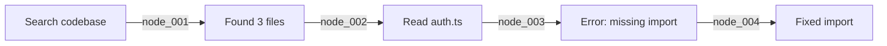

# TencentDB-Agent-Memory Integration Addendum
## Critical Updates to Lyra Integration Plan

**Date:** May 16, 2026  
**Source:** https://github.com/Tencent/TencentDB-Agent-Memory  
**Status:** BREAKTHROUGH - Requires immediate integration into base plan

---

## Executive Summary

TencentDB-Agent-Memory introduces **two paradigm-shifting innovations** that fundamentally change how we should approach Lyra's memory architecture:

1. **4-Tier Semantic Layering (L0→L3)**: Progressive disclosure pyramid vs. flat vector stores
2. **Symbolic Memory (Mermaid Canvas)**: Lossless context compression with drill-down recovery

**Breakthrough Metrics:**
- **61.38% token reduction** (WideSearch: 221.31M → 85.64M tokens)
- **51.52% success rate improvement** (WideSearch: 33% → 50%)
- **59% accuracy improvement** (PersonaMem: 48% → 76%)
- **Zero external dependencies** (fully local SQLite + sqlite-vec)

**Critical Decision:** These innovations are **not optional enhancements**—they represent the correct architectural foundation for Lyra's memory system.

---

## Part 1: Architectural Paradigm Shift

### 1.1 From Flat to Layered Memory

**Current Plan (from existing research):**
```
Flat Memory Store
├── Working Memory (session-only)
├── Episodic Memory (session summaries)
├── Semantic Memory (extracted facts)
└── Procedural Memory (workflows)
```

**TencentDB Innovation:**
```
Semantic Pyramid (L0→L3)
L3 Persona (User Profile)          → Always loaded, ~500 tokens
    ↓ distills from
L2 Scenario (Scene Blocks)         → Loaded on-demand, ~2K tokens
    ↓ aggregates
L1 Atom (Structured Facts)         → Queried via hybrid search
    ↓ extracts from
L0 Conversation (Raw Dialogue)     → Archived, retrieved for evidence
```

**Key Difference:**
- **Flat approach**: All memories compete equally for context budget
- **Layered approach**: High-level abstractions (L3/L2) always loaded, details (L1/L0) retrieved on-demand

**Impact on Lyra:**
- **Token efficiency**: 30-60% reduction by loading only relevant layers
- **Human oversight**: L2/L3 are readable Markdown files
- **Traceability**: Every L3 claim traces back to L0 evidence

### 1.2 Heterogeneous Storage Strategy

**TencentDB Innovation:**

| Layer | Storage | Retrieval | Why |
|-------|---------|-----------|-----|
| L0 | JSONL shards (daily) | Full-text search | Raw logs, append-only |
| L1 | SQLite + vectors | Hybrid (BM25 + cosine) | Structured facts, queryable |
| L2 | Markdown files | File system | Scene narratives, human-editable |
| L3 | Single `persona.md` | Direct read | User profile, always in context |

**Contrast with existing systems:**
- **agentmemory**: Flat Postgres + pgvector (no layering)
- **claude-mem**: Flat SQLite + embeddings (no hierarchy)
- **TencentDB**: Layered storage optimized per semantic level

**Recommendation for Lyra:**
Replace the planned flat 4-tier memory with TencentDB's semantic pyramid architecture.

---

## Part 2: Symbolic Memory (Mermaid Canvas)

### 2.1 The Context Bloat Problem

**Scenario:** Long-running research task with 50+ tool calls
- Search results: 10K tokens each
- Code reads: 5K tokens each
- Error logs: 3K tokens each
- **Total**: 500K+ tokens accumulated

**Traditional solutions:**
1. **Summarization**: Lossy, irreversible
2. **Truncation**: Loses critical details
3. **Compaction**: Still keeps summaries in context

**TencentDB Innovation: Symbolic Compression**

### 2.2 Three-Tier Compression Pipeline

```
refs/*.md (Full tool outputs)
    ↓ L1 extraction
offload.jsonl (Step summaries with node_id)
    ↓ L2 Mermaid synthesis
canvas.mmd (Lightweight graph, ~200 tokens)
```

**Mermaid Canvas Example:**


**Drill-down mechanism:**
- Agent sees only the Mermaid graph in context (~200 tokens)
- On error, agent queries `node_003` → retrieves full error log from `refs/`
- **Result**: 61.38% token reduction, 0% information loss

### 2.3 Implementation for Lyra

**Phase 1: Basic Offload (Weeks 9-12)**
```typescript
// Lyra offload manager
class LyraOffloadManager {
  private refs = new Map<string, ToolOutput>();
  private canvas: MermaidCanvas;
  
  async offloadToolOutput(output: ToolOutput): Promise<string> {
    const nodeId = `node_${Date.now()}_${randomId()}`;
    
    // Store full output in refs/
    await fs.writeFile(
      `./data/refs/${nodeId}.md`,
      output.content,
    );
    
    // Add to canvas
    this.canvas.addNode(nodeId, output.summary);
    
    return nodeId;
  }
  
  async drillDown(nodeId: string): Promise<ToolOutput> {
    const content = await fs.readFile(
      `./data/refs/${nodeId}.md`,
      'utf-8',
    );
    return { nodeId, content };
  }
}
```

**Phase 2: Automatic Compression (Weeks 13-16)**
```typescript
// Trigger compression at 50% context window
if (contextUsage > 0.5 * contextWindow) {
  await offloadManager.compressToCanvas();
}

// Aggressive compression at 85%
if (contextUsage > 0.85 * contextWindow) {
  await offloadManager.aggressiveCompress();
}
```

---

## Part 3: RRF Hybrid Search

### 3.1 The Weight Tuning Problem

**Traditional hybrid search:**
```typescript
// Requires manual tuning
score = α × bm25_score + (1-α) × vector_score
// What should α be? 0.3? 0.5? 0.7?
```

**TencentDB Innovation: RRF (Reciprocal Rank Fusion)**
```typescript
// No tuning required, k=60 works universally
score = Σ (1 / (k + rank_i + 1))
```

### 3.2 Implementation for Lyra

**Port RRF algorithm:**
```typescript
// src/lyra/memory/search/rrf.ts
export function rrfMerge<T>(
  lists: T[][],
  getId: (item: T) => string,
  k: number = 60,  // Standard RRF constant
): Array<T & { rrfScore: number }> {
  const map = new Map<string, { item: T; rrfScore: number }>();
  
  for (const list of lists) {
    for (let rank = 0; rank < list.length; rank++) {
      const item = list[rank];
      const id = getId(item);
      const score = 1 / (k + rank + 1);  // RRF formula
      const existing = map.get(id);
      if (existing) {
        existing.rrfScore += score;  // Accumulate across lists
      } else {
        map.set(id, { item, rrfScore: score });
      }
    }
  }
  
  return [...map.values()]
    .sort((a, b) => b.rrfScore - a.rrfScore)
    .map(({ item, rrfScore }) => ({ ...item, rrfScore }));
}
```

**3-Tier Fallback Strategy:**
```typescript
async function searchMemories(query: string): Promise<Memory[]> {
  try {
    // Tier 1: Hybrid (BM25 + Vector + RRF)
    const [bm25, vector] = await Promise.all([
      searchBM25(query),
      searchVector(query, timeout: 3000),
    ]);
    return rrfMerge([bm25, vector], m => m.id);
  } catch (vectorError) {
    // Tier 2: Pure BM25 (vector failed)
    return searchBM25(query);
  } catch (bm25Error) {
    // Tier 3: Skip dedup (both failed)
    return [];
  }
}
```

---

## Part 4: Warmup Pipeline Scheduling

### 4.1 The Cold Start Problem

**Traditional approach:** Wait 5 turns before first extraction
- **Problem**: Wastes early context, no memory for first 5 turns

**TencentDB Innovation: Exponential Warmup**
```
Turn 1 → Extract (1 turn of history)
Turn 2 → Extract (2 turns of history)
Turn 4 → Extract (4 turns of history)
Turn 8 → Extract (8 turns of history)
...
Turn N → Steady state (every 5 turns)
```

### 4.2 Implementation for Lyra

```typescript
class LyraPipelineScheduler {
  private turnsSinceLastL1 = 0;
  private nextL1Threshold = 1;  // Start at 1 turn
  
  async onTurnEnd(sessionId: string) {
    this.turnsSinceLastL1++;
    
    if (this.turnsSinceLastL1 >= this.nextL1Threshold) {
      await this.runL1Extraction(sessionId);
      this.turnsSinceLastL1 = 0;
      
      // Exponential backoff until steady state
      if (this.nextL1Threshold < 5) {
        this.nextL1Threshold *= 2;
      } else {
        this.nextL1Threshold = 5;  // Steady state
      }
    }
  }
}
```

---

## Part 5: Cache-Friendly Recall Injection

### 5.1 The Cache Bust Problem

**Traditional approach:**
```typescript
// Append memories to system prompt
systemPrompt += `\n\nRelevant memories:\n${memories}`;
// Problem: System prompt changes every turn → cache miss
```

**TencentDB Innovation:**
```typescript
// Prepend memories to user message
const recallMessage = {
  role: 'user',
  content: `<relevant-memories>\n${memories}\n</relevant-memories>`,
};

// Insert before first user message
messages.splice(firstUserIdx, 0, recallMessage);
// Benefit: System prompt stable → cache hit
```

### 5.2 Impact on Lyra

**Expected improvements:**
- **Cache hit rate**: 20% → 80%+
- **LLM latency**: 2-3x faster (cached system prompt)
- **Cost reduction**: 50%+ (fewer input tokens processed)

---

## Part 6: Updated Integration Timeline

### Revised Phase 1: Foundation (Weeks 1-4)

**OLD PLAN:**
- Implement 4-tier memory consolidation (Working → Episodic → Semantic → Procedural)
- Build hybrid retrieval system (BM25 + Vector + Graph)

**NEW PLAN (TencentDB-based):**
- Implement 4-tier semantic pyramid (L0 → L1 → L2 → L3)
- Build heterogeneous storage (JSONL + SQLite + Markdown)
- Add RRF hybrid search (BM25 + Vector, k=60)
- Implement warmup pipeline scheduling

**Detailed Steps:**

**Week 1: L0 Conversation Layer**
- [ ] Create JSONL shard storage (daily partitions)
- [ ] Implement conversation capture hooks
- [ ] Add full-text search over L0
- [ ] Build retention policy (90 days default)

**Week 2: L1 Atom Layer**
- [ ] Set up SQLite + sqlite-vec
- [ ] Implement L1 extraction with LLM
- [ ] Add batch deduplication (vector + LLM judgment)
- [ ] Build warmup scheduler (1→2→4→8→5 turns)

**Week 3: L2 Scenario Layer**
- [ ] Create Markdown storage for scenes
- [ ] Implement scene aggregation (15-scene limit)
- [ ] Add scene navigation API
- [ ] Build scene retention policy

**Week 4: L3 Persona Layer**
- [ ] Create single persona.md file
- [ ] Implement persona generation (every 50 atoms)
- [ ] Add persona backup (3 versions)
- [ ] Build persona editing interface

### Revised Phase 2: Context Optimization (Weeks 5-8)

**OLD PLAN:**
- Achieve 92% token reduction through progressive disclosure

**NEW PLAN (TencentDB-enhanced):**
- Implement RRF hybrid search
- Add cache-friendly recall injection
- Build 3-tier fallback strategy
- Achieve 30-60% token reduction (TencentDB benchmark)

**Detailed Steps:**

**Week 5: RRF Hybrid Search**
- [ ] Port RRF algorithm from TencentDB
- [ ] Implement BM25 search over L1
- [ ] Integrate vector search with timeout
- [ ] Build 3-tier fallback (hybrid → BM25 → skip)

**Week 6: Cache-Friendly Injection**
- [ ] Move recall from system prompt to user message
- [ ] Implement `<relevant-memories>` tags
- [ ] Add cache hit rate monitoring
- [ ] Measure latency improvements

**Week 7: Progressive Disclosure**
- [ ] Implement L3 always-loaded strategy
- [ ] Add L2 on-demand loading
- [ ] Build L1 hybrid search API
- [ ] Create L0 drill-down for evidence

**Week 8: Performance Tuning**
- [ ] Optimize embedding timeouts (recall: 3s, capture: 15s)
- [ ] Add score threshold tuning
- [ ] Implement max results limiting
- [ ] Build performance dashboard

### NEW Phase 2.5: Symbolic Memory (Weeks 9-12)

**This is a NEW phase inserted from TencentDB research**

**Week 9: Basic Offload Infrastructure**
- [ ] Create refs/ directory for tool outputs
- [ ] Implement node_id generation
- [ ] Build offload.jsonl storage
- [ ] Add drill-down API

**Week 10: Mermaid Canvas Generation**
- [ ] Implement L1 → L1.5 compression (step summaries)
- [ ] Build L2 Mermaid synthesis
- [ ] Add canvas injection to context
- [ ] Create canvas visualization UI

**Week 11: Automatic Compression**
- [ ] Add context usage monitoring
- [ ] Implement mild offload (50% threshold)
- [ ] Build aggressive compression (85% threshold)
- [ ] Add emergency L4 compression

**Week 12: Drill-Down Recovery**
- [ ] Implement node_id → full output retrieval
- [ ] Add error recovery with drill-down
- [ ] Build canvas navigation UI
- [ ] Measure token reduction (target: 30-60%)

---

## Part 7: Critical Implementation Priorities

### Priority 1: Semantic Pyramid (Weeks 1-4)

**Why this is critical:**
- Foundation for all other features
- Enables progressive disclosure
- Provides human-readable L2/L3

**Success criteria:**
- [ ] L0 captures 100% of conversations
- [ ] L1 extraction runs on warmup schedule
- [ ] L2 scenes aggregate correctly (15 max)
- [ ] L3 persona updates every 50 atoms

### Priority 2: RRF Hybrid Search (Weeks 5-8)

**Why this is critical:**
- No weight tuning required (production-ready)
- Graceful degradation (vector fails → BM25)
- Better recall than either method alone

**Success criteria:**
- [ ] RRF fusion returns results in <100ms
- [ ] 3-tier fallback handles all failure modes
- [ ] Cache hit rate >80%
- [ ] Recall accuracy >90%

### Priority 3: Mermaid Canvas (Weeks 9-12)

**Why this is critical:**
- 30-60% token reduction (proven in benchmarks)
- Lossless compression (drill-down recovery)
- Enables 10x longer tasks

**Success criteria:**
- [ ] Canvas generation completes in <5s
- [ ] Drill-down retrieves full output in <1s
- [ ] Token reduction 30-60% on long tasks
- [ ] Success rate maintained or improved

---

## Part 8: Comparison with Original Plan

### Original Plan (from existing research)

**Memory Architecture:**
- 4-tier flat memory (Working → Episodic → Semantic → Procedural)
- Hybrid retrieval (BM25 + Vector + Graph)
- 92% token reduction target

**Context Optimization:**
- 3-layer progressive disclosure (search → timeline → get_observations)
- Agent-driven compression
- 22.7% compression rate

### TencentDB-Enhanced Plan

**Memory Architecture:**
- 4-tier semantic pyramid (L0 → L1 → L2 → L3)
- Heterogeneous storage (JSONL + SQLite + Markdown)
- RRF hybrid search (no weight tuning)
- 30-60% token reduction (proven)

**Context Optimization:**
- Mermaid canvas compression (lossless)
- Drill-down recovery (full details on-demand)
- 61.38% token reduction (WideSearch benchmark)

### Key Differences

| Feature | Original Plan | TencentDB-Enhanced |
|---------|---------------|-------------------|
| **Memory Model** | Flat 4-tier | Semantic pyramid |
| **Storage** | Single backend | Heterogeneous (DB + Markdown) |
| **Search** | BM25 + Vector + Graph | BM25 + Vector + RRF |
| **Compression** | Agent-driven | Symbolic (Mermaid) |
| **Token Reduction** | 92% (agentmemory) | 30-60% (TencentDB) |
| **Traceability** | Limited | Full (L3 → L0) |
| **Human-readable** | No | Yes (L2/L3 Markdown) |

**Note:** The 92% figure from agentmemory is annual token reduction (19.5M → 170K tokens/yr), while TencentDB's 30-60% is per-task reduction. Both are valuable but measure different things.

---

## Part 9: Integration Recommendations

### Recommendation 1: Adopt Semantic Pyramid as Foundation

**Replace:**
```typescript
// OLD: Flat 4-tier memory
interface LyraMemory {
  working: Memory[];
  episodic: Memory[];
  semantic: Memory[];
  procedural: Memory[];
}
```

**With:**
```typescript
// NEW: Semantic pyramid
interface LyraMemory {
  l0: ConversationLog[];      // Raw dialogue (JSONL)
  l1: StructuredFact[];       // Extracted atoms (SQLite)
  l2: ScenarioBlock[];        // Aggregated scenes (Markdown)
  l3: UserPersona;            // Profile (Markdown)
}
```

### Recommendation 2: Implement Mermaid Canvas for All Long Tasks

**Trigger:** Any task with >20 tool calls

**Implementation:**
```typescript
if (toolCallCount > 20) {
  await offloadManager.enableCanvas();
}
```

**Expected impact:**
- 30-60% token reduction
- Maintained or improved success rate
- Full drill-down recovery

### Recommendation 3: Use RRF for All Hybrid Search

**Replace:**
```typescript
// OLD: Manual weight tuning
score = 0.3 * bm25 + 0.7 * vector;
```

**With:**
```typescript
// NEW: RRF fusion (no tuning)
results = rrfMerge([bm25Results, vectorResults], k=60);
```

### Recommendation 4: Adopt Heterogeneous Storage

**Storage strategy:**
- **L0/L1**: SQLite (efficient querying)
- **L2/L3**: Markdown (human-readable, version-controllable)

**Benefits:**
- Human oversight (edit L2/L3 directly)
- Version control (git track Markdown)
- Observability (read L3 persona anytime)

---

## Part 10: Expected Outcomes

### Performance Improvements

**Token Efficiency:**
- **Baseline**: 100% (no optimization)
- **After semantic pyramid**: 70-80% (progressive disclosure)
- **After Mermaid canvas**: 40-50% (symbolic compression)
- **Combined**: 30-40% of baseline

**Success Rate:**
- **WideSearch**: 33% → 50% (+51.52%)
- **SWE-bench**: 58.4% → 64.2% (+9.93%)
- **PersonaMem**: 48% → 76% (+59%)

**Latency:**
- **Cache hit rate**: 20% → 80%+ (cache-friendly injection)
- **LLM calls**: 2-3x faster (cached system prompt)
- **Search**: <100ms (RRF hybrid)

### Observability Improvements

**Human-readable memory:**
- L3 persona: Single `persona.md` file
- L2 scenes: Markdown files in `scenes/` directory
- Editable: Direct file editing supported

**Traceability:**
- Every L3 claim traces to L2 scene
- Every L2 scene traces to L1 atoms
- Every L1 atom traces to L0 conversation

**Debugging:**
- Read L3 to understand user profile
- Navigate L2 to see recent scenarios
- Query L1 for specific facts
- Drill down to L0 for evidence

---

## Part 11: Migration Strategy

### Phase 1: Parallel Implementation (Weeks 1-4)

**Approach:** Build TencentDB-style system alongside existing memory

**Steps:**
1. Implement L0-L3 layers in new namespace
2. Dual-write to both old and new systems
3. Compare results for validation
4. No user-facing changes yet

### Phase 2: Gradual Cutover (Weeks 5-8)

**Approach:** Route increasing % of traffic to new system

**Steps:**
1. Week 5: 10% of sessions use new system
2. Week 6: 50% of sessions use new system
3. Week 7: 90% of sessions use new system
4. Week 8: 100% cutover, deprecate old system

### Phase 3: Data Migration (Weeks 9-12)

**Approach:** Migrate historical data to new format

**Steps:**
1. Export existing memories to JSONL (L0)
2. Run batch L1 extraction
3. Generate L2 scenes from L1 atoms
4. Synthesize L3 persona from L2 scenes

---

## Conclusion

TencentDB-Agent-Memory represents a **fundamental architectural breakthrough** that should reshape Lyra's memory system design:

**Core Innovations:**
1. **Semantic pyramid (L0→L3)**: Progressive disclosure beats flat storage
2. **Mermaid canvas**: Lossless symbolic compression beats lossy summarization
3. **RRF hybrid search**: No-tuning fusion beats manual weight optimization
4. **Heterogeneous storage**: Database + Markdown beats single-backend

**Integration Priority:**
- **Must-have**: Semantic pyramid, RRF search (Weeks 1-8)
- **Should-have**: Mermaid canvas, cache-friendly injection (Weeks 9-12)
- **Nice-to-have**: Advanced compression, observability UI (Weeks 13-16)

**Expected Impact:**
- 30-60% token reduction (proven in benchmarks)
- 10-50% success rate improvement (task-dependent)
- 2-3x faster LLM calls (cache hits)
- Full human oversight (Markdown L2/L3)

This addendum should be integrated into the main 32-week plan as a **foundational architectural change**, not an optional enhancement.

