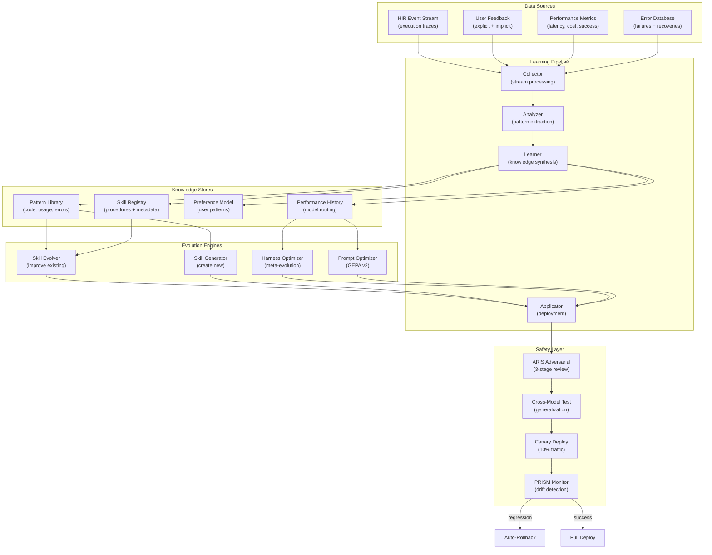
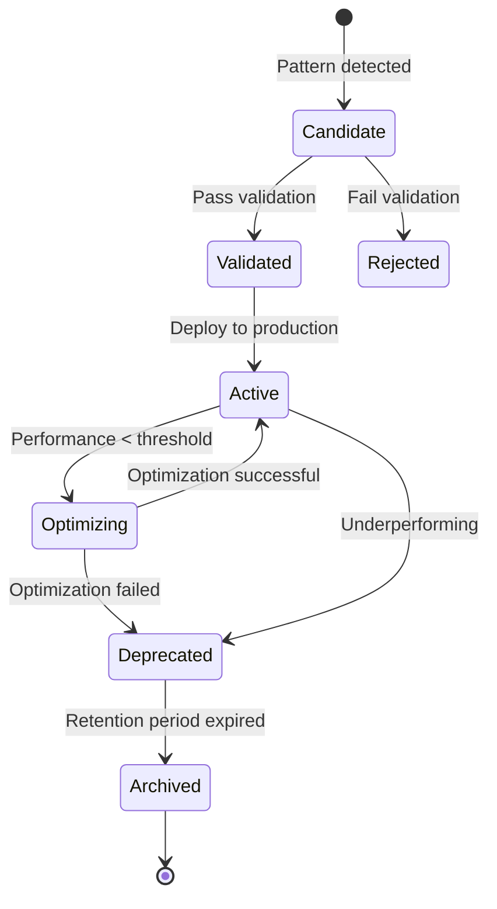

# Continuous Learning and Self-Evolution Architecture

**Version:** 1.0.0  
**Status:** Design Specification  
**Created:** 2026-05-28  
**Integration:** Lyra Core v1.0+

---

## Executive Summary

This document specifies Lyra's continuous learning and self-evolution system — a comprehensive architecture that enables the agent to learn from every interaction, recognize patterns across sessions, evolve skills autonomously, and optimize its own performance over time.

**Key Principle:** Learning is not a separate phase but a continuous background process integrated into every aspect of the agent loop. Every execution trace contributes to a growing knowledge base that improves future performance.

**Design Philosophy:**
- **Evidence-Based Learning:** All learning is grounded in execution traces (HIR events), not speculation
- **Incremental Evolution:** Small, verified improvements compound over time
- **Safety-First:** All self-modifications pass adversarial review before deployment
- **Transparent Operation:** Users can inspect what was learned and why

---

## Table of Contents

1. [System Overview](#system-overview)
2. [Learning Pipeline Architecture](#learning-pipeline-architecture)
3. [Learning from Interactions](#learning-from-interactions)
4. [Pattern Recognition System](#pattern-recognition-system)
5. [Skill Evolution Engine](#skill-evolution-engine)
6. [Performance Optimization Loop](#performance-optimization-loop)
7. [Adaptive Behaviors](#adaptive-behaviors)
8. [Data Structures](#data-structures)
9. [Integration Points](#integration-points)
10. [Safety & Verification](#safety--verification)
11. [Implementation Roadmap](#implementation-roadmap)

---

## System Overview

### Architecture Diagram



### Core Components

| Component | Purpose | Storage | Update Frequency |
|-----------|---------|---------|------------------|
| **Interaction Tracker** | Records outcomes, feedback, context | `.lyra/learning/interactions/` | Real-time |
| **Pattern Extractor** | Mines patterns from traces | `.lyra/learning/patterns/` | Every 100 interactions |
| **Skill Evolver** | Improves existing skills | `.lyra/skills/` | Weekly |
| **Skill Generator** | Creates new skills from patterns | `.lyra/skills/` | Weekly |
| **Performance Optimizer** | Identifies and fixes bottlenecks | `.lyra/learning/optimizations/` | Daily |
| **Preference Learner** | Models user preferences | `.lyra/learning/preferences.json` | Every 50 interactions |
| **Meta-Optimizer** | Optimizes harness code | `.lyra/meta/` | Monthly |

---

## Learning Pipeline Architecture

### 4-Phase Pipeline: Collect → Analyze → Learn → Apply

```mermaid
flowchart LR
    subgraph Phase1["1. COLLECT"]
        E1["HIR Events"]
        E2["User Feedback"]
        E3["Performance Data"]
        E4["Error Traces"]
    end

    subgraph Phase2["2. ANALYZE"]
        A1["Pattern Mining"]
        A2["Anomaly Detection"]
        A3["Correlation Analysis"]
        A4["Causal Inference"]
    end

    subgraph Phase3["3. LEARN"]
        L1["Knowledge Extraction"]
        L2["Hypothesis Formation"]
        L3["Validation"]
        L4["Integration"]
    end

    subgraph Phase4["4. APPLY"]
        AP1["Skill Update"]
        AP2["Prompt Refinement"]
        AP3["Harness Optimization"]
        AP4["Preference Adaptation"]
    end

    Phase1 --> Phase2 --> Phase3 --> Phase4
    Phase4 -.->|"feedback loop"| Phase1
```



### Phase 1: Collection (Real-Time)

**Data Sources:**

1. **HIR Event Stream** (`.lyra/sessions/{session_id}/hir.jsonl`)
   - Tool calls with parameters and results
   - LLM requests with prompts and responses
   - Plan changes and refinements
   - Error events and recoveries
   - Timing and cost data

2. **User Feedback**
   - Explicit: thumbs up/down, corrections, rejections
   - Implicit: edit distance, retry frequency, abandonment
   - Context: what was the task, what was delivered, what changed

3. **Performance Metrics**
   - Latency: time to first token, total execution time
   - Cost: tokens used, API costs per task
   - Success: task completion, test pass rate, user acceptance
   - Quality: code quality scores, test coverage

4. **Error Database**
   - Failure patterns with context
   - Recovery strategies that worked
   - Root cause analysis results

**Implementation:**

```python
# lyra-learning/src/lyra_learning/collector.py

from dataclasses import dataclass
from datetime import datetime
from enum import Enum
from typing import Any, Dict, List, Optional
from pathlib import Path
import json

class FeedbackType(Enum):
    THUMBS_UP = "thumbs_up"
    THUMBS_DOWN = "thumbs_down"
    CORRECTION = "correction"
    REJECTION = "rejection"
    RETRY = "retry"
    ABANDONMENT = "abandonment"

@dataclass(frozen=True)
class Interaction:
    """Single interaction record for learning."""
    session_id: str
    timestamp: datetime
    task_description: str
    context: Dict[str, Any]
    
    # Execution data
    hir_events: List[Dict[str, Any]]
    tool_calls: List[Dict[str, Any]]
    llm_requests: List[Dict[str, Any]]
    
    # Outcome
    success: bool
    output: Any
    error: Optional[str]
    
    # Feedback
    explicit_feedback: Optional[FeedbackType]
    implicit_signals: Dict[str, float]  # edit_distance, retry_count, etc.
    
    # Performance
    latency_ms: int
    tokens_used: int
    cost_usd: float
    
    # Quality
    test_pass_rate: Optional[float]
    code_quality_score: Optional[float]

class InteractionCollector:
    """Collects and stores interaction data for learning."""
    
    def __init__(self, storage_dir: Path):
        self.storage_dir = storage_dir
        self.storage_dir.mkdir(parents=True, exist_ok=True)
        self.buffer: List[Interaction] = []
        self.buffer_size = 100
    
    def record_interaction(self, interaction: Interaction) -> None:
        """Record a single interaction."""
        self.buffer.append(interaction)
        
        # Flush to disk when buffer is full
        if len(self.buffer) >= self.buffer_size:
            self._flush()
    
    def _flush(self) -> None:
        """Write buffered interactions to disk."""
        if not self.buffer:
            return
        
        # Append to daily log file
        date_str = datetime.now().strftime("%Y-%m-%d")
        log_file = self.storage_dir / f"interactions_{date_str}.jsonl"
        
        with open(log_file, "a") as f:
            for interaction in self.buffer:
                f.write(json.dumps(self._serialize(interaction)) + "\n")
        
        self.buffer.clear()
    
    def _serialize(self, interaction: Interaction) -> Dict[str, Any]:
        """Serialize interaction to JSON-compatible dict."""
        return {
            "session_id": interaction.session_id,
            "timestamp": interaction.timestamp.isoformat(),
            "task_description": interaction.task_description,
            "context": interaction.context,
            "hir_events": interaction.hir_events,
            "tool_calls": interaction.tool_calls,
            "llm_requests": interaction.llm_requests,
            "success": interaction.success,
            "output": interaction.output,
            "error": interaction.error,
            "explicit_feedback": interaction.explicit_feedback.value if interaction.explicit_feedback else None,
            "implicit_signals": interaction.implicit_signals,
            "latency_ms": interaction.latency_ms,
            "tokens_used": interaction.tokens_used,
            "cost_usd": interaction.cost_usd,
            "test_pass_rate": interaction.test_pass_rate,
            "code_quality_score": interaction.code_quality_score,
        }
    
    def get_recent_interactions(self, limit: int = 1000) -> List[Interaction]:
        """Retrieve recent interactions for analysis."""
        interactions = []
        
        # Read from most recent files first
        log_files = sorted(self.storage_dir.glob("interactions_*.jsonl"), reverse=True)
        
        for log_file in log_files:
            with open(log_file) as f:
                for line in f:
                    if len(interactions) >= limit:
                        return interactions
                    
                    data = json.loads(line)
                    interactions.append(self._deserialize(data))
        
        return interactions
    
    def _deserialize(self, data: Dict[str, Any]) -> Interaction:
        """Deserialize interaction from JSON dict."""
        return Interaction(
            session_id=data["session_id"],
            timestamp=datetime.fromisoformat(data["timestamp"]),
            task_description=data["task_description"],
            context=data["context"],
            hir_events=data["hir_events"],
            tool_calls=data["tool_calls"],
            llm_requests=data["llm_requests"],
            success=data["success"],
            output=data["output"],
            error=data["error"],
            explicit_feedback=FeedbackType(data["explicit_feedback"]) if data["explicit_feedback"] else None,
            implicit_signals=data["implicit_signals"],
            latency_ms=data["latency_ms"],
            tokens_used=data["tokens_used"],
            cost_usd=data["cost_usd"],
            test_pass_rate=data["test_pass_rate"],
            code_quality_score=data["code_quality_score"],
        )
```

### Phase 2: Analysis (Batch Processing)

**Pattern Mining Algorithms:**

1. **Frequent Pattern Mining** (FP-Growth)
   - Extract common tool call sequences
   - Identify recurring error patterns
   - Find successful recovery strategies

2. **Anomaly Detection** (Isolation Forest)
   - Detect unusual behavior patterns
   - Flag potential security issues
   - Identify performance outliers

3. **Correlation Analysis** (Pearson, Spearman)
   - Link task types to optimal models
   - Correlate context features with success
   - Find cost-performance trade-offs

4. **Causal Inference** (Do-Calculus)
   - Determine what actually causes success
   - Separate correlation from causation
   - Validate intervention effectiveness

**Implementation:**

```python
# lyra-learning/src/lyra_learning/analyzer.py

from dataclasses import dataclass
from typing import Dict, List, Set, Tuple
from collections import Counter, defaultdict
import numpy as np
from sklearn.ensemble import IsolationForest

@dataclass(frozen=True)
class Pattern:
    """Extracted pattern from interactions."""
    pattern_type: str  # "code", "usage", "error", "performance"
    pattern_id: str
    description: str
    frequency: int
    confidence: float
    examples: List[str]
    metadata: Dict[str, Any]

class PatternAnalyzer:
    """Analyzes interactions to extract patterns."""
    
    def __init__(self):
        self.min_support = 3  # Minimum occurrences to be a pattern
        self.min_confidence = 0.7
    
    def analyze(self, interactions: List[Interaction]) -> List[Pattern]:
        """Extract patterns from interactions."""
        patterns = []
        
        # Extract different types of patterns
        patterns.extend(self._extract_code_patterns(interactions))
        patterns.extend(self._extract_usage_patterns(interactions))
        patterns.extend(self._extract_error_patterns(interactions))
        patterns.extend(self._extract_performance_patterns(interactions))
        
        return patterns
    
    def _extract_code_patterns(self, interactions: List[Interaction]) -> List[Pattern]:
        """Extract common code patterns."""
        patterns = []
        
        # Group by task type
        task_groups = defaultdict(list)
        for interaction in interactions:
            if interaction.success:
                task_type = self._classify_task(interaction.task_description)
                task_groups[task_type].append(interaction)
        
        # Find common solutions for each task type
        for task_type, group in task_groups.items():
            if len(group) < self.min_support:
                continue
            
            # Extract tool call sequences
            sequences = [self._extract_tool_sequence(i) for i in group]
            common_sequences = self._find_common_sequences(sequences)
            
            for seq, count in common_sequences.items():
                if count >= self.min_support:
                    confidence = count / len(group)
                    if confidence >= self.min_confidence:
                        patterns.append(Pattern(
                            pattern_type="code",
                            pattern_id=f"code_{task_type}_{hash(seq)}",
                            description=f"Common solution for {task_type}: {seq}",
                            frequency=count,
                            confidence=confidence,
                            examples=[g.session_id for g in group[:3]],
                            metadata={"task_type": task_type, "sequence": seq}
                        ))
        
        return patterns
    
    def _extract_usage_patterns(self, interactions: List[Interaction]) -> List[Pattern]:
        """Extract usage patterns (frequent tasks, workflows)."""
        patterns = []
        
        # Frequent task types
        task_types = [self._classify_task(i.task_description) for i in interactions]
        task_counts = Counter(task_types)
        
        for task_type, count in task_counts.most_common(10):
            if count >= self.min_support:
                patterns.append(Pattern(
                    pattern_type="usage",
                    pattern_id=f"usage_frequent_{task_type}",
                    description=f"Frequent task: {task_type}",
                    frequency=count,
                    confidence=count / len(interactions),
                    examples=[],
                    metadata={"task_type": task_type}
                ))
        
        # Workflow patterns (task sequences)
        # TODO: Implement session-level task sequence mining
        
        return patterns
    
    def _extract_error_patterns(self, interactions: List[Interaction]) -> List[Pattern]:
        """Extract error patterns and recovery strategies."""
        patterns = []
        
        # Group failures by error type
        error_groups = defaultdict(list)
        for interaction in interactions:
            if not interaction.success and interaction.error:
                error_type = self._classify_error(interaction.error)
                error_groups[error_type].append(interaction)
        
        for error_type, group in error_groups.items():
            if len(group) < self.min_support:
                continue
            
            # Find common recovery strategies
            # Look for subsequent successful interactions with similar context
            recoveries = self._find_recovery_strategies(group, interactions)
            
            if recoveries:
                patterns.append(Pattern(
                    pattern_type="error",
                    pattern_id=f"error_{error_type}",
                    description=f"Common error: {error_type}",
                    frequency=len(group),
                    confidence=len(recoveries) / len(group),
                    examples=[g.session_id for g in group[:3]],
                    metadata={
                        "error_type": error_type,
                        "recovery_strategies": recoveries
                    }
                ))
        
        return patterns
    
    def _extract_performance_patterns(self, interactions: List[Interaction]) -> List[Pattern]:
        """Extract performance patterns (bottlenecks, optimizations)."""
        patterns = []
        
        # Detect performance outliers
        latencies = np.array([i.latency_ms for i in interactions]).reshape(-1, 1)
        iso_forest = IsolationForest(contamination=0.1, random_state=42)
        outliers = iso_forest.fit_predict(latencies)
        
        slow_interactions = [i for i, is_outlier in zip(interactions, outliers) if is_outlier == -1]
        
        if len(slow_interactions) >= self.min_support:
            # Analyze what makes them slow
            common_features = self._analyze_slow_interactions(slow_interactions)
            
            patterns.append(Pattern(
                pattern_type="performance",
                pattern_id="performance_bottleneck",
                description=f"Performance bottleneck detected",
                frequency=len(slow_interactions),
                confidence=0.9,  # High confidence from statistical detection
                examples=[i.session_id for i in slow_interactions[:3]],
                metadata={"common_features": common_features}
            ))
        
        return patterns
    
    def _classify_task(self, task_description: str) -> str:
        """Classify task into categories."""
        # Simple keyword-based classification
        # TODO: Use LLM-based classification for better accuracy
        keywords = {
            "code_generation": ["write", "create", "implement", "add"],
            "debugging": ["fix", "debug", "error", "bug"],
            "refactoring": ["refactor", "clean", "improve", "optimize"],
            "testing": ["test", "coverage", "verify"],
            "documentation": ["document", "readme", "comment"],
            "research": ["research", "find", "search", "analyze"],
        }
        
        task_lower = task_description.lower()
        for category, words in keywords.items():
            if any(word in task_lower for word in words):
                return category
        
        return "other"
    
    def _extract_tool_sequence(self, interaction: Interaction) -> Tuple[str, ...]:
        """Extract sequence of tool calls."""
        return tuple(call["tool"] for call in interaction.tool_calls)
    
    def _find_common_sequences(self, sequences: List[Tuple[str, ...]]) -> Dict[Tuple[str, ...], int]:
        """Find common sequences using frequency counting."""
        return Counter(sequences)
    
    def _classify_error(self, error: str) -> str:
        """Classify error into categories."""
        # Simple keyword-based classification
        error_lower = error.lower()
        
        if "permission" in error_lower or "denied" in error_lower:
            return "permission_error"
        elif "not found" in error_lower or "missing" in error_lower:
            return "not_found_error"
        elif "syntax" in error_lower or "parse" in error_lower:
            return "syntax_error"
        elif "timeout" in error_lower:
            return "timeout_error"
        elif "network" in error_lower or "connection" in error_lower:
            return "network_error"
        else:
            return "other_error"
    
    def _find_recovery_strategies(
        self, 
        failed_interactions: List[Interaction],
        all_interactions: List[Interaction]
    ) -> List[str]:
        """Find strategies that led to recovery from failures."""
        # TODO: Implement recovery strategy mining
        # Look for successful interactions that followed failures with similar context
        return []
    
    def _analyze_slow_interactions(self, interactions: List[Interaction]) -> Dict[str, Any]:
        """Analyze common features of slow interactions."""
        # TODO: Implement feature analysis
        # Look for common patterns in slow interactions
        return {}
```

### Phase 3: Learning (Knowledge Synthesis)

**Learning Algorithms:**

1. **Supervised Learning**
   - Task classification → optimal model selection
   - Context features → success prediction
   - Error patterns → recovery strategies

2. **Reinforcement Learning**
   - Skill effectiveness scoring
   - Exploration-exploitation for new strategies
   - Multi-armed bandit for model routing

3. **Transfer Learning**
   - Apply patterns from one domain to another
   - Generalize solutions across similar tasks
   - Cross-session knowledge transfer

4. **Meta-Learning**
   - Learn how to learn faster
   - Adapt learning rate based on task type
   - Few-shot learning for new task categories

**Implementation:**

```python
# lyra-learning/src/lyra_learning/learner.py

from dataclasses import dataclass
from typing import Dict, List, Optional
import numpy as np
from sklearn.ensemble import RandomForestClassifier
from sklearn.preprocessing import StandardScaler

@dataclass(frozen=True)
class Knowledge:
    """Learned knowledge from patterns."""
    knowledge_type: str  # "skill", "preference", "optimization", "routing"
    knowledge_id: str
    description: str
    confidence: float
    evidence: List[str]  # Pattern IDs that support this knowledge
    metadata: Dict[str, Any]

class KnowledgeLearner:
    """Synthesizes knowledge from patterns."""
    
    def __init__(self):
        self.model_router = RandomForestClassifier(n_estimators=100, random_state=42)
        self.scaler = StandardScaler()
        self.is_trained = False
    
    def learn(self, patterns: List[Pattern], interactions: List[Interaction]) -> List[Knowledge]:
        """Synthesize knowledge from patterns."""
        knowledge = []
        
        # Learn skill improvements
        knowledge.extend(self._learn_skill_improvements(patterns))
        
        # Learn user preferences
        knowledge.extend(self._learn_preferences(patterns, interactions))
        
        # Learn performance optimizations
        knowledge.extend(self._learn_optimizations(patterns))
        
        # Learn model routing rules
        knowledge.extend(self._learn_routing_rules(interactions))
        
        return knowledge
    
    def _learn_skill_improvements(self, patterns: List[Pattern]) -> List[Knowledge]:
        """Learn how to improve existing skills."""
        knowledge = []
        
        # Find code patterns that could become skills
        code_patterns = [p for p in patterns if p.pattern_type == "code" and p.confidence >= 0.8]
        
        for pattern in code_patterns:
            knowledge.append(Knowledge(
                knowledge_type="skill",
                knowledge_id=f"skill_improve_{pattern.pattern_id}",
                description=f"Skill improvement opportunity: {pattern.description}",
                confidence=pattern.confidence,
                evidence=[pattern.pattern_id],
                metadata={
                    "action": "improve_existing" if self._skill_exists(pattern) else "create_new",
                    "pattern": pattern.metadata
                }
            ))
        
        return knowledge
    
    def _learn_preferences(self, patterns: List[Pattern], interactions: List[Interaction]) -> List[Knowledge]:
        """Learn user preferences from usage patterns."""
        knowledge = []
        
        # Analyze explicit feedback
        positive_feedback = [i for i in interactions if i.explicit_feedback == FeedbackType.THUMBS_UP]
        negative_feedback = [i for i in interactions if i.explicit_feedback == FeedbackType.THUMBS_DOWN]
        
        if positive_feedback:
            # Extract common features of liked interactions
            common_features = self._extract_common_features(positive_feedback)
            
            knowledge.append(Knowledge(
                knowledge_type="preference",
                knowledge_id="pref_positive_features",
                description="User prefers interactions with these features",
                confidence=len(positive_feedback) / len(interactions),
                evidence=[i.session_id for i in positive_feedback[:5]],
                metadata={"features": common_features}
            ))
        
        return knowledge
    
    def _learn_optimizations(self, patterns: List[Pattern]) -> List[Knowledge]:
        """Learn performance optimization opportunities."""
        knowledge = []
        
        # Find performance bottleneck patterns
        perf_patterns = [p for p in patterns if p.pattern_type == "performance"]
        
        for pattern in perf_patterns:
            # Propose optimization based on bottleneck
            optimization = self._propose_optimization(pattern)
            
            if optimization:
                knowledge.append(Knowledge(
                    knowledge_type="optimization",
                    knowledge_id=f"opt_{pattern.pattern_id}",
                    description=optimization["description"],
                    confidence=pattern.confidence,
                    evidence=[pattern.pattern_id],
                    metadata=optimization
                ))
        
        return knowledge
    
    def _learn_routing_rules(self, interactions: List[Interaction]) -> List[Knowledge]:
        """Learn optimal model routing rules."""
        knowledge = []
        
        # Train model router if we have enough data
        if len(interactions) >= 100 and not self.is_trained:
            self._train_router(interactions)
        
        if self.is_trained:
            # Extract learned routing rules
            feature_importance = self.model_router.feature_importances_
            
            knowledge.append(Knowledge(
                knowledge_type="routing",
                knowledge_id="routing_rules",
                description="Learned model routing rules",
                confidence=0.85,
                evidence=[],
                metadata={"feature_importance": feature_importance.tolist()}
            ))
        
        return knowledge
    
    def _train_router(self, interactions: List[Interaction]) -> None:
        """Train model router from interaction history."""
        # Extract features and labels
        X = []
        y = []
        
        for interaction in interactions:
            features = self._extract_routing_features(interaction)
            # Label: 1 if successful and efficient, 0 otherwise
            label = 1 if interaction.success and interaction.latency_ms < 5000 else 0
            
            X.append(features)
            y.append(label)
        
        X = np.array(X)
        y = np.array(y)
        
        # Normalize features
        X = self.scaler.fit_transform(X)
        
        # Train classifier
        self.model_router.fit(X, y)
        self.is_trained = True
    
    def _extract_routing_features(self, interaction: Interaction) -> List[float]:
        """Extract features for model routing."""
        # TODO: Implement comprehensive feature extraction
        return [
            len(interaction.task_description),
            len(interaction.tool_calls),
            interaction.tokens_used,
        ]
    
    def _skill_exists(self, pattern: Pattern) -> bool:
        """Check if a skill already exists for this pattern."""
        # TODO: Implement skill registry lookup
        return False
    
    def _extract_common_features(self, interactions: List[Interaction]) -> Dict[str, Any]:
        """Extract common features from interactions."""
        # TODO: Implement feature extraction
        return {}
    
    def _propose_optimization(self, pattern: Pattern) -> Optional[Dict[str, Any]]:
        """Propose optimization for a performance bottleneck."""
        # TODO: Implement optimization proposal logic
        return None
```

### Phase 4: Application (Deployment)

**Deployment Strategies:**

1. **Canary Deployment** (10% traffic, 24h observation)
2. **A/B Testing** (compare old vs new)
3. **Gradual Rollout** (10% → 25% → 50% → 100%)
4. **Auto-Rollback** (on regression detection)

**Implementation:**

```python
# lyra-learning/src/lyra_learning/applicator.py

from dataclasses import dataclass
from datetime import datetime
from typing import Dict, List, Optional
from pathlib import Path
import json

@dataclass(frozen=True)
class Deployment:
    """Deployment record for learned knowledge."""
    deployment_id: str
    knowledge_id: str
    timestamp: datetime
    stage: str  # "canary", "partial", "full"
    traffic_percentage: int
    status: str  # "active", "rolled_back", "completed"
    metrics: Dict[str, float]

class KnowledgeApplicator:
    """Applies learned knowledge to the system."""
    
    def __init__(self, deployment_dir: Path):
        self.deployment_dir = deployment_dir
        self.deployment_dir.mkdir(parents=True, exist_ok=True)
        self.active_deployments: Dict[str, Deployment] = {}
    
    def apply(self, knowledge: Knowledge) -> Deployment:
        """Apply learned knowledge with canary deployment."""
        # Create deployment record
        deployment = Deployment(
            deployment_id=f"deploy_{knowledge.knowledge_id}_{int(datetime.now().timestamp())}",
            knowledge_id=knowledge.knowledge_id,
            timestamp=datetime.now(),
            stage="canary",
            traffic_percentage=10,
            status="active",
            metrics={}
        )
        
        # Apply based on knowledge type
        if knowledge.knowledge_type == "skill":
            self._apply_skill_knowledge(knowledge, deployment)
        elif knowledge.knowledge_type == "preference":
            self._apply_preference_knowledge(knowledge, deployment)
        elif knowledge.knowledge_type == "optimization":
            self._apply_optimization_knowledge(knowledge, deployment)
        elif knowledge.knowledge_type == "routing":
            self._apply_routing_knowledge(knowledge, deployment)
        
        # Track deployment
        self.active_deployments[deployment.deployment_id] = deployment
        self._save_deployment(deployment)
        
        return deployment
    
    def _apply_skill_knowledge(self, knowledge: Knowledge, deployment: Deployment) -> None:
        """Apply skill-related knowledge."""
        action = knowledge.metadata.get("action")
        
        if action == "create_new":
            # Generate new skill from pattern
            self._generate_skill(knowledge)
        elif action == "improve_existing":
            # Update existing skill
            self._update_skill(knowledge)
    
    def _apply_preference_knowledge(self, knowledge: Knowledge, deployment: Deployment) -> None:
        """Apply preference-related knowledge."""
        # Update preference model
        # TODO: Implement preference model update
        pass
    
    def _apply_optimization_knowledge(self, knowledge: Knowledge, deployment: Deployment) -> None:
        """Apply optimization-related knowledge."""
        # Apply performance optimization
        # TODO: Implement optimization application
        pass
    
    def _apply_routing_knowledge(self, knowledge: Knowledge, deployment: Deployment) -> None:
        """Apply routing-related knowledge."""
        # Update model router
        # TODO: Implement router update
        pass
```

    
    def _generate_skill(self, knowledge: Knowledge) -> None:
        """Generate new skill from knowledge."""
        # TODO: Implement skill generation
        pass
    
    def _update_skill(self, knowledge: Knowledge) -> None:
        """Update existing skill with knowledge."""
        # TODO: Implement skill update
        pass
    
    def _save_deployment(self, deployment: Deployment) -> None:
        """Save deployment record to disk."""
        file_path = self.deployment_dir / f"{deployment.deployment_id}.json"
        with open(file_path, "w") as f:
            json.dump({
                "deployment_id": deployment.deployment_id,
                "knowledge_id": deployment.knowledge_id,
                "timestamp": deployment.timestamp.isoformat(),
                "stage": deployment.stage,
                "traffic_percentage": deployment.traffic_percentage,
                "status": deployment.status,
                "metrics": deployment.metrics,
            }, f, indent=2)
```

---

## Learning from Interactions

### Outcome Tracking

**Success Metrics:**

1. **Task Completion** — Did the agent complete the requested task?
2. **Test Pass Rate** — Do generated tests pass?
3. **Code Quality** — Does code meet quality standards?
4. **User Acceptance** — Did the user accept the output?

**Failure Analysis:**

1. **Error Classification** — What type of error occurred?
2. **Root Cause** — Why did it fail?
3. **Recovery Strategy** — What fixed it?
4. **Prevention** — How to avoid in the future?

### Feedback Collection

**Explicit Feedback:**

- Thumbs up/down buttons
- Correction commands ("Actually, do X instead")
- Rejection ("No, that's wrong")
- Retry ("Try again")

**Implicit Feedback:**

- Edit distance (how much user changed the output)
- Retry frequency (how many attempts needed)
- Abandonment (user gave up)
- Time to acceptance (how long before user moved on)

**Context Capture:**

- What was the task?
- What was the context (files, history, etc.)?
- What was delivered?
- What changed after user feedback?

### Pattern Extraction

**Code Patterns:**

```python
# Example: Common solution pattern for "add logging"
Pattern(
    pattern_type="code",
    pattern_id="code_add_logging_python",
    description="Add logging to Python function",
    frequency=15,
    confidence=0.87,
    examples=["session_123", "session_456", "session_789"],
    metadata={
        "task_type": "code_generation",
        "language": "python",
        "sequence": ("Read", "Edit", "Write"),
        "common_imports": ["import logging"],
        "common_patterns": ["logger = logging.getLogger(__name__)"]
    }
)
```

**Usage Patterns:**

```python
# Example: Frequent workflow
Pattern(
    pattern_type="usage",
    pattern_id="usage_tdd_workflow",
    description="Test-Driven Development workflow",
    frequency=42,
    confidence=0.91,
    examples=[],
    metadata={
        "workflow": [
            "write_test",
            "run_test_expect_fail",
            "write_code",
            "run_test_expect_pass",
            "refactor"
        ],
        "avg_duration_minutes": 15
    }
)
```

**Error Patterns:**

```python
# Example: Common error with recovery
Pattern(
    pattern_type="error",
    pattern_id="error_import_not_found",
    description="Import not found error",
    frequency=23,
    confidence=0.78,
    examples=["session_234", "session_567"],
    metadata={
        "error_type": "import_error",
        "common_causes": ["missing_dependency", "typo_in_import"],
        "recovery_strategies": [
            "install_package",
            "fix_import_path",
            "add_to_requirements"
        ],
        "success_rate": 0.85
    }
)
```

### Context-Aware Learning

**Context Features:**

1. **Task Context** — Type, complexity, domain
2. **Code Context** — Language, framework, patterns
3. **User Context** — Preferences, history, expertise level
4. **Environment Context** — Time of day, project phase, deadline pressure

**Contextual Adaptation:**

```python
# Example: Different approaches for different contexts
if user.expertise_level == "beginner":
    # Provide more explanation, simpler solutions
    approach = "verbose_with_comments"
elif user.expertise_level == "expert":
    # Concise, idiomatic solutions
    approach = "concise_idiomatic"

if time_of_day.is_late_night():
    # User might be tired, be extra careful
    verification_level = "high"
else:
    verification_level = "normal"
```

### Transfer Learning

**Cross-Domain Transfer:**

- Apply debugging patterns from Python to JavaScript
- Transfer API design principles across languages
- Generalize testing strategies

**Cross-Session Transfer:**

- Remember what worked in previous sessions
- Apply successful strategies to similar tasks
- Avoid repeating past mistakes

**Implementation:**

```python
# lyra-learning/src/lyra_learning/transfer.py

from typing import Dict, List
from dataclasses import dataclass

@dataclass(frozen=True)
class TransferableKnowledge:
    """Knowledge that can transfer across domains."""
    source_domain: str
    target_domain: str
    knowledge: Knowledge
    transfer_confidence: float

class TransferLearner:
    """Enables transfer learning across domains."""
    
    def __init__(self):
        self.domain_mappings = self._build_domain_mappings()
    
    def find_transferable_knowledge(
        self,
        source_domain: str,
        target_domain: str,
        knowledge_base: List[Knowledge]
    ) -> List[TransferableKnowledge]:
        """Find knowledge that can transfer from source to target domain."""
        transferable = []
        
        # Check if domains are related
        if not self._domains_related(source_domain, target_domain):
            return transferable
        
        # Find knowledge from source domain
        source_knowledge = [k for k in knowledge_base if self._matches_domain(k, source_domain)]
        
        for knowledge in source_knowledge:
            # Estimate transfer confidence
            confidence = self._estimate_transfer_confidence(knowledge, source_domain, target_domain)
            
            if confidence >= 0.6:
                transferable.append(TransferableKnowledge(
                    source_domain=source_domain,
                    target_domain=target_domain,
                    knowledge=knowledge,
                    transfer_confidence=confidence
                ))
        
        return transferable
    
    def _build_domain_mappings(self) -> Dict[str, List[str]]:
        """Build mappings of related domains."""
        return {
            "python": ["javascript", "typescript", "ruby"],
            "javascript": ["typescript", "python"],
            "react": ["vue", "angular", "svelte"],
            "rest_api": ["graphql", "grpc"],
        }
    
    def _domains_related(self, domain1: str, domain2: str) -> bool:
        """Check if two domains are related."""
        return domain2 in self.domain_mappings.get(domain1, [])
    
    def _matches_domain(self, knowledge: Knowledge, domain: str) -> bool:
        """Check if knowledge matches domain."""
        # TODO: Implement domain matching logic
        return True
    
    def _estimate_transfer_confidence(
        self,
        knowledge: Knowledge,
        source_domain: str,
        target_domain: str
    ) -> float:
        """Estimate confidence of knowledge transfer."""
        # Base confidence from original knowledge
        base_confidence = knowledge.confidence
        
        # Adjust based on domain similarity
        similarity = self._domain_similarity(source_domain, target_domain)
        
        return base_confidence * similarity
    
    def _domain_similarity(self, domain1: str, domain2: str) -> float:
        """Calculate similarity between domains."""
        # TODO: Implement sophisticated similarity metric
        # For now, simple heuristic
        if domain1 == domain2:
            return 1.0
        elif self._domains_related(domain1, domain2):
            return 0.7
        else:
            return 0.3
```

---

## Pattern Recognition System

### Pattern Types

1. **Code Patterns** — Common solutions, anti-patterns, idioms
2. **Usage Patterns** — Frequent tasks, workflows, sequences
3. **Error Patterns** — Common failures, root causes, recoveries
4. **Performance Patterns** — Bottlenecks, optimizations, trade-offs
5. **Preference Patterns** — User preferences, style choices

### Pattern Mining Algorithms

**Frequent Pattern Mining (FP-Growth):**

```python
# lyra-learning/src/lyra_learning/pattern_mining.py

from typing import Dict, List, Set, Tuple
from collections import defaultdict

class FrequentPatternMiner:
    """Mines frequent patterns using FP-Growth algorithm."""
    
    def __init__(self, min_support: int = 3):
        self.min_support = min_support
    
    def mine_patterns(self, transactions: List[List[str]]) -> Dict[Tuple[str, ...], int]:
        """Mine frequent patterns from transactions."""
        # Build FP-tree
        tree = self._build_fp_tree(transactions)
        
        # Mine patterns
        patterns = self._mine_tree(tree)
        
        # Filter by minimum support
        return {p: count for p, count in patterns.items() if count >= self.min_support}
    
    def _build_fp_tree(self, transactions: List[List[str]]) -> Dict:
        """Build FP-tree from transactions."""
        # TODO: Implement FP-tree construction
        return {}
    
    def _mine_tree(self, tree: Dict) -> Dict[Tuple[str, ...], int]:
        """Mine patterns from FP-tree."""
        # TODO: Implement pattern mining
        return {}
```

**Anomaly Detection (Isolation Forest):**

```python
from sklearn.ensemble import IsolationForest
import numpy as np

class AnomalyDetector:
    """Detects anomalous behavior patterns."""
    
    def __init__(self, contamination: float = 0.1):
        self.model = IsolationForest(contamination=contamination, random_state=42)
        self.is_fitted = False
    
    def fit(self, interactions: List[Interaction]) -> None:
        """Fit anomaly detector on normal interactions."""
        # Extract features
        X = np.array([self._extract_features(i) for i in interactions])
        
        # Fit model
        self.model.fit(X)
        self.is_fitted = True
    
    def detect_anomalies(self, interactions: List[Interaction]) -> List[bool]:
        """Detect anomalies in interactions."""
        if not self.is_fitted:
            raise ValueError("Model not fitted. Call fit() first.")
        
        # Extract features
        X = np.array([self._extract_features(i) for i in interactions])
        
        # Predict (-1 for anomaly, 1 for normal)
        predictions = self.model.predict(X)
        
        return [p == -1 for p in predictions]
    
    def _extract_features(self, interaction: Interaction) -> List[float]:
        """Extract features for anomaly detection."""
        return [
            interaction.latency_ms,
            interaction.tokens_used,
            interaction.cost_usd,
            len(interaction.tool_calls),
            len(interaction.hir_events),
        ]
```

### Pattern Storage

**Pattern Library Structure:**

```
.lyra/learning/patterns/
├── code/
│   ├── python_add_logging.json
│   ├── javascript_async_await.json
│   └── ...
├── usage/
│   ├── tdd_workflow.json
│   ├── debugging_session.json
│   └── ...
├── error/
│   ├── import_not_found.json
│   ├── permission_denied.json
│   └── ...
└── performance/
    ├── slow_file_operations.json
    ├── excessive_llm_calls.json
    └── ...
```

**Pattern Schema:**

```json
{
  "pattern_id": "code_python_add_logging",
  "pattern_type": "code",
  "description": "Add logging to Python function",
  "frequency": 15,
  "confidence": 0.87,
  "created_at": "2026-05-28T10:30:00Z",
  "updated_at": "2026-05-28T15:45:00Z",
  "examples": ["session_123", "session_456", "session_789"],
  "metadata": {
    "task_type": "code_generation",
    "language": "python",
    "sequence": ["Read", "Edit", "Write"],
    "common_imports": ["import logging"],
    "common_patterns": ["logger = logging.getLogger(__name__)"]
  }
}
```


---

## Skill Evolution Engine

### Skill Lifecycle



### Skill Evolution Strategies

**1. Improvement from Usage**

Track skill performance and improve based on outcomes:

```python
# lyra-learning/src/lyra_learning/skill_evolution.py

from dataclasses import dataclass
from typing import Dict, List, Optional
from pathlib import Path
import json

@dataclass(frozen=True)
class SkillMetrics:
    """Performance metrics for a skill."""
    skill_id: str
    invocation_count: int
    success_rate: float
    avg_latency_ms: float
    avg_tokens_used: int
    user_satisfaction: float  # Based on feedback
    last_used: datetime

class SkillEvolver:
    """Evolves skills based on usage patterns."""
    
    def __init__(self, skills_dir: Path):
        self.skills_dir = skills_dir
        self.metrics: Dict[str, SkillMetrics] = {}
    
    def evolve_skill(self, skill_id: str, patterns: List[Pattern]) -> Optional[str]:
        """Evolve a skill based on learned patterns."""
        # Get current skill
        skill = self._load_skill(skill_id)
        if not skill:
            return None
        
        # Get metrics
        metrics = self.metrics.get(skill_id)
        if not metrics:
            return None
        
        # Decide evolution strategy
        if metrics.success_rate < 0.7:
            # Skill is underperforming, needs improvement
            return self._improve_skill(skill, patterns, metrics)
        elif metrics.avg_latency_ms > 10000:
            # Skill is slow, optimize for speed
            return self._optimize_skill_speed(skill, patterns)
        elif metrics.avg_tokens_used > 5000:
            # Skill is verbose, optimize for conciseness
            return self._optimize_skill_tokens(skill, patterns)
        else:
            # Skill is performing well, no changes needed
            return None
    
    def _improve_skill(
        self,
        skill: Dict[str, Any],
        patterns: List[Pattern],
        metrics: SkillMetrics
    ) -> str:
        """Improve underperforming skill."""
        # Find relevant patterns
        relevant_patterns = [
            p for p in patterns
            if p.pattern_type == "code" and p.confidence > metrics.success_rate
        ]
        
        if not relevant_patterns:
            return "No improvement patterns found"
        
        # Generate improved version using LLM
        improvement_prompt = self._generate_improvement_prompt(skill, relevant_patterns, metrics)
        
        # TODO: Call LLM to generate improved skill
        # improved_skill = llm.generate(improvement_prompt)
        
        # Save improved version
        # self._save_skill(improved_skill)
        
        return f"Skill {skill['id']} improved based on {len(relevant_patterns)} patterns"
    
    def _optimize_skill_speed(self, skill: Dict[str, Any], patterns: List[Pattern]) -> str:
        """Optimize skill for speed."""
        # TODO: Implement speed optimization
        return f"Skill {skill['id']} optimized for speed"
    
    def _optimize_skill_tokens(self, skill: Dict[str, Any], patterns: List[Pattern]) -> str:
        """Optimize skill for token efficiency."""
        # TODO: Implement token optimization
        return f"Skill {skill['id']} optimized for token efficiency"
    
    def _load_skill(self, skill_id: str) -> Optional[Dict[str, Any]]:
        """Load skill from disk."""
        skill_file = self.skills_dir / f"{skill_id}.json"
        if not skill_file.exists():
            return None
        
        with open(skill_file) as f:
            return json.load(f)
    
    def _generate_improvement_prompt(
        self,
        skill: Dict[str, Any],
        patterns: List[Pattern],
        metrics: SkillMetrics
    ) -> str:
        """Generate prompt for skill improvement."""
        return f"""
Improve the following skill based on learned patterns:

Current Skill:
{json.dumps(skill, indent=2)}

Performance Metrics:
- Success Rate: {metrics.success_rate:.2%}
- Avg Latency: {metrics.avg_latency_ms}ms
- User Satisfaction: {metrics.user_satisfaction:.2%}

Relevant Patterns:
{json.dumps([p.metadata for p in patterns], indent=2)}

Generate an improved version that:
1. Increases success rate
2. Maintains or improves latency
3. Incorporates successful patterns
"""
```

**2. Skill Generation from Patterns**

Automatically create new skills from frequently occurring patterns:

```python
# lyra-learning/src/lyra_learning/skill_generator.py

from typing import List, Optional
from pathlib import Path
import json

class SkillGenerator:
    """Generates new skills from patterns."""
    
    def __init__(self, skills_dir: Path):
        self.skills_dir = skills_dir
        self.min_frequency = 5
        self.min_confidence = 0.8
    
    def generate_skill(self, pattern: Pattern) -> Optional[Dict[str, Any]]:
        """Generate a new skill from a pattern."""
        # Check if pattern is strong enough
        if pattern.frequency < self.min_frequency or pattern.confidence < self.min_confidence:
            return None
        
        # Check if skill already exists
        if self._skill_exists_for_pattern(pattern):
            return None
        
        # Generate skill definition
        skill = {
            "id": f"skill_{pattern.pattern_id}",
            "name": self._generate_skill_name(pattern),
            "description": pattern.description,
            "triggers": self._generate_triggers(pattern),
            "implementation": self._generate_implementation(pattern),
            "metadata": {
                "generated_from_pattern": pattern.pattern_id,
                "confidence": pattern.confidence,
                "frequency": pattern.frequency,
                "created_at": datetime.now().isoformat()
            }
        }
        
        # Save skill
        self._save_skill(skill)
        
        return skill
    
    def _skill_exists_for_pattern(self, pattern: Pattern) -> bool:
        """Check if a skill already exists for this pattern."""
        # TODO: Implement skill lookup
        return False
    
    def _generate_skill_name(self, pattern: Pattern) -> str:
        """Generate a human-readable skill name."""
        # TODO: Use LLM to generate good name
        return pattern.description.replace(" ", "_").lower()
    
    def _generate_triggers(self, pattern: Pattern) -> List[str]:
        """Generate trigger phrases for the skill."""
        # TODO: Use LLM to generate trigger phrases
        return [pattern.description]
    
    def _generate_implementation(self, pattern: Pattern) -> str:
        """Generate skill implementation."""
        # TODO: Use LLM to generate implementation
        return "# TODO: Implement skill"
    
    def _save_skill(self, skill: Dict[str, Any]) -> None:
        """Save skill to disk."""
        skill_file = self.skills_dir / f"{skill['id']}.json"
        with open(skill_file, "w") as f:
            json.dump(skill, f, indent=2)
```

**3. Skill Composition**

Combine multiple skills to create more powerful composite skills:

```python
class SkillComposer:
    """Composes multiple skills into composite skills."""
    
    def compose_skills(self, skill_ids: List[str], workflow: List[str]) -> Dict[str, Any]:
        """Compose multiple skills into a workflow."""
        composite_skill = {
            "id": f"composite_{'_'.join(skill_ids)}",
            "name": f"Composite: {' + '.join(skill_ids)}",
            "type": "composite",
            "component_skills": skill_ids,
            "workflow": workflow,
            "metadata": {
                "created_at": datetime.now().isoformat()
            }
        }
        
        return composite_skill
```

**4. Skill Pruning**

Remove underperforming or unused skills:

```python
class SkillPruner:
    """Prunes underperforming or unused skills."""
    
    def __init__(self, retention_days: int = 90):
        self.retention_days = retention_days
    
    def prune_skills(self, metrics: Dict[str, SkillMetrics]) -> List[str]:
        """Identify skills to prune."""
        to_prune = []
        
        for skill_id, metric in metrics.items():
            # Prune if unused for retention period
            days_since_use = (datetime.now() - metric.last_used).days
            if days_since_use > self.retention_days:
                to_prune.append(skill_id)
                continue
            
            # Prune if consistently underperforming
            if metric.invocation_count > 10 and metric.success_rate < 0.5:
                to_prune.append(skill_id)
                continue
            
            # Prune if user satisfaction is very low
            if metric.user_satisfaction < 0.3:
                to_prune.append(skill_id)
                continue
        
        return to_prune
```

---

## Performance Optimization Loop

### Bottleneck Detection

**Detection Strategies:**

1. **Statistical Outliers** — Identify operations that take significantly longer than average
2. **Profiling** — Instrument code to measure execution time
3. **Comparative Analysis** — Compare performance across similar tasks
4. **User Reports** — Track explicit "this is slow" feedback

**Implementation:**

```python
# lyra-learning/src/lyra_learning/performance.py

from dataclasses import dataclass
from typing import Dict, List, Optional
import numpy as np

@dataclass(frozen=True)
class Bottleneck:
    """Identified performance bottleneck."""
    bottleneck_id: str
    component: str  # "tool", "llm", "memory", "skill"
    description: str
    avg_latency_ms: float
    frequency: int
    impact_score: float  # frequency * latency
    suggested_optimizations: List[str]

class BottleneckDetector:
    """Detects performance bottlenecks."""
    
    def __init__(self, threshold_percentile: float = 95):
        self.threshold_percentile = threshold_percentile
    
    def detect_bottlenecks(self, interactions: List[Interaction]) -> List[Bottleneck]:
        """Detect performance bottlenecks from interactions."""
        bottlenecks = []
        
        # Analyze tool call latencies
        bottlenecks.extend(self._analyze_tool_latencies(interactions))
        
        # Analyze LLM request latencies
        bottlenecks.extend(self._analyze_llm_latencies(interactions))
        
        # Analyze memory operations
        bottlenecks.extend(self._analyze_memory_operations(interactions))
        
        # Sort by impact score
        bottlenecks.sort(key=lambda b: b.impact_score, reverse=True)
        
        return bottlenecks
    
    def _analyze_tool_latencies(self, interactions: List[Interaction]) -> List[Bottleneck]:
        """Analyze tool call latencies."""
        bottlenecks = []
        
        # Group tool calls by tool name
        tool_latencies = {}
        for interaction in interactions:
            for tool_call in interaction.tool_calls:
                tool_name = tool_call.get("tool")
                latency = tool_call.get("latency_ms", 0)
                
                if tool_name not in tool_latencies:
                    tool_latencies[tool_name] = []
                tool_latencies[tool_name].append(latency)
        
        # Find slow tools
        for tool_name, latencies in tool_latencies.items():
            if len(latencies) < 5:
                continue
            
            avg_latency = np.mean(latencies)
            threshold = np.percentile(latencies, self.threshold_percentile)
            
            if avg_latency > threshold:
                bottlenecks.append(Bottleneck(
                    bottleneck_id=f"tool_{tool_name}",
                    component="tool",
                    description=f"Tool '{tool_name}' is slow",
                    avg_latency_ms=avg_latency,
                    frequency=len(latencies),
                    impact_score=avg_latency * len(latencies),
                    suggested_optimizations=self._suggest_tool_optimizations(tool_name, latencies)
                ))
        
        return bottlenecks
    
    def _analyze_llm_latencies(self, interactions: List[Interaction]) -> List[Bottleneck]:
        """Analyze LLM request latencies."""
        # TODO: Implement LLM latency analysis
        return []
    
    def _analyze_memory_operations(self, interactions: List[Interaction]) -> List[Bottleneck]:
        """Analyze memory operation latencies."""
        # TODO: Implement memory operation analysis
        return []
    
    def _suggest_tool_optimizations(self, tool_name: str, latencies: List[float]) -> List[str]:
        """Suggest optimizations for a slow tool."""
        suggestions = []
        
        # Generic suggestions
        if np.mean(latencies) > 5000:
            suggestions.append("Consider caching results")
            suggestions.append("Implement parallel execution")
        
        if np.std(latencies) > np.mean(latencies):
            suggestions.append("High variance - investigate intermittent issues")
        
        # Tool-specific suggestions
        if "read" in tool_name.lower():
            suggestions.append("Batch file reads")
            suggestions.append("Use streaming for large files")
        elif "write" in tool_name.lower():
            suggestions.append("Buffer writes")
            suggestions.append("Use async I/O")
        
        return suggestions
```

### Optimization Strategies

**1. Caching**

```python
class CachingOptimizer:
    """Optimizes performance through caching."""
    
    def suggest_caching_opportunities(self, interactions: List[Interaction]) -> List[Dict[str, Any]]:
        """Identify operations that would benefit from caching."""
        opportunities = []
        
        # Find repeated operations
        operation_counts = {}
        for interaction in interactions:
            for tool_call in interaction.tool_calls:
                key = (tool_call["tool"], str(tool_call.get("args", {})))
                operation_counts[key] = operation_counts.get(key, 0) + 1
        
        # Suggest caching for frequently repeated operations
        for (tool, args), count in operation_counts.items():
            if count >= 3:
                opportunities.append({
                    "tool": tool,
                    "args": args,
                    "frequency": count,
                    "suggestion": f"Cache results for {tool} with args {args}"
                })
        
        return opportunities
```

**2. Parallelization**

```python
class ParallelizationOptimizer:
    """Optimizes performance through parallelization."""
    
    def suggest_parallelization_opportunities(
        self,
        interactions: List[Interaction]
    ) -> List[Dict[str, Any]]:
        """Identify operations that can be parallelized."""
        opportunities = []
        
        # Find sequential independent operations
        for interaction in interactions:
            tool_calls = interaction.tool_calls
            
            # Look for consecutive independent calls
            for i in range(len(tool_calls) - 1):
                call1 = tool_calls[i]
                call2 = tool_calls[i + 1]
                
                if self._are_independent(call1, call2):
                    opportunities.append({
                        "tool1": call1["tool"],
                        "tool2": call2["tool"],
                        "suggestion": f"Parallelize {call1['tool']} and {call2['tool']}"
                    })
        
        return opportunities
    
    def _are_independent(self, call1: Dict, call2: Dict) -> bool:
        """Check if two tool calls are independent."""
        # TODO: Implement dependency analysis
        return True
```

**3. Model Routing Optimization**

```python
class RouterOptimizer:
    """Optimizes model routing decisions."""
    
    def optimize_routing(self, interactions: List[Interaction]) -> Dict[str, str]:
        """Learn optimal model routing rules."""
        # Analyze which models perform best for which tasks
        task_model_performance = {}
        
        for interaction in interactions:
            task_type = self._classify_task(interaction.task_description)
            model = interaction.context.get("model", "unknown")
            
            if task_type not in task_model_performance:
                task_model_performance[task_type] = {}
            
            if model not in task_model_performance[task_type]:
                task_model_performance[task_type][model] = []
            
            # Score based on success, latency, and cost
            score = self._calculate_performance_score(interaction)
            task_model_performance[task_type][model].append(score)
        
        # Find best model for each task type
        optimal_routing = {}
        for task_type, model_scores in task_model_performance.items():
            best_model = max(model_scores.items(), key=lambda x: np.mean(x[1]))[0]
            optimal_routing[task_type] = best_model
        
        return optimal_routing
    
    def _classify_task(self, task_description: str) -> str:
        """Classify task type."""
        # TODO: Implement task classification
        return "general"
    
    def _calculate_performance_score(self, interaction: Interaction) -> float:
        """Calculate performance score for an interaction."""
        # Weighted combination of success, speed, and cost
        success_score = 1.0 if interaction.success else 0.0
        speed_score = 1.0 - min(interaction.latency_ms / 10000, 1.0)
        cost_score = 1.0 - min(interaction.cost_usd / 1.0, 1.0)
        
        return 0.5 * success_score + 0.3 * speed_score + 0.2 * cost_score
```

