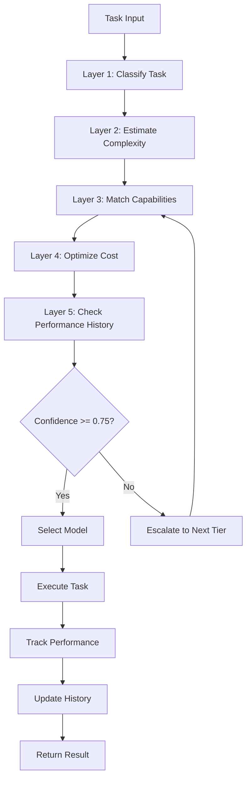

# Model Routing System Architecture

## Overview

The Intelligent Model Routing System automatically selects optimal LLM models based on task complexity, cost constraints, and performance requirements. This system implements a 5-layer decision pipeline that balances quality, speed, and cost.

## System Goals

1. **Cost Optimization**: Minimize API costs by routing simple tasks to cheaper models
2. **Quality Assurance**: Route complex tasks to high-capability models
3. **Performance**: Minimize latency for time-sensitive operations
4. **Adaptability**: Learn from historical performance to improve routing decisions

## Architecture Layers

### Layer 1: Task Classification

Categorizes incoming tasks into predefined categories based on semantic analysis.

**Categories:**
- `reasoning`: Complex analysis, architectural decisions, system design
- `execution`: Code generation, refactoring, implementation
- `analysis`: Code review, bug analysis, security audit
- `generation`: Documentation, comments, test generation
- `simple-query`: Lookups, simple questions, status checks

**Implementation:**
```typescript
interface TaskCategory {
  name: string;
  description: string;
  keywords: string[];
  patterns: RegExp[];
}
```

**Classification Algorithm:**
1. Extract keywords from task description
2. Match against category patterns
3. Calculate confidence score per category
4. Select highest confidence category (threshold: 0.6)

### Layer 2: Complexity Estimation

Scores task complexity on a 1-10 scale using multiple signals.

**Complexity Signals:**
- Token count in task description
- Number of files mentioned
- Presence of technical terms
- Historical similar task complexity
- Context window requirements

**Scoring Formula:**
```
complexity_score = (
  token_weight * normalized_tokens +
  file_weight * file_count +
  technical_weight * technical_density +
  history_weight * avg_historical_complexity
) / total_weight
```

**Complexity Bands:**
- 1-3: Simple (single file, <500 tokens)
- 4-6: Moderate (2-5 files, 500-2000 tokens)
- 7-9: Complex (5+ files, 2000-8000 tokens)
- 10: Critical (architecture, security, >8000 tokens)

### Layer 3: Capability Matching

Maps task requirements to model capabilities.

**Model Capabilities:**
- `reasoning_depth`: Deep analysis capability (1-10 scale)
- `code_quality`: Code generation quality (1-10 scale)
- `context_window`: Maximum context tokens
- `vision`: Image/screenshot analysis support
- `speed`: Response latency (ms)
- `cost_per_1m_tokens`: Pricing (input/output)

**Capability Requirements by Category:**

| Category | Reasoning | Code Quality | Context | Vision | Speed |
|----------|-----------|--------------|---------|--------|-------|
| reasoning | 9-10 | 6-8 | 128K+ | Optional | Medium |
| execution | 6-8 | 9-10 | 64K+ | Optional | Fast |
| analysis | 7-9 | 8-9 | 64K+ | Optional | Medium |
| generation | 5-7 | 6-8 | 32K+ | No | Fast |
| simple-query | 3-5 | 4-6 | 16K+ | No | Very Fast |

**Matching Algorithm:**
1. Filter models meeting minimum capability thresholds
2. Score each model based on capability fit
3. Apply complexity multiplier
4. Rank by weighted score

### Layer 4: Cost Optimization

Implements cascade routing to minimize costs while maintaining quality.

**Cascade Strategy:**
1. Start with cheapest model meeting requirements
2. If confidence < threshold, escalate to next tier
3. Track success rate per model per task type
4. Adjust cascade thresholds based on performance

**Cost Tiers:**

**Tier 1 - Ultra Fast & Cheap:**
- `claude-haiku-4.5`: $0.25/$1.25 per 1M tokens
- `deepseek-v4-flash`: $0.14/$0.55 per 1M tokens

**Tier 2 - Balanced:**
- `claude-sonnet-4.6`: $3/$15 per 1M tokens
- `deepseek-v4-pro`: $0.55/$2.19 per 1M tokens

**Tier 3 - Premium Reasoning:**
- `claude-opus-4.7`: $15/$75 per 1M tokens
- `gpt-4o`: $2.50/$10 per 1M tokens

**Tier 4 - Maximum Capability:**
- `o3-mini`: $1.10/$4.40 per 1M tokens (high reasoning)
- `o3`: $10/$40 per 1M tokens (maximum reasoning)

**Escalation Rules:**
```typescript
interface EscalationRule {
  from_tier: number;
  to_tier: number;
  trigger: 'confidence' | 'failure' | 'complexity';
  threshold: number;
}
```

### Layer 5: Performance History

Learns from past routing decisions to improve future selections.

**Tracked Metrics:**
- Success rate per model per category
- Average latency per model
- Cost efficiency (quality/cost ratio)
- User satisfaction signals (retry rate, manual overrides)

**Learning Algorithm:**
1. Store outcome for each routing decision
2. Calculate rolling success rate (30-day window)
3. Adjust model scores based on performance
4. Penalize models with high failure rates
5. Reward models exceeding quality expectations

**Performance Score Formula:**
```
performance_score = (
  success_rate * 0.4 +
  (1 - normalized_latency) * 0.2 +
  cost_efficiency * 0.3 +
  user_satisfaction * 0.1
)
```

## Model Selection Matrix

### Reasoning Tasks (Complex Analysis, Architecture)

| Complexity | Primary Model | Fallback | Cost/1M tokens |
|------------|---------------|----------|----------------|
| 1-3 | deepseek-v4-pro | claude-sonnet-4.6 | $0.55-$3 |
| 4-6 | claude-sonnet-4.6 | deepseek-v4-pro | $3 |
| 7-9 | claude-opus-4.7 | o3-mini | $15 |
| 10 | claude-opus-4.7 | o3 | $15-$10 |

### Execution Tasks (Code Generation)

| Complexity | Primary Model | Fallback | Cost/1M tokens |
|------------|---------------|----------|----------------|
| 1-3 | deepseek-v4-flash | claude-haiku-4.5 | $0.14-$0.25 |
| 4-6 | claude-sonnet-4.6 | deepseek-v4-pro | $3 |
| 7-9 | claude-sonnet-4.6 | claude-opus-4.7 | $3-$15 |
| 10 | claude-opus-4.7 | claude-sonnet-4.6 | $15 |

### Analysis Tasks (Code Review, Security)

| Complexity | Primary Model | Fallback | Cost/1M tokens |
|------------|---------------|----------|----------------|
| 1-3 | deepseek-v4-pro | claude-sonnet-4.6 | $0.55 |
| 4-6 | claude-sonnet-4.6 | deepseek-v4-pro | $3 |
| 7-9 | claude-opus-4.7 | claude-sonnet-4.6 | $15 |
| 10 | claude-opus-4.7 | o3-mini | $15 |

### Generation Tasks (Documentation, Tests)

| Complexity | Primary Model | Fallback | Cost/1M tokens |
|------------|---------------|----------|----------------|
| 1-3 | deepseek-v4-flash | claude-haiku-4.5 | $0.14 |
| 4-6 | claude-haiku-4.5 | deepseek-v4-pro | $0.25 |
| 7-9 | claude-sonnet-4.6 | deepseek-v4-pro | $3 |
| 10 | claude-sonnet-4.6 | claude-opus-4.7 | $3 |

### Simple Query Tasks (Lookups, Status)

| Complexity | Primary Model | Fallback | Cost/1M tokens |
|------------|---------------|----------|----------------|
| 1-3 | deepseek-v4-flash | claude-haiku-4.5 | $0.14 |
| 4-6 | claude-haiku-4.5 | deepseek-v4-flash | $0.25 |
| 7-9 | deepseek-v4-pro | claude-sonnet-4.6 | $0.55 |
| 10 | claude-sonnet-4.6 | deepseek-v4-pro | $3 |

## Routing Decision Flow



## Cost Estimation System

### Per-Token Pricing (as of 2026-05)

**Anthropic Models:**
- `claude-opus-4.7`: $15 input / $75 output per 1M tokens
- `claude-sonnet-4.6`: $3 input / $15 output per 1M tokens
- `claude-haiku-4.5`: $0.25 input / $1.25 output per 1M tokens

**DeepSeek Models:**
- `deepseek-v4-pro`: $0.55 input / $2.19 output per 1M tokens
- `deepseek-v4-flash`: $0.14 input / $0.55 output per 1M tokens

**OpenAI Models:**
- `o3`: $10 input / $40 output per 1M tokens
- `o3-mini`: $1.10 input / $4.40 output per 1M tokens
- `gpt-4o`: $2.50 input / $10 output per 1M tokens

### Cost Calculation

```typescript
interface CostEstimate {
  input_tokens: number;
  output_tokens: number;
  input_cost: number;
  output_cost: number;
  total_cost: number;
  model: string;
}

function estimateCost(
  inputTokens: number,
  outputTokens: number,
  model: ModelConfig
): CostEstimate {
  const inputCost = (inputTokens / 1_000_000) * model.pricing.input;
  const outputCost = (outputTokens / 1_000_000) * model.pricing.output;
  
  return {
    input_tokens: inputTokens,
    output_tokens: outputTokens,
    input_cost: inputCost,
    output_cost: outputCost,
    total_cost: inputCost + outputCost,
    model: model.name
  };
}
```

### Budget Tracking

**Session Budget:**
- Track cumulative cost per session
- Warn at 80% of budget threshold
- Block at 100% (configurable)
- Reset on session end

**Monthly Budget:**
- Aggregate costs across all sessions
- Project monthly spend based on usage patterns
- Alert on trajectory exceeding budget
- Provide cost breakdown by model/category

```typescript
interface BudgetTracker {
  session_budget: number;
  session_spent: number;
  monthly_budget: number;
  monthly_spent: number;
  daily_average: number;
  projected_monthly: number;
}
```

## Performance Tracking System

### Latency Metrics

Track response time percentiles per model:

```typescript
interface LatencyMetrics {
  model: string;
  category: string;
  p50: number;  // median
  p95: number;  // 95th percentile
  p99: number;  // 99th percentile
  avg: number;
  samples: number;
}
```

**Latency Targets:**
- Simple queries: p95 < 2s
- Generation: p95 < 5s
- Execution: p95 < 10s
- Analysis: p95 < 15s
- Reasoning: p95 < 30s

### Quality Scores

**Success Rate:**
- Task completed without errors
- No user retry required
- Output meets requirements

**User Feedback:**
- Explicit thumbs up/down
- Manual model override (negative signal)
- Task completion without follow-up (positive signal)

**Quality Score Formula:**
```
quality_score = (
  success_rate * 0.5 +
  (1 - retry_rate) * 0.3 +
  user_satisfaction * 0.2
)
```

### Model Comparison Dashboard

Real-time metrics displayed in TUI:

```
┌─────────────────────────────────────────────────────────────┐
│ Model Performance Dashboard                                  │
├─────────────────────────────────────────────────────────────┤
│ Model              Success  Latency  Cost/Task  Quality     │
│ claude-opus-4.7    98.5%    12.3s    $0.45      9.2/10      │
│ claude-sonnet-4.6  96.8%    5.7s     $0.08      8.7/10      │
│ claude-haiku-4.5   94.2%    1.8s     $0.01      7.9/10      │
│ deepseek-v4-pro    95.1%    6.2s     $0.03      8.4/10      │
│ deepseek-v4-flash  92.3%    2.1s     $0.005     7.5/10      │
└─────────────────────────────────────────────────────────────┘
```

### A/B Testing Framework

**Test Configuration:**
```typescript
interface ABTest {
  name: string;
  category: string;
  model_a: string;
  model_b: string;
  traffic_split: number;  // 0.0 to 1.0
  duration_days: number;
  metrics: string[];
}
```

**Test Execution:**
1. Randomly assign tasks to model A or B based on split
2. Track all metrics for both models
3. Calculate statistical significance
4. Recommend winner after test duration
5. Automatically promote winner if confidence > 95%

## Routing Algorithm Implementation

### Decision Tree

```typescript
class ModelRouter {
  async route(task: Task): Promise<ModelSelection> {
    // Layer 1: Classify
    const category = await this.classifier.classify(task);
    
    // Layer 2: Estimate complexity
    const complexity = await this.estimator.estimate(task, category);
    
    // Layer 3: Match capabilities
    const candidates = await this.matcher.match(category, complexity);
    
    // Layer 4: Optimize cost
    const ranked = await this.optimizer.rank(candidates, task);
    
    // Layer 5: Apply performance history
    const adjusted = await this.history.adjust(ranked, category);
    
    // Select top candidate
    const selected = adjusted[0];
    
    // Check confidence
    if (selected.confidence < 0.75) {
      return this.escalate(selected, adjusted);
    }
    
    return selected;
  }
  
  private async escalate(
    current: ModelSelection,
    candidates: ModelSelection[]
  ): Promise<ModelSelection> {
    // Find next tier model
    const nextTier = candidates.find(
      c => c.tier > current.tier && c.confidence >= 0.75
    );
    
    return nextTier || current;
  }
}
```

### Fallback Strategies

**Primary Fallback:**
If selected model fails (API error, timeout):
1. Try fallback model from same tier
2. If fallback fails, escalate to next tier
3. If all tiers exhausted, return error with retry suggestion

**Rate Limit Handling:**
1. Detect rate limit error
2. Switch to alternative provider (e.g., DeepSeek if Anthropic limited)
3. Queue request for retry after cooldown
4. Update routing to prefer alternative provider temporarily

**Load Balancing:**
- Distribute requests across providers
- Track provider health (error rate, latency)
- Temporarily disable unhealthy providers
- Gradually re-enable after recovery

```typescript
interface FallbackStrategy {
  primary: string;
  fallbacks: string[];
  escalation_path: string[];
  rate_limit_alternatives: Map<string, string[]>;
}
```

## Integration Points

### Existing Lyra Components

**AgentLoop Integration:**
```typescript
// In lyra-core/loop/agent_loop.ts
const router = new ModelRouter(config);
const selection = await router.route(task);
const response = await this.llm.complete(task, selection.model);
```

**Memory System Integration:**
- Store routing decisions in episodic memory
- Retrieve similar past tasks for complexity estimation
- Learn from historical performance

**HIR Event Stream:**
```typescript
interface RoutingEvent {
  type: 'model.selected' | 'model.escalated' | 'model.failed';
  task_id: string;
  category: string;
  complexity: number;
  model: string;
  confidence: number;
  cost_estimate: CostEstimate;
  timestamp: number;
}
```

**Cost Observatory:**
- Aggregate routing costs
- Generate cost reports
- Identify optimization opportunities

## Configuration

### User Configuration

```yaml
# ~/.lyra/routing.yaml
routing:
  enabled: true
  
  # Budget limits
  budget:
    session_max: 5.00  # USD
    monthly_max: 100.00  # USD
    warn_threshold: 0.8
  
  # Model preferences
  preferences:
    prefer_speed: false
    prefer_cost: true
    prefer_quality: false
    
  # Category overrides
  overrides:
    reasoning: claude-opus-4.7
    execution: claude-sonnet-4.6
    
  # Escalation settings
  escalation:
    confidence_threshold: 0.75
    max_retries: 3
    
  # A/B testing
  ab_testing:
    enabled: true
    participation_rate: 0.1
```

### Model Registry

```typescript
interface ModelConfig {
  name: string;
  provider: string;
  capabilities: {
    reasoning_depth: number;
    code_quality: number;
    context_window: number;
    vision: boolean;
    speed_ms: number;
  };
  pricing: {
    input: number;   // per 1M tokens
    output: number;  // per 1M tokens
  };
  tier: number;
  enabled: boolean;
}
```

## Monitoring & Observability

### Metrics to Track

1. **Routing Accuracy**: % of tasks routed to optimal model
2. **Cost Savings**: Actual cost vs. always-use-opus baseline
3. **Quality Maintained**: Success rate vs. baseline
4. **Latency Impact**: Average latency vs. baseline
5. **Escalation Rate**: % of tasks requiring escalation

### Dashboards

**Real-time Dashboard:**
- Current session cost
- Model distribution (pie chart)
- Recent routing decisions (table)
- Performance alerts

**Historical Dashboard:**
- Cost trends (line chart)
- Model usage over time (stacked area)
- Quality scores by model (bar chart)
- Optimization opportunities (recommendations)

### Alerts

**Cost Alerts:**
- Session budget 80% reached
- Monthly projection exceeds budget
- Unusual cost spike detected

**Performance Alerts:**
- Model success rate drops below threshold
- Latency exceeds target
- High escalation rate for category

**System Alerts:**
- Provider API errors
- Rate limits reached
- Routing service degraded

## Future Enhancements

1. **Multi-Model Ensemble**: Combine outputs from multiple models for critical tasks
2. **Reinforcement Learning**: Train routing policy with RL
3. **User Personalization**: Learn individual user preferences
4. **Context-Aware Routing**: Consider full conversation context
5. **Predictive Routing**: Pre-select models based on conversation flow
6. **Cost Prediction**: Estimate total conversation cost upfront
7. **Quality Prediction**: Predict output quality before execution
8. **Dynamic Pricing**: Adjust routing based on real-time pricing changes

## References

- [FrugalGPT: Cost-Effective LLM Routing](https://arxiv.org/abs/2305.05176)
- [RouteLLM: Learning to Route LLMs](https://arxiv.org/abs/2406.18665)
- [Cascade Routing for LLMs](https://arxiv.org/abs/2404.15778)
- Lyra Architecture: `ARCHITECTURE.md`
- Lyra Ultra Plan 10: `plans/LYRA_ULTRA_PLAN_10_MODEL_ROUTER_V2.md`
