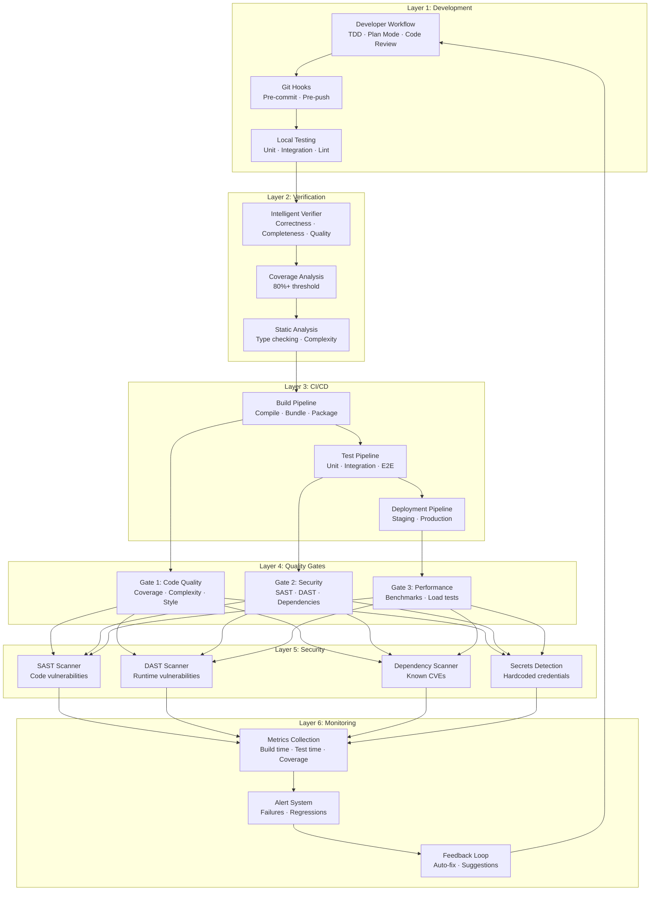
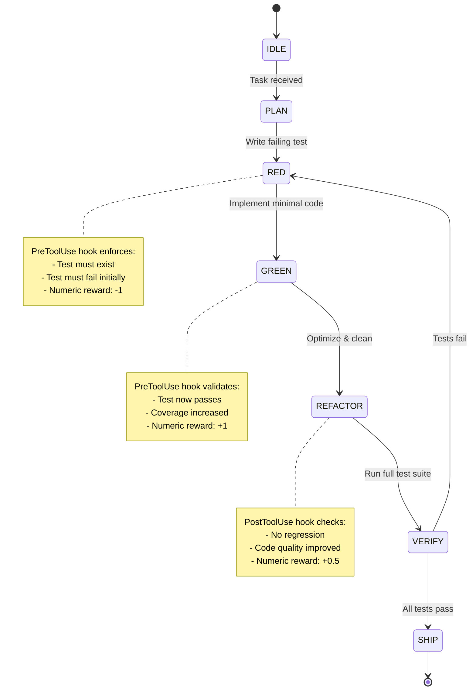
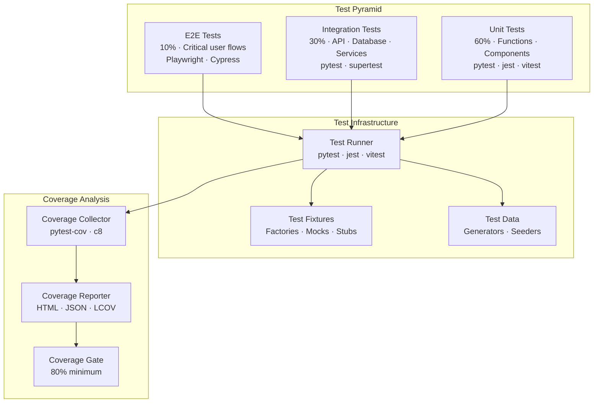
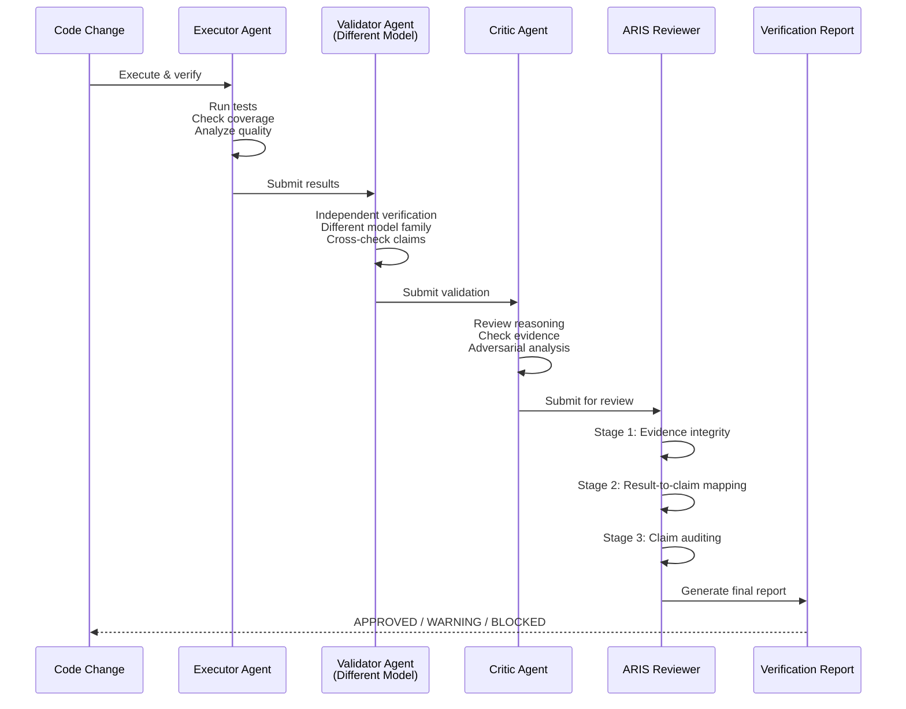
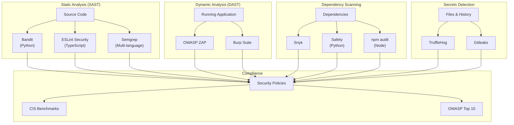
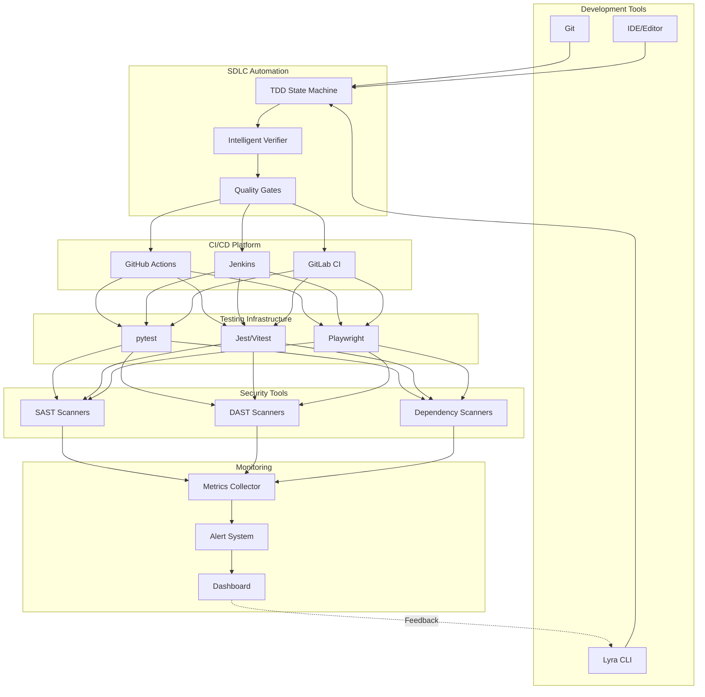

# SDLC Automation Architecture

> **Status**: Design Document  
> **Version**: 1.0.0  
> **Last Updated**: 2026-05-28

## Executive Summary

This document defines Lyra's end-to-end SDLC automation architecture, integrating development workflows, automated testing, intelligent verification, CI/CD pipelines, quality gates, and security scanning into a cohesive system that ensures code quality, security, and reliability at every stage.

## Table of Contents

1. [Overview](#overview)
2. [Development Workflow Automation](#development-workflow-automation)
3. [Automated Testing Framework](#automated-testing-framework)
4. [Intelligent Verifier System](#intelligent-verifier-system)
5. [CI/CD Integration](#cicd-integration)
6. [Code Quality Gates](#code-quality-gates)
7. [Security Scanning](#security-scanning)
8. [Monitoring and Feedback Loops](#monitoring-and-feedback-loops)
9. [Integration Architecture](#integration-architecture)
10. [Implementation Roadmap](#implementation-roadmap)

---

## Overview

### Design Principles

1. **Shift-Left Testing** — Catch issues early in development
2. **Continuous Verification** — Validate at every stage
3. **Automated Quality Gates** — Enforce standards without manual intervention
4. **Security by Default** — Integrate security scanning into every workflow
5. **Fast Feedback Loops** — Provide immediate feedback to developers
6. **Self-Healing** — Automatically fix common issues when possible

### Architecture Layers



---

## Development Workflow Automation

### TDD-First Development

Lyra enforces Test-Driven Development through the TDD State Machine:



### Plan-Gated Execution

All work follows the plan-gated workflow:

1. **Plan Phase**
   - Agent proposes implementation plan
   - User reviews and approves
   - Plan stored in `.lyra/plans/`

2. **Execute Phase**
   - Agent executes approved plan
   - PermissionBridge gates each action
   - HIR events logged to `.lyra/sessions/`

3. **Verify Phase**
   - Multi-agent verifier validates output
   - Executor → Validator → Critic pipeline
   - ARIS 3-stage adversarial review

### Git Workflow Integration

```yaml
# .lyra/workflows/git-workflow.yml
name: Git Workflow Automation

on:
  pre_commit:
    - run: lint
    - run: format
    - run: type_check
    - run: unit_tests
    - run: security_scan_local
    
  pre_push:
    - run: integration_tests
    - run: coverage_check
    - run: build_verification
    
  post_commit:
    - run: update_changelog
    - run: tag_version
    - run: notify_team
```

### Automated Code Review

```python
# lyra_core/automation/code_review.py
class AutomatedCodeReview:
    """Automated code review system using multi-agent verification."""
    
    def __init__(self):
        self.reviewers = [
            CodeQualityReviewer(),
            SecurityReviewer(),
            PerformanceReviewer(),
            TestCoverageReviewer(),
        ]
    
    async def review_changes(self, diff: GitDiff) -> ReviewReport:
        """Run parallel review agents on code changes."""
        reviews = await asyncio.gather(*[
            reviewer.analyze(diff) for reviewer in self.reviewers
        ])
        
        return ReviewReport(
            findings=self._aggregate_findings(reviews),
            severity=self._calculate_severity(reviews),
            approval_status=self._determine_approval(reviews),
            suggestions=self._generate_suggestions(reviews),
        )
    
    def _determine_approval(self, reviews: List[Review]) -> ApprovalStatus:
        """Determine if changes can be approved."""
        critical_issues = [r for r in reviews if r.severity == "CRITICAL"]
        high_issues = [r for r in reviews if r.severity == "HIGH"]
        
        if critical_issues:
            return ApprovalStatus.BLOCKED
        elif high_issues:
            return ApprovalStatus.WARNING
        else:
            return ApprovalStatus.APPROVED
```

---

## Automated Testing Framework

### Test Pyramid



### Unit Testing

**Python (pytest)**

```python
# tests/unit/test_agent_loop.py
import pytest
from lyra_core.loop import AgentLoop
from lyra_core.state import TDDState

@pytest.fixture
def agent_loop():
    """Create agent loop with test configuration."""
    return AgentLoop(
        mode="test",
        permission_bridge=MockPermissionBridge(),
        hir_emitter=MockHIREmitter(),
    )

@pytest.mark.asyncio
async def test_tdd_state_transition_red_to_green(agent_loop):
    """Test TDD state machine transitions from RED to GREEN."""
    # Arrange
    agent_loop.state = TDDState.RED
    test_result = TestResult(passed=True, coverage=0.85)
    
    # Act
    await agent_loop.transition_state(test_result)
    
    # Assert
    assert agent_loop.state == TDDState.GREEN
    assert agent_loop.reward == 1.0

@pytest.mark.asyncio
async def test_plan_gated_execution_requires_approval(agent_loop):
    """Test that execution is blocked without plan approval."""
    # Arrange
    plan = Plan(steps=[Step(action="write_file", path="test.py")])
    agent_loop.set_plan(plan)
    
    # Act & Assert
    with pytest.raises(PermissionDeniedError):
        await agent_loop.execute_step(plan.steps[0])

def test_coverage_threshold_enforcement():
    """Test that coverage below 80% fails the build."""
    coverage_report = CoverageReport(line_coverage=0.75)
    
    with pytest.raises(CoverageThresholdError):
        enforce_coverage_threshold(coverage_report, min_threshold=0.80)
```

**TypeScript (Jest/Vitest)**

```typescript
// packages/ui-core/tests/unit/AgentLoop.test.ts
import { describe, it, expect, vi } from 'vitest';
import { AgentLoop } from '@lyra/ui-core';
import { TDDState } from '@lyra/ui-core/state';

describe('AgentLoop', () => {
  it('should transition from RED to GREEN on passing test', async () => {
    // Arrange
    const loop = new AgentLoop({ mode: 'test' });
    loop.setState(TDDState.RED);
    const testResult = { passed: true, coverage: 0.85 };
    
    // Act
    await loop.transitionState(testResult);
    
    // Assert
    expect(loop.getState()).toBe(TDDState.GREEN);
    expect(loop.getReward()).toBe(1.0);
  });
  
  it('should enforce plan approval before execution', async () => {
    // Arrange
    const loop = new AgentLoop({ mode: 'test' });
    const plan = { steps: [{ action: 'write_file', path: 'test.ts' }] };
    loop.setPlan(plan);
    
    // Act & Assert
    await expect(loop.executeStep(plan.steps[0]))
      .rejects.toThrow('Permission denied');
  });
});
```

### Integration Testing

```python
# tests/integration/test_agent_workflow.py
import pytest
from lyra_core import Lyra
from lyra_core.providers import AnthropicProvider

@pytest.mark.integration
@pytest.mark.asyncio
async def test_end_to_end_agent_workflow():
    """Test complete agent workflow from task to completion."""
    # Arrange
    lyra = Lyra(provider=AnthropicProvider(api_key="test"))
    task = "Add Redis caching to user service"
    
    # Act
    result = await lyra.run(task)
    
    # Assert
    assert result.status == "completed"
    assert result.files_changed > 0
    assert result.tests_passed is True
    assert result.coverage >= 0.80

@pytest.mark.integration
async def test_multi_agent_verification():
    """Test multi-agent verifier pipeline."""
    # Arrange
    verifier = MultiAgentVerifier()
    code_change = CodeChange(
        files=["src/cache.py"],
        diff=load_fixture("cache_implementation.diff"),
    )
    
    # Act
    report = await verifier.verify(code_change)
    
    # Assert
    assert report.executor_result.status == "pass"
    assert report.validator_result.status == "pass"
    assert report.critic_result.status == "pass"
    assert report.overall_status == "approved"
```

### E2E Testing

```typescript
// tests/e2e/agent-workflow.spec.ts
import { test, expect } from '@playwright/test';

test.describe('Agent Workflow E2E', () => {
  test('should complete full TDD cycle', async ({ page }) => {
    // Navigate to Lyra TUI
    await page.goto('http://localhost:3000');
    
    // Enter task
    await page.fill('[data-testid="task-input"]', 'Add user authentication');
    await page.click('[data-testid="submit-task"]');
    
    // Wait for plan generation
    await expect(page.locator('[data-testid="plan-status"]'))
      .toContainText('Plan generated');
    
    // Approve plan
    await page.click('[data-testid="approve-plan"]');
    
    // Wait for execution
    await expect(page.locator('[data-testid="execution-status"]'))
      .toContainText('Completed', { timeout: 60000 });
    
    // Verify results
    const filesChanged = await page.locator('[data-testid="files-changed"]').textContent();
    const testsPassed = await page.locator('[data-testid="tests-passed"]').textContent();
    const coverage = await page.locator('[data-testid="coverage"]').textContent();
    
    expect(parseInt(filesChanged)).toBeGreaterThan(0);
    expect(testsPassed).toBe('true');
    expect(parseFloat(coverage)).toBeGreaterThanOrEqual(0.80);
  });
});
```

### Test Coverage Requirements

| Test Type | Minimum Coverage | Target Coverage |
|-----------|-----------------|-----------------|
| Unit Tests | 80% | 90% |
| Integration Tests | 70% | 85% |
| E2E Tests | Critical paths only | All user flows |
| Overall | 80% | 90% |

### Test Automation Configuration

```yaml
# .lyra/testing/config.yml
testing:
  unit:
    framework: pytest
    coverage_threshold: 0.80
    parallel: true
    max_workers: 4
    
  integration:
    framework: pytest
    coverage_threshold: 0.70
    database: test_db
    cleanup: true
    
  e2e:
    framework: playwright
    browsers: [chromium, firefox]
    headless: true
    video: on-failure
    
  performance:
    framework: pytest-benchmark
    iterations: 100
    warmup: 10
```

---

## Intelligent Verifier System

### Multi-Agent Verification Pipeline



### Verification Dimensions

```python
# lyra_core/verification/intelligent_verifier.py
from dataclasses import dataclass
from enum import Enum
from typing import List, Dict, Any

class VerificationDimension(Enum):
    """Dimensions of code verification."""
    CORRECTNESS = "correctness"  # Does it work?
    COMPLETENESS = "completeness"  # Is everything done?
    QUALITY = "quality"  # Is it good?
    SECURITY = "security"  # Is it safe?
    PERFORMANCE = "performance"  # Is it fast?
    MAINTAINABILITY = "maintainability"  # Can it be maintained?

@dataclass
class VerificationResult:
    """Result of verification check."""
    dimension: VerificationDimension
    status: str  # "pass", "warning", "fail"
    score: float  # 0.0 to 1.0
    findings: List[str]
    evidence: Dict[str, Any]
    recommendations: List[str]

class IntelligentVerifier:
    """Multi-dimensional intelligent verification system."""
    
    def __init__(self):
        self.verifiers = {
            VerificationDimension.CORRECTNESS: CorrectnessVerifier(),
            VerificationDimension.COMPLETENESS: CompletenessVerifier(),
            VerificationDimension.QUALITY: QualityVerifier(),
            VerificationDimension.SECURITY: SecurityVerifier(),
            VerificationDimension.PERFORMANCE: PerformanceVerifier(),
            VerificationDimension.MAINTAINABILITY: MaintainabilityVerifier(),
        }
    
    async def verify(self, code_change: CodeChange) -> VerificationReport:
        """Run comprehensive verification across all dimensions."""
        results = await asyncio.gather(*[
            verifier.verify(code_change)
            for verifier in self.verifiers.values()
        ])
        
        return VerificationReport(
            results=results,
            overall_status=self._calculate_overall_status(results),
            overall_score=self._calculate_overall_score(results),
            critical_findings=self._extract_critical_findings(results),
            recommendations=self._generate_recommendations(results),
        )

class CorrectnessVerifier:
    """Verify code correctness."""
    
    async def verify(self, code_change: CodeChange) -> VerificationResult:
        """Check if code works correctly."""
        findings = []
        evidence = {}
        
        # Run tests
        test_result = await self._run_tests(code_change)
        evidence["test_result"] = test_result
        if not test_result.all_passed:
            findings.append(f"{test_result.failed_count} tests failed")
        
        # Check type safety
        type_result = await self._check_types(code_change)
        evidence["type_result"] = type_result
        if type_result.errors:
            findings.append(f"{len(type_result.errors)} type errors")
        
        # Verify logic
        logic_result = await self._verify_logic(code_change)
        evidence["logic_result"] = logic_result
        
        score = self._calculate_correctness_score(evidence)
        status = "pass" if score >= 0.9 else "warning" if score >= 0.7 else "fail"
        
        return VerificationResult(
            dimension=VerificationDimension.CORRECTNESS,
            status=status,
            score=score,
            findings=findings,
            evidence=evidence,
            recommendations=self._generate_correctness_recommendations(findings),
        )
```

### Completeness Verification

```python
class CompletenessVerifier:
    """Verify implementation completeness."""
    
    async def verify(self, code_change: CodeChange) -> VerificationResult:
        """Check if all requirements are implemented."""
        findings = []
        evidence = {}
        
        # Check acceptance criteria
        criteria_result = await self._check_acceptance_criteria(code_change)
        evidence["criteria"] = criteria_result
        if criteria_result.incomplete:
            findings.append(f"{len(criteria_result.incomplete)} criteria not met")
        
        # Verify test coverage
        coverage_result = await self._check_coverage(code_change)
        evidence["coverage"] = coverage_result
        if coverage_result.line_coverage < 0.80:
            findings.append(f"Coverage {coverage_result.line_coverage:.1%} below 80%")
        
        # Check documentation
        docs_result = await self._check_documentation(code_change)
        evidence["documentation"] = docs_result
        if docs_result.missing_docs:
            findings.append(f"{len(docs_result.missing_docs)} functions lack docs")
        
        score = self._calculate_completeness_score(evidence)
        status = "pass" if score >= 0.9 else "warning" if score >= 0.7 else "fail"
        
        return VerificationResult(
            dimension=VerificationDimension.COMPLETENESS,
            status=status,
            score=score,
            findings=findings,
            evidence=evidence,
            recommendations=self._generate_completeness_recommendations(findings),
        )
```

### Regression Detection

```python
class RegressionDetector:
    """Detect performance and functionality regressions."""
    
    async def detect_regressions(
        self,
        current: CodeChange,
        baseline: CodeChange,
    ) -> RegressionReport:
        """Compare current changes against baseline."""
        regressions = []
        
        # Performance regression
        perf_current = await self._run_benchmarks(current)
        perf_baseline = await self._run_benchmarks(baseline)
        
        for metric, current_value in perf_current.items():
            baseline_value = perf_baseline.get(metric)
            if baseline_value and current_value > baseline_value * 1.1:  # 10% threshold
                regressions.append(
                    Regression(
                        type="performance",
                        metric=metric,
                        baseline=baseline_value,
                        current=current_value,
                        degradation=(current_value - baseline_value) / baseline_value,
                    )
                )
        
        # Functionality regression
        func_result = await self._compare_functionality(current, baseline)
        if func_result.broken_features:
            regressions.extend([
                Regression(
                    type="functionality",
                    feature=feature,
                    status="broken",
                )
                for feature in func_result.broken_features
            ])
        
        return RegressionReport(
            regressions=regressions,
            has_regressions=len(regressions) > 0,
            severity=self._calculate_severity(regressions),
        )
```

---

## CI/CD Integration

### Pipeline Architecture

```mermaid
graph LR
    subgraph "Trigger Events"
        PUSH["git push"]
        PR["Pull Request"]
        TAG["Tag Release"]
        SCHEDULE["Scheduled"]
    end
    
    subgraph "Build Stage"
        CHECKOUT["Checkout Code"]
        DEPS["Install Dependencies"]
        BUILD["Build Artifacts"]
        LINT["Lint & Format"]
    end
    
    subgraph "Test Stage"
        UNIT["Unit Tests"]
        INT["Integration Tests"]
        E2E["E2E Tests"]
        COV["Coverage Report"]
    end
    
    subgraph "Quality Gates"
        GATE1["Gate 1: Coverage ≥ 80%"]
        GATE2["Gate 2: No Critical Issues"]
        GATE3["Gate 3: Performance OK"]
    end
    
    subgraph "Security Stage"
        SAST_S["SAST Scan"]
        DEPS_S["Dependency Scan"]
        SECRETS_S["Secrets Scan"]
        DAST_S["DAST Scan"]
    end
    
    subgraph "Deploy Stage"
        STAGING["Deploy Staging"]
        SMOKE["Smoke Tests"]
        PROD["Deploy Production"]
        ROLLBACK["Rollback (if needed)"]
    end
    
    PUSH & PR & TAG & SCHEDULE --> CHECKOUT
    CHECKOUT --> DEPS --> BUILD --> LINT
    LINT --> UNIT & INT & E2E
    UNIT & INT & E2E --> COV
    COV --> GATE1 --> GATE2 --> GATE3
    GATE3 --> SAST_S & DEPS_S & SECRETS_S
    SAST_S & DEPS_S & SECRETS_S --> DAST_S
    DAST_S --> STAGING --> SMOKE
    SMOKE --> PROD
    SMOKE -.->|"Failure"| ROLLBACK
```



### GitHub Actions Workflow

```yaml
# .github/workflows/ci.yml
name: CI/CD Pipeline

on:
  push:
    branches: [main, develop]
  pull_request:
    branches: [main, develop]
  schedule:
    - cron: '0 0 * * *'  # Daily at midnight

env:
  PYTHON_VERSION: '3.11'
  NODE_VERSION: '20'

jobs:
  build:
    name: Build & Lint
    runs-on: ubuntu-latest
    steps:
      - uses: actions/checkout@v4
      
      - name: Setup Python
        uses: actions/setup-python@v5
        with:
          python-version: ${{ env.PYTHON_VERSION }}
          cache: 'pip'
      
      - name: Setup Node.js
        uses: actions/setup-node@v4
        with:
          node-version: ${{ env.NODE_VERSION }}
          cache: 'npm'
      
      - name: Install Python dependencies
        run: |
          pip install -e ".[dev]"
          pip install -e ".[full]"
      
      - name: Install Node dependencies
        run: npm ci
      
      - name: Lint Python
        run: |
          ruff check src/ tests/
          black --check src/ tests/
          mypy src/
      
      - name: Lint TypeScript
        run: |
          npm run lint
          npm run type-check
      
      - name: Build
        run: |
          python -m build
          npm run build

  test:
    name: Test Suite
    needs: build
    runs-on: ubuntu-latest
    strategy:
      matrix:
        test-type: [unit, integration, e2e]
    steps:
      - uses: actions/checkout@v4
      
      - name: Setup Python
        uses: actions/setup-python@v5
        with:
          python-version: ${{ env.PYTHON_VERSION }}
          cache: 'pip'
      
      - name: Install dependencies
        run: pip install -e ".[dev]"
      
      - name: Run ${{ matrix.test-type }} tests
        run: |
          pytest tests/${{ matrix.test-type }}/ \
            --cov=src \
            --cov-report=xml \
            --cov-report=html \
            --junit-xml=test-results-${{ matrix.test-type }}.xml
      
      - name: Upload coverage
        uses: codecov/codecov-action@v4
        with:
          files: ./coverage.xml
          flags: ${{ matrix.test-type }}
      
      - name: Upload test results
        uses: actions/upload-artifact@v4
        if: always()
        with:
          name: test-results-${{ matrix.test-type }}
          path: test-results-${{ matrix.test-type }}.xml

  quality-gates:
    name: Quality Gates
    needs: test
    runs-on: ubuntu-latest
    steps:
      - uses: actions/checkout@v4
      
      - name: Download coverage reports
        uses: actions/download-artifact@v4
      
      - name: Check coverage threshold
        run: |
          python scripts/check_coverage.py --threshold 0.80
      
      - name: Check complexity
        run: |
          radon cc src/ -a -nb
          radon mi src/ -nb
      
      - name: Check code quality
        run: |
          pylint src/ --fail-under=8.0

  security:
    name: Security Scanning
    needs: build
    runs-on: ubuntu-latest
    steps:
      - uses: actions/checkout@v4
      
      - name: SAST - Python
        run: |
          bandit -r src/ -f json -o bandit-report.json
      
      - name: SAST - TypeScript
        run: |
          npm run security:scan
      
      - name: Dependency scan
        uses: snyk/actions/python@master
        env:
          SNYK_TOKEN: ${{ secrets.SNYK_TOKEN }}
      
      - name: Secrets detection
        uses: trufflesecurity/trufflehog@main
        with:
          path: ./
          base: ${{ github.event.repository.default_branch }}
          head: HEAD
      
      - name: Upload security reports
        uses: github/codeql-action/upload-sarif@v3
        with:
          sarif_file: bandit-report.json

  deploy-staging:
    name: Deploy to Staging
    needs: [quality-gates, security]
    if: github.ref == 'refs/heads/develop'
    runs-on: ubuntu-latest
    environment: staging
    steps:
      - uses: actions/checkout@v4
      
      - name: Deploy to staging
        run: |
          ./scripts/deploy.sh staging
      
      - name: Run smoke tests
        run: |
          pytest tests/smoke/ --base-url=${{ secrets.STAGING_URL }}
      
      - name: Notify deployment
        uses: 8398a7/action-slack@v3
        with:
          status: ${{ job.status }}
          text: 'Staging deployment completed'
          webhook_url: ${{ secrets.SLACK_WEBHOOK }}

  deploy-production:
    name: Deploy to Production
    needs: deploy-staging
    if: github.ref == 'refs/heads/main'
    runs-on: ubuntu-latest
    environment: production
    steps:
      - uses: actions/checkout@v4
      
      - name: Deploy to production
        run: |
          ./scripts/deploy.sh production --strategy=blue-green
      
      - name: Run smoke tests
        run: |
          pytest tests/smoke/ --base-url=${{ secrets.PRODUCTION_URL }}
      
      - name: Monitor deployment
        run: |
          ./scripts/monitor_deployment.sh --duration=300
      
      - name: Rollback on failure
        if: failure()
        run: |
          ./scripts/rollback.sh production
```

### Deployment Strategies

```python
# lyra_core/deployment/strategies.py
from abc import ABC, abstractmethod
from typing import Dict, Any

class DeploymentStrategy(ABC):
    """Base class for deployment strategies."""
    
    @abstractmethod
    async def deploy(self, artifact: Artifact, environment: str) -> DeploymentResult:
        """Deploy artifact to environment."""
        pass
    
    @abstractmethod
    async def rollback(self, environment: str) -> RollbackResult:
        """Rollback to previous version."""
        pass

class BlueGreenDeployment(DeploymentStrategy):
    """Blue-green deployment strategy."""
    
    async def deploy(self, artifact: Artifact, environment: str) -> DeploymentResult:
        """Deploy using blue-green strategy."""
        # Deploy to green environment
        green_env = f"{environment}-green"
        await self._deploy_to_environment(artifact, green_env)
        
        # Run smoke tests
        smoke_result = await self._run_smoke_tests(green_env)
        if not smoke_result.passed:
            await self._cleanup_environment(green_env)
            raise DeploymentError("Smoke tests failed")
        
        # Switch traffic from blue to green
        await self._switch_traffic(environment, green_env)
        
        # Monitor for 5 minutes
        monitor_result = await self._monitor_deployment(green_env, duration=300)
        if not monitor_result.healthy:
            await self._switch_traffic(environment, f"{environment}-blue")
            raise DeploymentError("Health check failed")
        
        # Cleanup old blue environment
        await self._cleanup_environment(f"{environment}-blue")
        
        return DeploymentResult(
            status="success",
            environment=green_env,
            version=artifact.version,
        )

class CanaryDeployment(DeploymentStrategy):
    """Canary deployment strategy."""
    
    async def deploy(self, artifact: Artifact, environment: str) -> DeploymentResult:
        """Deploy using canary strategy."""
        # Deploy to canary (10% traffic)
        canary_env = f"{environment}-canary"
        await self._deploy_to_environment(artifact, canary_env)
        await self._route_traffic(canary_env, percentage=10)
        
        # Monitor canary for 1 hour
        monitor_result = await self._monitor_deployment(canary_env, duration=3600)
        if not monitor_result.healthy:
            await self._route_traffic(canary_env, percentage=0)
            raise DeploymentError("Canary health check failed")
        
        # Gradually increase traffic: 10% -> 25% -> 50% -> 100%
        for percentage in [25, 50, 100]:
            await self._route_traffic(canary_env, percentage=percentage)
            await asyncio.sleep(1800)  # Wait 30 minutes
            
            monitor_result = await self._monitor_deployment(canary_env, duration=300)
            if not monitor_result.healthy:
                await self._route_traffic(canary_env, percentage=0)
                raise DeploymentError(f"Health check failed at {percentage}%")
        
        return DeploymentResult(
            status="success",
            environment=canary_env,
            version=artifact.version,
        )

class RollingDeployment(DeploymentStrategy):
    """Rolling deployment strategy."""
    
    async def deploy(self, artifact: Artifact, environment: str) -> DeploymentResult:
        """Deploy using rolling strategy."""
        instances = await self._get_instances(environment)
        
        # Update instances one by one
        for instance in instances:
            # Deploy to instance
            await self._deploy_to_instance(artifact, instance)
            
            # Wait for health check
            health_result = await self._check_instance_health(instance)
            if not health_result.healthy:
                # Rollback this instance
                await self._rollback_instance(instance)
                raise DeploymentError(f"Instance {instance.id} health check failed")
            
            # Wait before next instance
            await asyncio.sleep(30)
        
        return DeploymentResult(
            status="success",
            environment=environment,
            version=artifact.version,
            instances_updated=len(instances),
        )
```

---

## Code Quality Gates

### Quality Metrics

```python
# lyra_core/quality/metrics.py
from dataclasses import dataclass
from typing import List, Dict

@dataclass
class QualityMetrics:
    """Code quality metrics."""
    coverage: float  # Line coverage percentage
    complexity: float  # Average cyclomatic complexity
    maintainability: float  # Maintainability index
    duplication: float  # Code duplication percentage
    technical_debt: int  # Technical debt in minutes
    violations: List[str]  # Quality violations

class QualityGate:
    """Enforce quality standards."""
    
    def __init__(self):
        self.thresholds = {
            "coverage": 0.80,
            "complexity": 10.0,
            "maintainability": 65.0,
            "duplication": 0.05,
            "technical_debt": 480,  # 8 hours
        }
    
    def evaluate(self, metrics: QualityMetrics) -> GateResult:
        """Evaluate metrics against thresholds."""
        violations = []
        
        if metrics.coverage < self.thresholds["coverage"]:
            violations.append(
                f"Coverage {metrics.coverage:.1%} below {self.thresholds['coverage']:.1%}"
            )
        
        if metrics.complexity > self.thresholds["complexity"]:
            violations.append(
                f"Complexity {metrics.complexity:.1f} above {self.thresholds['complexity']:.1f}"
            )
        
        if metrics.maintainability < self.thresholds["maintainability"]:
            violations.append(
                f"Maintainability {metrics.maintainability:.1f} below {self.thresholds['maintainability']:.1f}"
            )
        
        if metrics.duplication > self.thresholds["duplication"]:
            violations.append(
                f"Duplication {metrics.duplication:.1%} above {self.thresholds['duplication']:.1%}"
            )
        
        if metrics.technical_debt > self.thresholds["technical_debt"]:
            violations.append(
                f"Technical debt {metrics.technical_debt}min above {self.thresholds['technical_debt']}min"
            )
        
        return GateResult(
            passed=len(violations) == 0,
            violations=violations,
            metrics=metrics,
        )
```

### Quality Gate Configuration

```yaml
# .lyra/quality/gates.yml
quality_gates:
  gate_1_coverage:
    name: "Test Coverage"
    threshold: 0.80
    metric: line_coverage
    blocking: true
    
  gate_2_complexity:
    name: "Cyclomatic Complexity"
    threshold: 10.0
    metric: avg_complexity
    blocking: true
    
  gate_3_maintainability:
    name: "Maintainability Index"
    threshold: 65.0
    metric: maintainability_index
    blocking: false
    
  gate_4_duplication:
    name: "Code Duplication"
    threshold: 0.05
    metric: duplication_percentage
    blocking: false
    
  gate_5_debt:
    name: "Technical Debt"
    threshold: 480  # minutes
    metric: technical_debt
    blocking: false

style_enforcement:
  python:
    formatter: black
    linter: ruff
    type_checker: mypy
    
  typescript:
    formatter: prettier
    linter: eslint
    type_checker: tsc

complexity_limits:
  cyclomatic_complexity: 10
  cognitive_complexity: 15
  max_function_lines: 50
  max_file_lines: 800
  max_parameters: 5
  max_nesting: 4
```

---

## Security Scanning

### Security Architecture



### SAST Implementation

```python
# lyra_core/security/sast.py
from typing import List, Dict
import subprocess
import json

class SASTScanner:
    """Static Application Security Testing scanner."""
    
    def __init__(self):
        self.scanners = {
            "python": PythonSASTScanner(),
            "typescript": TypeScriptSASTScanner(),
            "generic": GenericSASTScanner(),
        }
    
    async def scan(self, codebase: str) -> SASTReport:
        """Run SAST scans on codebase."""
        results = await asyncio.gather(*[
            scanner.scan(codebase)
            for scanner in self.scanners.values()
        ])
        
        return SASTReport(
            findings=self._aggregate_findings(results),
            severity_counts=self._count_by_severity(results),
            categories=self._categorize_findings(results),
        )

class PythonSASTScanner:
    """Python-specific SAST scanner."""
    
    async def scan(self, codebase: str) -> List[Finding]:
        """Scan Python code for security issues."""
        findings = []
        
        # Run Bandit
        bandit_result = subprocess.run(
            ["bandit", "-r", codebase, "-f", "json"],
            capture_output=True,
            text=True,
        )
        bandit_findings = json.loads(bandit_result.stdout)
        
        for issue in bandit_findings.get("results", []):
            findings.append(Finding(
                scanner="bandit",
                severity=self._map_severity(issue["issue_severity"]),
                category=issue["issue_text"],
                file=issue["filename"],
                line=issue["line_number"],
                code=issue["code"],
                cwe=issue.get("issue_cwe", {}).get("id"),
                recommendation=self._get_recommendation(issue),
            ))
        
        return findings
    
    def _map_severity(self, bandit_severity: str) -> str:
        """Map Bandit severity to standard levels."""
        mapping = {
            "HIGH": "CRITICAL",
            "MEDIUM": "HIGH",
            "LOW": "MEDIUM",
        }
        return mapping.get(bandit_severity, "LOW")
```

### Dependency Scanning

```python
# lyra_core/security/dependency_scanner.py
class DependencyScanner:
    """Scan dependencies for known vulnerabilities."""
    
    async def scan(self, manifest_file: str) -> DependencyReport:
        """Scan dependencies for CVEs."""
        vulnerabilities = []
        
        # Scan Python dependencies
        if manifest_file.endswith("requirements.txt") or manifest_file.endswith("pyproject.toml"):
            safety_result = subprocess.run(
                ["safety", "check", "--json"],
                capture_output=True,
                text=True,
            )
            safety_data = json.loads(safety_result.stdout)
            
            for vuln in safety_data:
                vulnerabilities.append(Vulnerability(
                    package=vuln["package"],
                    version=vuln["installed_version"],
                    cve=vuln["vulnerability_id"],
                    severity=vuln["severity"],
                    description=vuln["advisory"],
                    fixed_version=vuln.get("fixed_version"),
                ))
        
        # Scan Node dependencies
        elif manifest_file.endswith("package.json"):
            audit_result = subprocess.run(
                ["npm", "audit", "--json"],
                capture_output=True,
                text=True,
            )
            audit_data = json.loads(audit_result.stdout)
            
            for vuln_id, vuln in audit_data.get("vulnerabilities", {}).items():
                vulnerabilities.append(Vulnerability(
                    package=vuln["name"],
                    version=vuln["range"],
                    cve=vuln.get("cve", [vuln_id])[0],
                    severity=vuln["severity"].upper(),
                    description=vuln["via"][0] if isinstance(vuln["via"], list) else vuln["via"],
                    fixed_version=vuln.get("fixAvailable", {}).get("version"),
                ))
        
        return DependencyReport(
            vulnerabilities=vulnerabilities,
            total_count=len(vulnerabilities),
            critical_count=len([v for v in vulnerabilities if v.severity == "CRITICAL"]),
            high_count=len([v for v in vulnerabilities if v.severity == "HIGH"]),
        )
```

### Secrets Detection

```python
# lyra_core/security/secrets_detector.py
import re
from typing import List, Pattern

class SecretsDetector:
    """Detect hardcoded secrets in code."""
    
    def __init__(self):
        self.patterns: List[Pattern] = [
            re.compile(r'api[_-]?key\s*=\s*["\']([^"\']+)["\']', re.IGNORECASE),
            re.compile(r'password\s*=\s*["\']([^"\']+)["\']', re.IGNORECASE),
            re.compile(r'secret\s*=\s*["\']([^"\']+)["\']', re.IGNORECASE),
            re.compile(r'token\s*=\s*["\']([^"\']+)["\']', re.IGNORECASE),
            re.compile(r'aws_access_key_id\s*=\s*["\']([^"\']+)["\']', re.IGNORECASE),
            re.compile(r'private[_-]?key\s*=\s*["\']([^"\']+)["\']', re.IGNORECASE),
        ]
    
    def scan_file(self, file_path: str) -> List[SecretFinding]:
        """Scan file for hardcoded secrets."""
        findings = []
        
        with open(file_path, 'r') as f:
            for line_num, line in enumerate(f, 1):
                for pattern in self.patterns:
                    match = pattern.search(line)
                    if match:
                        findings.append(SecretFinding(
                            file=file_path,
                            line=line_num,
                            type=self._extract_secret_type(pattern),
                            value=match.group(1)[:10] + "...",  # Truncate
                            severity="CRITICAL",
                        ))
        
        return findings
```

---

## Monitoring and Feedback Loops

### Metrics Collection

```python
# lyra_core/monitoring/metrics.py
from dataclasses import dataclass
from datetime import datetime
from typing import Dict, List

@dataclass
class BuildMetrics:
    """Build pipeline metrics."""
    build_id: str
    timestamp: datetime
    duration_seconds: float
    status: str
    stage_durations: Dict[str, float]
    test_results: TestResults
    coverage: float
    quality_score: float

class MetricsCollector:
    """Collect and aggregate SDLC metrics."""
    
    def __init__(self):
        self.storage = MetricsStorage()
    
    async def collect_build_metrics(self, build: Build) -> BuildMetrics:
        """Collect metrics from build."""
        return BuildMetrics(
            build_id=build.id,
            timestamp=datetime.now(),
            duration_seconds=build.duration,
            status=build.status,
            stage_durations={
                "checkout": build.stages["checkout"].duration,
                "build": build.stages["build"].duration,
                "test": build.stages["test"].duration,
                "deploy": build.stages["deploy"].duration,
            },
            test_results=build.test_results,
            coverage=build.coverage,
            quality_score=build.quality_score,
        )
    
    async def analyze_trends(self, days: int = 30) -> TrendAnalysis:
        """Analyze metrics trends over time."""
        metrics = await self.storage.get_metrics(days=days)
        
        return TrendAnalysis(
            avg_build_time=self._calculate_average([m.duration_seconds for m in metrics]),
            success_rate=len([m for m in metrics if m.status == "success"]) / len(metrics),
            coverage_trend=self._calculate_trend([m.coverage for m in metrics]),
            quality_trend=self._calculate_trend([m.quality_score for m in metrics]),
            failure_patterns=self._identify_failure_patterns(metrics),
        )
```

### Alert System

```python
# lyra_core/monitoring/alerts.py
class AlertSystem:
    """Alert on build failures and regressions."""
    
    def __init__(self):
        self.notifiers = [
            SlackNotifier(),
            EmailNotifier(),
            PagerDutyNotifier(),
        ]
    
    async def check_and_alert(self, build: Build):
        """Check build results and send alerts if needed."""
        alerts = []
        
        # Build failure
        if build.status == "failed":
            alerts.append(Alert(
                severity="HIGH",
                title=f"Build {build.id} failed",
                message=f"Build failed at stage: {build.failed_stage}",
                details=build.error_log,
            ))
        
        # Coverage regression
        if build.coverage < 0.80:
            alerts.append(Alert(
                severity="MEDIUM",
                title="Coverage below threshold",
                message=f"Coverage {build.coverage:.1%} below 80%",
                details=build.coverage_report,
            ))
        
        # Performance regression
        if build.duration_seconds > build.baseline_duration * 1.5:
            alerts.append(Alert(
                severity="MEDIUM",
                title="Build time regression",
                message=f"Build took {build.duration_seconds}s (baseline: {build.baseline_duration}s)",
            ))
        
        # Security issues
        if build.security_findings:
            critical = [f for f in build.security_findings if f.severity == "CRITICAL"]
            if critical:
                alerts.append(Alert(
                    severity="CRITICAL",
                    title=f"{len(critical)} critical security issues found",
                    message="Critical security vulnerabilities detected",
                    details=critical,
                ))
        
        # Send alerts
        for alert in alerts:
            await self._send_alert(alert)
```

### Feedback Loop

```python
# lyra_core/automation/feedback_loop.py
class FeedbackLoop:
    """Automated feedback and self-healing."""
    
    async def process_build_result(self, build: Build):
        """Process build result and take corrective actions."""
        if build.status == "failed":
            await self._handle_failure(build)
        elif build.has_warnings:
            await self._handle_warnings(build)
    
    async def _handle_failure(self, build: Build):
        """Handle build failure with auto-fix attempts."""
        # Analyze failure
        failure_analysis = await self._analyze_failure(build)
        
        # Attempt auto-fix
        if failure_analysis.is_auto_fixable:
            fix_result = await self._apply_auto_fix(failure_analysis)
            
            if fix_result.success:
                # Trigger rebuild
                await self._trigger_rebuild(build)
                await self._notify_auto_fix(build, fix_result)
            else:
                # Escalate to human
                await self._escalate_to_human(build, failure_analysis)
        else:
            await self._escalate_to_human(build, failure_analysis)
    
    async def _apply_auto_fix(self, analysis: FailureAnalysis) -> FixResult:
        """Apply automated fixes for common issues."""
        fixes = {
            "lint_error": self._fix_lint_errors,
            "format_error": self._fix_format_errors,
            "import_error": self._fix_import_errors,
            "type_error": self._fix_type_errors,
        }
        
        fix_func = fixes.get(analysis.failure_type)
        if fix_func:
            return await fix_func(analysis)
        
        return FixResult(success=False, reason="No auto-fix available")
```

---

## Integration Architecture

### System Integration


